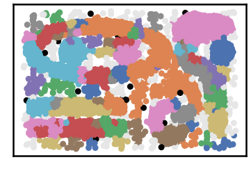
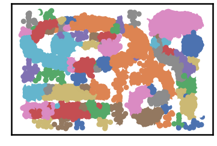
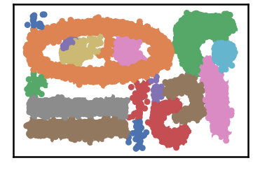

Noise Detection
===============

``` {.python}
import pandas as pd
import time
import os.path

import warnings
warnings.filterwarnings('ignore')
```

``` {.python}
# install DenMune clustering algorithm using pip command from the offecial Python repository, PyPi
# from https://pypi.org/project/denmune/
!pip install denmune

# then import it
from denmune import DenMune
```

``` {.python}
# clone datasets from our repository datasets
if not os.path.exists('datasets'):
  !git clone https://github.com/egy1st/datasets
```

::: {.parsed-literal}
Cloning into \'datasets\'\... remote: Enumerating objects: 63, done.\[K
remote: Counting objects: 100% (63/63), done.\[K remote: Compressing
objects: 100% (52/52), done.\[K remote: Total 63 (delta 10), reused 59
(delta 9), pack-reused 0\[K Unpacking objects: 100% (63/63), done.
Checking out files: 100% (23/23), done.
:::

------------------------------------------------------------------------

DenMune detects noise and outlier automatically, no need to any further
work from your side. \* It plots pre-identified noise in black \* It
plots post-identified noise in light grey

You can set show\_noise parameter to False to show clean data as
identified by the algorithm

``` {.python}
data_path = 'datasets/denmune/chameleon/'  

chameleon_dataset = "t7.10k" #["t4.8k", "t5.8k", "t7.10k", "t8.8k"]

knn = 10
# train file
data_file = data_path + chameleon_dataset + '.csv'
X_train = pd.read_csv(data_file, sep=',', header=None)

dm = DenMune(train_data=X_train, k_nearest=knn, rgn_tsne=False)
labels, validity = dm.fit_predict(show_noise=True, show_analyzer=False)
```



``` {.python}
# let us show clean data by removing noise

m = DenMune(train_data=X_train, k_nearest=knn, rgn_tsne=False)
labels, validity = dm.fit_predict(show_noise=False, show_analyzer=False)
```



``` {.python}
knn = 20
# train file
data_file = data_path + chameleon_dataset + '.csv'
X_train = pd.read_csv(data_file, sep=',', header=None)

dm = DenMune(train_data=X_train, k_nearest=knn, rgn_tsne=False)
labels, validity = dm.fit_predict(show_noise=True, show_analyzer=False)
```


``` {.python}
# let us show clean data by removing noise

m = DenMune(train_data=X_train, k_nearest=knn, rgn_tsne=False)
labels, validity = dm.fit_predict(show_noise=False, show_analyzer=False)
```



``` {.python}
knn = 39
# train file
data_file = data_path + chameleon_dataset + '.csv'
X_train = pd.read_csv(data_file, sep=',', header=None)

dm = DenMune(train_data=X_train, k_nearest=knn, rgn_tsne=False)
labels, validity = dm.fit_predict(show_noise=True, show_analyzer=False)
```


``` {.python}
# let us show clean data by removing noise

m = DenMune(train_data=X_train, k_nearest=knn, rgn_tsne=False)
labels, validity = dm.fit_predict(show_noise=False, show_analyzer=False)
```


