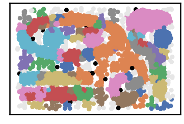
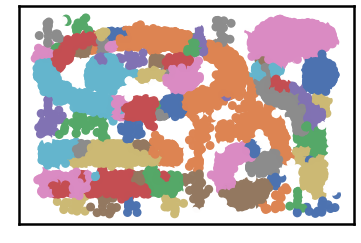
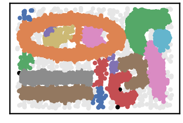
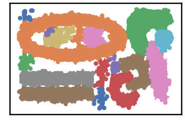
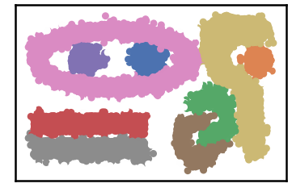

Noise Detection
--------------------

.. code:: python

    import pandas as pd
    import time
    import os.path
    
    import warnings
    warnings.filterwarnings('ignore')

.. code:: python

    # install DenMune clustering algorithm using pip command from the offecial Python repository, PyPi
    # from https://pypi.org/project/denmune/
    !pip install denmune
    
    # then import it
    from denmune import DenMune

.. code:: python

    # clone datasets from our repository datasets
    if not os.path.exists('datasets'):
      !git clone https://github.com/egy1st/datasets

.. parsed-literal::

    Cloning into 'datasets'...
    remote: Enumerating objects: 63, done.
    remote: Counting objects: 100% (63/63), done.
    remote: Compressing objects: 100% (52/52), done.
    remote: Total 63 (delta 10), reused 59 (delta 9), pack-reused 0
    Unpacking objects: 100% (63/63), done.
    Checking out files: 100% (23/23), done.

--------------

DenMune detects noise and outlier automatically, no need to any further
work from your side. \* It plots pre-identified noise in black \* It
plots post-identified noise in light grey

You can set show_noise parameter to False to show clean data as
identified by the algorithm

.. code:: python

    data_path = 'datasets/denmune/chameleon/'  
    
    chameleon_dataset = "t7.10k" #["t4.8k", "t5.8k", "t7.10k", "t8.8k"]
    
    knn = 10
    # train file
    data_file = data_path + chameleon_dataset + '.csv'
    X_train = pd.read_csv(data_file, sep=',', header=None)
    
    dm = DenMune(train_data=X_train, k_nearest=knn, rgn_tsne=False)
    labels, validity = dm.fit_predict(show_noise=True, show_analyzer=False)

.. code:: python

    # let us show clean data by removing noise
    
    m = DenMune(train_data=X_train, k_nearest=knn, rgn_tsne=False)
    labels, validity = dm.fit_predict(show_noise=False, show_analyzer=False)

.. code:: python

    knn = 20
    # train file
    data_file = data_path + chameleon_dataset + '.csv'
    X_train = pd.read_csv(data_file, sep=',', header=None)
    
    dm = DenMune(train_data=X_train, k_nearest=knn, rgn_tsne=False)
    labels, validity = dm.fit_predict(show_noise=True, show_analyzer=False)

.. code:: python

    # let us show clean data by removing noise
    
    m = DenMune(train_data=X_train, k_nearest=knn, rgn_tsne=False)
    labels, validity = dm.fit_predict(show_noise=False, show_analyzer=False)

.. code:: python

    knn = 39
    # train file
    data_file = data_path + chameleon_dataset + '.csv'
    X_train = pd.read_csv(data_file, sep=',', header=None)
    
    dm = DenMune(train_data=X_train, k_nearest=knn, rgn_tsne=False)
    labels, validity = dm.fit_predict(show_noise=True, show_analyzer=False)

.. image:: images/noise_detection/output_9_0.png

.. code:: python

    # let us show clean data by removing noise
    
    m = DenMune(train_data=X_train, k_nearest=knn, rgn_tsne=False)
    labels, validity = dm.fit_predict(show_noise=False, show_analyzer=False)

