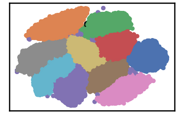

MNIST Dataset
=============

``` {.python}
import pandas as pd
import numpy as np
import time
import os.path

import warnings
warnings.filterwarnings('ignore')
```

``` {.python}
# install DenMune clustering algorithm using pip command from the offecial Python repository, PyPi
# from https://pypi.org/project/denmune/
!pip install denmune

# then import it
from denmune import DenMune
```

``` {.python}
# clone datasets from our repository datasets
if not os.path.exists('datasets'):
  !git clone https://github.com/egy1st/datasets
```

::: {.parsed-literal}
Cloning into \'datasets\'\... remote: Enumerating objects: 52, done.\[K
remote: Counting objects: 100% (52/52), done.\[K remote: Compressing
objects: 100% (43/43), done.\[K remote: Total 52 (delta 8), reused 49
(delta 8), pack-reused 0\[K Unpacking objects: 100% (52/52), done.
:::

``` {.python}
data_path = 'datasets/denmune/mnist/'  
file_2d = data_path + 'mnist-2d.csv'

X_train = pd.read_csv(data_path + 'train.csv', sep=',')
X_test = pd.read_csv(data_path + 'test.csv',  sep=',')
y_train = X_train['label']
X_train = X_train.drop(['label'], axis=1)

dm = DenMune(train_data=X_train,
             train_truth=y_train,
             test_data=X_test, 
             k_nearest=93,
             file_2d=file_2d,
             rgn_tsne=False)

labels, validity = dm.fit_predict(show_noise=True, show_analyzer=True)
```

::: {.parsed-literal}
Plotting dataset Groundtruth
:::


::: {.parsed-literal}
Plotting train data
:::



::: {.parsed-literal}
Validating train data ├── exec\_time │ ├── DenMune: 340.29 │ ├── NGT:
15.154 │ └── t\_SNE: 0 ├── n\_clusters │ ├── actual: 10 │ └── detected:
10 ├── n\_points │ ├── dim: 784 │ ├── noise │ │ ├── type-1: 2 │ │ └──
type-2: 0 │ ├── plot\_size: 42000 │ ├── size: 70000 │ ├── strong: 38267
│ └── weak │ ├── all: 31733 │ ├── failed to merge: 0 │ └── succeeded to
merge: 31733 └── validity └── train ├── ACC: 40564 ├── AMI: 0.913 ├──
ARI: 0.926 ├── F1: 0.966 ├── NMI: 0.913 ├── completeness: 0.913 └──
homogeneity: 0.913

Plotting test data
:::


``` {.python}
# prepare our output to be submitted to the dataset kaggle competition
ImageID = np.arange(len(X_test))+1
Out = pd.DataFrame([ImageID,labels['test']]).T
Out.to_csv('submission.csv', header =  ['ImageId', 'Label' ], index = None)
```
