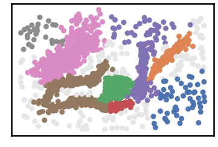

Chameleon Dataset
=================

``` {.python}
import pandas as pd
import time
import os.path

import warnings
warnings.filterwarnings('ignore')
```

``` {.python}
# install DenMune clustering algorithm using pip command from the offecial Python repository, PyPi
# from https://pypi.org/project/denmune/
!pip install denmune

# then import it
from denmune import DenMune
```

``` {.python}
# clone datasets from our repository datasets
if not os.path.exists('datasets'):
  !git clone https://github.com/egy1st/datasets
```

::: {.parsed-literal}
Cloning into \'datasets\'\... remote: Enumerating objects: 52, done.\[K
remote: Counting objects: 100% (52/52), done.\[K remote: Compressing
objects: 100% (43/43), done.\[K remote: Total 52 (delta 8), reused 49
(delta 8), pack-reused 0\[K Unpacking objects: 100% (52/52), done.
:::

``` {.python}
data_path = 'datasets/denmune/chameleon/'  

#@title  { run: "auto", vertical-output: true, form-width: "50%" }
chameleon_dataset = "t7.10k" #@param ["t4.8k", "t5.8k", "t7.10k", "t8.8k"]
show_noize_checkbox = True #@param {type:"boolean"}
show_analyzer_checkbox = True #@param {type:"boolean"}
k_nearest_slider = 39 #@param {type:"slider", min:1, max:100, step:1}

# train file
data_file = data_path + chameleon_dataset + '.csv'
X_train = pd.read_csv(data_file, sep=',', header=None)

dm = DenMune(train_data=X_train, k_nearest=k_nearest_slider, rgn_tsne=False)
labels, validity = dm.fit_predict(show_noise=show_noize_checkbox,
                                  show_analyzer=show_analyzer_checkbox)
```

::: {.parsed-literal}
Plotting train data
:::


::: {.parsed-literal}
Validating train data ├── exec\_time │ ├── DenMune: 9.7 │ ├── NGT: 0.612
│ └── t\_SNE: 0 ├── n\_clusters │ ├── actual: 0 │ └── detected: 9 └──
n\_points ├── dim: 2 ├── noise │ ├── type-1: 0 │ └── type-2: 516 ├──
plot\_size: 10000 ├── size: 10000 ├── strong: 5860 └── weak ├── all:
4140 ├── failed to merge: 516 └── succeeded to merge: 3624
:::

``` {.python}
data_path = 'datasets/denmune/chameleon/'  

#@title  { run: "auto", vertical-output: true, form-width: "50%" }
chameleon_dataset = "clusterable" #@param ["t4.8k", "t5.8k", "t7.10k", "t8.8k", "clusterable"]
show_noize_checkbox = True #@param {type:"boolean"}
show_analyzer_checkbox = True #@param {type:"boolean"}
k_nearest_slider = 24 #@param {type:"slider", min:1, max:100, step:1}

# train file
data_file = data_path + chameleon_dataset + '.csv'
X_train = pd.read_csv(data_file, sep=',', header=None)

dm = DenMune(train_data=X_train, k_nearest=k_nearest_slider, rgn_tsne=False)
labels, validity = dm.fit_predict(show_noise=show_noize_checkbox,
                                  show_analyzer=show_analyzer_checkbox)
```

::: {.parsed-literal}
Plotting train data
:::



::: {.parsed-literal}
Validating train data ├── exec\_time │ ├── DenMune: 1.393 │ ├── NGT:
0.121 │ └── t\_SNE: 0 ├── n\_clusters │ ├── actual: 0 │ └── detected: 8
└── n\_points ├── dim: 2 ├── noise │ ├── type-1: 0 │ └── type-2: 141 ├──
plot\_size: 2309 ├── size: 2309 ├── strong: 1352 └── weak ├── all: 957
├── failed to merge: 141 └── succeeded to merge: 816
:::
