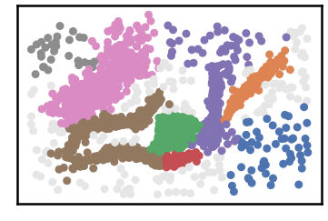

Chameleon Dataset
--------------------

.. code:: python

    import pandas as pd
    import time
    import os.path
    
    import warnings
    warnings.filterwarnings('ignore')

.. code:: python

    # install DenMune clustering algorithm using pip command from the offecial Python repository, PyPi
    # from https://pypi.org/project/denmune/
    !pip install denmune
    
    # then import it
    from denmune import DenMune

.. code:: python

    # clone datasets from our repository datasets
    if not os.path.exists('datasets'):
      !git clone https://github.com/egy1st/datasets

.. parsed-literal::

    Cloning into 'datasets'...
    remote: Enumerating objects: 52, done.
    remote: Counting objects: 100% (52/52), done.
    remote: Compressing objects: 100% (43/43), done.
    remote: Total 52 (delta 8), reused 49 (delta 8), pack-reused 0
    Unpacking objects: 100% (52/52), done.

.. code:: python

    data_path = 'datasets/denmune/chameleon/'  
    
    #@title  { run: "auto", vertical-output: true, form-width: "50%" }
    chameleon_dataset = "t7.10k" #@param ["t4.8k", "t5.8k", "t7.10k", "t8.8k"]
    show_noize_checkbox = True #@param {type:"boolean"}
    show_analyzer_checkbox = True #@param {type:"boolean"}
    k_nearest_slider = 39 #@param {type:"slider", min:1, max:100, step:1}
    
    # train file
    data_file = data_path + chameleon_dataset + '.csv'
    X_train = pd.read_csv(data_file, sep=',', header=None)
    
    dm = DenMune(train_data=X_train, k_nearest=k_nearest_slider, rgn_tsne=False)
    labels, validity = dm.fit_predict(show_noise=show_noize_checkbox,
                                      show_analyzer=show_analyzer_checkbox)

.. parsed-literal::

    Plotting train data

.. image:: images/chameleon/output_4_1.png

.. parsed-literal::

    Validating train data
    ├── exec_time
    │   ├── DenMune: 9.7
    │   ├── NGT: 0.612
    │   └── t_SNE: 0
    ├── n_clusters
    │   ├── actual: 0
    │   └── detected: 9
    └── n_points
        ├── dim: 2
        ├── noise
        │   ├── type-1: 0
        │   └── type-2: 516
        ├── plot_size: 10000
        ├── size: 10000
        ├── strong: 5860
        └── weak
            ├── all: 4140
            ├── failed to merge: 516
            └── succeeded to merge: 3624
    

.. code:: python

    data_path = 'datasets/denmune/chameleon/'  
    
    #@title  { run: "auto", vertical-output: true, form-width: "50%" }
    chameleon_dataset = "clusterable" #@param ["t4.8k", "t5.8k", "t7.10k", "t8.8k", "clusterable"]
    show_noize_checkbox = True #@param {type:"boolean"}
    show_analyzer_checkbox = True #@param {type:"boolean"}
    k_nearest_slider = 24 #@param {type:"slider", min:1, max:100, step:1}
    
    # train file
    data_file = data_path + chameleon_dataset + '.csv'
    X_train = pd.read_csv(data_file, sep=',', header=None)
    
    dm = DenMune(train_data=X_train, k_nearest=k_nearest_slider, rgn_tsne=False)
    labels, validity = dm.fit_predict(show_noise=show_noize_checkbox,
                                      show_analyzer=show_analyzer_checkbox)

.. parsed-literal::

    Plotting train data

.. parsed-literal::

    Validating train data
    ├── exec_time
    │   ├── DenMune: 1.393
    │   ├── NGT: 0.121
    │   └── t_SNE: 0
    ├── n_clusters
    │   ├── actual: 0
    │   └── detected: 8
    └── n_points
        ├── dim: 2
        ├── noise
        │   ├── type-1: 0
        │   └── type-2: 141
        ├── plot_size: 2309
        ├── size: 2309
        ├── strong: 1352
        └── weak
            ├── all: 957
            ├── failed to merge: 141
            └── succeeded to merge: 816
    

