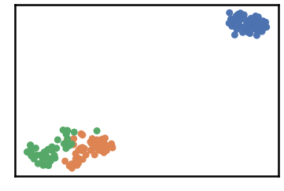
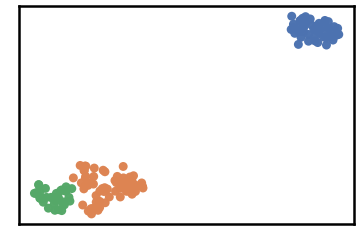

Iris Dataset
============

``` {.python}
import pandas as pd
import numpy as np
import time
import os.path

import warnings
warnings.filterwarnings('ignore')
```

``` {.python}
# install DenMune clustering algorithm using pip command from the offecial Python repository, PyPi
# from https://pypi.org/project/denmune/
!pip install denmune

# then import it
from denmune import DenMune
```

``` {.python}
# clone datasets from our repository datasets
if not os.path.exists('datasets'):
  !git clone https://github.com/egy1st/datasets
```

::: {.parsed-literal}
Cloning into \'datasets\'\... remote: Enumerating objects: 57, done.\[K
remote: Counting objects: 100% (57/57), done.\[K remote: Compressing
objects: 100% (46/46), done.\[K remote: Total 57 (delta 9), reused 54
(delta 9), pack-reused 0\[K Unpacking objects: 100% (57/57), done.
:::

``` {.python}
data_path = 'datasets/denmune/uci/' 
dataset='iris' 
data_file = data_path + dataset + '.csv'

X_train = pd.read_csv(data_file, sep=',', header=None)
y_train = X_train.iloc[:, -1]
X_train = X_train.drop(X_train.columns[-1], axis=1)  

knn = 11 # k-nearest neighbor, the only parameter required by the algorithm
dm = DenMune(train_data=X_train,
             train_truth=y_train,
             k_nearest=knn,
             rgn_tsne=False)

labels, validity = dm.fit_predict(show_noise=True, show_analyzer=True)
```

::: {.parsed-literal}
Plotting dataset Groundtruth
:::



::: {.parsed-literal}
Plotting train data
:::



::: {.parsed-literal}
Validating train data ├── exec\_time │ ├── DenMune: 0.019 │ ├── NGT:
0.002 │ └── t\_SNE: 0.85 ├── n\_clusters │ ├── actual: 3 │ └── detected:
3 ├── n\_points │ ├── dim: 4 │ ├── noise │ │ ├── type-1: 0 │ │ └──
type-2: 0 │ ├── plot\_size: 150 │ ├── size: 150 │ ├── strong: 84 │ └──
weak │ ├── all: 66 │ ├── failed to merge: 0 │ └── succeeded to merge: 66
└── validity └── train ├── ACC: 135 ├── AMI: 0.795 ├── ARI: 0.746 ├──
F1: 0.898 ├── NMI: 0.798 ├── completeness: 0.809 └── homogeneity: 0.787
:::
