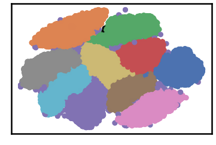
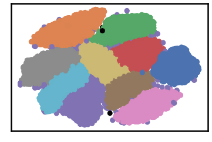

Trining MNIST Dataset
=====================

``` {.python}
import pandas as pd
import numpy as np
import time
import os.path

import warnings
warnings.filterwarnings('ignore')
```

``` {.python}
# install DenMune clustering algorithm using pip command from the offecial Python repository, PyPi
# from https://pypi.org/project/denmune/
!pip install denmune

# then import it
from denmune import DenMune
```

``` {.python}
# clone datasets from our repository datasets
if not os.path.exists('datasets'):
  !git clone https://github.com/egy1st/datasets
```

::: {.parsed-literal}
Cloning into \'datasets\'\... remote: Enumerating objects: 63, done.\[K
remote: Counting objects: 100% (63/63), done.\[K remote: Compressing
objects: 100% (52/52), done.\[K remote: Total 63 (delta 10), reused 59
(delta 9), pack-reused 0\[K Unpacking objects: 100% (63/63), done.
:::

``` {.python}
# let us train the dataset

data_path = 'datasets/denmune/mnist/'  
file_2d = data_path + 'mnist-2d.csv'

X_train = pd.read_csv(data_path + 'train.csv', sep=',')
X_test = pd.read_csv(data_path + 'test.csv',  sep=',')
y_train = X_train['label']
X_train = X_train.drop(['label'], axis=1)

validity_key = "F1" 
scores = []
score = 0
best_knn = 0
best_score = -1

for knn in range (10, 50):   # knn ==> k-nearest neighbor, the only parameter required by the algorithm
  dm = DenMune(train_data=X_train,
              train_truth=y_train,
              test_data=X_test, 
              k_nearest=knn,
              file_2d=file_2d,
              rgn_tsne=False)

  labels, validity = dm.fit_predict(show_plots=False, show_analyzer=False)
  score = validity['train'][validity_key]

  if score > best_score:
    best_score = score
    best_knn = knn

  print ('k=' , knn, validity_key , 'score:', round(score*100,2) , '%, best score:',  round(best_score*100,2) , '% at k=', best_knn)
  scores.append([knn, score])
```

::: {.parsed-literal}
k= 10 F1 score: 88.92 %, best score: 88.92 % at k= 10 k= 11 F1 score:
90.14 %, best score: 90.14 % at k= 11 k= 12 F1 score: 90.97 %, best
score: 90.97 % at k= 12 k= 13 F1 score: 91.97 %, best score: 91.97 % at
k= 13 k= 14 F1 score: 92.3 %, best score: 92.3 % at k= 14 k= 15 F1
score: 92.58 %, best score: 92.58 % at k= 15 k= 16 F1 score: 91.77 %,
best score: 92.58 % at k= 15 k= 17 F1 score: 94.07 %, best score: 94.07
% at k= 17 k= 18 F1 score: 92.89 %, best score: 94.07 % at k= 17 k= 19
F1 score: 93.7 %, best score: 94.07 % at k= 17 k= 20 F1 score: 94.57 %,
best score: 94.57 % at k= 20 k= 21 F1 score: 80.54 %, best score: 94.57
% at k= 20 k= 22 F1 score: 93.18 %, best score: 94.57 % at k= 20 k= 23
F1 score: 94.91 %, best score: 94.91 % at k= 23 k= 24 F1 score: 94.43 %,
best score: 94.91 % at k= 23 k= 25 F1 score: 95.1 %, best score: 95.1 %
at k= 25 k= 26 F1 score: 93.68 %, best score: 95.1 % at k= 25 k= 27 F1
score: 93.09 %, best score: 95.1 % at k= 25 k= 28 F1 score: 83.83 %,
best score: 95.1 % at k= 25 k= 29 F1 score: 83.42 %, best score: 95.1 %
at k= 25 k= 30 F1 score: 84.41 %, best score: 95.1 % at k= 25 k= 31 F1
score: 76.45 %, best score: 95.1 % at k= 25 k= 32 F1 score: 65.25 %,
best score: 95.1 % at k= 25 k= 33 F1 score: 64.28 %, best score: 95.1 %
at k= 25 k= 34 F1 score: 64.12 %, best score: 95.1 % at k= 25 k= 35 F1
score: 73.24 %, best score: 95.1 % at k= 25 k= 36 F1 score: 74.07 %,
best score: 95.1 % at k= 25 k= 37 F1 score: 84.26 %, best score: 95.1 %
at k= 25 k= 38 F1 score: 96.14 %, best score: 96.14 % at k= 38 k= 39 F1
score: 96.16 %, best score: 96.16 % at k= 39 k= 40 F1 score: 85.34 %,
best score: 96.16 % at k= 39 k= 41 F1 score: 72.7 %, best score: 96.16 %
at k= 39 k= 42 F1 score: 85.17 %, best score: 96.16 % at k= 39 k= 43 F1
score: 85.19 %, best score: 96.16 % at k= 39 k= 44 F1 score: 85.46 %,
best score: 96.16 % at k= 39 k= 45 F1 score: 84.78 %, best score: 96.16
% at k= 39 k= 46 F1 score: 84.55 %, best score: 96.16 % at k= 39 k= 47
F1 score: 84.47 %, best score: 96.16 % at k= 39 k= 48 F1 score: 96.22 %,
best score: 96.22 % at k= 48 k= 49 F1 score: 84.11 %, best score: 96.22
% at k= 48
:::

``` {.python}
# now let us use our best_knn which corresponds to best_score for our test data prediction
#best_knn ==> 48

dm = DenMune(train_data=X_train,
              train_truth=y_train,
              test_data=X_test, 
              k_nearest=best_knn,
              file_2d=file_2d,
              rgn_tsne=False)

labels, validity = dm.fit_predict(show_plots=True, show_analyzer=True)
```

::: {.parsed-literal}
Plotting dataset Groundtruth
:::


::: {.parsed-literal}
Plotting train data
:::



::: {.parsed-literal}
Validating train data ├── exec\_time │ ├── DenMune: 95.723 │ ├── NGT:
8.561 │ └── t\_SNE: 0 ├── n\_clusters │ ├── actual: 10 │ └── detected:
11 ├── n\_points │ ├── dim: 784 │ ├── noise │ │ ├── type-1: 5 │ │ └──
type-2: 0 │ ├── plot\_size: 42000 │ ├── size: 70000 │ ├── strong: 37447
│ └── weak │ ├── all: 32553 │ ├── failed to merge: 0 │ └── succeeded to
merge: 32553 └── validity └── train ├── ACC: 40386 ├── AMI: 0.905 ├──
ARI: 0.919 ├── F1: 0.962 ├── NMI: 0.905 ├── completeness: 0.904 └──
homogeneity: 0.906

Plotting test data
:::



``` {.python}
# prepare our output to be submitted to the dataset kaggle competition
ImageID = np.arange(len(X_test))+1
Out = pd.DataFrame([ImageID,labels['test']]).T
Out.to_csv('submission.csv', header =  ['ImageId', 'Label' ], index = None)
```
