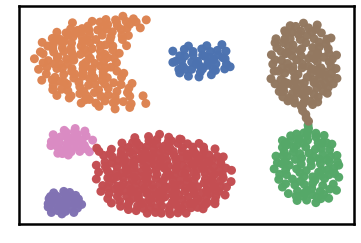

Validate Your Results
=====================

``` {.python}
import pandas as pd
import time
import os.path

import warnings
warnings.filterwarnings('ignore')
```

``` {.python}
# install DenMune clustering algorithm using pip command from the offecial Python repository, PyPi
# from https://pypi.org/project/denmune/
!pip install denmune

# then import it
from denmune import DenMune
```

``` {.python}
# clone datasets from our repository datasets
if not os.path.exists('datasets'):
  !git clone https://github.com/egy1st/datasets
```


> Cloning into \'datasets\'\... remote: Enumerating objects: 63, done.\[K
> remote: Counting objects: 100% (63/63), done.\[K remote: Compressing
> objects: 100% (52/52), done.\[K remote: Total 63 (delta 10), reused 59
> (delta 9), pack-reused 0\[K Unpacking objects: 100% (63/63), done.
> Checking out files: 100% (23/23), done.

You can get your validation results using 3 methods - by showing the
Analyzer - extract values from the validity returned list from
fit\_predict function - extract values from the Analyzer dictionary

The algorithm is associated with five built-in validity measures, which
are: - ACC, Accuracy - F1 score - NMI index (Normalized Mutual
Information) - AMI index (Adjusted Mutual Information) - ARI index
(Adjusted Rand Index)

``` {.python}
# Let us show the analyzer by set show_analyzer to True, which is actually the default parameter's value

data_path = 'datasets/denmune/shapes/'  
dataset = "aggregation" 
knn = 6

data_file = data_path + dataset + '.csv'
X_train = pd.read_csv(data_file, sep=',', header=None)
y_train = X_train.iloc[:, -1]
X_train = X_train.drop(X_train.columns[-1], axis=1)   

print ("Dataset:", dataset)
dm = DenMune(train_data=X_train,
            train_truth=y_train,
            k_nearest=knn,
            rgn_tsne=False)

labels, validity = dm.fit_predict(show_noise=True, show_analyzer=True)
```


Dataset: aggregation
===================

Plotting dataset Groundtruth
-----------------------




Plotting train data
-----------------------------


Validating train data ├── exec\_time │ ├── DenMune: 0.322 │ ├── NGT:
0.038 │ └── t\_SNE: 0 ├── n\_clusters │ ├── actual: 7 │ └── detected: 7
├── n\_points │ ├── dim: 2 │ ├── noise │ │ ├── type-1: 0 │ │ └── type-2:
0 │ ├── plot\_size: 788 │ ├── size: 788 │ ├── strong: 492 │ └── weak │
├── all: 296 │ ├── failed to merge: 0 │ └── succeeded to merge: 296 └──
validity └── train ├── ACC: 785 ├── AMI: 0.988 ├── ARI: 0.993 ├── F1:
0.996 ├── NMI: 0.988 ├── completeness: 0.987 └── homogeneity: 0.989

``` {.python}
# secondly, we can extract validity returned list from fit_predict function
dm = DenMune(train_data=X_train, train_truth=y_train, k_nearest=knn, rgn_tsne=False)
labels, validity = dm.fit_predict(show_plots=False, show_noise=True, show_analyzer=False)
validity
```


>  {\'train\': {\'ACC\': 785, :   \'AMI\': 0.9880984055236919, \'ARI\': 0.9927076502018027, \'F1\':
>     0.9962034083064701, \'NMI\': 0.9882680312048461, \'completeness\':
>     0.9873385166573364, \'homogeneity\': 0.9891992975556994}}

``` {.python}
Accuracy = validity['train']['ACC']
print ('Accuracy:',Accuracy, 'correctely identified points')

F1_score = validity['train']['F1']
print ('F1 score:', round(F1_score*100,2), '%')

NMI = validity['train']['NMI']
print ('NMI index:', round(NMI*100,2), '%')

AMI = validity['train']['AMI']
print ('AMI index:', round(AMI*100,2), '%')

ARI = validity['train']['ARI']
print ('ARI index:', round(ARI*100,2), '%')
```


> Accuracy: 785 correctly identified points F1 score: 99.62 % NMI index:
> 98.83 % AMI index: 98.81 % ARI index: 99.27 %

``` {.python}
# Third, we can extract extract values from the Analyzer dictionary
dm = DenMune(train_data=X_train, train_truth=y_train, k_nearest=knn, rgn_tsne=False)
labels, validity = dm.fit_predict(show_plots=False, show_noise=True, show_analyzer=False)
dm.analyzer
```


> {\'exec\_time\': {\'DenMune\': 0.12747693061828613, :   \'NGT\': 0.016164064407348633, \'t\_SNE\': 0}, \'n\_clusters\':     {\'actual\': 7, \'detected\': 7}, \'n\_points\': {\'dim\': 2,
>     \'noise\': {\'type-1\': 0, \'type-2\': 0}, \'plot\_size\': 788,
>     \'size\': 788, \'strong\': 492, \'weak\': {\'all\': 296, \'failed to
>     merge\': 0, \'succeeded to merge\': 296}}, \'validity\': {\'train\':
>     {\'ACC\': 785, \'AMI\': 0.9880984055236919, \'ARI\':
>     0.9927076502018027, \'F1\': 0.9962034083064701, \'NMI\':
>     0.9882680312048461, \'completeness\': 0.9873385166573364,
>     \'homogeneity\': 0.9891992975556994}}}

``` {.python}
Accuracy = dm.analyzer['validity']['train']['ACC']
print ('Accuracy:',Accuracy, 'correctely identified points')

F1_score = dm.analyzer['validity']['train']['F1']
print ('F1 score:', round(F1_score*100,2), '%')

NMI = dm.analyzer['validity']['train']['NMI']
print ('NMI index:', round(NMI*100,2), '%')

AMI = dm.analyzer['validity']['train']['AMI']
print ('AMI index:', round(AMI*100,2), '%')

ARI = dm.analyzer['validity']['train']['ARI']
print ('ARI index:', round(ARI*100,2), '%')
```


> Accuracy: 785 correctly identified points F1 score: 99.62 % NMI index:
> 98.83 % AMI index: 98.81 % ARI index: 99.27 %
