A1 Dataset
===========

.. code:: ipython3

    import time
    import os.path
    import requests
    import pandas as pd

.. code:: ipython3

    # install DenMune clustering algorithm using pip command from the offecial Python repository, PyPi
    # from https://pypi.org/project/denmune/
    !pip install denmune
    
    # now import it
    from denmune import DenMune

.. code:: ipython3

    dataset = 'a1' # let us take Jain dataset as an example
    
    url = "https://zerobytes.one/denmune_data/"
    file_ext = ".txt"
    ground_ext = "-gt"
    
    dataset_url = url + dataset + file_ext
    groundtruth_url = url + dataset + ground_ext  + file_ext
    
    data_path = 'data/' # change it to whatever you put your data, set it to ''; so it will retrive from current folder
    if  not os.path.isfile(data_path + dataset + file_ext):
        req = requests.get(dataset_url)
        with open(data_path + dataset + file_ext, 'wb') as f:
            f.write(req.content)
            
    if  not os.path.isfile(data_path + dataset + ground_ext + file_ext):
        req = requests.get(groundtruth_url)
        with open(data_path + dataset +  ground_ext + file_ext, 'wb') as f:
            f.write(req.content)       

.. code:: ipython3

    # Denmune's Paramaters
    # DenMune(dataset=dataset, k_nearest=n, data_path=data_path, verpose=verpose_mode, show_plot=show_plot, show_noise=show_noise)
    verpose_mode = True # view in-depth analysis of time complexity and outlier detection, num of clusters
    show_plot = True  # show plots on/off
    show_noise = True # show noise and outlier on/off
    
    # loop's parameters
    start = 5
    step = 1
    end=18
    
    # Validity indexes' parameters
    validity_val = -1
    best_k = 0
    best_val = -1
    
    validity_idx = 2 # Acc=1, F1-score=2,  NMI=3, AMI=4, ARI=5,  Homogeneity=6, and Completeness=7
    df = pd.DataFrame(columns =['K', 'ACC', 'F1', 'NMI', 'AMI', 'ARI','Homogeneity', 'Completeness', 'Time' ])
    
    
    for n in range(start, end+1, step):
        start_time = time.time()
        dm = DenMune(dataset=dataset, k_nearest=n, data_path=data_path, verpose=verpose_mode, show_noise=show_noise)
        labels_true, labels_pred = dm.output_Clusters()
        if show_plot == True and n==start:
            # Let us plot the groundtruth of this dataset which is reduced to 2-d using t-SNE
            print ("Dataset\'s Groundtruht")
            dm.plot_clusters(labels_true, ground=True)
            print('\n', "=====" * 20 , '\n')       
                   
        end_time = time.time()
        
        validity_indexes = dm.validate_Clusters(labels_true, labels_pred)
        validity_val = validity_indexes[validity_idx]
        validity_indexes[0] = n
        validity_indexes[8] = end_time - start_time
        
        df = df.append(pd.Series(validity_indexes, index=df.columns ), ignore_index=True)
        
        if (best_val < validity_val):
            best_val = validity_val
            best_k = n
            # Let us show results where only an improve in accuracy is detected
        if show_plot:
                dm.plot_clusters(labels_pred, show_noise=show_noise)
        print ('k=' , n, ':Validity score is:', validity_val , 'but best score is', best_val, 'at k=', best_k , end='     ')
                
        if not verpose_mode:
            print('\r', end='')
        else:
            print('\n', "=====" * 20 , '\n')

.. parsed-literal::

    using NGT, Proximity matrix has been calculated  in:  0.07231497764587402  seconds
    Dataset's Groundtruht

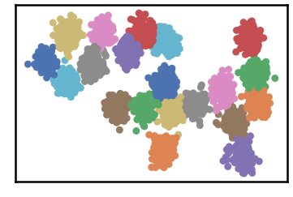

.. parsed-literal::

    
     ==================================================================================================== 
    
    There are 25 outlier point(s) in black (noise of type-1) represent 1% of total points
    There are 0 weak point(s) in light grey (noise of type-2) represent 0% of total points
    DenMune detected 133 clusters 
    

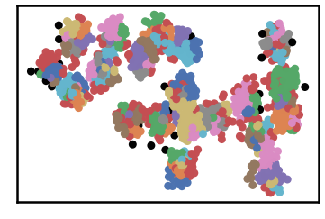

.. parsed-literal::

    k= 5 :Validity score is: 0.5519750039930905 but best score is 0.5519750039930905 at k= 5     
     ==================================================================================================== 
    
    using NGT, Proximity matrix has been calculated  in:  0.054454803466796875  seconds
    There are 20 outlier point(s) in black (noise of type-1) represent 1% of total points
    There are 0 weak point(s) in light grey (noise of type-2) represent 0% of total points
    DenMune detected 82 clusters 
    

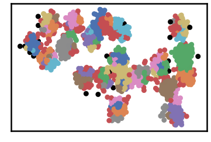

.. parsed-literal::

    k= 6 :Validity score is: 0.6697285901144308 but best score is 0.6697285901144308 at k= 6     
     ==================================================================================================== 
    
    using NGT, Proximity matrix has been calculated  in:  0.04253506660461426  seconds
    There are 12 outlier point(s) in black (noise of type-1) represent 0% of total points
    There are 0 weak point(s) in light grey (noise of type-2) represent 0% of total points
    DenMune detected 50 clusters 
    

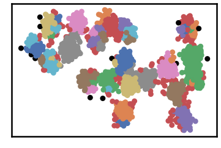

.. parsed-literal::

    k= 7 :Validity score is: 0.7646813293180561 but best score is 0.7646813293180561 at k= 7     
     ==================================================================================================== 
    
    using NGT, Proximity matrix has been calculated  in:  0.15336012840270996  seconds
    There are 11 outlier point(s) in black (noise of type-1) represent 0% of total points
    There are 0 weak point(s) in light grey (noise of type-2) represent 0% of total points
    DenMune detected 38 clusters 
    

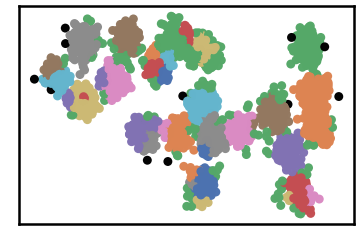

.. parsed-literal::

    k= 8 :Validity score is: 0.7987893036577698 but best score is 0.7987893036577698 at k= 8     
     ==================================================================================================== 
    
    using NGT, Proximity matrix has been calculated  in:  0.047051191329956055  seconds
    There are 6 outlier point(s) in black (noise of type-1) represent 0% of total points
    There are 0 weak point(s) in light grey (noise of type-2) represent 0% of total points
    DenMune detected 24 clusters 
    

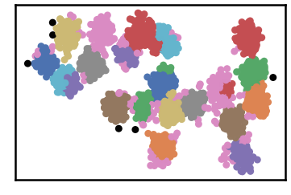

.. parsed-literal::

    k= 9 :Validity score is: 0.8924010285362158 but best score is 0.8924010285362158 at k= 9     
     ==================================================================================================== 
    
    using NGT, Proximity matrix has been calculated  in:  0.056050777435302734  seconds
    There are 6 outlier point(s) in black (noise of type-1) represent 0% of total points
    There are 0 weak point(s) in light grey (noise of type-2) represent 0% of total points
    DenMune detected 26 clusters 
    

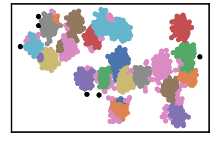

.. parsed-literal::

    k= 10 :Validity score is: 0.8606538117789311 but best score is 0.8924010285362158 at k= 9     
     ==================================================================================================== 
    
    using NGT, Proximity matrix has been calculated  in:  0.06364774703979492  seconds
    There are 5 outlier point(s) in black (noise of type-1) represent 0% of total points
    There are 0 weak point(s) in light grey (noise of type-2) represent 0% of total points
    DenMune detected 22 clusters 
    

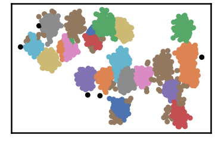

.. parsed-literal::

    k= 11 :Validity score is: 0.8709261441081445 but best score is 0.8924010285362158 at k= 9     
     ==================================================================================================== 
    
    using NGT, Proximity matrix has been calculated  in:  0.05389976501464844  seconds
    There are 5 outlier point(s) in black (noise of type-1) represent 0% of total points
    There are 0 weak point(s) in light grey (noise of type-2) represent 0% of total points
    DenMune detected 22 clusters 
    

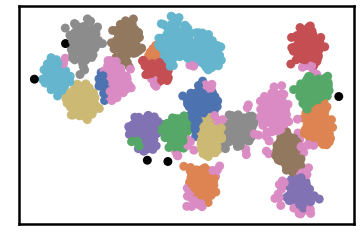

.. parsed-literal::

    k= 12 :Validity score is: 0.8755892873224093 but best score is 0.8924010285362158 at k= 9     
     ==================================================================================================== 
    
    using NGT, Proximity matrix has been calculated  in:  0.05953025817871094  seconds
    There are 5 outlier point(s) in black (noise of type-1) represent 0% of total points
    There are 0 weak point(s) in light grey (noise of type-2) represent 0% of total points
    DenMune detected 20 clusters 
    

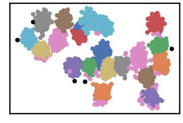

.. parsed-literal::

    k= 13 :Validity score is: 0.8838832264649391 but best score is 0.8924010285362158 at k= 9     
     ==================================================================================================== 
    
    using NGT, Proximity matrix has been calculated  in:  0.08502507209777832  seconds
    There are 2 outlier point(s) in black (noise of type-1) represent 0% of total points
    There are 0 weak point(s) in light grey (noise of type-2) represent 0% of total points
    DenMune detected 18 clusters 
    

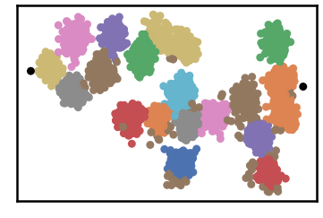

.. parsed-literal::

    k= 14 :Validity score is: 0.8369193110701418 but best score is 0.8924010285362158 at k= 9     
     ==================================================================================================== 
    
    using NGT, Proximity matrix has been calculated  in:  0.05931258201599121  seconds
    There are 2 outlier point(s) in black (noise of type-1) represent 0% of total points
    There are 0 weak point(s) in light grey (noise of type-2) represent 0% of total points
    DenMune detected 18 clusters 
    

.. parsed-literal::

    k= 15 :Validity score is: 0.8402686120698365 but best score is 0.8924010285362158 at k= 9     
     ==================================================================================================== 
    
    using NGT, Proximity matrix has been calculated  in:  0.05946683883666992  seconds
    There are 1 outlier point(s) in black (noise of type-1) represent 0% of total points
    There are 0 weak point(s) in light grey (noise of type-2) represent 0% of total points
    DenMune detected 19 clusters 
    

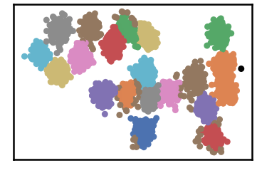

.. parsed-literal::

    k= 16 :Validity score is: 0.8937873812268335 but best score is 0.8937873812268335 at k= 16     
     ==================================================================================================== 
    
    using NGT, Proximity matrix has been calculated  in:  0.0742027759552002  seconds
    There are 1 outlier point(s) in black (noise of type-1) represent 0% of total points
    There are 0 weak point(s) in light grey (noise of type-2) represent 0% of total points
    DenMune detected 18 clusters 
    

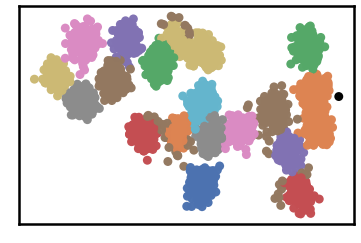

.. parsed-literal::

    k= 17 :Validity score is: 0.8475211362307216 but best score is 0.8937873812268335 at k= 16     
     ==================================================================================================== 
    
    using NGT, Proximity matrix has been calculated  in:  0.08389592170715332  seconds
    There are 1 outlier point(s) in black (noise of type-1) represent 0% of total points
    There are 0 weak point(s) in light grey (noise of type-2) represent 0% of total points
    DenMune detected 17 clusters 
    

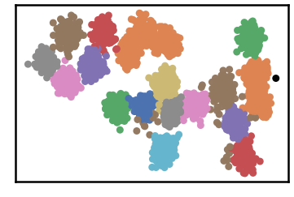

.. parsed-literal::

    k= 18 :Validity score is: 0.7942714932963612 but best score is 0.8937873812268335 at k= 16     
     ==================================================================================================== 
    

.. parsed-literal::

    <Figure size 432x288 with 0 Axes>

.. code:: ipython3

    # It is time to save the results
    results_path = 'results/'  # change it to whatever you output results to, set it to ''; so it will output to current folder
    para_file = 'denmune'+ '_para_'  + dataset + '.csv'
    df.sort_values(by=['F1', 'NMI', 'ARI'] , ascending=False, inplace=True)   
    df.to_csv(results_path + para_file, index=False, sep='\t', header=True)

.. code:: ipython3

    df # it is sorted now and saved

.. raw:: html

    

    
    <table border="1" class="dataframe">
      <thead>
        <tr style="text-align: right;">
          <th></th>
          <th>K</th>
          <th>ACC</th>
          <th>F1</th>
          <th>NMI</th>
          <th>AMI</th>
          <th>ARI</th>
          <th>Homogeneity</th>
          <th>Completeness</th>
          <th>Time</th>
        </tr>
      </thead>
      <tbody>
        <tr>
          <th>11</th>
          <td>16.0</td>
          <td>2726.0</td>
          <td>0.893787</td>
          <td>0.935722</td>
          <td>0.934399</td>
          <td>0.866949</td>
          <td>0.923898</td>
          <td>0.947853</td>
          <td>0.709525</td>
        </tr>
        <tr>
          <th>4</th>
          <td>9.0</td>
          <td>2594.0</td>
          <td>0.892401</td>
          <td>0.892903</td>
          <td>0.890045</td>
          <td>0.791440</td>
          <td>0.906472</td>
          <td>0.879734</td>
          <td>0.540347</td>
        </tr>
        <tr>
          <th>8</th>
          <td>13.0</td>
          <td>2675.0</td>
          <td>0.883883</td>
          <td>0.917385</td>
          <td>0.915537</td>
          <td>0.832151</td>
          <td>0.908915</td>
          <td>0.926015</td>
          <td>0.628907</td>
        </tr>
        <tr>
          <th>7</th>
          <td>12.0</td>
          <td>2636.0</td>
          <td>0.875589</td>
          <td>0.909471</td>
          <td>0.907232</td>
          <td>0.815603</td>
          <td>0.905464</td>
          <td>0.913514</td>
          <td>0.693933</td>
        </tr>
        <tr>
          <th>6</th>
          <td>11.0</td>
          <td>2634.0</td>
          <td>0.870926</td>
          <td>0.912574</td>
          <td>0.910420</td>
          <td>0.823876</td>
          <td>0.909230</td>
          <td>0.915943</td>
          <td>0.658109</td>
        </tr>
        <tr>
          <th>5</th>
          <td>10.0</td>
          <td>2556.0</td>
          <td>0.860654</td>
          <td>0.893128</td>
          <td>0.889978</td>
          <td>0.783995</td>
          <td>0.900310</td>
          <td>0.886059</td>
          <td>0.534910</td>
        </tr>
        <tr>
          <th>12</th>
          <td>17.0</td>
          <td>2643.0</td>
          <td>0.847521</td>
          <td>0.935292</td>
          <td>0.934024</td>
          <td>0.854889</td>
          <td>0.914417</td>
          <td>0.957143</td>
          <td>0.851638</td>
        </tr>
        <tr>
          <th>10</th>
          <td>15.0</td>
          <td>2618.0</td>
          <td>0.840269</td>
          <td>0.927448</td>
          <td>0.926011</td>
          <td>0.842111</td>
          <td>0.906632</td>
          <td>0.949241</td>
          <td>0.738221</td>
        </tr>
        <tr>
          <th>9</th>
          <td>14.0</td>
          <td>2605.0</td>
          <td>0.836919</td>
          <td>0.920202</td>
          <td>0.918621</td>
          <td>0.831330</td>
          <td>0.899358</td>
          <td>0.942036</td>
          <td>0.795036</td>
        </tr>
        <tr>
          <th>3</th>
          <td>8.0</td>
          <td>2284.0</td>
          <td>0.798789</td>
          <td>0.855346</td>
          <td>0.849131</td>
          <td>0.700762</td>
          <td>0.890333</td>
          <td>0.823005</td>
          <td>0.685580</td>
        </tr>
        <tr>
          <th>13</th>
          <td>18.0</td>
          <td>2508.0</td>
          <td>0.794271</td>
          <td>0.929007</td>
          <td>0.927674</td>
          <td>0.791205</td>
          <td>0.893096</td>
          <td>0.967926</td>
          <td>0.914261</td>
        </tr>
        <tr>
          <th>2</th>
          <td>7.0</td>
          <td>2145.0</td>
          <td>0.764681</td>
          <td>0.836070</td>
          <td>0.826980</td>
          <td>0.669413</td>
          <td>0.893244</td>
          <td>0.785775</td>
          <td>0.516450</td>
        </tr>
        <tr>
          <th>1</th>
          <td>6.0</td>
          <td>1682.0</td>
          <td>0.669729</td>
          <td>0.780250</td>
          <td>0.761163</td>
          <td>0.504790</td>
          <td>0.897355</td>
          <td>0.690181</td>
          <td>0.528271</td>
        </tr>
        <tr>
          <th>0</th>
          <td>5.0</td>
          <td>1276.0</td>
          <td>0.551975</td>
          <td>0.730323</td>
          <td>0.694275</td>
          <td>0.372483</td>
          <td>0.898798</td>
          <td>0.615037</td>
          <td>0.612546</td>
        </tr>
      </tbody>
    </table>
    

