A2 Dataset
===========

.. code:: ipython3

    import time
    import os.path
    import requests
    import pandas as pd

.. code:: ipython3

    # install DenMune clustering algorithm using pip command from the offecial Python repository, PyPi
    # from https://pypi.org/project/denmune/
    !pip install denmune
    
    # now import it
    from denmune import DenMune

.. code:: ipython3

    dataset = 'a2' # let us take Jain dataset as an example
    
    url = "https://zerobytes.one/denmune_data/"
    file_ext = ".txt"
    ground_ext = "-gt"
    
    dataset_url = url + dataset + file_ext
    groundtruth_url = url + dataset + ground_ext  + file_ext
    
    data_path = 'data/' # change it to whatever you put your data, set it to ''; so it will retrive from current folder
    if  not os.path.isfile(data_path + dataset + file_ext):
        req = requests.get(dataset_url)
        with open(data_path + dataset + file_ext, 'wb') as f:
            f.write(req.content)
            
    if  not os.path.isfile(data_path + dataset + ground_ext + file_ext):
        req = requests.get(groundtruth_url)
        with open(data_path + dataset +  ground_ext + file_ext, 'wb') as f:
            f.write(req.content)       

.. code:: ipython3

    # Denmune's Paramaters
    # DenMune(dataset=dataset, k_nearest=n, data_path=data_path, verpose=verpose_mode, show_plot=show_plot, show_noise=show_noise)
    verpose_mode = True # view in-depth analysis of time complexity and outlier detection, num of clusters
    show_plot = True  # show plots on/off
    show_noise = True # show noise and outlier on/off
    
    # loop's parameters
    start = 5
    step = 1
    end=40
    
    # Validity indexes' parameters
    validity_val = -1
    best_k = 0
    best_val = -1
    
    validity_idx = 2 # Acc=1, F1-score=2,  NMI=3, AMI=4, ARI=5,  Homogeneity=6, and Completeness=7
    df = pd.DataFrame(columns =['K', 'ACC', 'F1', 'NMI', 'AMI', 'ARI','Homogeneity', 'Completeness', 'Time' ])
    
    
    for n in range(start, end+1, step):
        start_time = time.time()
        dm = DenMune(dataset=dataset, k_nearest=n, data_path=data_path, verpose=verpose_mode, show_noise=show_noise)
        labels_true, labels_pred = dm.output_Clusters()
        if show_plot == True and n==start:
            # Let us plot the groundtruth of this dataset which is reduced to 2-d using t-SNE
            print ("Dataset\'s Groundtruht")
            dm.plot_clusters(labels_true, ground=True)
            print('\n', "=====" * 20 , '\n')       
                   
        end_time = time.time()
        
        validity_indexes = dm.validate_Clusters(labels_true, labels_pred)
        validity_val = validity_indexes[validity_idx]
        validity_indexes[0] = n
        validity_indexes[8] = end_time - start_time
        
        df = df.append(pd.Series(validity_indexes, index=df.columns ), ignore_index=True)
        
        if (best_val < validity_val):
            best_val = validity_val
            best_k = n
            # Let us show results where only an improve in accuracy is detected
        if show_plot:
                dm.plot_clusters(labels_pred, show_noise=show_noise)
        print ('k=' , n, ':Validity score is:', validity_val , 'but best score is', best_val, 'at k=', best_k , end='     ')
                
        if not verpose_mode:
            print('\r', end='')
        else:
            print('\n', "=====" * 20 , '\n')

.. parsed-literal::

    using NGT, Proximity matrix has been calculated  in:  0.07681965827941895  seconds
    Dataset's Groundtruht

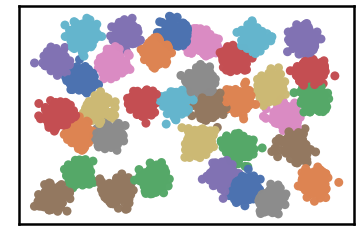

.. parsed-literal::

    
     ==================================================================================================== 
    
    There are 63 outlier point(s) in black (noise of type-1) represent 1% of total points
    There are 0 weak point(s) in light grey (noise of type-2) represent 0% of total points
    DenMune detected 230 clusters 
    

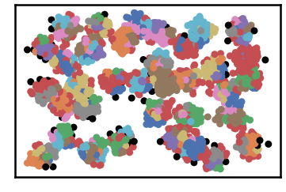

.. parsed-literal::

    k= 5 :Validity score is: 0.5864710212570391 but best score is 0.5864710212570391 at k= 5     
     ==================================================================================================== 
    
    using NGT, Proximity matrix has been calculated  in:  0.0998077392578125  seconds
    There are 43 outlier point(s) in black (noise of type-1) represent 1% of total points
    There are 0 weak point(s) in light grey (noise of type-2) represent 0% of total points
    DenMune detected 144 clusters 
    

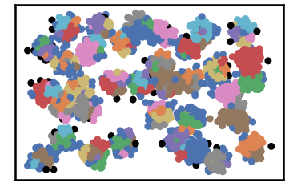

.. parsed-literal::

    k= 6 :Validity score is: 0.7074522411490288 but best score is 0.7074522411490288 at k= 6     
     ==================================================================================================== 
    
    using NGT, Proximity matrix has been calculated  in:  0.07574582099914551  seconds
    There are 25 outlier point(s) in black (noise of type-1) represent 0% of total points
    There are 0 weak point(s) in light grey (noise of type-2) represent 0% of total points
    DenMune detected 95 clusters 
    

.. image:: datasets/a2/output_3_7.png

.. parsed-literal::

    k= 7 :Validity score is: 0.7741701884132377 but best score is 0.7741701884132377 at k= 7     
     ==================================================================================================== 
    
    using NGT, Proximity matrix has been calculated  in:  0.11592698097229004  seconds
    There are 22 outlier point(s) in black (noise of type-1) represent 0% of total points
    There are 0 weak point(s) in light grey (noise of type-2) represent 0% of total points
    DenMune detected 65 clusters 
    

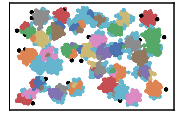

.. parsed-literal::

    k= 8 :Validity score is: 0.7974613470871128 but best score is 0.7974613470871128 at k= 8     
     ==================================================================================================== 
    
    using NGT, Proximity matrix has been calculated  in:  0.13671326637268066  seconds
    There are 15 outlier point(s) in black (noise of type-1) represent 0% of total points
    There are 0 weak point(s) in light grey (noise of type-2) represent 0% of total points
    DenMune detected 54 clusters 
    

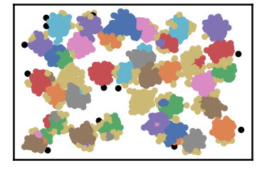

.. parsed-literal::

    k= 9 :Validity score is: 0.8891493926763121 but best score is 0.8891493926763121 at k= 9     
     ==================================================================================================== 
    
    using NGT, Proximity matrix has been calculated  in:  0.11426305770874023  seconds
    There are 14 outlier point(s) in black (noise of type-1) represent 0% of total points
    There are 0 weak point(s) in light grey (noise of type-2) represent 0% of total points
    DenMune detected 49 clusters 
    

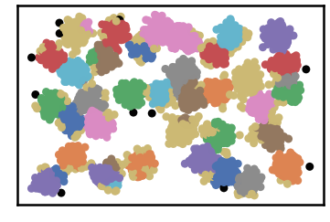

.. parsed-literal::

    k= 10 :Validity score is: 0.8817941001997371 but best score is 0.8891493926763121 at k= 9     
     ==================================================================================================== 
    
    using NGT, Proximity matrix has been calculated  in:  0.11754679679870605  seconds
    There are 12 outlier point(s) in black (noise of type-1) represent 0% of total points
    There are 0 weak point(s) in light grey (noise of type-2) represent 0% of total points
    DenMune detected 39 clusters 
    

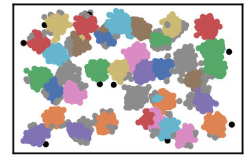

.. parsed-literal::

    k= 11 :Validity score is: 0.8936250535486268 but best score is 0.8936250535486268 at k= 11     
     ==================================================================================================== 
    
    using NGT, Proximity matrix has been calculated  in:  0.09736943244934082  seconds
    There are 11 outlier point(s) in black (noise of type-1) represent 0% of total points
    There are 0 weak point(s) in light grey (noise of type-2) represent 0% of total points
    DenMune detected 36 clusters 
    

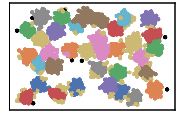

.. parsed-literal::

    k= 12 :Validity score is: 0.8716773792331559 but best score is 0.8936250535486268 at k= 11     
     ==================================================================================================== 
    
    using NGT, Proximity matrix has been calculated  in:  0.12694978713989258  seconds
    There are 11 outlier point(s) in black (noise of type-1) represent 0% of total points
    There are 0 weak point(s) in light grey (noise of type-2) represent 0% of total points
    DenMune detected 36 clusters 
    

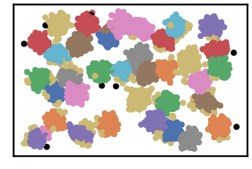

.. parsed-literal::

    k= 13 :Validity score is: 0.9115232024549726 but best score is 0.9115232024549726 at k= 13     
     ==================================================================================================== 
    
    using NGT, Proximity matrix has been calculated  in:  0.10122823715209961  seconds
    There are 8 outlier point(s) in black (noise of type-1) represent 0% of total points
    There are 0 weak point(s) in light grey (noise of type-2) represent 0% of total points
    DenMune detected 33 clusters 
    

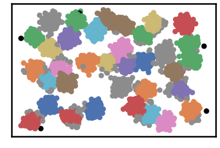

.. parsed-literal::

    k= 14 :Validity score is: 0.8857450223381936 but best score is 0.9115232024549726 at k= 13     
     ==================================================================================================== 
    
    using NGT, Proximity matrix has been calculated  in:  0.09865117073059082  seconds
    There are 8 outlier point(s) in black (noise of type-1) represent 0% of total points
    There are 0 weak point(s) in light grey (noise of type-2) represent 0% of total points
    DenMune detected 31 clusters 
    

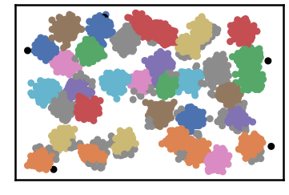

.. parsed-literal::

    k= 15 :Validity score is: 0.8159830486741992 but best score is 0.9115232024549726 at k= 13     
     ==================================================================================================== 
    
    using NGT, Proximity matrix has been calculated  in:  0.12059569358825684  seconds
    There are 7 outlier point(s) in black (noise of type-1) represent 0% of total points
    There are 0 weak point(s) in light grey (noise of type-2) represent 0% of total points
    DenMune detected 33 clusters 
    

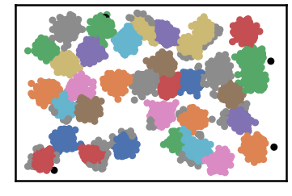

.. parsed-literal::

    k= 16 :Validity score is: 0.8768151337573286 but best score is 0.9115232024549726 at k= 13     
     ==================================================================================================== 
    
    using NGT, Proximity matrix has been calculated  in:  0.1090996265411377  seconds
    There are 7 outlier point(s) in black (noise of type-1) represent 0% of total points
    There are 0 weak point(s) in light grey (noise of type-2) represent 0% of total points
    DenMune detected 31 clusters 
    

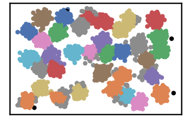

.. parsed-literal::

    k= 17 :Validity score is: 0.8245924337459768 but best score is 0.9115232024549726 at k= 13     
     ==================================================================================================== 
    
    using NGT, Proximity matrix has been calculated  in:  0.10828018188476562  seconds
    There are 7 outlier point(s) in black (noise of type-1) represent 0% of total points
    There are 0 weak point(s) in light grey (noise of type-2) represent 0% of total points
    DenMune detected 33 clusters 
    

.. parsed-literal::

    k= 18 :Validity score is: 0.8977241526116724 but best score is 0.9115232024549726 at k= 13     
     ==================================================================================================== 
    
    using NGT, Proximity matrix has been calculated  in:  0.13713431358337402  seconds
    There are 7 outlier point(s) in black (noise of type-1) represent 0% of total points
    There are 0 weak point(s) in light grey (noise of type-2) represent 0% of total points
    DenMune detected 32 clusters 
    

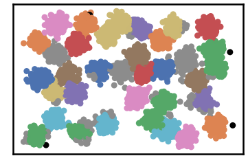

.. parsed-literal::

    k= 19 :Validity score is: 0.8607354150045408 but best score is 0.9115232024549726 at k= 13     
     ==================================================================================================== 
    
    using NGT, Proximity matrix has been calculated  in:  0.15227127075195312  seconds
    There are 6 outlier point(s) in black (noise of type-1) represent 0% of total points
    There are 0 weak point(s) in light grey (noise of type-2) represent 0% of total points
    DenMune detected 32 clusters 
    

.. image:: datasets/a2/output_3_33.png

.. parsed-literal::

    k= 20 :Validity score is: 0.8612481904596092 but best score is 0.9115232024549726 at k= 13     
     ==================================================================================================== 
    
    using NGT, Proximity matrix has been calculated  in:  0.12079548835754395  seconds
    There are 6 outlier point(s) in black (noise of type-1) represent 0% of total points
    There are 0 weak point(s) in light grey (noise of type-2) represent 0% of total points
    DenMune detected 32 clusters 
    

.. parsed-literal::

    k= 21 :Validity score is: 0.8666286340155688 but best score is 0.9115232024549726 at k= 13     
     ==================================================================================================== 
    
    using NGT, Proximity matrix has been calculated  in:  0.12417101860046387  seconds
    There are 6 outlier point(s) in black (noise of type-1) represent 0% of total points
    There are 0 weak point(s) in light grey (noise of type-2) represent 0% of total points
    DenMune detected 32 clusters 
    

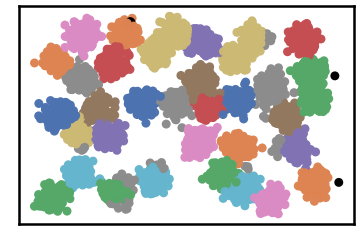

.. parsed-literal::

    k= 22 :Validity score is: 0.8672952345350025 but best score is 0.9115232024549726 at k= 13     
     ==================================================================================================== 
    
    using NGT, Proximity matrix has been calculated  in:  0.146834135055542  seconds
    There are 6 outlier point(s) in black (noise of type-1) represent 0% of total points
    There are 0 weak point(s) in light grey (noise of type-2) represent 0% of total points
    DenMune detected 32 clusters 
    

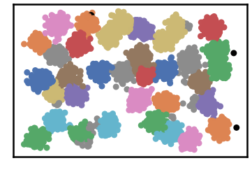

.. parsed-literal::

    k= 23 :Validity score is: 0.8682761960030115 but best score is 0.9115232024549726 at k= 13     
     ==================================================================================================== 
    
    using NGT, Proximity matrix has been calculated  in:  0.13053488731384277  seconds
    There are 6 outlier point(s) in black (noise of type-1) represent 0% of total points
    There are 0 weak point(s) in light grey (noise of type-2) represent 0% of total points
    DenMune detected 32 clusters 
    

.. parsed-literal::

    k= 24 :Validity score is: 0.8667938347164925 but best score is 0.9115232024549726 at k= 13     
     ==================================================================================================== 
    
    using NGT, Proximity matrix has been calculated  in:  0.14505457878112793  seconds
    There are 6 outlier point(s) in black (noise of type-1) represent 0% of total points
    There are 0 weak point(s) in light grey (noise of type-2) represent 0% of total points
    DenMune detected 32 clusters 
    

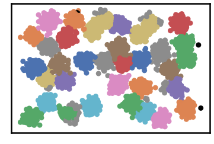

.. parsed-literal::

    k= 25 :Validity score is: 0.8676737026189878 but best score is 0.9115232024549726 at k= 13     
     ==================================================================================================== 
    
    using NGT, Proximity matrix has been calculated  in:  0.14754462242126465  seconds
    There are 5 outlier point(s) in black (noise of type-1) represent 0% of total points
    There are 0 weak point(s) in light grey (noise of type-2) represent 0% of total points
    DenMune detected 32 clusters 
    

.. parsed-literal::

    k= 26 :Validity score is: 0.8705420284512531 but best score is 0.9115232024549726 at k= 13     
     ==================================================================================================== 
    
    using NGT, Proximity matrix has been calculated  in:  0.15557551383972168  seconds
    There are 4 outlier point(s) in black (noise of type-1) represent 0% of total points
    There are 0 weak point(s) in light grey (noise of type-2) represent 0% of total points
    DenMune detected 32 clusters 
    

.. parsed-literal::

    k= 27 :Validity score is: 0.8699842502425269 but best score is 0.9115232024549726 at k= 13     
     ==================================================================================================== 
    
    using NGT, Proximity matrix has been calculated  in:  0.16003894805908203  seconds
    There are 4 outlier point(s) in black (noise of type-1) represent 0% of total points
    There are 0 weak point(s) in light grey (noise of type-2) represent 0% of total points
    DenMune detected 32 clusters 
    

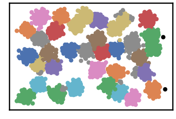

.. parsed-literal::

    k= 28 :Validity score is: 0.873614813859628 but best score is 0.9115232024549726 at k= 13     
     ==================================================================================================== 
    
    using NGT, Proximity matrix has been calculated  in:  0.1610405445098877  seconds
    There are 3 outlier point(s) in black (noise of type-1) represent 0% of total points
    There are 0 weak point(s) in light grey (noise of type-2) represent 0% of total points
    DenMune detected 33 clusters 
    

.. parsed-literal::

    k= 29 :Validity score is: 0.9098892988607995 but best score is 0.9115232024549726 at k= 13     
     ==================================================================================================== 
    
    using NGT, Proximity matrix has been calculated  in:  0.17227745056152344  seconds
    There are 3 outlier point(s) in black (noise of type-1) represent 0% of total points
    There are 0 weak point(s) in light grey (noise of type-2) represent 0% of total points
    DenMune detected 33 clusters 
    

.. parsed-literal::

    k= 30 :Validity score is: 0.909251429828706 but best score is 0.9115232024549726 at k= 13     
     ==================================================================================================== 
    
    using NGT, Proximity matrix has been calculated  in:  0.1834416389465332  seconds
    There are 2 outlier point(s) in black (noise of type-1) represent 0% of total points
    There are 0 weak point(s) in light grey (noise of type-2) represent 0% of total points
    DenMune detected 33 clusters 
    

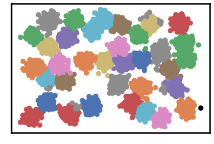

.. parsed-literal::

    k= 31 :Validity score is: 0.9106192648637166 but best score is 0.9115232024549726 at k= 13     
     ==================================================================================================== 
    
    using NGT, Proximity matrix has been calculated  in:  0.17345070838928223  seconds
    There are 2 outlier point(s) in black (noise of type-1) represent 0% of total points
    There are 0 weak point(s) in light grey (noise of type-2) represent 0% of total points
    DenMune detected 33 clusters 
    

.. parsed-literal::

    k= 32 :Validity score is: 0.9110069876455197 but best score is 0.9115232024549726 at k= 13     
     ==================================================================================================== 
    
    using NGT, Proximity matrix has been calculated  in:  0.2375030517578125  seconds
    There are 2 outlier point(s) in black (noise of type-1) represent 0% of total points
    There are 0 weak point(s) in light grey (noise of type-2) represent 0% of total points
    DenMune detected 33 clusters 
    

.. parsed-literal::

    k= 33 :Validity score is: 0.9144485362856591 but best score is 0.9144485362856591 at k= 33     
     ==================================================================================================== 
    
    using NGT, Proximity matrix has been calculated  in:  0.17737841606140137  seconds
    There are 2 outlier point(s) in black (noise of type-1) represent 0% of total points
    There are 0 weak point(s) in light grey (noise of type-2) represent 0% of total points
    DenMune detected 33 clusters 
    

.. image:: datasets/a2/output_3_61.png

.. parsed-literal::

    k= 34 :Validity score is: 0.9157804789812707 but best score is 0.9157804789812707 at k= 34     
     ==================================================================================================== 
    
    using NGT, Proximity matrix has been calculated  in:  0.23755812644958496  seconds
    There are 1 outlier point(s) in black (noise of type-1) represent 0% of total points
    There are 0 weak point(s) in light grey (noise of type-2) represent 0% of total points
    DenMune detected 33 clusters 
    

.. parsed-literal::

    k= 35 :Validity score is: 0.9166589366692112 but best score is 0.9166589366692112 at k= 35     
     ==================================================================================================== 
    
    using NGT, Proximity matrix has been calculated  in:  0.16965842247009277  seconds
    There are 1 outlier point(s) in black (noise of type-1) represent 0% of total points
    There are 0 weak point(s) in light grey (noise of type-2) represent 0% of total points
    DenMune detected 34 clusters 
    

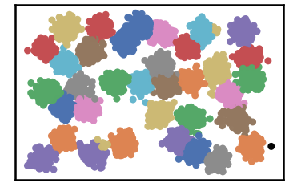

.. parsed-literal::

    k= 36 :Validity score is: 0.9528573856685968 but best score is 0.9528573856685968 at k= 36     
     ==================================================================================================== 
    
    using NGT, Proximity matrix has been calculated  in:  0.2249295711517334  seconds
    There are 1 outlier point(s) in black (noise of type-1) represent 0% of total points
    There are 0 weak point(s) in light grey (noise of type-2) represent 0% of total points
    DenMune detected 34 clusters 
    

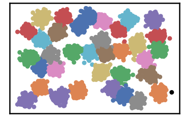

.. parsed-literal::

    k= 37 :Validity score is: 0.9552730079271825 but best score is 0.9552730079271825 at k= 37     
     ==================================================================================================== 
    
    using NGT, Proximity matrix has been calculated  in:  0.15952420234680176  seconds
    There are 1 outlier point(s) in black (noise of type-1) represent 0% of total points
    There are 0 weak point(s) in light grey (noise of type-2) represent 0% of total points
    DenMune detected 33 clusters 
    

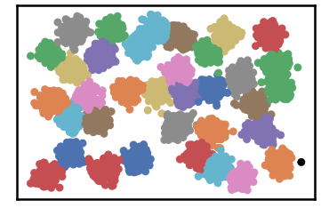

.. parsed-literal::

    k= 38 :Validity score is: 0.9191196549904646 but best score is 0.9552730079271825 at k= 37     
     ==================================================================================================== 
    
    using NGT, Proximity matrix has been calculated  in:  0.21010684967041016  seconds
    There are 0 outlier point(s) in black (noise of type-1) represent 0% of total points
    There are 0 weak point(s) in light grey (noise of type-2) represent 0% of total points
    DenMune detected 34 clusters 
    

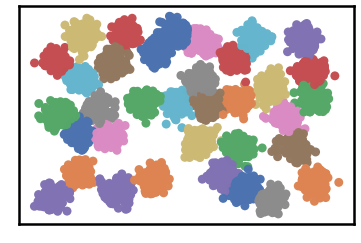

.. parsed-literal::

    k= 39 :Validity score is: 0.9567083195213666 but best score is 0.9567083195213666 at k= 39     
     ==================================================================================================== 
    
    using NGT, Proximity matrix has been calculated  in:  0.21008706092834473  seconds
    There are 0 outlier point(s) in black (noise of type-1) represent 0% of total points
    There are 0 weak point(s) in light grey (noise of type-2) represent 0% of total points
    DenMune detected 32 clusters 
    

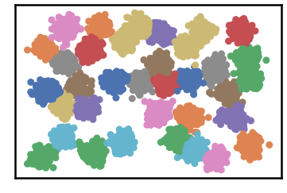

.. parsed-literal::

    k= 40 :Validity score is: 0.8828611209282811 but best score is 0.9567083195213666 at k= 39     
     ==================================================================================================== 
    

.. parsed-literal::

    <Figure size 432x288 with 0 Axes>

.. code:: ipython3

    # It is time to save the results
    results_path = 'results/'  # change it to whatever you output results to, set it to ''; so it will output to current folder
    para_file = 'denmune'+ '_para_'  + dataset + '.csv'
    df.sort_values(by=['F1', 'NMI', 'ARI'] , ascending=False, inplace=True)   
    df.to_csv(results_path + para_file, index=False, sep='\t', header=True)

.. code:: ipython3

    df # it is sorted now and saved

.. raw:: html

    

    
    <table border="1" class="dataframe">
      <thead>
        <tr style="text-align: right;">
          <th></th>
          <th>K</th>
          <th>ACC</th>
          <th>F1</th>
          <th>NMI</th>
          <th>AMI</th>
          <th>ARI</th>
          <th>Homogeneity</th>
          <th>Completeness</th>
          <th>Time</th>
        </tr>
      </thead>
      <tbody>
        <tr>
          <th>34</th>
          <td>39.0</td>
          <td>5072.0</td>
          <td>0.956708</td>
          <td>0.984093</td>
          <td>0.983566</td>
          <td>0.957820</td>
          <td>0.978589</td>
          <td>0.989658</td>
          <td>3.333653</td>
        </tr>
        <tr>
          <th>32</th>
          <td>37.0</td>
          <td>5064.0</td>
          <td>0.955273</td>
          <td>0.982717</td>
          <td>0.982141</td>
          <td>0.955035</td>
          <td>0.977365</td>
          <td>0.988128</td>
          <td>2.430394</td>
        </tr>
        <tr>
          <th>31</th>
          <td>36.0</td>
          <td>5051.0</td>
          <td>0.952857</td>
          <td>0.979587</td>
          <td>0.978908</td>
          <td>0.949936</td>
          <td>0.974222</td>
          <td>0.985012</td>
          <td>2.435593</td>
        </tr>
        <tr>
          <th>33</th>
          <td>38.0</td>
          <td>4924.0</td>
          <td>0.919120</td>
          <td>0.978806</td>
          <td>0.978119</td>
          <td>0.931632</td>
          <td>0.968054</td>
          <td>0.989799</td>
          <td>3.285442</td>
        </tr>
        <tr>
          <th>30</th>
          <td>35.0</td>
          <td>4911.0</td>
          <td>0.916659</td>
          <td>0.976116</td>
          <td>0.975343</td>
          <td>0.926958</td>
          <td>0.965391</td>
          <td>0.987083</td>
          <td>2.282217</td>
        </tr>
        <tr>
          <th>29</th>
          <td>34.0</td>
          <td>4906.0</td>
          <td>0.915780</td>
          <td>0.975150</td>
          <td>0.974342</td>
          <td>0.925341</td>
          <td>0.964548</td>
          <td>0.985987</td>
          <td>2.238722</td>
        </tr>
        <tr>
          <th>28</th>
          <td>33.0</td>
          <td>4899.0</td>
          <td>0.914449</td>
          <td>0.973366</td>
          <td>0.972500</td>
          <td>0.922775</td>
          <td>0.962778</td>
          <td>0.984189</td>
          <td>3.010125</td>
        </tr>
        <tr>
          <th>8</th>
          <td>13.0</td>
          <td>4773.0</td>
          <td>0.911523</td>
          <td>0.928331</td>
          <td>0.925750</td>
          <td>0.834004</td>
          <td>0.923494</td>
          <td>0.933218</td>
          <td>1.389836</td>
        </tr>
        <tr>
          <th>27</th>
          <td>32.0</td>
          <td>4879.0</td>
          <td>0.911007</td>
          <td>0.969332</td>
          <td>0.968334</td>
          <td>0.914675</td>
          <td>0.958620</td>
          <td>0.980287</td>
          <td>2.191572</td>
        </tr>
        <tr>
          <th>26</th>
          <td>31.0</td>
          <td>4877.0</td>
          <td>0.910619</td>
          <td>0.968695</td>
          <td>0.967677</td>
          <td>0.913956</td>
          <td>0.957998</td>
          <td>0.979635</td>
          <td>2.506671</td>
        </tr>
        <tr>
          <th>24</th>
          <td>29.0</td>
          <td>4872.0</td>
          <td>0.909889</td>
          <td>0.967551</td>
          <td>0.966492</td>
          <td>0.911974</td>
          <td>0.956917</td>
          <td>0.978424</td>
          <td>2.298921</td>
        </tr>
        <tr>
          <th>25</th>
          <td>30.0</td>
          <td>4868.0</td>
          <td>0.909251</td>
          <td>0.966928</td>
          <td>0.965849</td>
          <td>0.910600</td>
          <td>0.956303</td>
          <td>0.977792</td>
          <td>2.683558</td>
        </tr>
        <tr>
          <th>13</th>
          <td>18.0</td>
          <td>4797.0</td>
          <td>0.897724</td>
          <td>0.949001</td>
          <td>0.947320</td>
          <td>0.877115</td>
          <td>0.938202</td>
          <td>0.960050</td>
          <td>1.690296</td>
        </tr>
        <tr>
          <th>6</th>
          <td>11.0</td>
          <td>4644.0</td>
          <td>0.893625</td>
          <td>0.919331</td>
          <td>0.916177</td>
          <td>0.811025</td>
          <td>0.919983</td>
          <td>0.918679</td>
          <td>1.192523</td>
        </tr>
        <tr>
          <th>4</th>
          <td>9.0</td>
          <td>4440.0</td>
          <td>0.889149</td>
          <td>0.896268</td>
          <td>0.890833</td>
          <td>0.760506</td>
          <td>0.918597</td>
          <td>0.874998</td>
          <td>1.242115</td>
        </tr>
        <tr>
          <th>9</th>
          <td>14.0</td>
          <td>4715.0</td>
          <td>0.885745</td>
          <td>0.931181</td>
          <td>0.928905</td>
          <td>0.836567</td>
          <td>0.919496</td>
          <td>0.943166</td>
          <td>1.309601</td>
        </tr>
        <tr>
          <th>35</th>
          <td>40.0</td>
          <td>4783.0</td>
          <td>0.882861</td>
          <td>0.973900</td>
          <td>0.973083</td>
          <td>0.907031</td>
          <td>0.957594</td>
          <td>0.990772</td>
          <td>3.035338</td>
        </tr>
        <tr>
          <th>5</th>
          <td>10.0</td>
          <td>4508.0</td>
          <td>0.881794</td>
          <td>0.903206</td>
          <td>0.898591</td>
          <td>0.774202</td>
          <td>0.914215</td>
          <td>0.892458</td>
          <td>1.072658</td>
        </tr>
        <tr>
          <th>11</th>
          <td>16.0</td>
          <td>4680.0</td>
          <td>0.876815</td>
          <td>0.934862</td>
          <td>0.932710</td>
          <td>0.838807</td>
          <td>0.923190</td>
          <td>0.946832</td>
          <td>1.523093</td>
        </tr>
        <tr>
          <th>23</th>
          <td>28.0</td>
          <td>4730.0</td>
          <td>0.873615</td>
          <td>0.962014</td>
          <td>0.960806</td>
          <td>0.890068</td>
          <td>0.946486</td>
          <td>0.978060</td>
          <td>2.027007</td>
        </tr>
        <tr>
          <th>7</th>
          <td>12.0</td>
          <td>4605.0</td>
          <td>0.871677</td>
          <td>0.920746</td>
          <td>0.917883</td>
          <td>0.805030</td>
          <td>0.912060</td>
          <td>0.929599</td>
          <td>1.347491</td>
        </tr>
        <tr>
          <th>21</th>
          <td>26.0</td>
          <td>4711.0</td>
          <td>0.870542</td>
          <td>0.959210</td>
          <td>0.957909</td>
          <td>0.883880</td>
          <td>0.943671</td>
          <td>0.975268</td>
          <td>2.078764</td>
        </tr>
        <tr>
          <th>22</th>
          <td>27.0</td>
          <td>4708.0</td>
          <td>0.869984</td>
          <td>0.958169</td>
          <td>0.956838</td>
          <td>0.881952</td>
          <td>0.942498</td>
          <td>0.974370</td>
          <td>1.958839</td>
        </tr>
        <tr>
          <th>18</th>
          <td>23.0</td>
          <td>4700.0</td>
          <td>0.868276</td>
          <td>0.955419</td>
          <td>0.953994</td>
          <td>0.877683</td>
          <td>0.939812</td>
          <td>0.971553</td>
          <td>1.713094</td>
        </tr>
        <tr>
          <th>20</th>
          <td>25.0</td>
          <td>4696.0</td>
          <td>0.867674</td>
          <td>0.954754</td>
          <td>0.953308</td>
          <td>0.876035</td>
          <td>0.939325</td>
          <td>0.970698</td>
          <td>2.064271</td>
        </tr>
        <tr>
          <th>17</th>
          <td>22.0</td>
          <td>4694.0</td>
          <td>0.867295</td>
          <td>0.954608</td>
          <td>0.953157</td>
          <td>0.875490</td>
          <td>0.938950</td>
          <td>0.970797</td>
          <td>1.852631</td>
        </tr>
        <tr>
          <th>19</th>
          <td>24.0</td>
          <td>4689.0</td>
          <td>0.866794</td>
          <td>0.953320</td>
          <td>0.951828</td>
          <td>0.872090</td>
          <td>0.937713</td>
          <td>0.969455</td>
          <td>1.756472</td>
        </tr>
        <tr>
          <th>16</th>
          <td>21.0</td>
          <td>4690.0</td>
          <td>0.866629</td>
          <td>0.953857</td>
          <td>0.952382</td>
          <td>0.874422</td>
          <td>0.938250</td>
          <td>0.969992</td>
          <td>1.679489</td>
        </tr>
        <tr>
          <th>15</th>
          <td>20.0</td>
          <td>4659.0</td>
          <td>0.861248</td>
          <td>0.948228</td>
          <td>0.946571</td>
          <td>0.861432</td>
          <td>0.932229</td>
          <td>0.964785</td>
          <td>1.946641</td>
        </tr>
        <tr>
          <th>14</th>
          <td>19.0</td>
          <td>4652.0</td>
          <td>0.860735</td>
          <td>0.944725</td>
          <td>0.942952</td>
          <td>0.853985</td>
          <td>0.928621</td>
          <td>0.961397</td>
          <td>1.875022</td>
        </tr>
        <tr>
          <th>12</th>
          <td>17.0</td>
          <td>4515.0</td>
          <td>0.824592</td>
          <td>0.937489</td>
          <td>0.935543</td>
          <td>0.831558</td>
          <td>0.916791</td>
          <td>0.959145</td>
          <td>1.445357</td>
        </tr>
        <tr>
          <th>10</th>
          <td>15.0</td>
          <td>4456.0</td>
          <td>0.815983</td>
          <td>0.925016</td>
          <td>0.922673</td>
          <td>0.805761</td>
          <td>0.903775</td>
          <td>0.947279</td>
          <td>1.483391</td>
        </tr>
        <tr>
          <th>3</th>
          <td>8.0</td>
          <td>3991.0</td>
          <td>0.797461</td>
          <td>0.873684</td>
          <td>0.865824</td>
          <td>0.689034</td>
          <td>0.898429</td>
          <td>0.850266</td>
          <td>1.194283</td>
        </tr>
        <tr>
          <th>2</th>
          <td>7.0</td>
          <td>3692.0</td>
          <td>0.774170</td>
          <td>0.853070</td>
          <td>0.840142</td>
          <td>0.651007</td>
          <td>0.913518</td>
          <td>0.800126</td>
          <td>1.236548</td>
        </tr>
        <tr>
          <th>1</th>
          <td>6.0</td>
          <td>3129.0</td>
          <td>0.707452</td>
          <td>0.808649</td>
          <td>0.785046</td>
          <td>0.512310</td>
          <td>0.903356</td>
          <td>0.731915</td>
          <td>1.353306</td>
        </tr>
        <tr>
          <th>0</th>
          <td>5.0</td>
          <td>2405.0</td>
          <td>0.586471</td>
          <td>0.764958</td>
          <td>0.721789</td>
          <td>0.380161</td>
          <td>0.902540</td>
          <td>0.663774</td>
          <td>1.591946</td>
        </tr>
      </tbody>
    </table>
    

