Appendicitis datasets
======================

.. code:: ipython3

    import time
    import os.path
    import requests
    import pandas as pd

.. code:: ipython3

    # install DenMune clustering algorithm using pip command from the offecial Python repository, PyPi
    # from https://pypi.org/project/denmune/
    !pip install denmune
    
    # now import it
    from denmune import DenMune

.. code:: ipython3

    dataset = 'appendicitis' # let us take Appendicitis dataset as an example
    
    url = "https://zerobytes.one/denmune_data/"
    file_ext = ".txt"
    ground_ext = "-gt"
    
    dataset_url = url + dataset + file_ext
    groundtruth_url = url + dataset + ground_ext  + file_ext
    
    data_path = 'data/' # change it to whatever you put your data, set it to ''; so it will retrive from current folder
    if  not os.path.isfile(data_path + dataset + file_ext):
        req = requests.get(dataset_url)
        with open(data_path + dataset + file_ext, 'wb') as f:
            f.write(req.content)
            
    if  not os.path.isfile(data_path + dataset + ground_ext + file_ext):
        req = requests.get(groundtruth_url)
        with open(data_path + dataset +  ground_ext + file_ext, 'wb') as f:
            f.write(req.content)       

.. code:: ipython3

    # Denmune's Paramaters
    # DenMune(dataset=dataset, k_nearest=n, data_path=data_path, verpose=verpose_mode, show_plot=show_plot, show_noise=show_noise)
    verpose_mode = True # view in-depth analysis of time complexity and outlier detection, num of clusters
    show_plot = True  # show plots on/off
    show_noise = True # show noise and outlier on/off
    
    # loop's parameters
    start = 2
    step = 1
    end=12
    
    # Validity indexes' parameters
    validity_val = -1
    best_k = 0
    best_val = -1
    
    validity_idx = 2 # Acc=1, F1-score=2,  NMI=3, AMI=4, ARI=5,  Homogeneity=6, and Completeness=7
    df = pd.DataFrame(columns =['K', 'ACC', 'F1', 'NMI', 'AMI', 'ARI','Homogeneity', 'Completeness', 'Time' ])
    
    
    for n in range(start, end+1, step):
        start_time = time.time()
        dm = DenMune(dataset=dataset, k_nearest=n, data_path=data_path, verpose=verpose_mode, show_noise=show_noise)
        labels_true, labels_pred = dm.output_Clusters()
        if show_plot == True and n==start:
            # Let us plot the groundtruth of this dataset which is reduced to 2-d using t-SNE
            print ("Dataset\'s Groundtruht")
            dm.plot_clusters(labels_true, ground=True)
            print('\n', "=====" * 20 , '\n')       
                   
        end_time = time.time()
        
        validity_indexes = dm.validate_Clusters(labels_true, labels_pred)
        validity_val = validity_indexes[validity_idx]
        validity_indexes[0] = n
        validity_indexes[8] = end_time - start_time
        
        df = df.append(pd.Series(validity_indexes, index=df.columns ), ignore_index=True)
        
        if (best_val < validity_val):
            best_val = validity_val
            best_k = n
            # Let us show results where only an improve in accuracy is detected
        if show_plot:
                dm.plot_clusters(labels_pred, show_noise=show_noise)
        print ('k=' , n, ':Validity score is:', validity_val , 'but best score is', best_val, 'at k=', best_k , end='     ')
                
        if not verpose_mode:
            print('\r', end='')
        else:
            print('\n', "=====" * 20 , '\n')

.. parsed-literal::

    using NGT, Proximity matrix has been calculated  in:  0.0009572505950927734  seconds
    Dataset's Groundtruht

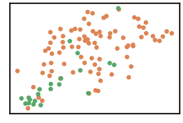

.. parsed-literal::

    
     ==================================================================================================== 
    
    There are 8 outlier point(s) in black (noise of type-1) represent 8% of total points
    There are 4 weak point(s) in light grey (noise of type-2) represent 4% of total points
    DenMune detected 22 clusters 
    

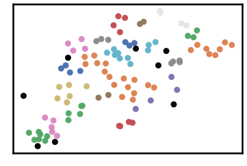

.. parsed-literal::

    k= 2 :Validity score is: 0.29345340194396796 but best score is 0.29345340194396796 at k= 2     
     ==================================================================================================== 
    
    using NGT, Proximity matrix has been calculated  in:  0.0016608238220214844  seconds
    There are 2 outlier point(s) in black (noise of type-1) represent 2% of total points
    There are 3 weak point(s) in light grey (noise of type-2) represent 3% of total points
    DenMune detected 13 clusters 
    

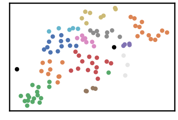

.. parsed-literal::

    k= 3 :Validity score is: 0.34125133990363105 but best score is 0.34125133990363105 at k= 3     
     ==================================================================================================== 
    
    using NGT, Proximity matrix has been calculated  in:  0.0016977787017822266  seconds
    There are 1 outlier point(s) in black (noise of type-1) represent 1% of total points
    There are 0 weak point(s) in light grey (noise of type-2) represent 0% of total points
    DenMune detected 7 clusters 
    

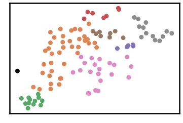

.. parsed-literal::

    k= 4 :Validity score is: 0.5219388037403861 but best score is 0.5219388037403861 at k= 4     
     ==================================================================================================== 
    
    using NGT, Proximity matrix has been calculated  in:  0.001567840576171875  seconds
    There are 1 outlier point(s) in black (noise of type-1) represent 1% of total points
    There are 0 weak point(s) in light grey (noise of type-2) represent 0% of total points
    DenMune detected 4 clusters 
    

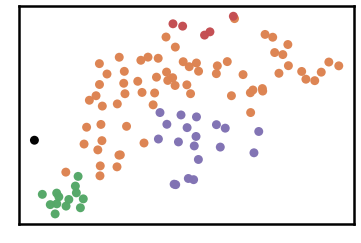

.. parsed-literal::

    k= 5 :Validity score is: 0.7664323591071648 but best score is 0.7664323591071648 at k= 5     
     ==================================================================================================== 
    
    using NGT, Proximity matrix has been calculated  in:  0.002506256103515625  seconds
    There are 1 outlier point(s) in black (noise of type-1) represent 1% of total points
    There are 0 weak point(s) in light grey (noise of type-2) represent 0% of total points
    DenMune detected 5 clusters 
    

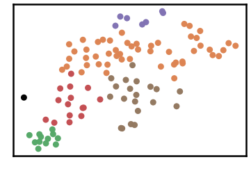

.. parsed-literal::

    k= 6 :Validity score is: 0.6858919382504289 but best score is 0.7664323591071648 at k= 5     
     ==================================================================================================== 
    
    using NGT, Proximity matrix has been calculated  in:  0.0022726058959960938  seconds
    There are 1 outlier point(s) in black (noise of type-1) represent 1% of total points
    There are 0 weak point(s) in light grey (noise of type-2) represent 0% of total points
    DenMune detected 3 clusters 
    

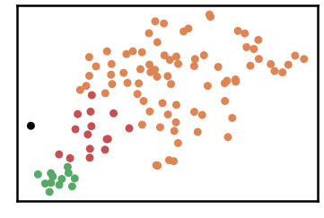

.. parsed-literal::

    k= 7 :Validity score is: 0.806637973671195 but best score is 0.806637973671195 at k= 7     
     ==================================================================================================== 
    
    using NGT, Proximity matrix has been calculated  in:  0.0019979476928710938  seconds
    There are 1 outlier point(s) in black (noise of type-1) represent 1% of total points
    There are 0 weak point(s) in light grey (noise of type-2) represent 0% of total points
    DenMune detected 3 clusters 
    

.. parsed-literal::

    k= 8 :Validity score is: 0.806637973671195 but best score is 0.806637973671195 at k= 7     
     ==================================================================================================== 
    
    using NGT, Proximity matrix has been calculated  in:  0.002064228057861328  seconds
    There are 1 outlier point(s) in black (noise of type-1) represent 1% of total points
    There are 0 weak point(s) in light grey (noise of type-2) represent 0% of total points
    DenMune detected 2 clusters 
    

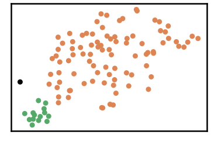

.. parsed-literal::

    k= 9 :Validity score is: 0.7289879931389365 but best score is 0.806637973671195 at k= 7     
     ==================================================================================================== 
    
    using NGT, Proximity matrix has been calculated  in:  0.0029211044311523438  seconds
    There are 0 outlier point(s) in black (noise of type-1) represent 0% of total points
    There are 4 weak point(s) in light grey (noise of type-2) represent 4% of total points
    DenMune detected 2 clusters 
    

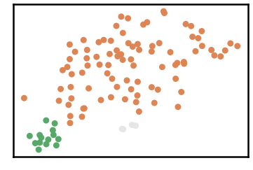

.. parsed-literal::

    k= 10 :Validity score is: 0.8362962155087795 but best score is 0.8362962155087795 at k= 10     
     ==================================================================================================== 
    
    using NGT, Proximity matrix has been calculated  in:  0.002622842788696289  seconds
    There are 0 outlier point(s) in black (noise of type-1) represent 0% of total points
    There are 3 weak point(s) in light grey (noise of type-2) represent 3% of total points
    DenMune detected 2 clusters 
    

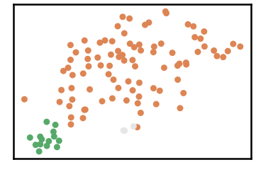

.. parsed-literal::

    k= 11 :Validity score is: 0.8413576230752547 but best score is 0.8413576230752547 at k= 11     
     ==================================================================================================== 
    
    using NGT, Proximity matrix has been calculated  in:  0.1183176040649414  seconds
    There are 0 outlier point(s) in black (noise of type-1) represent 0% of total points
    There are 0 weak point(s) in light grey (noise of type-2) represent 0% of total points
    DenMune detected 1 clusters 
    

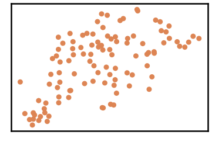

.. parsed-literal::

    k= 12 :Validity score is: 0.713721228884718 but best score is 0.8413576230752547 at k= 11     
     ==================================================================================================== 
    

.. parsed-literal::

    <Figure size 432x288 with 0 Axes>

.. code:: ipython3

    # It is time to save the results
    results_path = 'results/'  # change it to whatever you output results to, set it to ''; so it will output to current folder
    para_file = 'denmune'+ '_para_'  + dataset + '.csv'
    df.sort_values(by=['F1', 'NMI', 'ARI'] , ascending=False, inplace=True)   
    df.to_csv(results_path + para_file, index=False, sep='\t', header=True)

.. code:: ipython3

    df # it is sorted now and saved

.. raw:: html

    

    
    <table border="1" class="dataframe">
      <thead>
        <tr style="text-align: right;">
          <th></th>
          <th>K</th>
          <th>ACC</th>
          <th>F1</th>
          <th>NMI</th>
          <th>AMI</th>
          <th>ARI</th>
          <th>Homogeneity</th>
          <th>Completeness</th>
          <th>Time</th>
        </tr>
      </thead>
      <tbody>
        <tr>
          <th>9</th>
          <td>11.0</td>
          <td>89.0</td>
          <td>0.841358</td>
          <td>2.086952e-01</td>
          <td>1.915519e-01</td>
          <td>0.387821</td>
          <td>2.123123e-01</td>
          <td>0.205199</td>
          <td>0.023242</td>
        </tr>
        <tr>
          <th>8</th>
          <td>10.0</td>
          <td>88.0</td>
          <td>0.836296</td>
          <td>1.986163e-01</td>
          <td>1.815834e-01</td>
          <td>0.367447</td>
          <td>2.081449e-01</td>
          <td>0.189922</td>
          <td>0.024623</td>
        </tr>
        <tr>
          <th>5</th>
          <td>7.0</td>
          <td>80.0</td>
          <td>0.806638</td>
          <td>1.888070e-01</td>
          <td>1.692873e-01</td>
          <td>0.336147</td>
          <td>2.448029e-01</td>
          <td>0.153659</td>
          <td>0.014274</td>
        </tr>
        <tr>
          <th>6</th>
          <td>8.0</td>
          <td>80.0</td>
          <td>0.806638</td>
          <td>1.888070e-01</td>
          <td>1.692873e-01</td>
          <td>0.336147</td>
          <td>2.448029e-01</td>
          <td>0.153659</td>
          <td>0.018385</td>
        </tr>
        <tr>
          <th>3</th>
          <td>5.0</td>
          <td>72.0</td>
          <td>0.766432</td>
          <td>1.617368e-01</td>
          <td>1.385227e-01</td>
          <td>0.242295</td>
          <td>2.495537e-01</td>
          <td>0.119637</td>
          <td>0.017354</td>
        </tr>
        <tr>
          <th>7</th>
          <td>9.0</td>
          <td>80.0</td>
          <td>0.728988</td>
          <td>2.175373e-01</td>
          <td>2.006636e-01</td>
          <td>0.370876</td>
          <td>2.054272e-01</td>
          <td>0.231165</td>
          <td>0.020975</td>
        </tr>
        <tr>
          <th>10</th>
          <td>12.0</td>
          <td>85.0</td>
          <td>0.713721</td>
          <td>-3.122516e-15</td>
          <td>-8.845725e-15</td>
          <td>0.000000</td>
          <td>-1.561258e-15</td>
          <td>1.000000</td>
          <td>0.142560</td>
        </tr>
        <tr>
          <th>4</th>
          <td>6.0</td>
          <td>58.0</td>
          <td>0.685892</td>
          <td>1.495829e-01</td>
          <td>1.259867e-01</td>
          <td>0.179844</td>
          <td>2.871643e-01</td>
          <td>0.101131</td>
          <td>0.019236</td>
        </tr>
        <tr>
          <th>2</th>
          <td>4.0</td>
          <td>41.0</td>
          <td>0.521939</td>
          <td>1.219913e-01</td>
          <td>9.205599e-02</td>
          <td>0.026825</td>
          <td>2.760626e-01</td>
          <td>0.078295</td>
          <td>0.015982</td>
        </tr>
        <tr>
          <th>1</th>
          <td>3.0</td>
          <td>25.0</td>
          <td>0.341251</td>
          <td>1.474115e-01</td>
          <td>1.018192e-01</td>
          <td>0.022887</td>
          <td>4.410434e-01</td>
          <td>0.088495</td>
          <td>0.018264</td>
        </tr>
        <tr>
          <th>0</th>
          <td>2.0</td>
          <td>19.0</td>
          <td>0.293453</td>
          <td>1.726989e-01</td>
          <td>1.079344e-01</td>
          <td>0.020610</td>
          <td>6.113306e-01</td>
          <td>0.100552</td>
          <td>0.173841</td>
        </tr>
      </tbody>
    </table>
    

