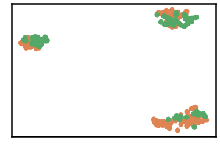
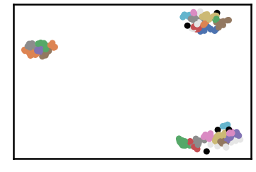
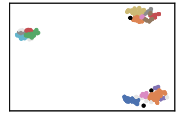
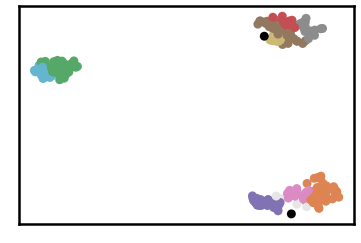
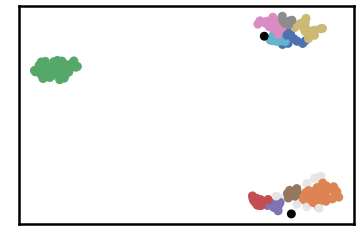
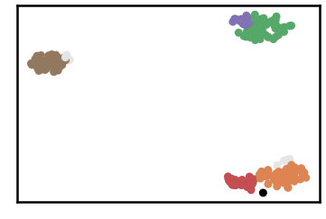
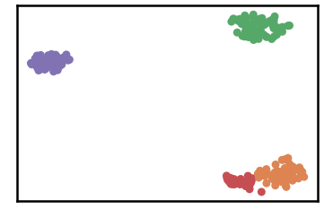
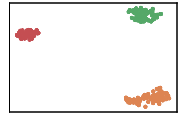

Arcene Dataset
================

.. code:: ipython3

    import time
    import os.path
    import requests
    import pandas as pd

.. code:: ipython3

    # install DenMune clustering algorithm using pip command from the offecial Python repository, PyPi
    # from https://pypi.org/project/denmune/
    !pip install denmune
    
    # now import it
    from denmune import DenMune

.. code:: ipython3

    dataset = 'arcene' # let us take Arcene dataset as an example
    
    url = "https://zerobytes.one/denmune_data/"
    file_ext = ".txt"
    ground_ext = "-gt"
    
    dataset_url = url + dataset + file_ext
    groundtruth_url = url + dataset + ground_ext  + file_ext
    
    data_path = 'data/' # change it to whatever you put your data, set it to ''; so it will retrive from current folder
    if  not os.path.isfile(data_path + dataset + file_ext):
        req = requests.get(dataset_url)
        with open(data_path + dataset + file_ext, 'wb') as f:
            f.write(req.content)
            
    if  not os.path.isfile(data_path + dataset + ground_ext + file_ext):
        req = requests.get(groundtruth_url)
        with open(data_path + dataset +  ground_ext + file_ext, 'wb') as f:
            f.write(req.content)       

.. code:: ipython3

    # Denmune's Paramaters
    # DenMune(dataset=dataset, k_nearest=n, data_path=data_path, verpose=verpose_mode, show_plot=show_plot, show_noise=show_noise)
    verpose_mode = True # view in-depth analysis of time complexity and outlier detection, num of clusters
    show_plot = True  # show plots on/off
    show_noise = True # show noise and outlier on/off
    
    # loop's parameters
    start = 3
    step = 1
    end=10
    
    # Validity indexes' parameters
    validity_val = -1
    best_k = 0
    best_val = -1
    
    validity_idx = 2 # Acc=1, F1-score=2,  NMI=3, AMI=4, ARI=5,  Homogeneity=6, and Completeness=7
    df = pd.DataFrame(columns =['K', 'ACC', 'F1', 'NMI', 'AMI', 'ARI','Homogeneity', 'Completeness', 'Time' ])
    
    
    for n in range(start, end+1, step):
        start_time = time.time()
        dm = DenMune(dataset=dataset, k_nearest=n, data_path=data_path, verpose=verpose_mode, show_noise=show_noise)
        labels_true, labels_pred = dm.output_Clusters()
        if show_plot == True and n==start:
            # Let us plot the groundtruth of this dataset which is reduced to 2-d using t-SNE
            print ("Dataset\'s Groundtruht")
            dm.plot_clusters(labels_true, ground=True)
            print('\n', "=====" * 20 , '\n')       
                   
        end_time = time.time()
        
        validity_indexes = dm.validate_Clusters(labels_true, labels_pred)
        validity_val = validity_indexes[validity_idx]
        validity_indexes[0] = n
        validity_indexes[8] = end_time - start_time
        
        df = df.append(pd.Series(validity_indexes, index=df.columns ), ignore_index=True)
        
        if (best_val < validity_val):
            best_val = validity_val
            best_k = n
            # Let us show results where only an improve in accuracy is detected
        if show_plot:
                dm.plot_clusters(labels_pred, show_noise=show_noise)
        print ('k=' , n, ':Validity score is:', validity_val , 'but best score is', best_val, 'at k=', best_k , end='     ')
                
        if not verpose_mode:
            print('\r', end='')
        else:
            print('\n', "=====" * 20 , '\n')

.. parsed-literal::

    using NGT, Proximity matrix has been calculated  in:  0.0027883052825927734  seconds
    Dataset's Groundtruht

.. parsed-literal::

    
     ==================================================================================================== 
    
    There are 5 outlier point(s) in black (noise of type-1) represent 2% of total points
    There are 15 weak point(s) in light grey (noise of type-2) represent 8% of total points
    DenMune detected 28 clusters 
    

.. parsed-literal::

    k= 3 :Validity score is: 0.21398709677419356 but best score is 0.21398709677419356 at k= 3     
     ==================================================================================================== 
    
    using NGT, Proximity matrix has been calculated  in:  0.002399444580078125  seconds
    There are 3 outlier point(s) in black (noise of type-1) represent 2% of total points
    There are 12 weak point(s) in light grey (noise of type-2) represent 6% of total points
    DenMune detected 17 clusters 
    

.. parsed-literal::

    k= 4 :Validity score is: 0.3194942044257113 but best score is 0.3194942044257113 at k= 4     
     ==================================================================================================== 
    
    using NGT, Proximity matrix has been calculated  in:  0.004059791564941406  seconds
    There are 2 outlier point(s) in black (noise of type-1) represent 1% of total points
    There are 4 weak point(s) in light grey (noise of type-2) represent 2% of total points
    DenMune detected 9 clusters 
    

.. parsed-literal::

    k= 5 :Validity score is: 0.4319617224880383 but best score is 0.4319617224880383 at k= 5     
     ==================================================================================================== 
    
    using NGT, Proximity matrix has been calculated  in:  0.0022721290588378906  seconds
    There are 2 outlier point(s) in black (noise of type-1) represent 1% of total points
    There are 10 weak point(s) in light grey (noise of type-2) represent 5% of total points
    DenMune detected 10 clusters 
    

.. parsed-literal::

    k= 6 :Validity score is: 0.42164086687306507 but best score is 0.4319617224880383 at k= 5     
     ==================================================================================================== 
    
    using NGT, Proximity matrix has been calculated  in:  0.0030138492584228516  seconds
    There are 1 outlier point(s) in black (noise of type-1) represent 0% of total points
    There are 8 weak point(s) in light grey (noise of type-2) represent 4% of total points
    DenMune detected 5 clusters 
    

.. parsed-literal::

    k= 7 :Validity score is: 0.4406516205667741 but best score is 0.4406516205667741 at k= 7     
     ==================================================================================================== 
    
    using NGT, Proximity matrix has been calculated  in:  0.0038573741912841797  seconds
    There are 0 outlier point(s) in black (noise of type-1) represent 0% of total points
    There are 0 weak point(s) in light grey (noise of type-2) represent 0% of total points
    DenMune detected 4 clusters 
    

.. parsed-literal::

    k= 8 :Validity score is: 0.4656591251885369 but best score is 0.4656591251885369 at k= 8     
     ==================================================================================================== 
    
    using NGT, Proximity matrix has been calculated  in:  0.0025887489318847656  seconds
    There are 0 outlier point(s) in black (noise of type-1) represent 0% of total points
    There are 0 weak point(s) in light grey (noise of type-2) represent 0% of total points
    DenMune detected 3 clusters 
    

.. parsed-literal::

    k= 9 :Validity score is: 0.5744322344322345 but best score is 0.5744322344322345 at k= 9     
     ==================================================================================================== 
    
    using NGT, Proximity matrix has been calculated  in:  0.0044629573822021484  seconds
    There are 0 outlier point(s) in black (noise of type-1) represent 0% of total points
    There are 0 weak point(s) in light grey (noise of type-2) represent 0% of total points
    DenMune detected 4 clusters 
    

.. parsed-literal::

    k= 10 :Validity score is: 0.4656591251885369 but best score is 0.5744322344322345 at k= 9     
     ==================================================================================================== 
    

.. parsed-literal::

    <Figure size 432x288 with 0 Axes>

.. code:: ipython3

    # It is time to save the results
    results_path = 'results/'  # change it to whatever you output results to, set it to ''; so it will output to current folder
    para_file = 'denmune'+ '_para_'  + dataset + '.csv'
    df.sort_values(by=['F1', 'NMI', 'ARI'] , ascending=False, inplace=True)   
    df.to_csv(results_path + para_file, index=False, sep='\t', header=True)

.. code:: ipython3

    df # it is sorted now and saved

.. raw:: html

    

    
    <table border="1" class="dataframe">
      <thead>
        <tr style="text-align: right;">
          <th></th>
          <th>K</th>
          <th>ACC</th>
          <th>F1</th>
          <th>NMI</th>
          <th>AMI</th>
          <th>ARI</th>
          <th>Homogeneity</th>
          <th>Completeness</th>
          <th>Time</th>
        </tr>
      </thead>
      <tbody>
        <tr>
          <th>6</th>
          <td>9.0</td>
          <td>101.0</td>
          <td>0.574432</td>
          <td>0.073950</td>
          <td>0.068598</td>
          <td>0.092083</td>
          <td>0.094850</td>
          <td>0.060597</td>
          <td>2.365471</td>
        </tr>
        <tr>
          <th>5</th>
          <td>8.0</td>
          <td>76.0</td>
          <td>0.465659</td>
          <td>0.090107</td>
          <td>0.083193</td>
          <td>0.045345</td>
          <td>0.132641</td>
          <td>0.068228</td>
          <td>2.577182</td>
        </tr>
        <tr>
          <th>7</th>
          <td>10.0</td>
          <td>76.0</td>
          <td>0.465659</td>
          <td>0.090107</td>
          <td>0.083193</td>
          <td>0.045345</td>
          <td>0.132641</td>
          <td>0.068228</td>
          <td>2.790059</td>
        </tr>
        <tr>
          <th>4</th>
          <td>7.0</td>
          <td>68.0</td>
          <td>0.440652</td>
          <td>0.079940</td>
          <td>0.066804</td>
          <td>0.039291</td>
          <td>0.135621</td>
          <td>0.056672</td>
          <td>2.670122</td>
        </tr>
        <tr>
          <th>2</th>
          <td>5.0</td>
          <td>59.0</td>
          <td>0.431962</td>
          <td>0.141331</td>
          <td>0.124800</td>
          <td>0.077756</td>
          <td>0.296712</td>
          <td>0.092756</td>
          <td>2.592071</td>
        </tr>
        <tr>
          <th>3</th>
          <td>6.0</td>
          <td>61.0</td>
          <td>0.421641</td>
          <td>0.102367</td>
          <td>0.083680</td>
          <td>0.039793</td>
          <td>0.217525</td>
          <td>0.066932</td>
          <td>2.393256</td>
        </tr>
        <tr>
          <th>1</th>
          <td>4.0</td>
          <td>40.0</td>
          <td>0.319494</td>
          <td>0.210260</td>
          <td>0.185526</td>
          <td>0.065190</td>
          <td>0.514721</td>
          <td>0.132114</td>
          <td>2.849524</td>
        </tr>
        <tr>
          <th>0</th>
          <td>3.0</td>
          <td>24.0</td>
          <td>0.213987</td>
          <td>0.194257</td>
          <td>0.159263</td>
          <td>0.037501</td>
          <td>0.565716</td>
          <td>0.117261</td>
          <td>3.174840</td>
        </tr>
      </tbody>
    </table>
    

