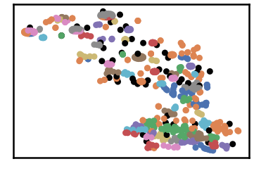
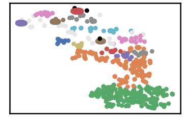
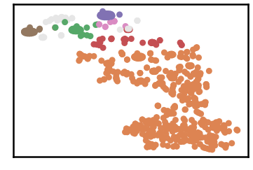
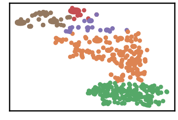
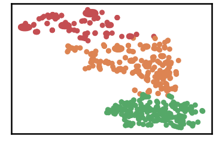
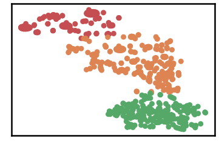
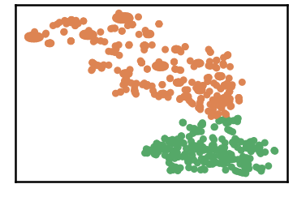

Breast Cancer Dataset
==========================

.. code:: ipython3

    import time
    import os.path
    import requests
    import pandas as pd

.. code:: ipython3

    # install DenMune clustering algorithm using pip command from the offecial Python repository, PyPi
    # from https://pypi.org/project/denmune/
    !pip install denmune
    
    # now import it
    from denmune import DenMune

.. code:: ipython3

    dataset = 'breast' # let us take Breast Cancer dataset as an example
    
    url = "https://zerobytes.one/denmune_data/"
    file_ext = ".txt"
    ground_ext = "-gt"
    
    dataset_url = url + dataset + file_ext
    groundtruth_url = url + dataset + ground_ext  + file_ext
    
    data_path = 'data/' # change it to whatever you put your data, set it to ''; so it will retrive from current folder
    if  not os.path.isfile(data_path + dataset + file_ext):
        req = requests.get(dataset_url)
        with open(data_path + dataset + file_ext, 'wb') as f:
            f.write(req.content)
            
    if  not os.path.isfile(data_path + dataset + ground_ext + file_ext):
        req = requests.get(groundtruth_url)
        with open(data_path + dataset +  ground_ext + file_ext, 'wb') as f:
            f.write(req.content)       

.. code:: ipython3

    # Denmune's Paramaters
    # DenMune(dataset=dataset, k_nearest=n, data_path=data_path, verpose=verpose_mode, show_plot=show_plot, show_noise=show_noise)
    verpose_mode = True # view in-depth analysis of time complexity and outlier detection, num of clusters
    show_plot = True  # show plots on/off
    show_noise = True # show noise and outlier on/off
    
    # loop's parameters
    start = 3
    step = 10
    end=100
    
    # Validity indexes' parameters
    validity_val = -1
    best_k = 0
    best_val = -1
    
    validity_idx = 2 # Acc=1, F1-score=2,  NMI=3, AMI=4, ARI=5,  Homogeneity=6, and Completeness=7
    df = pd.DataFrame(columns =['K', 'ACC', 'F1', 'NMI', 'AMI', 'ARI','Homogeneity', 'Completeness', 'Time' ])
    
    
    for n in range(start, end+1, step):
        start_time = time.time()
        dm = DenMune(dataset=dataset, k_nearest=n, data_path=data_path, verpose=verpose_mode, show_noise=show_noise)
        labels_true, labels_pred = dm.output_Clusters()
        if show_plot == True and n==start:
            # Let us plot the groundtruth of this dataset which is reduced to 2-d using t-SNE
            print ("Dataset\'s Groundtruht")
            dm.plot_clusters(labels_true, ground=True)
            print('\n', "=====" * 20 , '\n')       
                   
        end_time = time.time()
        
        validity_indexes = dm.validate_Clusters(labels_true, labels_pred)
        validity_val = validity_indexes[validity_idx]
        validity_indexes[0] = n
        validity_indexes[8] = end_time - start_time
        
        df = df.append(pd.Series(validity_indexes, index=df.columns ), ignore_index=True)
        
        if (best_val < validity_val):
            best_val = validity_val
            best_k = n
            # Let us show results where only an improve in accuracy is detected
        if show_plot:
                dm.plot_clusters(labels_pred, show_noise=show_noise)
        print ('k=' , n, ':Validity score is:', validity_val , 'but best score is', best_val, 'at k=', best_k , end='     ')
                
        if not verpose_mode:
            print('\r', end='')
        else:
            print('\n', "=====" * 20 , '\n')

.. parsed-literal::

    using NGT, Proximity matrix has been calculated  in:  0.014810800552368164  seconds
    Dataset's Groundtruht

.. parsed-literal::

    
     ==================================================================================================== 
    
    There are 52 outlier point(s) in black (noise of type-1) represent 8% of total points
    There are 0 weak point(s) in light grey (noise of type-2) represent 0% of total points
    DenMune detected 81 clusters 
    

.. parsed-literal::

    k= 3 :Validity score is: 0.22356869493234036 but best score is 0.22356869493234036 at k= 3     
     ==================================================================================================== 
    
    using NGT, Proximity matrix has been calculated  in:  0.013700723648071289  seconds
    There are 3 outlier point(s) in black (noise of type-1) represent 0% of total points
    There are 48 weak point(s) in light grey (noise of type-2) represent 7% of total points
    DenMune detected 17 clusters 
    

.. parsed-literal::

    k= 13 :Validity score is: 0.5178159065490456 but best score is 0.5178159065490456 at k= 13     
     ==================================================================================================== 
    
    using NGT, Proximity matrix has been calculated  in:  0.02716350555419922  seconds
    There are 0 outlier point(s) in black (noise of type-1) represent 0% of total points
    There are 39 weak point(s) in light grey (noise of type-2) represent 6% of total points
    DenMune detected 6 clusters 
    

.. parsed-literal::

    k= 23 :Validity score is: 0.36540957077907066 but best score is 0.5178159065490456 at k= 13     
     ==================================================================================================== 
    
    using NGT, Proximity matrix has been calculated  in:  0.02761077880859375  seconds
    There are 0 outlier point(s) in black (noise of type-1) represent 0% of total points
    There are 0 weak point(s) in light grey (noise of type-2) represent 0% of total points
    DenMune detected 5 clusters 
    

.. parsed-literal::

    k= 33 :Validity score is: 0.785431189950322 but best score is 0.785431189950322 at k= 33     
     ==================================================================================================== 
    
    using NGT, Proximity matrix has been calculated  in:  0.03173661231994629  seconds
    There are 0 outlier point(s) in black (noise of type-1) represent 0% of total points
    There are 0 weak point(s) in light grey (noise of type-2) represent 0% of total points
    DenMune detected 3 clusters 
    

.. parsed-literal::

    k= 43 :Validity score is: 0.7900699880482858 but best score is 0.7900699880482858 at k= 43     
     ==================================================================================================== 
    
    using NGT, Proximity matrix has been calculated  in:  0.12326860427856445  seconds
    There are 0 outlier point(s) in black (noise of type-1) represent 0% of total points
    There are 0 weak point(s) in light grey (noise of type-2) represent 0% of total points
    DenMune detected 3 clusters 
    

.. parsed-literal::

    k= 53 :Validity score is: 0.8072861957230932 but best score is 0.8072861957230932 at k= 53     
     ==================================================================================================== 
    
    using NGT, Proximity matrix has been calculated  in:  0.044019460678100586  seconds
    There are 0 outlier point(s) in black (noise of type-1) represent 0% of total points
    There are 0 weak point(s) in light grey (noise of type-2) represent 0% of total points
    DenMune detected 3 clusters 
    

.. parsed-literal::

    k= 63 :Validity score is: 0.8124711746308257 but best score is 0.8124711746308257 at k= 63     
     ==================================================================================================== 
    
    using NGT, Proximity matrix has been calculated  in:  0.0491030216217041  seconds
    There are 0 outlier point(s) in black (noise of type-1) represent 0% of total points
    There are 0 weak point(s) in light grey (noise of type-2) represent 0% of total points
    DenMune detected 2 clusters 
    

.. parsed-literal::

    k= 73 :Validity score is: 0.9544522227175649 but best score is 0.9544522227175649 at k= 73     
     ==================================================================================================== 
    
    using NGT, Proximity matrix has been calculated  in:  0.12079691886901855  seconds
    There are 0 outlier point(s) in black (noise of type-1) represent 0% of total points
    There are 0 weak point(s) in light grey (noise of type-2) represent 0% of total points
    DenMune detected 2 clusters 
    

.. parsed-literal::

    k= 83 :Validity score is: 0.9664638041392066 but best score is 0.9664638041392066 at k= 83     
     ==================================================================================================== 
    
    using NGT, Proximity matrix has been calculated  in:  0.06252431869506836  seconds
    There are 0 outlier point(s) in black (noise of type-1) represent 0% of total points
    There are 0 weak point(s) in light grey (noise of type-2) represent 0% of total points
    DenMune detected 2 clusters 
    

.. parsed-literal::

    k= 93 :Validity score is: 0.9560761346998536 but best score is 0.9664638041392066 at k= 83     
     ==================================================================================================== 
    

.. parsed-literal::

    <Figure size 432x288 with 0 Axes>

.. code:: ipython3

    # It is time to save the results
    results_path = 'results/'  # change it to whatever you output results to, set it to ''; so it will output to current folder
    para_file = 'denmune'+ '_para_'  + dataset + '.csv'
    df.sort_values(by=['F1', 'NMI', 'ARI'] , ascending=False, inplace=True)   
    df.to_csv(results_path + para_file, index=False, sep='\t', header=True)

.. code:: ipython3

    df # it is sorted now and saved

.. raw:: html

    

    
    <table border="1" class="dataframe">
      <thead>
        <tr style="text-align: right;">
          <th></th>
          <th>K</th>
          <th>ACC</th>
          <th>F1</th>
          <th>NMI</th>
          <th>AMI</th>
          <th>ARI</th>
          <th>Homogeneity</th>
          <th>Completeness</th>
          <th>Time</th>
        </tr>
      </thead>
      <tbody>
        <tr>
          <th>8</th>
          <td>83.0</td>
          <td>660.0</td>
          <td>0.966464</td>
          <td>0.780068</td>
          <td>0.779820</td>
          <td>0.868788</td>
          <td>0.784757</td>
          <td>0.775436</td>
          <td>0.750314</td>
        </tr>
        <tr>
          <th>9</th>
          <td>93.0</td>
          <td>653.0</td>
          <td>0.956076</td>
          <td>0.724983</td>
          <td>0.724671</td>
          <td>0.830440</td>
          <td>0.724983</td>
          <td>0.724983</td>
          <td>0.910463</td>
        </tr>
        <tr>
          <th>7</th>
          <td>73.0</td>
          <td>652.0</td>
          <td>0.954452</td>
          <td>0.718711</td>
          <td>0.718390</td>
          <td>0.824856</td>
          <td>0.715059</td>
          <td>0.722401</td>
          <td>0.662819</td>
        </tr>
        <tr>
          <th>6</th>
          <td>63.0</td>
          <td>496.0</td>
          <td>0.812471</td>
          <td>0.554315</td>
          <td>0.553549</td>
          <td>0.495309</td>
          <td>0.733796</td>
          <td>0.445379</td>
          <td>0.797327</td>
        </tr>
        <tr>
          <th>5</th>
          <td>53.0</td>
          <td>491.0</td>
          <td>0.807286</td>
          <td>0.554134</td>
          <td>0.553370</td>
          <td>0.491499</td>
          <td>0.735186</td>
          <td>0.444635</td>
          <td>0.541339</td>
        </tr>
        <tr>
          <th>4</th>
          <td>43.0</td>
          <td>476.0</td>
          <td>0.790070</td>
          <td>0.545115</td>
          <td>0.544339</td>
          <td>0.476085</td>
          <td>0.726980</td>
          <td>0.436034</td>
          <td>0.386786</td>
        </tr>
        <tr>
          <th>3</th>
          <td>33.0</td>
          <td>472.0</td>
          <td>0.785431</td>
          <td>0.463960</td>
          <td>0.462358</td>
          <td>0.387205</td>
          <td>0.711270</td>
          <td>0.344260</td>
          <td>0.343201</td>
        </tr>
        <tr>
          <th>1</th>
          <td>13.0</td>
          <td>272.0</td>
          <td>0.517816</td>
          <td>0.311505</td>
          <td>0.305414</td>
          <td>0.142120</td>
          <td>0.754676</td>
          <td>0.196257</td>
          <td>0.111369</td>
        </tr>
        <tr>
          <th>2</th>
          <td>23.0</td>
          <td>267.0</td>
          <td>0.365410</td>
          <td>0.162086</td>
          <td>0.157517</td>
          <td>-0.074860</td>
          <td>0.208555</td>
          <td>0.132551</td>
          <td>0.184174</td>
        </tr>
        <tr>
          <th>0</th>
          <td>3.0</td>
          <td>89.0</td>
          <td>0.223569</td>
          <td>0.217410</td>
          <td>0.193557</td>
          <td>0.023791</td>
          <td>0.782906</td>
          <td>0.126232</td>
          <td>0.199810</td>
        </tr>
      </tbody>
    </table>
    

