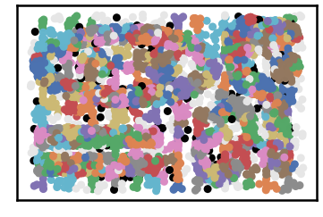
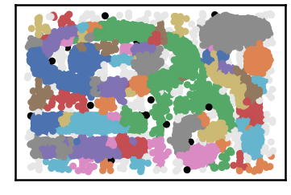
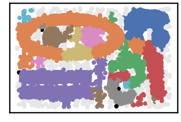
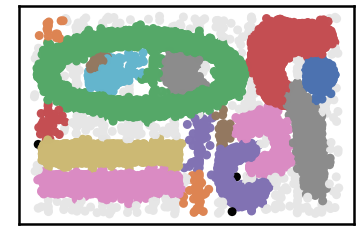
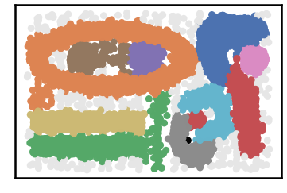
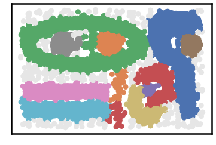
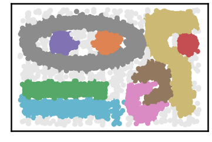
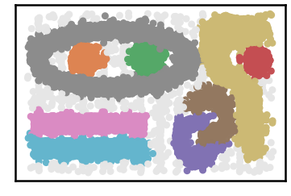
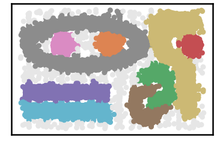

Chameleon DS4 Dataset
=====================

.. code:: ipython3

    import time
    import os.path
    import requests

.. code:: ipython3

    # install DenMune clustering algorithm using pip command from the offecial Python repository, PyPi
    # from https://pypi.org/project/denmune/
    !pip install denmune
    
    # now import it
    from denmune import DenMune

.. code:: ipython3

    dataset = 'cham_04' # let us take Chameleon DS4 dataset as an example
    
    url = "https://zerobytes.one/denmune_data/"
    file_ext = ".txt"
    # ground_ext = "-gt" # no groundtruth for this dataset
    
    dataset_url = url + dataset + file_ext
    # groundtruth_url = url + dataset + ground_ext  + file_ext # no groundtruth for this dataset
    
    data_path = 'data/' # change it to whatever you put your data, set it to ''; so it will retrive from current folder
    if  not os.path.isfile(data_path + dataset + file_ext):
        req = requests.get(dataset_url)
        with open(data_path + dataset + file_ext, 'wb') as f:
            f.write(req.content)

.. code:: ipython3

    # Denmune's Paramaters
    # DenMune(dataset=dataset, k_nearest=n, data_path=data_path, verpose=verpose_mode, show_plot=show_plot, show_noise=show_noise)
    verpose_mode = True # view in-depth analysis of time complexity and outlier detection, num of clusters
    show_plot = True  # show plots on/off
    show_noise = True # show noise and outlier on/off
    
    # loop's parameters
    start = 5
    step = 5
    end=45
    
    for n in range(start, end+1, step):
        start_time = time.time()
        dm = DenMune(dataset=dataset, k_nearest=n, data_path=data_path, verpose=verpose_mode, show_noise=show_noise)
        labels_true, labels_pred = dm.output_Clusters()
        end_time = time.time()
        
       
        if show_plot:
            dm.plot_clusters(labels_pred, show_noise=show_noise)
        print ('k=' , n , end='     ')
                
        if not verpose_mode:
            print('\r', end='')
        else:
            print('\n', "=====" * 20 , '\n')

.. parsed-literal::

    using NGT, Proximity matrix has been calculated  in:  0.23638534545898438  seconds
    There are 72 outlier point(s) in black (noise of type-1) represent 1% of total points
    There are 466 weak point(s) in light grey (noise of type-2) represent 5% of total points
    DenMune detected 480 clusters 
    

.. parsed-literal::

    k= 5     
     ==================================================================================================== 
    
    using NGT, Proximity matrix has been calculated  in:  0.21171855926513672  seconds
    There are 15 outlier point(s) in black (noise of type-1) represent 0% of total points
    There are 281 weak point(s) in light grey (noise of type-2) represent 3% of total points
    DenMune detected 84 clusters 
    

.. parsed-literal::

    k= 10     
     ==================================================================================================== 
    
    using NGT, Proximity matrix has been calculated  in:  0.2982974052429199  seconds
    There are 4 outlier point(s) in black (noise of type-1) represent 0% of total points
    There are 343 weak point(s) in light grey (noise of type-2) represent 3% of total points
    DenMune detected 25 clusters 
    

.. parsed-literal::

    k= 15     
     ==================================================================================================== 
    
    using NGT, Proximity matrix has been calculated  in:  0.3641092777252197  seconds
    There are 3 outlier point(s) in black (noise of type-1) represent 0% of total points
    There are 394 weak point(s) in light grey (noise of type-2) represent 4% of total points
    DenMune detected 17 clusters 
    

.. parsed-literal::

    k= 20     
     ==================================================================================================== 
    
    using NGT, Proximity matrix has been calculated  in:  0.35553503036499023  seconds
    There are 1 outlier point(s) in black (noise of type-1) represent 0% of total points
    There are 392 weak point(s) in light grey (noise of type-2) represent 4% of total points
    DenMune detected 13 clusters 
    

.. parsed-literal::

    k= 25     
     ==================================================================================================== 
    
    using NGT, Proximity matrix has been calculated  in:  0.4677877426147461  seconds
    There are 0 outlier point(s) in black (noise of type-1) represent 0% of total points
    There are 405 weak point(s) in light grey (noise of type-2) represent 4% of total points
    DenMune detected 13 clusters 
    

.. parsed-literal::

    k= 30     
     ==================================================================================================== 
    
    using NGT, Proximity matrix has been calculated  in:  0.4956350326538086  seconds
    There are 0 outlier point(s) in black (noise of type-1) represent 0% of total points
    There are 491 weak point(s) in light grey (noise of type-2) represent 5% of total points
    DenMune detected 9 clusters 
    

.. parsed-literal::

    k= 35     
     ==================================================================================================== 
    
    using NGT, Proximity matrix has been calculated  in:  0.49184155464172363  seconds
    There are 0 outlier point(s) in black (noise of type-1) represent 0% of total points
    There are 491 weak point(s) in light grey (noise of type-2) represent 5% of total points
    DenMune detected 9 clusters 
    

.. parsed-literal::

    k= 40     
     ==================================================================================================== 
    
    using NGT, Proximity matrix has been calculated  in:  0.5078001022338867  seconds
    There are 0 outlier point(s) in black (noise of type-1) represent 0% of total points
    There are 481 weak point(s) in light grey (noise of type-2) represent 5% of total points
    DenMune detected 9 clusters 
    

.. parsed-literal::

    k= 45     
     ==================================================================================================== 
    

.. parsed-literal::

    <Figure size 432x288 with 0 Axes>

