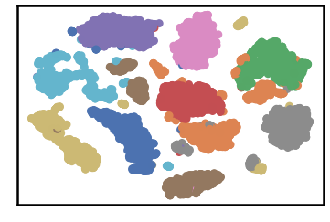

Stability
----------

.. code:: python

    import pandas as pd
    import numpy as np
    import matplotlib.pyplot as plt
    import time
    import os.path
    
    import warnings
    warnings.filterwarnings('ignore')

.. code:: python

    # install DenMune clustering algorithm using pip command from the offecial Python repository, PyPi
    # from https://pypi.org/project/denmune/
    !pip install denmune
    
    # then import it
    from denmune import DenMune

.. code:: python

    # clone datasets from our repository datasets
    if not os.path.exists('datasets'):
      !git clone https://github.com/egy1st/datasets

.. code:: python

    data_path = 'datasets/denmune/pendigits/'  
    file_2d = data_path + 'pendigits-2d.csv'
    
    X_train = pd.read_csv(data_path + 'train.csv', sep=',', header=None)
    y_train = X_train.iloc[:, -1]
    X_train = X_train.drop(X_train.columns[-1], axis=1) 
    X_test = pd.read_csv(data_path + 'test.csv', sep=',', header=None) 
    X_test = X_test.drop(X_test.columns[-1], axis=1)
    
    data_stability = [] 
    
    from IPython.display import clear_output
    for knn in range (1, 200):
      clear_output(wait=True)
      dm = DenMune(train_data=X_train,
                 train_truth=y_train,
                 test_data=X_test, 
                 k_nearest=knn,
                 file_2d=file_2d,
                 rgn_tsne=False)
    
      labels, validity = dm.fit_predict(show_plots=True, show_analyzer=False)
      
      validity_key = "F1"      
      print ('k=' , knn, validity_key , 'score is:', validity['train'][validity_key])
      data_stability.append([knn, validity['train'][validity_key]])

.. parsed-literal::

    k= 199 F1 score is: 0.7960390378193465

.. code:: python

    #computing moving average to smoth the curve
    x, y = zip(*data_stability)
    window = 5
    cumsum, moving_aves = [0], []
    
    for i, n in enumerate(y, 1):
        cumsum.append(cumsum[i-1] + n)
        if i>=window:
            moving_ave = (cumsum[i] - cumsum[i-window])/window
            #can do stuff with moving_ave here
            moving_aves.append(moving_ave)
    y = moving_aves        

.. code:: python

    # Creating figure and axis objects using subplots()
    fig, ax = plt.subplots(figsize=[20, 8])
    ax.plot(x[:-window+1], y, marker='.', linewidth=2, label='DenMune Stability')
    plt.xticks(rotation=60)
    ax.set_xlabel('k-nearest neighbors')
    ax.set_ylabel(validity_key + ' score')
    plt.legend()
    plt.show()

