Optical Digits Dataset
======================

.. code:: ipython3

    import time
    import os.path
    import requests
    import pandas as pd

.. code:: ipython3

    # install DenMune clustering algorithm using pip command from the offecial Python repository, PyPi
    # from https://pypi.org/project/denmune/
    !pip install denmune
    
    # now import it
    from denmune import DenMune

.. code:: ipython3

    dataset = 'chars' # let us take iris dataset as an example
    
    url = "https://zerobytes.one/denmune_data/"
    file_ext = ".txt"
    ground_ext = "-gt"
    
    dataset_url = url + dataset + file_ext
    groundtruth_url = url + dataset + ground_ext  + file_ext
    
    data_path = 'data/' # change it to whatever you put your data, set it to ''; so it will retrive from current folder
    if  not os.path.isfile(data_path + dataset + file_ext):
        req = requests.get(dataset_url)
        with open(data_path + dataset + file_ext, 'wb') as f:
            f.write(req.content)
        
    if  not os.path.isfile(data_path + dataset + ground_ext + file_ext):
        req = requests.get(groundtruth_url)
        with open(data_path + dataset +  ground_ext + file_ext, 'wb') as f:
            f.write(req.content)       

.. code:: ipython3

    # Denmune's Paramaters
    # DenMune(dataset=dataset, k_nearest=n, data_path=data_path, verpose=verpose_mode, show_plot=show_plot, show_noise=show_noise)
    verpose_mode = True # view in-depth analysis of time complexity and outlier detection, num of clusters
    show_plot = True  # show plots on/off
    show_noise = True # show noise and outlier on/off
    
    # loop's parameters
    start = 5
    step = 5
    end=100
    
    # Validity indexes' parameters
    validity_val = -1
    best_k = 0
    best_val = -1
    
    validity_idx = 2 # Acc=1, F1-score=2,  NMI=3, AMI=4, ARI=5,  Homogeneity=6, and Completeness=7
    df = pd.DataFrame(columns =['K', 'ACC', 'F1', 'NMI', 'AMI', 'ARI','Homogeneity', 'Completeness', 'Time' ])
    
    
    for n in range(start, end+1, step):
        start_time = time.time()
        dm = DenMune(dataset=dataset, k_nearest=n, data_path=data_path, verpose=verpose_mode, show_noise=show_noise)
        labels_true, labels_pred = dm.output_Clusters()
        if show_plot == True and n==start:
            # Let us plot the groundtruth of this dataset which is reduced to 2-d using t-SNE
            print ("Dataset\'s Groundtruht")
            dm.plot_clusters(labels_true, ground=True)
            print('\n', "=====" * 20 , '\n')       
                   
        end_time = time.time()
        
        validity_indexes = dm.validate_Clusters(labels_true, labels_pred)
        validity_val = validity_indexes[validity_idx]
        validity_indexes[0] = n
        validity_indexes[8] = end_time - start_time
        
        df = df.append(pd.Series(validity_indexes, index=df.columns ), ignore_index=True)
        
        if (best_val < validity_val):
            best_val = validity_val
            best_k = n
        # Let us show results where only an improve in accuracy is detected
        if show_plot:
                dm.plot_clusters(labels_pred, show_noise=show_noise)
        print ('k=' , n, ':Validity score is:', validity_val , 'but best score is', best_val, 'at k=', best_k , end='     ')
                
        if not verpose_mode:
            print('\r', end='')
        else:
            print('\n', "=====" * 20 , '\n')

.. parsed-literal::

    using t-SNE chars  dataset has been reduced to 2-d in  33.2231605052948  seconds
    using NGT, Proximity matrix has been calculated  in:  0.06522464752197266  seconds
    Dataset's Groundtruht

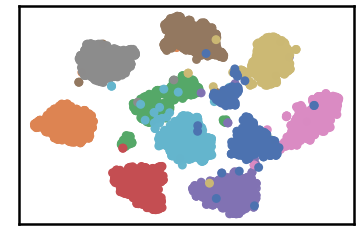

.. parsed-literal::

    
     ==================================================================================================== 
    
    There are 48 outlier point(s) in black (noise of type-1) represent 1% of total points
    There are 352 weak point(s) in light grey (noise of type-2) represent 6% of total points
    DenMune detected 286 clusters 
    

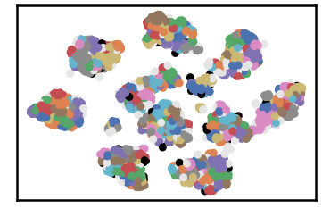

.. parsed-literal::

    k= 5 :Validity score is: 0.2505903782558811 but best score is 0.2505903782558811 at k= 5     
     ==================================================================================================== 
    
    using NGT, Proximity matrix has been calculated  in:  0.06783747673034668  seconds
    There are 8 outlier point(s) in black (noise of type-1) represent 0% of total points
    There are 115 weak point(s) in light grey (noise of type-2) represent 2% of total points
    DenMune detected 68 clusters 
    

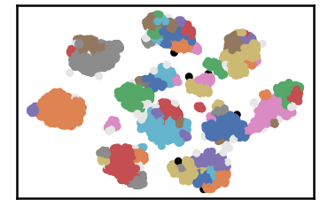

.. parsed-literal::

    k= 10 :Validity score is: 0.6887436872440568 but best score is 0.6887436872440568 at k= 10     
     ==================================================================================================== 
    
    using NGT, Proximity matrix has been calculated  in:  0.07927942276000977  seconds
    There are 1 outlier point(s) in black (noise of type-1) represent 0% of total points
    There are 92 weak point(s) in light grey (noise of type-2) represent 2% of total points
    DenMune detected 32 clusters 
    

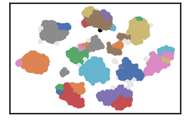

.. parsed-literal::

    k= 15 :Validity score is: 0.8310530895900827 but best score is 0.8310530895900827 at k= 15     
     ==================================================================================================== 
    
    using NGT, Proximity matrix has been calculated  in:  0.09425711631774902  seconds
    There are 1 outlier point(s) in black (noise of type-1) represent 0% of total points
    There are 68 weak point(s) in light grey (noise of type-2) represent 1% of total points
    DenMune detected 19 clusters 
    

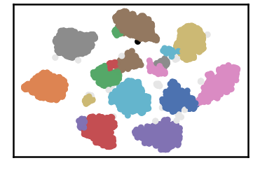

.. parsed-literal::

    k= 20 :Validity score is: 0.9214610809288906 but best score is 0.9214610809288906 at k= 20     
     ==================================================================================================== 
    
    using NGT, Proximity matrix has been calculated  in:  0.10963296890258789  seconds
    There are 0 outlier point(s) in black (noise of type-1) represent 0% of total points
    There are 43 weak point(s) in light grey (noise of type-2) represent 1% of total points
    DenMune detected 22 clusters 
    

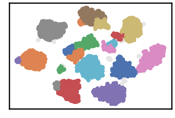

.. parsed-literal::

    k= 25 :Validity score is: 0.8822804149413315 but best score is 0.9214610809288906 at k= 20     
     ==================================================================================================== 
    
    using NGT, Proximity matrix has been calculated  in:  0.12322640419006348  seconds
    There are 0 outlier point(s) in black (noise of type-1) represent 0% of total points
    There are 39 weak point(s) in light grey (noise of type-2) represent 1% of total points
    DenMune detected 16 clusters 
    

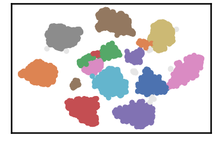

.. parsed-literal::

    k= 30 :Validity score is: 0.9226062505377836 but best score is 0.9226062505377836 at k= 30     
     ==================================================================================================== 
    
    using NGT, Proximity matrix has been calculated  in:  0.13576483726501465  seconds
    There are 0 outlier point(s) in black (noise of type-1) represent 0% of total points
    There are 42 weak point(s) in light grey (noise of type-2) represent 1% of total points
    DenMune detected 15 clusters 
    

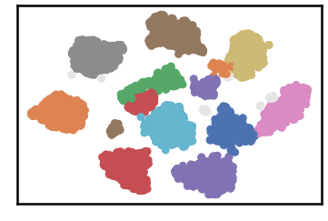

.. parsed-literal::

    k= 35 :Validity score is: 0.9259818999321192 but best score is 0.9259818999321192 at k= 35     
     ==================================================================================================== 
    
    using NGT, Proximity matrix has been calculated  in:  0.14704298973083496  seconds
    There are 0 outlier point(s) in black (noise of type-1) represent 0% of total points
    There are 29 weak point(s) in light grey (noise of type-2) represent 1% of total points
    DenMune detected 13 clusters 
    

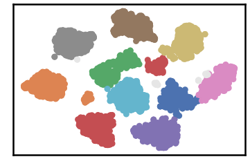

.. parsed-literal::

    k= 40 :Validity score is: 0.9365412263806417 but best score is 0.9365412263806417 at k= 40     
     ==================================================================================================== 
    
    using NGT, Proximity matrix has been calculated  in:  0.1679821014404297  seconds
    There are 0 outlier point(s) in black (noise of type-1) represent 0% of total points
    There are 29 weak point(s) in light grey (noise of type-2) represent 1% of total points
    DenMune detected 13 clusters 
    

.. parsed-literal::

    k= 45 :Validity score is: 0.9365412263806417 but best score is 0.9365412263806417 at k= 40     
     ==================================================================================================== 
    
    using NGT, Proximity matrix has been calculated  in:  0.1819467544555664  seconds
    There are 0 outlier point(s) in black (noise of type-1) represent 0% of total points
    There are 28 weak point(s) in light grey (noise of type-2) represent 0% of total points
    DenMune detected 12 clusters 
    

.. parsed-literal::

    k= 50 :Validity score is: 0.925536499299012 but best score is 0.9365412263806417 at k= 40     
     ==================================================================================================== 
    
    using NGT, Proximity matrix has been calculated  in:  0.19413137435913086  seconds
    There are 0 outlier point(s) in black (noise of type-1) represent 0% of total points
    There are 27 weak point(s) in light grey (noise of type-2) represent 0% of total points
    DenMune detected 13 clusters 
    

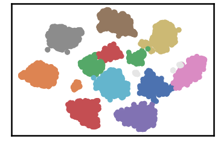

.. parsed-literal::

    k= 55 :Validity score is: 0.9380145840324141 but best score is 0.9380145840324141 at k= 55     
     ==================================================================================================== 
    
    using NGT, Proximity matrix has been calculated  in:  0.20542454719543457  seconds
    There are 0 outlier point(s) in black (noise of type-1) represent 0% of total points
    There are 68 weak point(s) in light grey (noise of type-2) represent 1% of total points
    DenMune detected 12 clusters 
    

.. parsed-literal::

    k= 60 :Validity score is: 0.9388372333647652 but best score is 0.9388372333647652 at k= 60     
     ==================================================================================================== 
    
    using NGT, Proximity matrix has been calculated  in:  0.33961009979248047  seconds
    There are 0 outlier point(s) in black (noise of type-1) represent 0% of total points
    There are 56 weak point(s) in light grey (noise of type-2) represent 1% of total points
    DenMune detected 12 clusters 
    

.. parsed-literal::

    k= 65 :Validity score is: 0.9354079543328574 but best score is 0.9388372333647652 at k= 60     
     ==================================================================================================== 
    
    using NGT, Proximity matrix has been calculated  in:  0.23458552360534668  seconds
    There are 0 outlier point(s) in black (noise of type-1) represent 0% of total points
    There are 56 weak point(s) in light grey (noise of type-2) represent 1% of total points
    DenMune detected 12 clusters 
    

.. parsed-literal::

    k= 70 :Validity score is: 0.9367958646336041 but best score is 0.9388372333647652 at k= 60     
     ==================================================================================================== 
    
    using NGT, Proximity matrix has been calculated  in:  0.25034093856811523  seconds
    There are 0 outlier point(s) in black (noise of type-1) represent 0% of total points
    There are 56 weak point(s) in light grey (noise of type-2) represent 1% of total points
    DenMune detected 12 clusters 
    

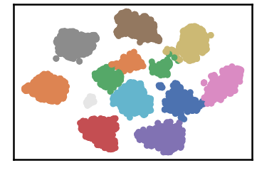

.. parsed-literal::

    k= 75 :Validity score is: 0.9366436125664311 but best score is 0.9388372333647652 at k= 60     
     ==================================================================================================== 
    
    using NGT, Proximity matrix has been calculated  in:  0.2537710666656494  seconds
    There are 0 outlier point(s) in black (noise of type-1) represent 0% of total points
    There are 56 weak point(s) in light grey (noise of type-2) represent 1% of total points
    DenMune detected 12 clusters 
    

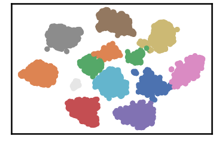

.. parsed-literal::

    k= 80 :Validity score is: 0.9368593577990602 but best score is 0.9388372333647652 at k= 60     
     ==================================================================================================== 
    
    using NGT, Proximity matrix has been calculated  in:  0.26604342460632324  seconds
    There are 0 outlier point(s) in black (noise of type-1) represent 0% of total points
    There are 56 weak point(s) in light grey (noise of type-2) represent 1% of total points
    DenMune detected 11 clusters 
    

.. parsed-literal::

    k= 85 :Validity score is: 0.9641899104918583 but best score is 0.9641899104918583 at k= 85     
     ==================================================================================================== 
    
    using NGT, Proximity matrix has been calculated  in:  0.28949952125549316  seconds
    There are 0 outlier point(s) in black (noise of type-1) represent 0% of total points
    There are 56 weak point(s) in light grey (noise of type-2) represent 1% of total points
    DenMune detected 12 clusters 
    

.. parsed-literal::

    k= 90 :Validity score is: 0.9375710234927745 but best score is 0.9641899104918583 at k= 85     
     ==================================================================================================== 
    
    using NGT, Proximity matrix has been calculated  in:  0.29271435737609863  seconds
    There are 0 outlier point(s) in black (noise of type-1) represent 0% of total points
    There are 56 weak point(s) in light grey (noise of type-2) represent 1% of total points
    DenMune detected 12 clusters 
    

.. parsed-literal::

    k= 95 :Validity score is: 0.9377270920319611 but best score is 0.9641899104918583 at k= 85     
     ==================================================================================================== 
    
    using NGT, Proximity matrix has been calculated  in:  0.30431056022644043  seconds
    There are 0 outlier point(s) in black (noise of type-1) represent 0% of total points
    There are 56 weak point(s) in light grey (noise of type-2) represent 1% of total points
    DenMune detected 12 clusters 
    

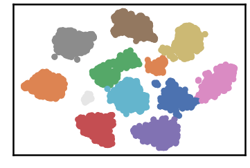

.. parsed-literal::

    k= 100 :Validity score is: 0.9383843670590842 but best score is 0.9641899104918583 at k= 85     
     ==================================================================================================== 
    

.. parsed-literal::

    <Figure size 432x288 with 0 Axes>

.. code:: ipython3

    # It is time to save the results
    results_path = 'results/'  # change it to whatever you output results to, set it to ''; so it will output to current folder
    para_file = 'denmune'+ '_para_'  + dataset + '.csv'
    df.sort_values(by=['F1', 'NMI', 'ARI'] , ascending=False, inplace=True)   
    df.to_csv(results_path + para_file, index=False, sep='\t', header=True)

.. code:: ipython3

    df # it is sorted now and saved

.. raw:: html

    

    
    <table border="1" class="dataframe">
      <thead>
        <tr style="text-align: right;">
          <th></th>
          <th>K</th>
          <th>ACC</th>
          <th>F1</th>
          <th>NMI</th>
          <th>AMI</th>
          <th>ARI</th>
          <th>Homogeneity</th>
          <th>Completeness</th>
          <th>Time</th>
        </tr>
      </thead>
      <tbody>
        <tr>
          <th>16</th>
          <td>85.0</td>
          <td>5328.0</td>
          <td>0.964190</td>
          <td>0.940669</td>
          <td>0.940444</td>
          <td>0.934356</td>
          <td>0.959596</td>
          <td>0.922473</td>
          <td>5.496037</td>
        </tr>
        <tr>
          <th>11</th>
          <td>60.0</td>
          <td>5104.0</td>
          <td>0.938837</td>
          <td>0.930174</td>
          <td>0.929889</td>
          <td>0.912853</td>
          <td>0.963318</td>
          <td>0.899235</td>
          <td>3.691297</td>
        </tr>
        <tr>
          <th>19</th>
          <td>100.0</td>
          <td>5116.0</td>
          <td>0.938384</td>
          <td>0.929006</td>
          <td>0.928715</td>
          <td>0.912300</td>
          <td>0.960439</td>
          <td>0.899564</td>
          <td>6.592730</td>
        </tr>
        <tr>
          <th>10</th>
          <td>55.0</td>
          <td>5101.0</td>
          <td>0.938015</td>
          <td>0.927379</td>
          <td>0.927056</td>
          <td>0.910497</td>
          <td>0.962563</td>
          <td>0.894678</td>
          <td>3.404933</td>
        </tr>
        <tr>
          <th>18</th>
          <td>95.0</td>
          <td>5112.0</td>
          <td>0.937727</td>
          <td>0.928486</td>
          <td>0.928193</td>
          <td>0.911544</td>
          <td>0.959939</td>
          <td>0.899028</td>
          <td>5.921057</td>
        </tr>
        <tr>
          <th>17</th>
          <td>90.0</td>
          <td>5111.0</td>
          <td>0.937571</td>
          <td>0.928476</td>
          <td>0.928184</td>
          <td>0.911517</td>
          <td>0.959940</td>
          <td>0.899009</td>
          <td>5.590351</td>
        </tr>
        <tr>
          <th>15</th>
          <td>80.0</td>
          <td>5105.0</td>
          <td>0.936859</td>
          <td>0.927989</td>
          <td>0.927695</td>
          <td>0.911212</td>
          <td>0.959644</td>
          <td>0.898355</td>
          <td>4.946638</td>
        </tr>
        <tr>
          <th>13</th>
          <td>70.0</td>
          <td>5100.0</td>
          <td>0.936796</td>
          <td>0.926665</td>
          <td>0.926366</td>
          <td>0.910052</td>
          <td>0.958664</td>
          <td>0.896733</td>
          <td>4.272645</td>
        </tr>
        <tr>
          <th>14</th>
          <td>75.0</td>
          <td>5099.0</td>
          <td>0.936644</td>
          <td>0.926919</td>
          <td>0.926621</td>
          <td>0.910084</td>
          <td>0.958978</td>
          <td>0.896935</td>
          <td>4.856277</td>
        </tr>
        <tr>
          <th>7</th>
          <td>40.0</td>
          <td>5091.0</td>
          <td>0.936541</td>
          <td>0.927265</td>
          <td>0.926942</td>
          <td>0.910358</td>
          <td>0.962716</td>
          <td>0.894331</td>
          <td>2.487215</td>
        </tr>
        <tr>
          <th>8</th>
          <td>45.0</td>
          <td>5091.0</td>
          <td>0.936541</td>
          <td>0.927265</td>
          <td>0.926942</td>
          <td>0.910358</td>
          <td>0.962716</td>
          <td>0.894331</td>
          <td>2.686197</td>
        </tr>
        <tr>
          <th>12</th>
          <td>65.0</td>
          <td>5092.0</td>
          <td>0.935408</td>
          <td>0.925570</td>
          <td>0.925267</td>
          <td>0.908749</td>
          <td>0.957585</td>
          <td>0.895628</td>
          <td>4.251009</td>
        </tr>
        <tr>
          <th>6</th>
          <td>35.0</td>
          <td>5001.0</td>
          <td>0.925982</td>
          <td>0.917426</td>
          <td>0.917008</td>
          <td>0.899268</td>
          <td>0.965869</td>
          <td>0.873611</td>
          <td>2.178432</td>
        </tr>
        <tr>
          <th>9</th>
          <td>50.0</td>
          <td>5096.0</td>
          <td>0.925536</td>
          <td>0.916445</td>
          <td>0.916098</td>
          <td>0.883275</td>
          <td>0.938134</td>
          <td>0.895737</td>
          <td>2.965045</td>
        </tr>
        <tr>
          <th>5</th>
          <td>30.0</td>
          <td>4985.0</td>
          <td>0.922606</td>
          <td>0.916090</td>
          <td>0.915636</td>
          <td>0.899461</td>
          <td>0.967141</td>
          <td>0.870159</td>
          <td>1.920695</td>
        </tr>
        <tr>
          <th>3</th>
          <td>20.0</td>
          <td>4917.0</td>
          <td>0.921461</td>
          <td>0.900240</td>
          <td>0.899584</td>
          <td>0.876373</td>
          <td>0.963750</td>
          <td>0.844584</td>
          <td>1.399321</td>
        </tr>
        <tr>
          <th>4</th>
          <td>25.0</td>
          <td>4624.0</td>
          <td>0.882280</td>
          <td>0.882169</td>
          <td>0.881314</td>
          <td>0.836542</td>
          <td>0.967020</td>
          <td>0.811007</td>
          <td>1.522315</td>
        </tr>
        <tr>
          <th>2</th>
          <td>15.0</td>
          <td>4115.0</td>
          <td>0.831053</td>
          <td>0.833837</td>
          <td>0.832103</td>
          <td>0.730556</td>
          <td>0.961098</td>
          <td>0.736337</td>
          <td>1.077629</td>
        </tr>
        <tr>
          <th>1</th>
          <td>10.0</td>
          <td>3101.0</td>
          <td>0.688744</td>
          <td>0.747703</td>
          <td>0.742425</td>
          <td>0.532752</td>
          <td>0.959603</td>
          <td>0.612460</td>
          <td>0.957537</td>
        </tr>
        <tr>
          <th>0</th>
          <td>5.0</td>
          <td>815.0</td>
          <td>0.250590</td>
          <td>0.563705</td>
          <td>0.531376</td>
          <td>0.098324</td>
          <td>0.918702</td>
          <td>0.406593</td>
          <td>34.074774</td>
        </tr>
      </tbody>
    </table>
    

