Clusterable Dataset
====================

.. code:: ipython3

    import time
    import os.path
    import requests

.. code:: ipython3

    # install DenMune clustering algorithm using pip command from the offecial Python repository, PyPi
    # from https://pypi.org/project/denmune/
    !pip install denmune
    
    # now import it
    from denmune import DenMune

.. parsed-literal::

    Defaulting to user installation because normal site-packages is not writeable
    Requirement already satisfied: denmune in /home/jupyter-admin/.local/lib/python3.7/site-packages (0.0.3.8)
    Requirement already satisfied: pandas>=1.0.3 in /opt/tljh/user/lib/python3.7/site-packages (from denmune) (1.0.3)
    Requirement already satisfied: anytree>=2.8.0 in /home/jupyter-admin/.local/lib/python3.7/site-packages (from denmune) (2.8.0)
    Requirement already satisfied: seaborn>=0.10.1 in /opt/tljh/user/lib/python3.7/site-packages (from denmune) (0.10.1)
    Requirement already satisfied: scikit-learn>=0.22.1 in /opt/tljh/user/lib/python3.7/site-packages (from denmune) (0.22.1)
    Requirement already satisfied: matplotlib>=3.2.1 in /opt/tljh/user/lib/python3.7/site-packages (from denmune) (3.2.1)
    Requirement already satisfied: numpy>=1.18.5 in /opt/tljh/user/lib/python3.7/site-packages (from denmune) (1.18.5)
    Requirement already satisfied: ngt>=1.11.6 in /opt/tljh/user/lib/python3.7/site-packages (from denmune) (1.11.6)
    Requirement already satisfied: six>=1.9.0 in /opt/tljh/user/lib/python3.7/site-packages (from anytree>=2.8.0->denmune) (1.12.0)
    Requirement already satisfied: cycler>=0.10 in /opt/tljh/user/lib/python3.7/site-packages (from matplotlib>=3.2.1->denmune) (0.10.0)
    Requirement already satisfied: pyparsing!=2.0.4,!=2.1.2,!=2.1.6,>=2.0.1 in /opt/tljh/user/lib/python3.7/site-packages (from matplotlib>=3.2.1->denmune) (2.4.7)
    Requirement already satisfied: kiwisolver>=1.0.1 in /opt/tljh/user/lib/python3.7/site-packages (from matplotlib>=3.2.1->denmune) (1.2.0)
    Requirement already satisfied: python-dateutil>=2.1 in /opt/tljh/user/lib/python3.7/site-packages (from matplotlib>=3.2.1->denmune) (2.8.1)
    Requirement already satisfied: pybind11 in /opt/tljh/user/lib/python3.7/site-packages (from ngt>=1.11.6->denmune) (2.5.0)
    Requirement already satisfied: pytz>=2017.2 in /opt/tljh/user/lib/python3.7/site-packages (from pandas>=1.0.3->denmune) (2020.1)
    Requirement already satisfied: joblib>=0.11 in /opt/tljh/user/lib/python3.7/site-packages (from scikit-learn>=0.22.1->denmune) (0.15.1)
    Requirement already satisfied: scipy>=0.17.0 in /opt/tljh/user/lib/python3.7/site-packages (from scikit-learn>=0.22.1->denmune) (1.4.1)

.. code:: ipython3

    dataset = 'clusterable' # let us take Chameleon DS1 dataset as an example
    
    url = "https://zerobytes.one/denmune_data/"
    file_ext = ".txt"
    # ground_ext = "-gt" # no groundtruth for this dataset
    
    dataset_url = url + dataset + file_ext
    # groundtruth_url = url + dataset + ground_ext  + file_ext # no groundtruth for this dataset
    
    data_path = 'data/' # change it to whatever you put your data, set it to ''; so it will retrive from current folder
    if  not os.path.isfile(data_path + dataset + file_ext):
        req = requests.get(dataset_url)
        with open(data_path + dataset + file_ext, 'wb') as f:
            f.write(req.content)

.. code:: ipython3

    # Denmune's Paramaters
    # DenMune(dataset=dataset, k_nearest=n, data_path=data_path, verpose=verpose_mode, show_plot=show_plot, show_noise=show_noise)
    verpose_mode = True # view in-depth analysis of time complexity and outlier detection, num of clusters
    show_plot = True  # show plots on/off
    show_noise = True # show noise and outlier on/off
    
    # loop's parameters
    start = 3
    step = 1
    end=33
    
    for n in range(start, end+1, step):
        start_time = time.time()
        dm = DenMune(dataset=dataset, k_nearest=n, data_path=data_path, verpose=verpose_mode, show_noise=show_noise)
        labels_true, labels_pred = dm.output_Clusters()
        end_time = time.time()
        
       
        if show_plot:
            dm.plot_clusters(labels_pred, show_noise=show_noise)
        print ('k=' , n , end='     ')
                
        if not verpose_mode:
            print('\r', end='')
        else:
            print('\n', "=====" * 20 , '\n')

.. parsed-literal::

    using NGT, Proximity matrix has been calculated  in:  0.1537036895751953  seconds
    There are 111 outlier point(s) in black (noise of type-1) represent 5% of total points
    There are 190 weak point(s) in light grey (noise of type-2) represent 8% of total points
    DenMune detected 292 clusters 
    

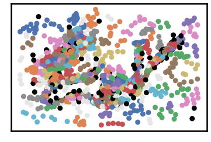

.. parsed-literal::

    k= 3     
     ==================================================================================================== 
    
    using NGT, Proximity matrix has been calculated  in:  0.03124237060546875  seconds
    There are 45 outlier point(s) in black (noise of type-1) represent 2% of total points
    There are 170 weak point(s) in light grey (noise of type-2) represent 7% of total points
    DenMune detected 184 clusters 
    

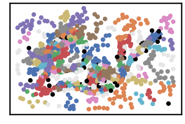

.. parsed-literal::

    k= 4     
     ==================================================================================================== 
    
    using NGT, Proximity matrix has been calculated  in:  0.03799271583557129  seconds
    There are 27 outlier point(s) in black (noise of type-1) represent 1% of total points
    There are 155 weak point(s) in light grey (noise of type-2) represent 7% of total points
    DenMune detected 113 clusters 
    

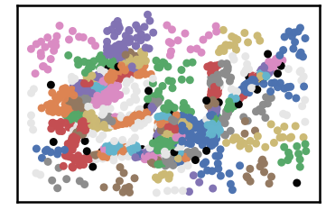

.. parsed-literal::

    k= 5     
     ==================================================================================================== 
    
    using NGT, Proximity matrix has been calculated  in:  0.0279848575592041  seconds
    There are 14 outlier point(s) in black (noise of type-1) represent 1% of total points
    There are 128 weak point(s) in light grey (noise of type-2) represent 6% of total points
    DenMune detected 80 clusters 
    

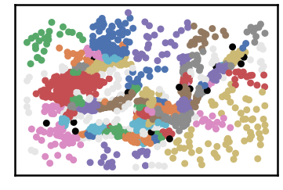

.. parsed-literal::

    k= 6     
     ==================================================================================================== 
    
    using NGT, Proximity matrix has been calculated  in:  0.030848979949951172  seconds
    There are 10 outlier point(s) in black (noise of type-1) represent 0% of total points
    There are 117 weak point(s) in light grey (noise of type-2) represent 5% of total points
    DenMune detected 50 clusters 
    

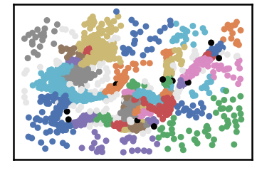

.. parsed-literal::

    k= 7     
     ==================================================================================================== 
    
    using NGT, Proximity matrix has been calculated  in:  0.03854632377624512  seconds
    There are 7 outlier point(s) in black (noise of type-1) represent 0% of total points
    There are 105 weak point(s) in light grey (noise of type-2) represent 5% of total points
    DenMune detected 42 clusters 
    

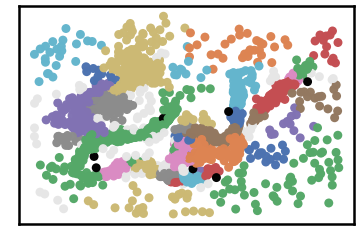

.. parsed-literal::

    k= 8     
     ==================================================================================================== 
    
    using NGT, Proximity matrix has been calculated  in:  0.03774738311767578  seconds
    There are 7 outlier point(s) in black (noise of type-1) represent 0% of total points
    There are 91 weak point(s) in light grey (noise of type-2) represent 4% of total points
    DenMune detected 28 clusters 
    

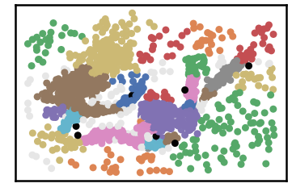

.. parsed-literal::

    k= 9     
     ==================================================================================================== 
    
    using NGT, Proximity matrix has been calculated  in:  0.03853130340576172  seconds
    There are 6 outlier point(s) in black (noise of type-1) represent 0% of total points
    There are 100 weak point(s) in light grey (noise of type-2) represent 4% of total points
    DenMune detected 19 clusters 
    

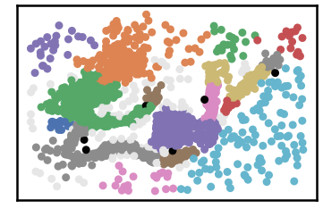

.. parsed-literal::

    k= 10     
     ==================================================================================================== 
    
    using NGT, Proximity matrix has been calculated  in:  0.13722777366638184  seconds
    There are 5 outlier point(s) in black (noise of type-1) represent 0% of total points
    There are 99 weak point(s) in light grey (noise of type-2) represent 4% of total points
    DenMune detected 18 clusters 
    

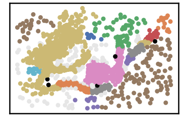

.. parsed-literal::

    k= 11     
     ==================================================================================================== 
    
    using NGT, Proximity matrix has been calculated  in:  0.05143141746520996  seconds
    There are 4 outlier point(s) in black (noise of type-1) represent 0% of total points
    There are 102 weak point(s) in light grey (noise of type-2) represent 4% of total points
    DenMune detected 22 clusters 
    

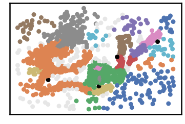

.. parsed-literal::

    k= 12     
     ==================================================================================================== 
    
    using NGT, Proximity matrix has been calculated  in:  0.0381925106048584  seconds
    There are 4 outlier point(s) in black (noise of type-1) represent 0% of total points
    There are 103 weak point(s) in light grey (noise of type-2) represent 4% of total points
    DenMune detected 17 clusters 
    

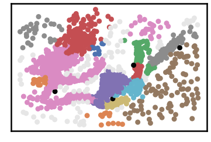

.. parsed-literal::

    k= 13     
     ==================================================================================================== 
    
    using NGT, Proximity matrix has been calculated  in:  0.04571080207824707  seconds
    There are 4 outlier point(s) in black (noise of type-1) represent 0% of total points
    There are 83 weak point(s) in light grey (noise of type-2) represent 4% of total points
    DenMune detected 12 clusters 
    

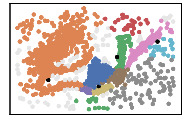

.. parsed-literal::

    k= 14     
     ==================================================================================================== 
    
    using NGT, Proximity matrix has been calculated  in:  0.06883382797241211  seconds
    There are 3 outlier point(s) in black (noise of type-1) represent 0% of total points
    There are 97 weak point(s) in light grey (noise of type-2) represent 4% of total points
    DenMune detected 13 clusters 
    

.. image:: datasets/clusterable/output_3_25.png

.. parsed-literal::

    k= 15     
     ==================================================================================================== 
    
    using NGT, Proximity matrix has been calculated  in:  0.05165553092956543  seconds
    There are 2 outlier point(s) in black (noise of type-1) represent 0% of total points
    There are 113 weak point(s) in light grey (noise of type-2) represent 5% of total points
    DenMune detected 11 clusters 
    

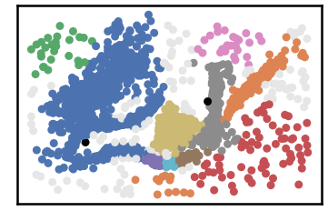

.. parsed-literal::

    k= 16     
     ==================================================================================================== 
    
    using NGT, Proximity matrix has been calculated  in:  0.15245723724365234  seconds
    There are 2 outlier point(s) in black (noise of type-1) represent 0% of total points
    There are 96 weak point(s) in light grey (noise of type-2) represent 4% of total points
    DenMune detected 15 clusters 
    

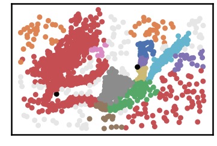

.. parsed-literal::

    k= 17     
     ==================================================================================================== 
    
    using NGT, Proximity matrix has been calculated  in:  0.058860063552856445  seconds
    There are 1 outlier point(s) in black (noise of type-1) represent 0% of total points
    There are 135 weak point(s) in light grey (noise of type-2) represent 6% of total points
    DenMune detected 11 clusters 
    

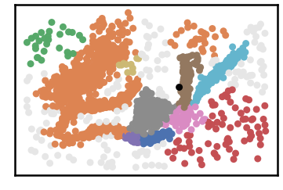

.. parsed-literal::

    k= 18     
     ==================================================================================================== 
    
    using NGT, Proximity matrix has been calculated  in:  0.1631636619567871  seconds
    There are 0 outlier point(s) in black (noise of type-1) represent 0% of total points
    There are 103 weak point(s) in light grey (noise of type-2) represent 4% of total points
    DenMune detected 11 clusters 
    

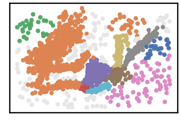

.. parsed-literal::

    k= 19     
     ==================================================================================================== 
    
    using NGT, Proximity matrix has been calculated  in:  0.06411504745483398  seconds
    There are 0 outlier point(s) in black (noise of type-1) represent 0% of total points
    There are 127 weak point(s) in light grey (noise of type-2) represent 6% of total points
    DenMune detected 10 clusters 
    

.. image:: datasets/clusterable/output_3_35.png

.. parsed-literal::

    k= 20     
     ==================================================================================================== 
    
    using NGT, Proximity matrix has been calculated  in:  0.06842851638793945  seconds
    There are 0 outlier point(s) in black (noise of type-1) represent 0% of total points
    There are 135 weak point(s) in light grey (noise of type-2) represent 6% of total points
    DenMune detected 10 clusters 
    

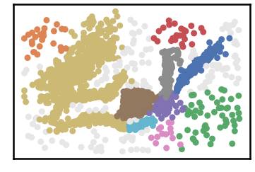

.. parsed-literal::

    k= 21     
     ==================================================================================================== 
    
    using NGT, Proximity matrix has been calculated  in:  0.0567624568939209  seconds
    There are 0 outlier point(s) in black (noise of type-1) represent 0% of total points
    There are 132 weak point(s) in light grey (noise of type-2) represent 6% of total points
    DenMune detected 8 clusters 
    

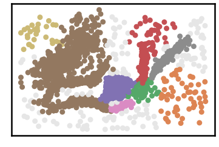

.. parsed-literal::

    k= 22     
     ==================================================================================================== 
    
    using NGT, Proximity matrix has been calculated  in:  0.06996417045593262  seconds
    There are 0 outlier point(s) in black (noise of type-1) represent 0% of total points
    There are 122 weak point(s) in light grey (noise of type-2) represent 5% of total points
    DenMune detected 7 clusters 
    

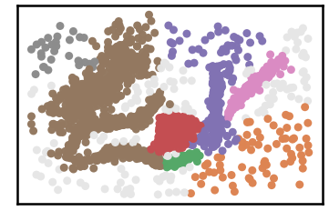

.. parsed-literal::

    k= 23     
     ==================================================================================================== 
    
    using NGT, Proximity matrix has been calculated  in:  0.08150386810302734  seconds
    There are 0 outlier point(s) in black (noise of type-1) represent 0% of total points
    There are 141 weak point(s) in light grey (noise of type-2) represent 6% of total points
    DenMune detected 8 clusters 
    

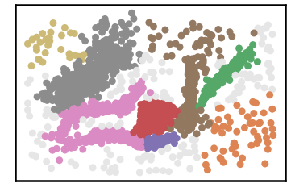

.. parsed-literal::

    k= 24     
     ==================================================================================================== 
    
    using NGT, Proximity matrix has been calculated  in:  0.07366752624511719  seconds
    There are 0 outlier point(s) in black (noise of type-1) represent 0% of total points
    There are 169 weak point(s) in light grey (noise of type-2) represent 7% of total points
    DenMune detected 8 clusters 
    

.. image:: datasets/clusterable/output_3_45.png

.. parsed-literal::

    k= 25     
     ==================================================================================================== 
    
    using NGT, Proximity matrix has been calculated  in:  0.07683539390563965  seconds
    There are 0 outlier point(s) in black (noise of type-1) represent 0% of total points
    There are 157 weak point(s) in light grey (noise of type-2) represent 7% of total points
    DenMune detected 7 clusters 
    

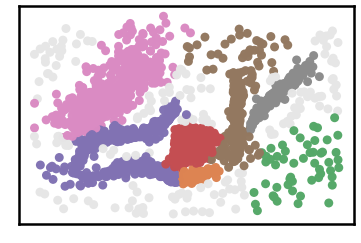

.. parsed-literal::

    k= 26     
     ==================================================================================================== 
    
    using NGT, Proximity matrix has been calculated  in:  0.1158287525177002  seconds
    There are 0 outlier point(s) in black (noise of type-1) represent 0% of total points
    There are 157 weak point(s) in light grey (noise of type-2) represent 7% of total points
    DenMune detected 7 clusters 
    

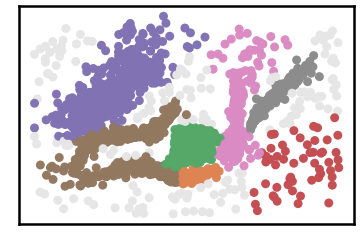

.. parsed-literal::

    k= 27     
     ==================================================================================================== 
    
    using NGT, Proximity matrix has been calculated  in:  0.09561038017272949  seconds
    There are 0 outlier point(s) in black (noise of type-1) represent 0% of total points
    There are 131 weak point(s) in light grey (noise of type-2) represent 6% of total points
    DenMune detected 8 clusters 
    

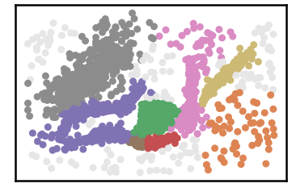

.. parsed-literal::

    k= 28     
     ==================================================================================================== 
    
    using NGT, Proximity matrix has been calculated  in:  0.10312819480895996  seconds
    There are 0 outlier point(s) in black (noise of type-1) represent 0% of total points
    There are 126 weak point(s) in light grey (noise of type-2) represent 5% of total points
    DenMune detected 7 clusters 
    

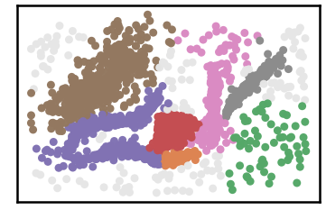

.. parsed-literal::

    k= 29     
     ==================================================================================================== 
    
    using NGT, Proximity matrix has been calculated  in:  0.18813276290893555  seconds
    There are 0 outlier point(s) in black (noise of type-1) represent 0% of total points
    There are 111 weak point(s) in light grey (noise of type-2) represent 5% of total points
    DenMune detected 7 clusters 
    

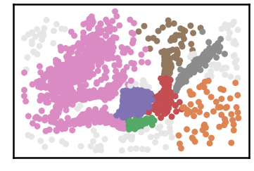

.. parsed-literal::

    k= 30     
     ==================================================================================================== 
    
    using NGT, Proximity matrix has been calculated  in:  0.18568849563598633  seconds
    There are 0 outlier point(s) in black (noise of type-1) represent 0% of total points
    There are 126 weak point(s) in light grey (noise of type-2) represent 5% of total points
    DenMune detected 8 clusters 
    

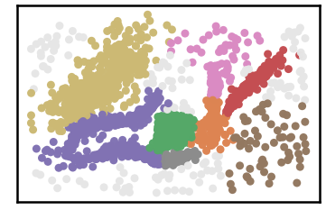

.. parsed-literal::

    k= 31     
     ==================================================================================================== 
    
    using NGT, Proximity matrix has been calculated  in:  0.0754401683807373  seconds
    There are 0 outlier point(s) in black (noise of type-1) represent 0% of total points
    There are 123 weak point(s) in light grey (noise of type-2) represent 5% of total points
    DenMune detected 7 clusters 
    

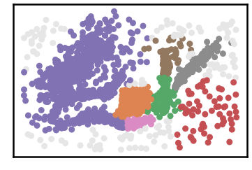

.. parsed-literal::

    k= 32     
     ==================================================================================================== 
    
    using NGT, Proximity matrix has been calculated  in:  0.07304644584655762  seconds
    There are 0 outlier point(s) in black (noise of type-1) represent 0% of total points
    There are 112 weak point(s) in light grey (noise of type-2) represent 5% of total points
    DenMune detected 6 clusters 
    

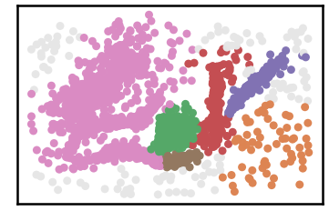

.. parsed-literal::

    k= 33     
     ==================================================================================================== 
    

.. parsed-literal::

    <Figure size 432x288 with 0 Axes>

