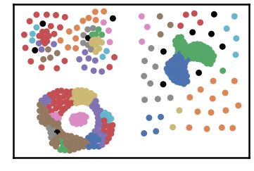
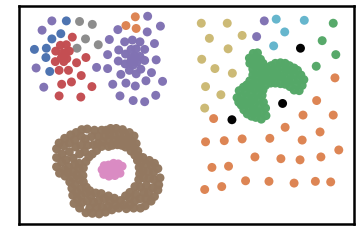
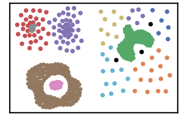
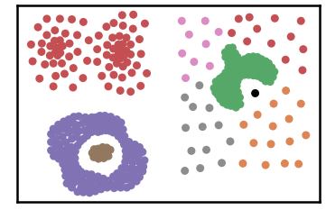
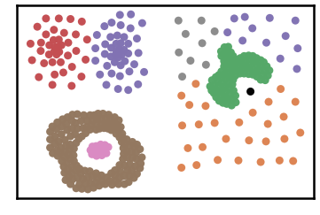
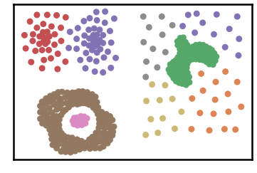
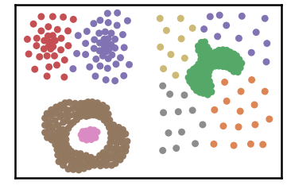
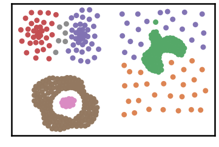
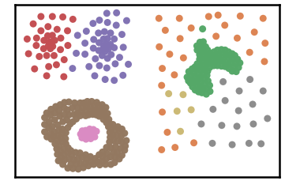
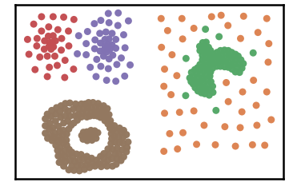

Compound Dataset
================

.. code:: ipython3

    import time
    import os.path
    import requests
    import pandas as pd

.. code:: ipython3

    # install DenMune clustering algorithm using pip command from the offecial Python repository, PyPi
    # from https://pypi.org/project/denmune/
    !pip install denmune
    
    # now import it
    from denmune import DenMune

.. code:: ipython3

    dataset = 'compound' # let us take Compound dataset as an example
    
    url = "https://zerobytes.one/denmune_data/"
    file_ext = ".txt"
    ground_ext = "-gt"
    
    dataset_url = url + dataset + file_ext
    groundtruth_url = url + dataset + ground_ext  + file_ext
    
    data_path = 'data/' # change it to whatever you put your data, set it to ''; so it will retrive from current folder
    if  not os.path.isfile(data_path + dataset + file_ext):
        req = requests.get(dataset_url)
        with open(data_path + dataset + file_ext, 'wb') as f:
            f.write(req.content)
            
    if  not os.path.isfile(data_path + dataset + ground_ext + file_ext):
        req = requests.get(groundtruth_url)
        with open(data_path + dataset +  ground_ext + file_ext, 'wb') as f:
            f.write(req.content)       

.. code:: ipython3

    # Denmune's Paramaters
    # DenMune(dataset=dataset, k_nearest=n, data_path=data_path, verpose=verpose_mode, show_plot=show_plot, show_noise=show_noise)
    verpose_mode = True # view in-depth analysis of time complexity and outlier detection, num of clusters
    show_plot = True  # show plots on/off
    show_noise = True # show noise and outlier on/off
    
    # loop's parameters
    start = 3
    step = 1
    end=15
    
    # Validity indexes' parameters
    validity_val = -1
    best_k = 0
    best_val = -1
    
    validity_idx = 2 # Acc=1, F1-score=2,  NMI=3, AMI=4, ARI=5,  Homogeneity=6, and Completeness=7
    df = pd.DataFrame(columns =['K', 'ACC', 'F1', 'NMI', 'AMI', 'ARI','Homogeneity', 'Completeness', 'Time' ])
    
    
    for n in range(start, end+1, step):
        start_time = time.time()
        dm = DenMune(dataset=dataset, k_nearest=n, data_path=data_path, verpose=verpose_mode, show_noise=show_noise)
        labels_true, labels_pred = dm.output_Clusters()
        if show_plot == True and n==start:
            # Let us plot the groundtruth of this dataset which is reduced to 2-d using t-SNE
            print ("Dataset\'s Groundtruht")
            dm.plot_clusters(labels_true, ground=True)
            print('\n', "=====" * 20 , '\n')       
                   
        end_time = time.time()
        
        validity_indexes = dm.validate_Clusters(labels_true, labels_pred)
        validity_val = validity_indexes[validity_idx]
        validity_indexes[0] = n
        validity_indexes[8] = end_time - start_time
        
        df = df.append(pd.Series(validity_indexes, index=df.columns ), ignore_index=True)
        
        if (best_val < validity_val):
            best_val = validity_val
            best_k = n
            # Let us show results where only an improve in accuracy is detected
        if show_plot:
                dm.plot_clusters(labels_pred, show_noise=show_noise)
        print ('k=' , n, ':Validity score is:', validity_val , 'but best score is', best_val, 'at k=', best_k , end='     ')
                
        if not verpose_mode:
            print('\r', end='')
        else:
            print('\n', "=====" * 20 , '\n')

.. parsed-literal::

    using NGT, Proximity matrix has been calculated  in:  0.0037763118743896484  seconds
    Dataset's Groundtruht

.. parsed-literal::

    
     ==================================================================================================== 
    
    There are 12 outlier point(s) in black (noise of type-1) represent 3% of total points
    There are 0 weak point(s) in light grey (noise of type-2) represent 0% of total points
    DenMune detected 39 clusters 
    

.. parsed-literal::

    k= 3 :Validity score is: 0.4833863898240931 but best score is 0.4833863898240931 at k= 3     
     ==================================================================================================== 
    
    using NGT, Proximity matrix has been calculated  in:  0.003530263900756836  seconds
    There are 3 outlier point(s) in black (noise of type-1) represent 1% of total points
    There are 0 weak point(s) in light grey (noise of type-2) represent 0% of total points
    DenMune detected 13 clusters 
    

.. parsed-literal::

    k= 4 :Validity score is: 0.9220715164504741 but best score is 0.9220715164504741 at k= 4     
     ==================================================================================================== 
    
    using NGT, Proximity matrix has been calculated  in:  0.004339694976806641  seconds
    There are 3 outlier point(s) in black (noise of type-1) represent 1% of total points
    There are 0 weak point(s) in light grey (noise of type-2) represent 0% of total points
    DenMune detected 10 clusters 
    

.. parsed-literal::

    k= 5 :Validity score is: 0.9117910071782166 but best score is 0.9220715164504741 at k= 4     
     ==================================================================================================== 
    
    using NGT, Proximity matrix has been calculated  in:  0.007215023040771484  seconds
    There are 1 outlier point(s) in black (noise of type-1) represent 0% of total points
    There are 0 weak point(s) in light grey (noise of type-2) represent 0% of total points
    DenMune detected 7 clusters 
    

.. parsed-literal::

    k= 6 :Validity score is: 0.7970062518934701 but best score is 0.9220715164504741 at k= 4     
     ==================================================================================================== 
    
    using NGT, Proximity matrix has been calculated  in:  0.004312276840209961  seconds
    There are 1 outlier point(s) in black (noise of type-1) represent 0% of total points
    There are 0 weak point(s) in light grey (noise of type-2) represent 0% of total points
    DenMune detected 7 clusters 
    

.. parsed-literal::

    k= 7 :Validity score is: 0.9489018801904978 but best score is 0.9489018801904978 at k= 7     
     ==================================================================================================== 
    
    using NGT, Proximity matrix has been calculated  in:  0.0045642852783203125  seconds
    There are 0 outlier point(s) in black (noise of type-1) represent 0% of total points
    There are 0 weak point(s) in light grey (noise of type-2) represent 0% of total points
    DenMune detected 8 clusters 
    

.. parsed-literal::

    k= 8 :Validity score is: 0.9199402153515593 but best score is 0.9489018801904978 at k= 7     
     ==================================================================================================== 
    
    using NGT, Proximity matrix has been calculated  in:  0.004555463790893555  seconds
    There are 0 outlier point(s) in black (noise of type-1) represent 0% of total points
    There are 0 weak point(s) in light grey (noise of type-2) represent 0% of total points
    DenMune detected 8 clusters 
    

.. parsed-literal::

    k= 9 :Validity score is: 0.9176884834779572 but best score is 0.9489018801904978 at k= 7     
     ==================================================================================================== 
    
    using NGT, Proximity matrix has been calculated  in:  0.005226612091064453  seconds
    There are 0 outlier point(s) in black (noise of type-1) represent 0% of total points
    There are 0 weak point(s) in light grey (noise of type-2) represent 0% of total points
    DenMune detected 7 clusters 
    

.. parsed-literal::

    k= 10 :Validity score is: 0.9344839420589544 but best score is 0.9489018801904978 at k= 7     
     ==================================================================================================== 
    
    using NGT, Proximity matrix has been calculated  in:  0.005286455154418945  seconds
    There are 0 outlier point(s) in black (noise of type-1) represent 0% of total points
    There are 0 weak point(s) in light grey (noise of type-2) represent 0% of total points
    DenMune detected 8 clusters 
    

.. parsed-literal::

    k= 11 :Validity score is: 0.9562966162181592 but best score is 0.9562966162181592 at k= 11     
     ==================================================================================================== 
    
    using NGT, Proximity matrix has been calculated  in:  0.005023956298828125  seconds
    There are 0 outlier point(s) in black (noise of type-1) represent 0% of total points
    There are 0 weak point(s) in light grey (noise of type-2) represent 0% of total points
    DenMune detected 8 clusters 
    

.. parsed-literal::

    k= 12 :Validity score is: 0.9583963373437057 but best score is 0.9583963373437057 at k= 12     
     ==================================================================================================== 
    
    using NGT, Proximity matrix has been calculated  in:  0.008102178573608398  seconds
    There are 0 outlier point(s) in black (noise of type-1) represent 0% of total points
    There are 0 weak point(s) in light grey (noise of type-2) represent 0% of total points
    DenMune detected 7 clusters 
    

.. parsed-literal::

    k= 13 :Validity score is: 0.9828443022951031 but best score is 0.9828443022951031 at k= 13     
     ==================================================================================================== 
    
    using NGT, Proximity matrix has been calculated  in:  0.007895469665527344  seconds
    There are 0 outlier point(s) in black (noise of type-1) represent 0% of total points
    There are 0 weak point(s) in light grey (noise of type-2) represent 0% of total points
    DenMune detected 5 clusters 
    

.. parsed-literal::

    k= 14 :Validity score is: 0.9154056568327119 but best score is 0.9828443022951031 at k= 13     
     ==================================================================================================== 
    
    using NGT, Proximity matrix has been calculated  in:  0.005811929702758789  seconds
    There are 0 outlier point(s) in black (noise of type-1) represent 0% of total points
    There are 0 weak point(s) in light grey (noise of type-2) represent 0% of total points
    DenMune detected 5 clusters 
    

.. parsed-literal::

    k= 15 :Validity score is: 0.9230266102453776 but best score is 0.9828443022951031 at k= 13     
     ==================================================================================================== 
    

.. parsed-literal::

    <Figure size 432x288 with 0 Axes>

.. code:: ipython3

    # It is time to save the results
    results_path = 'results/'  # change it to whatever you output results to, set it to ''; so it will output to current folder
    para_file = 'denmune'+ '_para_'  + dataset + '.csv'
    df.sort_values(by=['F1', 'NMI', 'ARI'] , ascending=False, inplace=True)   
    df.to_csv(results_path + para_file, index=False, sep='\t', header=True)

.. code:: ipython3

    df # it is sorted now and saved

.. raw:: html

    

    
    <table border="1" class="dataframe">
      <thead>
        <tr style="text-align: right;">
          <th></th>
          <th>K</th>
          <th>ACC</th>
          <th>F1</th>
          <th>NMI</th>
          <th>AMI</th>
          <th>ARI</th>
          <th>Homogeneity</th>
          <th>Completeness</th>
          <th>Time</th>
        </tr>
      </thead>
      <tbody>
        <tr>
          <th>10</th>
          <td>13.0</td>
          <td>389.0</td>
          <td>0.982844</td>
          <td>0.961066</td>
          <td>0.960046</td>
          <td>0.979710</td>
          <td>0.976055</td>
          <td>0.946530</td>
          <td>0.052626</td>
        </tr>
        <tr>
          <th>9</th>
          <td>12.0</td>
          <td>375.0</td>
          <td>0.958396</td>
          <td>0.943510</td>
          <td>0.941812</td>
          <td>0.967203</td>
          <td>0.976055</td>
          <td>0.913065</td>
          <td>0.116367</td>
        </tr>
        <tr>
          <th>8</th>
          <td>11.0</td>
          <td>374.0</td>
          <td>0.956297</td>
          <td>0.944282</td>
          <td>0.942599</td>
          <td>0.966414</td>
          <td>0.977895</td>
          <td>0.912903</td>
          <td>0.047203</td>
        </tr>
        <tr>
          <th>4</th>
          <td>7.0</td>
          <td>376.0</td>
          <td>0.948902</td>
          <td>0.928274</td>
          <td>0.926205</td>
          <td>0.953971</td>
          <td>0.945936</td>
          <td>0.911259</td>
          <td>0.036252</td>
        </tr>
        <tr>
          <th>7</th>
          <td>10.0</td>
          <td>371.0</td>
          <td>0.934484</td>
          <td>0.913639</td>
          <td>0.911363</td>
          <td>0.938031</td>
          <td>0.921441</td>
          <td>0.905968</td>
          <td>0.043330</td>
        </tr>
        <tr>
          <th>12</th>
          <td>15.0</td>
          <td>376.0</td>
          <td>0.923027</td>
          <td>0.912829</td>
          <td>0.911253</td>
          <td>0.889408</td>
          <td>0.870535</td>
          <td>0.959442</td>
          <td>0.053442</td>
        </tr>
        <tr>
          <th>1</th>
          <td>4.0</td>
          <td>355.0</td>
          <td>0.922072</td>
          <td>0.890091</td>
          <td>0.884409</td>
          <td>0.942317</td>
          <td>0.964909</td>
          <td>0.826040</td>
          <td>0.041947</td>
        </tr>
        <tr>
          <th>5</th>
          <td>8.0</td>
          <td>364.0</td>
          <td>0.919940</td>
          <td>0.916355</td>
          <td>0.913782</td>
          <td>0.946772</td>
          <td>0.944911</td>
          <td>0.889474</td>
          <td>0.114475</td>
        </tr>
        <tr>
          <th>6</th>
          <td>9.0</td>
          <td>363.0</td>
          <td>0.917688</td>
          <td>0.911032</td>
          <td>0.908294</td>
          <td>0.943695</td>
          <td>0.939011</td>
          <td>0.884671</td>
          <td>0.043827</td>
        </tr>
        <tr>
          <th>11</th>
          <td>14.0</td>
          <td>373.0</td>
          <td>0.915406</td>
          <td>0.895426</td>
          <td>0.893533</td>
          <td>0.880251</td>
          <td>0.853352</td>
          <td>0.941864</td>
          <td>0.065691</td>
        </tr>
        <tr>
          <th>2</th>
          <td>5.0</td>
          <td>355.0</td>
          <td>0.911791</td>
          <td>0.897926</td>
          <td>0.893599</td>
          <td>0.945619</td>
          <td>0.959201</td>
          <td>0.844010</td>
          <td>0.038338</td>
        </tr>
        <tr>
          <th>3</th>
          <td>6.0</td>
          <td>326.0</td>
          <td>0.797006</td>
          <td>0.865291</td>
          <td>0.861214</td>
          <td>0.880238</td>
          <td>0.850577</td>
          <td>0.880523</td>
          <td>0.053024</td>
        </tr>
        <tr>
          <th>0</th>
          <td>3.0</td>
          <td>142.0</td>
          <td>0.483386</td>
          <td>0.607748</td>
          <td>0.561940</td>
          <td>0.279608</td>
          <td>0.926350</td>
          <td>0.452216</td>
          <td>0.163321</td>
        </tr>
      </tbody>
    </table>
    

