D31 Dataset
============

.. code:: ipython3

    import time
    import os.path
    import requests
    import pandas as pd

.. code:: ipython3

    # install DenMune clustering algorithm using pip command from the offecial Python repository, PyPi
    # from https://pypi.org/project/denmune/
    !pip install denmune
    
    # now import it
    from denmune import DenMune

.. code:: ipython3

    dataset = 'd31' # let us take Spiral dataset as an example
    
    url = "https://zerobytes.one/denmune_data/"
    file_ext = ".txt"
    ground_ext = "-gt"
    
    dataset_url = url + dataset + file_ext
    groundtruth_url = url + dataset + ground_ext  + file_ext
    
    data_path = 'data/' # change it to whatever you put your data, set it to ''; so it will retrive from current folder
    if  not os.path.isfile(data_path + dataset + file_ext):
        req = requests.get(dataset_url)
        with open(data_path + dataset + file_ext, 'wb') as f:
            f.write(req.content)
            
    if  not os.path.isfile(data_path + dataset + ground_ext + file_ext):
        req = requests.get(groundtruth_url)
        with open(data_path + dataset +  ground_ext + file_ext, 'wb') as f:
            f.write(req.content)       

.. code:: ipython3

    # Denmune's Paramaters
    # DenMune(dataset=dataset, k_nearest=n, data_path=data_path, verpose=verpose_mode, show_plot=show_plot, show_noise=show_noise)
    verpose_mode = True # view in-depth analysis of time complexity and outlier detection, num of clusters
    show_plot = True  # show plots on/off
    show_noise = True # show noise and outlier on/off
    
    # loop's parameters
    start = 2
    step = 2
    end=40
    
    # Validity indexes' parameters
    validity_val = -1
    best_k = 0
    best_val = -1
    
    validity_idx = 2 # Acc=1, F1-score=2,  NMI=3, AMI=4, ARI=5,  Homogeneity=6, and Completeness=7
    df = pd.DataFrame(columns =['K', 'ACC', 'F1', 'NMI', 'AMI', 'ARI','Homogeneity', 'Completeness', 'Time' ])
    
    
    for n in range(start, end+1, step):
        start_time = time.time()
        dm = DenMune(dataset=dataset, k_nearest=n, data_path=data_path, verpose=verpose_mode, show_noise=show_noise)
        labels_true, labels_pred = dm.output_Clusters()
        if show_plot == True and n==start:
            # Let us plot the groundtruth of this dataset which is reduced to 2-d using t-SNE
            print ("Dataset\'s Groundtruht")
            dm.plot_clusters(labels_true, ground=True)
            print('\n', "=====" * 20 , '\n')       
                   
        end_time = time.time()
        
        validity_indexes = dm.validate_Clusters(labels_true, labels_pred)
        validity_val = validity_indexes[validity_idx]
        validity_indexes[0] = n
        validity_indexes[8] = end_time - start_time
        
        df = df.append(pd.Series(validity_indexes, index=df.columns ), ignore_index=True)
        
        if (best_val < validity_val):
            best_val = validity_val
            best_k = n
            # Let us show results where only an improve in accuracy is detected
        if show_plot:
                dm.plot_clusters(labels_pred, show_noise=show_noise)
        print ('k=' , n, ':Validity score is:', validity_val , 'but best score is', best_val, 'at k=', best_k , end='     ')
                
        if not verpose_mode:
            print('\r', end='')
        else:
            print('\n', "=====" * 20 , '\n')

.. parsed-literal::

    using NGT, Proximity matrix has been calculated  in:  0.05274677276611328  seconds
    Dataset's Groundtruht

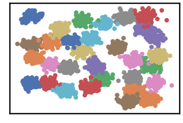

.. parsed-literal::

    
     ==================================================================================================== 
    
    There are 0 outlier point(s) in black (noise of type-1) represent 0% of total points
    There are 0 weak point(s) in light grey (noise of type-2) represent 0% of total points
    DenMune detected 686 clusters 
    

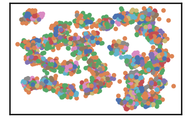

.. parsed-literal::

    k= 2 :Validity score is: 0.01627525634129165 but best score is 0.01627525634129165 at k= 2     
     ==================================================================================================== 
    
    using NGT, Proximity matrix has been calculated  in:  0.05670523643493652  seconds
    There are 66 outlier point(s) in black (noise of type-1) represent 2% of total points
    There are 0 weak point(s) in light grey (noise of type-2) represent 0% of total points
    DenMune detected 242 clusters 
    

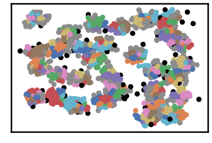

.. parsed-literal::

    k= 4 :Validity score is: 0.4444782195636548 but best score is 0.4444782195636548 at k= 4     
     ==================================================================================================== 
    
    using NGT, Proximity matrix has been calculated  in:  0.09154057502746582  seconds
    There are 29 outlier point(s) in black (noise of type-1) represent 1% of total points
    There are 226 weak point(s) in light grey (noise of type-2) represent 7% of total points
    DenMune detected 85 clusters 
    

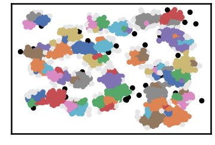

.. parsed-literal::

    k= 6 :Validity score is: 0.7592176195758852 but best score is 0.7592176195758852 at k= 6     
     ==================================================================================================== 
    
    using NGT, Proximity matrix has been calculated  in:  0.05003237724304199  seconds
    There are 16 outlier point(s) in black (noise of type-1) represent 1% of total points
    There are 191 weak point(s) in light grey (noise of type-2) represent 6% of total points
    DenMune detected 37 clusters 
    

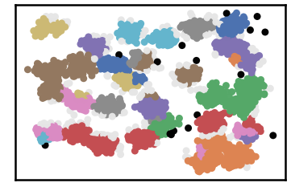

.. parsed-literal::

    k= 8 :Validity score is: 0.7084880820939885 but best score is 0.7592176195758852 at k= 6     
     ==================================================================================================== 
    
    using NGT, Proximity matrix has been calculated  in:  0.04780840873718262  seconds
    There are 15 outlier point(s) in black (noise of type-1) represent 0% of total points
    There are 188 weak point(s) in light grey (noise of type-2) represent 6% of total points
    DenMune detected 34 clusters 
    

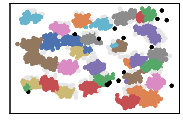

.. parsed-literal::

    k= 10 :Validity score is: 0.8047356969948538 but best score is 0.8047356969948538 at k= 10     
     ==================================================================================================== 
    
    using NGT, Proximity matrix has been calculated  in:  0.06363177299499512  seconds
    There are 11 outlier point(s) in black (noise of type-1) represent 0% of total points
    There are 135 weak point(s) in light grey (noise of type-2) represent 4% of total points
    DenMune detected 30 clusters 
    

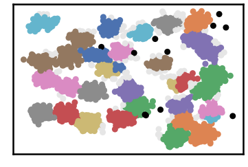

.. parsed-literal::

    k= 12 :Validity score is: 0.7769382173754561 but best score is 0.8047356969948538 at k= 10     
     ==================================================================================================== 
    
    using NGT, Proximity matrix has been calculated  in:  0.05327963829040527  seconds
    There are 11 outlier point(s) in black (noise of type-1) represent 0% of total points
    There are 104 weak point(s) in light grey (noise of type-2) represent 3% of total points
    DenMune detected 30 clusters 
    

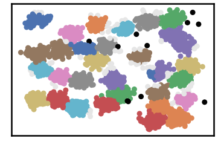

.. parsed-literal::

    k= 14 :Validity score is: 0.8702648917360151 but best score is 0.8702648917360151 at k= 14     
     ==================================================================================================== 
    
    using NGT, Proximity matrix has been calculated  in:  0.09774518013000488  seconds
    There are 9 outlier point(s) in black (noise of type-1) represent 0% of total points
    There are 72 weak point(s) in light grey (noise of type-2) represent 2% of total points
    DenMune detected 30 clusters 
    

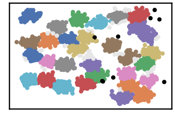

.. parsed-literal::

    k= 16 :Validity score is: 0.9206134078316673 but best score is 0.9206134078316673 at k= 16     
     ==================================================================================================== 
    
    using NGT, Proximity matrix has been calculated  in:  0.08378338813781738  seconds
    There are 8 outlier point(s) in black (noise of type-1) represent 0% of total points
    There are 50 weak point(s) in light grey (noise of type-2) represent 2% of total points
    DenMune detected 29 clusters 
    

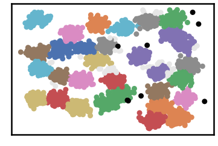

.. parsed-literal::

    k= 18 :Validity score is: 0.8809622175828665 but best score is 0.9206134078316673 at k= 16     
     ==================================================================================================== 
    
    using NGT, Proximity matrix has been calculated  in:  0.08395528793334961  seconds
    There are 7 outlier point(s) in black (noise of type-1) represent 0% of total points
    There are 18 weak point(s) in light grey (noise of type-2) represent 1% of total points
    DenMune detected 29 clusters 
    

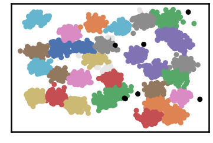

.. parsed-literal::

    k= 20 :Validity score is: 0.8833806453658043 but best score is 0.9206134078316673 at k= 16     
     ==================================================================================================== 
    
    using NGT, Proximity matrix has been calculated  in:  0.07099723815917969  seconds
    There are 6 outlier point(s) in black (noise of type-1) represent 0% of total points
    There are 13 weak point(s) in light grey (noise of type-2) represent 0% of total points
    DenMune detected 29 clusters 
    

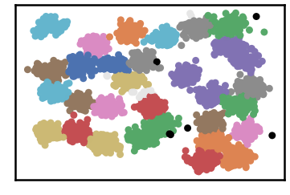

.. parsed-literal::

    k= 22 :Validity score is: 0.8854094401881663 but best score is 0.9206134078316673 at k= 16     
     ==================================================================================================== 
    
    using NGT, Proximity matrix has been calculated  in:  0.2132711410522461  seconds
    There are 6 outlier point(s) in black (noise of type-1) represent 0% of total points
    There are 7 weak point(s) in light grey (noise of type-2) represent 0% of total points
    DenMune detected 29 clusters 
    

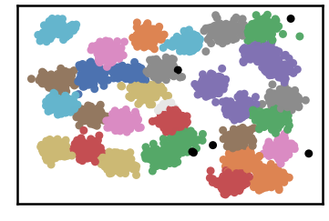

.. parsed-literal::

    k= 24 :Validity score is: 0.888661331453257 but best score is 0.9206134078316673 at k= 16     
     ==================================================================================================== 
    
    using NGT, Proximity matrix has been calculated  in:  0.09284424781799316  seconds
    There are 6 outlier point(s) in black (noise of type-1) represent 0% of total points
    There are 9 weak point(s) in light grey (noise of type-2) represent 0% of total points
    DenMune detected 29 clusters 
    

.. parsed-literal::

    k= 26 :Validity score is: 0.8847620667798934 but best score is 0.9206134078316673 at k= 16     
     ==================================================================================================== 
    
    using NGT, Proximity matrix has been calculated  in:  0.08334565162658691  seconds
    There are 5 outlier point(s) in black (noise of type-1) represent 0% of total points
    There are 9 weak point(s) in light grey (noise of type-2) represent 0% of total points
    DenMune detected 27 clusters 
    

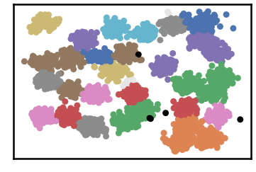

.. parsed-literal::

    k= 28 :Validity score is: 0.8049077917120888 but best score is 0.9206134078316673 at k= 16     
     ==================================================================================================== 
    
    using NGT, Proximity matrix has been calculated  in:  0.0969088077545166  seconds
    There are 5 outlier point(s) in black (noise of type-1) represent 0% of total points
    There are 0 weak point(s) in light grey (noise of type-2) represent 0% of total points
    DenMune detected 29 clusters 
    

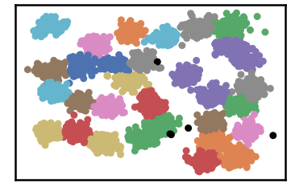

.. parsed-literal::

    k= 30 :Validity score is: 0.8892156292061791 but best score is 0.9206134078316673 at k= 16     
     ==================================================================================================== 
    
    using NGT, Proximity matrix has been calculated  in:  0.10151553153991699  seconds
    There are 5 outlier point(s) in black (noise of type-1) represent 0% of total points
    There are 0 weak point(s) in light grey (noise of type-2) represent 0% of total points
    DenMune detected 31 clusters 
    

.. image:: datasets/d31/output_3_33.png

.. parsed-literal::

    k= 32 :Validity score is: 0.9719964832855099 but best score is 0.9719964832855099 at k= 32     
     ==================================================================================================== 
    
    using NGT, Proximity matrix has been calculated  in:  0.09097790718078613  seconds
    There are 4 outlier point(s) in black (noise of type-1) represent 0% of total points
    There are 0 weak point(s) in light grey (noise of type-2) represent 0% of total points
    DenMune detected 31 clusters 
    

.. parsed-literal::

    k= 34 :Validity score is: 0.9708935955713698 but best score is 0.9719964832855099 at k= 32     
     ==================================================================================================== 
    
    using NGT, Proximity matrix has been calculated  in:  0.13016033172607422  seconds
    There are 4 outlier point(s) in black (noise of type-1) represent 0% of total points
    There are 0 weak point(s) in light grey (noise of type-2) represent 0% of total points
    DenMune detected 31 clusters 
    

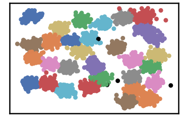

.. parsed-literal::

    k= 36 :Validity score is: 0.9686426907994277 but best score is 0.9719964832855099 at k= 32     
     ==================================================================================================== 
    
    using NGT, Proximity matrix has been calculated  in:  0.11252403259277344  seconds
    There are 4 outlier point(s) in black (noise of type-1) represent 0% of total points
    There are 0 weak point(s) in light grey (noise of type-2) represent 0% of total points
    DenMune detected 30 clusters 
    

.. parsed-literal::

    k= 38 :Validity score is: 0.9320399485980508 but best score is 0.9719964832855099 at k= 32     
     ==================================================================================================== 
    
    using NGT, Proximity matrix has been calculated  in:  0.13475465774536133  seconds
    There are 4 outlier point(s) in black (noise of type-1) represent 0% of total points
    There are 0 weak point(s) in light grey (noise of type-2) represent 0% of total points
    DenMune detected 30 clusters 
    

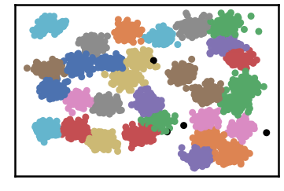

.. parsed-literal::

    k= 40 :Validity score is: 0.930508123225741 but best score is 0.9719964832855099 at k= 32     
     ==================================================================================================== 
    

.. parsed-literal::

    <Figure size 432x288 with 0 Axes>

.. code:: ipython3

    # It is time to save the results
    results_path = 'results/'  # change it to whatever you output results to, set it to ''; so it will output to current folder
    para_file = 'denmune'+ '_para_'  + dataset + '.csv'
    df.sort_values(by=['F1', 'NMI', 'ARI'] , ascending=False, inplace=True)   
    df.to_csv(results_path + para_file, index=False, sep='\t', header=True)

.. code:: ipython3

    df # it is sorted now and saved

.. raw:: html

    

    
    <table border="1" class="dataframe">
      <thead>
        <tr style="text-align: right;">
          <th></th>
          <th>K</th>
          <th>ACC</th>
          <th>F1</th>
          <th>NMI</th>
          <th>AMI</th>
          <th>ARI</th>
          <th>Homogeneity</th>
          <th>Completeness</th>
          <th>Time</th>
        </tr>
      </thead>
      <tbody>
        <tr>
          <th>15</th>
          <td>32.0</td>
          <td>3011.0</td>
          <td>0.971996</td>
          <td>0.960745</td>
          <td>0.958811</td>
          <td>0.943555</td>
          <td>0.961601</td>
          <td>0.959891</td>
          <td>1.240729</td>
        </tr>
        <tr>
          <th>16</th>
          <td>34.0</td>
          <td>3008.0</td>
          <td>0.970894</td>
          <td>0.959164</td>
          <td>0.957157</td>
          <td>0.941281</td>
          <td>0.959880</td>
          <td>0.958450</td>
          <td>1.464479</td>
        </tr>
        <tr>
          <th>17</th>
          <td>36.0</td>
          <td>3001.0</td>
          <td>0.968643</td>
          <td>0.957123</td>
          <td>0.955015</td>
          <td>0.936839</td>
          <td>0.957818</td>
          <td>0.956430</td>
          <td>1.600758</td>
        </tr>
        <tr>
          <th>18</th>
          <td>38.0</td>
          <td>2920.0</td>
          <td>0.932040</td>
          <td>0.958137</td>
          <td>0.956139</td>
          <td>0.917783</td>
          <td>0.952576</td>
          <td>0.963762</td>
          <td>1.659700</td>
        </tr>
        <tr>
          <th>19</th>
          <td>40.0</td>
          <td>2915.0</td>
          <td>0.930508</td>
          <td>0.955942</td>
          <td>0.953840</td>
          <td>0.914356</td>
          <td>0.950362</td>
          <td>0.961588</td>
          <td>1.952493</td>
        </tr>
        <tr>
          <th>7</th>
          <td>16.0</td>
          <td>2849.0</td>
          <td>0.920613</td>
          <td>0.936232</td>
          <td>0.933058</td>
          <td>0.888003</td>
          <td>0.935648</td>
          <td>0.936818</td>
          <td>1.223704</td>
        </tr>
        <tr>
          <th>14</th>
          <td>30.0</td>
          <td>2820.0</td>
          <td>0.889216</td>
          <td>0.950103</td>
          <td>0.947790</td>
          <td>0.890125</td>
          <td>0.938860</td>
          <td>0.961618</td>
          <td>1.223753</td>
        </tr>
        <tr>
          <th>11</th>
          <td>24.0</td>
          <td>2814.0</td>
          <td>0.888661</td>
          <td>0.950514</td>
          <td>0.948160</td>
          <td>0.889198</td>
          <td>0.940517</td>
          <td>0.960726</td>
          <td>1.042944</td>
        </tr>
        <tr>
          <th>10</th>
          <td>22.0</td>
          <td>2801.0</td>
          <td>0.885409</td>
          <td>0.946317</td>
          <td>0.943746</td>
          <td>0.882868</td>
          <td>0.936943</td>
          <td>0.955880</td>
          <td>0.871655</td>
        </tr>
        <tr>
          <th>12</th>
          <td>26.0</td>
          <td>2801.0</td>
          <td>0.884762</td>
          <td>0.945808</td>
          <td>0.943223</td>
          <td>0.881883</td>
          <td>0.936059</td>
          <td>0.955763</td>
          <td>1.098049</td>
        </tr>
        <tr>
          <th>9</th>
          <td>20.0</td>
          <td>2792.0</td>
          <td>0.883381</td>
          <td>0.943299</td>
          <td>0.940571</td>
          <td>0.879372</td>
          <td>0.934550</td>
          <td>0.952213</td>
          <td>0.984088</td>
        </tr>
        <tr>
          <th>8</th>
          <td>18.0</td>
          <td>2770.0</td>
          <td>0.880962</td>
          <td>0.937046</td>
          <td>0.934006</td>
          <td>0.871622</td>
          <td>0.930050</td>
          <td>0.944149</td>
          <td>1.266986</td>
        </tr>
        <tr>
          <th>6</th>
          <td>14.0</td>
          <td>2701.0</td>
          <td>0.870265</td>
          <td>0.918425</td>
          <td>0.914340</td>
          <td>0.837812</td>
          <td>0.914165</td>
          <td>0.922725</td>
          <td>0.857680</td>
        </tr>
        <tr>
          <th>13</th>
          <td>28.0</td>
          <td>2619.0</td>
          <td>0.804908</td>
          <td>0.937742</td>
          <td>0.934960</td>
          <td>0.836682</td>
          <td>0.915732</td>
          <td>0.960835</td>
          <td>1.427676</td>
        </tr>
        <tr>
          <th>4</th>
          <td>10.0</td>
          <td>2447.0</td>
          <td>0.804736</td>
          <td>0.875791</td>
          <td>0.868757</td>
          <td>0.718703</td>
          <td>0.872798</td>
          <td>0.878805</td>
          <td>0.845449</td>
        </tr>
        <tr>
          <th>5</th>
          <td>12.0</td>
          <td>2449.0</td>
          <td>0.776938</td>
          <td>0.894837</td>
          <td>0.889535</td>
          <td>0.769500</td>
          <td>0.883465</td>
          <td>0.906506</td>
          <td>0.729492</td>
        </tr>
        <tr>
          <th>2</th>
          <td>6.0</td>
          <td>2007.0</td>
          <td>0.759218</td>
          <td>0.817861</td>
          <td>0.795221</td>
          <td>0.586316</td>
          <td>0.892491</td>
          <td>0.754748</td>
          <td>0.758993</td>
        </tr>
        <tr>
          <th>3</th>
          <td>8.0</td>
          <td>2196.0</td>
          <td>0.708488</td>
          <td>0.853136</td>
          <td>0.844237</td>
          <td>0.664328</td>
          <td>0.847367</td>
          <td>0.858984</td>
          <td>0.661534</td>
        </tr>
        <tr>
          <th>1</th>
          <td>4.0</td>
          <td>943.0</td>
          <td>0.444478</td>
          <td>0.713497</td>
          <td>0.628873</td>
          <td>0.232285</td>
          <td>0.882877</td>
          <td>0.598647</td>
          <td>0.670987</td>
        </tr>
        <tr>
          <th>0</th>
          <td>2.0</td>
          <td>42.0</td>
          <td>0.016275</td>
          <td>0.582031</td>
          <td>0.334509</td>
          <td>0.026415</td>
          <td>0.775674</td>
          <td>0.465757</td>
          <td>1.563010</td>
        </tr>
      </tbody>
    </table>
    

