Pen Digits Dataset
===================

.. code:: ipython3

    import time
    import os.path
    import requests
    import pandas as pd

.. code:: ipython3

    # install DenMune clustering algorithm using pip command from the offecial Python repository, PyPi
    # from https://pypi.org/project/denmune/
    !pip install denmune
    
    # now import it
    from denmune import DenMune

.. code:: ipython3

    dataset = 'digits' # let us take iris dataset as an example
    
    url = "https://zerobytes.one/denmune_data/"
    file_ext = ".txt"
    ground_ext = "-gt"
    
    dataset_url = url + dataset + file_ext
    groundtruth_url = url + dataset + ground_ext  + file_ext
    
    data_path = 'data/' # change it to whatever you put your data, set it to ''; so it will retrive from current folder
    if  not os.path.isfile(data_path + dataset + file_ext):
        req = requests.get(dataset_url)
        with open(data_path + dataset + file_ext, 'wb') as f:
            f.write(req.content)
        
    if  not os.path.isfile(data_path + dataset + ground_ext + file_ext):
        req = requests.get(groundtruth_url)
        with open(data_path + dataset +  ground_ext + file_ext, 'wb') as f:
            f.write(req.content)       

.. code:: ipython3

    # Denmune's Paramaters
    # DenMune(dataset=dataset, k_nearest=n, data_path=data_path, verpose=verpose_mode, show_plot=show_plot, show_noise=show_noise)
    verpose_mode = True # view in-depth analysis of time complexity and outlier detection, num of clusters
    show_plot = True  # show plots on/off
    show_noise = True # show noise and outlier on/off
    
    # loop's parameters
    start = 15
    step = 5
    end=100
    
    # Validity indexes' parameters
    validity_val = -1
    best_k = 0
    best_val = -1
    
    validity_idx = 2 # Acc=1, F1-score=2,  NMI=3, AMI=4, ARI=5,  Homogeneity=6, and Completeness=7
    df = pd.DataFrame(columns =['K', 'ACC', 'F1', 'NMI', 'AMI', 'ARI','Homogeneity', 'Completeness', 'Time' ])
    
    
    for n in range(start, end+1, step):
        start_time = time.time()
        dm = DenMune(dataset=dataset, k_nearest=n, data_path=data_path, verpose=verpose_mode, show_noise=show_noise)
        labels_true, labels_pred = dm.output_Clusters()
        if show_plot == True and n==start:
            # Let us plot the groundtruth of this dataset which is reduced to 2-d using t-SNE
            print ("Dataset\'s Groundtruht")
            dm.plot_clusters(labels_true, ground=True)
            print('\n', "=====" * 20 , '\n')       
                   
        end_time = time.time()
        
        validity_indexes = dm.validate_Clusters(labels_true, labels_pred)
        validity_val = validity_indexes[validity_idx]
        validity_indexes[0] = n
        validity_indexes[8] = end_time - start_time
        
        df = df.append(pd.Series(validity_indexes, index=df.columns ), ignore_index=True)
        
        if (best_val < validity_val):
            best_val = validity_val
            best_k = n
        # Let us show results where only an improve in accuracy is detected
        if show_plot:
                dm.plot_clusters(labels_pred, show_noise=show_noise)
        print ('k=' , n, ':Validity score is:', validity_val , 'but best score is', best_val, 'at k=', best_k , end='     ')
                
        if not verpose_mode:
            print('\r', end='')
        else:
            print('\n', "=====" * 20 , '\n')

.. parsed-literal::

    using t-SNE digits  dataset has been reduced to 2-d in  75.45315861701965  seconds
    using NGT, Proximity matrix has been calculated  in:  0.22072362899780273  seconds
    Dataset's Groundtruht

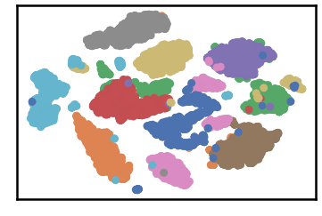

.. parsed-literal::

    
     ==================================================================================================== 
    
    There are 5 outlier point(s) in black (noise of type-1) represent 0% of total points
    There are 173 weak point(s) in light grey (noise of type-2) represent 2% of total points
    DenMune detected 121 clusters 
    

.. image:: datasets/digits/output_3_3.png

.. parsed-literal::

    k= 15 :Validity score is: 0.4831178863029158 but best score is 0.4831178863029158 at k= 15     
     ==================================================================================================== 
    
    using NGT, Proximity matrix has been calculated  in:  0.2052602767944336  seconds
    There are 5 outlier point(s) in black (noise of type-1) represent 0% of total points
    There are 121 weak point(s) in light grey (noise of type-2) represent 1% of total points
    DenMune detected 64 clusters 
    

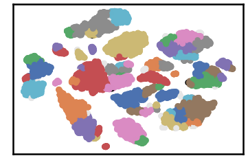

.. parsed-literal::

    k= 20 :Validity score is: 0.6441477627805198 but best score is 0.6441477627805198 at k= 20     
     ==================================================================================================== 
    
    using NGT, Proximity matrix has been calculated  in:  0.22417545318603516  seconds
    There are 5 outlier point(s) in black (noise of type-1) represent 0% of total points
    There are 157 weak point(s) in light grey (noise of type-2) represent 1% of total points
    DenMune detected 44 clusters 
    

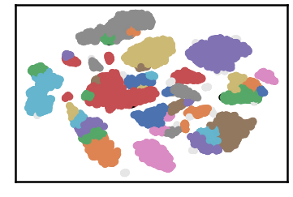

.. parsed-literal::

    k= 25 :Validity score is: 0.7741522150443666 but best score is 0.7741522150443666 at k= 25     
     ==================================================================================================== 
    
    using NGT, Proximity matrix has been calculated  in:  0.25125861167907715  seconds
    There are 5 outlier point(s) in black (noise of type-1) represent 0% of total points
    There are 171 weak point(s) in light grey (noise of type-2) represent 2% of total points
    DenMune detected 32 clusters 
    

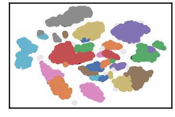

.. parsed-literal::

    k= 30 :Validity score is: 0.8032983070478512 but best score is 0.8032983070478512 at k= 30     
     ==================================================================================================== 
    
    using NGT, Proximity matrix has been calculated  in:  0.279599666595459  seconds
    There are 5 outlier point(s) in black (noise of type-1) represent 0% of total points
    There are 157 weak point(s) in light grey (noise of type-2) represent 1% of total points
    DenMune detected 26 clusters 
    

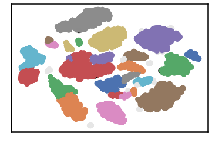

.. parsed-literal::

    k= 35 :Validity score is: 0.8315151636779963 but best score is 0.8315151636779963 at k= 35     
     ==================================================================================================== 
    
    using NGT, Proximity matrix has been calculated  in:  0.48532962799072266  seconds
    There are 5 outlier point(s) in black (noise of type-1) represent 0% of total points
    There are 133 weak point(s) in light grey (noise of type-2) represent 1% of total points
    DenMune detected 23 clusters 
    

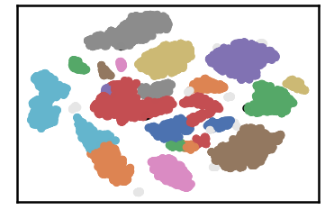

.. parsed-literal::

    k= 40 :Validity score is: 0.8560044269666767 but best score is 0.8560044269666767 at k= 40     
     ==================================================================================================== 
    
    using NGT, Proximity matrix has been calculated  in:  0.3321878910064697  seconds
    There are 5 outlier point(s) in black (noise of type-1) represent 0% of total points
    There are 105 weak point(s) in light grey (noise of type-2) represent 1% of total points
    DenMune detected 22 clusters 
    

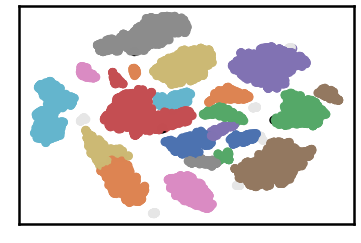

.. parsed-literal::

    k= 45 :Validity score is: 0.8556290114664459 but best score is 0.8560044269666767 at k= 40     
     ==================================================================================================== 
    
    using NGT, Proximity matrix has been calculated  in:  0.3662679195404053  seconds
    There are 5 outlier point(s) in black (noise of type-1) represent 0% of total points
    There are 92 weak point(s) in light grey (noise of type-2) represent 1% of total points
    DenMune detected 22 clusters 
    

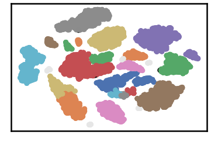

.. parsed-literal::

    k= 50 :Validity score is: 0.8637360806881963 but best score is 0.8637360806881963 at k= 50     
     ==================================================================================================== 
    
    using NGT, Proximity matrix has been calculated  in:  0.3983762264251709  seconds
    There are 5 outlier point(s) in black (noise of type-1) represent 0% of total points
    There are 197 weak point(s) in light grey (noise of type-2) represent 2% of total points
    DenMune detected 20 clusters 
    

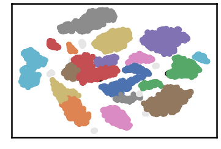

.. parsed-literal::

    k= 55 :Validity score is: 0.8442659985599057 but best score is 0.8637360806881963 at k= 50     
     ==================================================================================================== 
    
    using NGT, Proximity matrix has been calculated  in:  0.4723522663116455  seconds
    There are 5 outlier point(s) in black (noise of type-1) represent 0% of total points
    There are 167 weak point(s) in light grey (noise of type-2) represent 2% of total points
    DenMune detected 18 clusters 
    

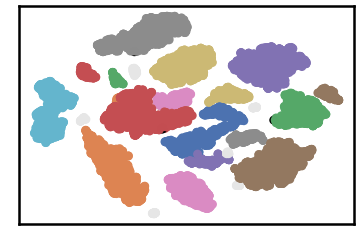

.. parsed-literal::

    k= 60 :Validity score is: 0.9064385563304047 but best score is 0.9064385563304047 at k= 60     
     ==================================================================================================== 
    
    using NGT, Proximity matrix has been calculated  in:  0.6823856830596924  seconds
    There are 5 outlier point(s) in black (noise of type-1) represent 0% of total points
    There are 167 weak point(s) in light grey (noise of type-2) represent 2% of total points
    DenMune detected 17 clusters 
    

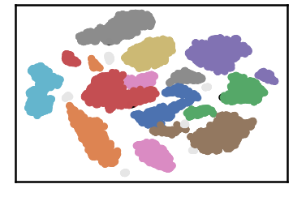

.. parsed-literal::

    k= 65 :Validity score is: 0.9054906089835684 but best score is 0.9064385563304047 at k= 60     
     ==================================================================================================== 
    
    using NGT, Proximity matrix has been calculated  in:  0.5588953495025635  seconds
    There are 5 outlier point(s) in black (noise of type-1) represent 0% of total points
    There are 139 weak point(s) in light grey (noise of type-2) represent 1% of total points
    DenMune detected 17 clusters 
    

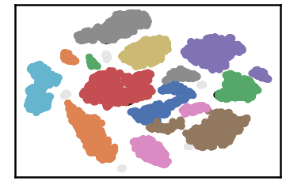

.. parsed-literal::

    k= 70 :Validity score is: 0.9053332903218106 but best score is 0.9064385563304047 at k= 60     
     ==================================================================================================== 
    
    using NGT, Proximity matrix has been calculated  in:  0.5089232921600342  seconds
    There are 5 outlier point(s) in black (noise of type-1) represent 0% of total points
    There are 128 weak point(s) in light grey (noise of type-2) represent 1% of total points
    DenMune detected 17 clusters 
    

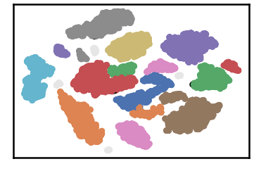

.. parsed-literal::

    k= 75 :Validity score is: 0.9044248602396726 but best score is 0.9064385563304047 at k= 60     
     ==================================================================================================== 
    
    using NGT, Proximity matrix has been calculated  in:  0.5643761157989502  seconds
    There are 5 outlier point(s) in black (noise of type-1) represent 0% of total points
    There are 128 weak point(s) in light grey (noise of type-2) represent 1% of total points
    DenMune detected 17 clusters 
    

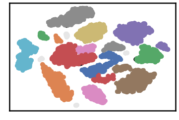

.. parsed-literal::

    k= 80 :Validity score is: 0.9042169697137292 but best score is 0.9064385563304047 at k= 60     
     ==================================================================================================== 
    
    using NGT, Proximity matrix has been calculated  in:  0.5513322353363037  seconds
    There are 5 outlier point(s) in black (noise of type-1) represent 0% of total points
    There are 128 weak point(s) in light grey (noise of type-2) represent 1% of total points
    DenMune detected 18 clusters 
    

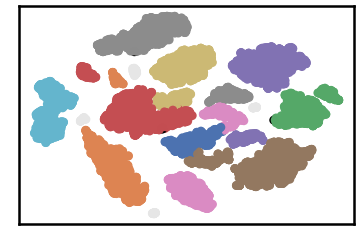

.. parsed-literal::

    k= 85 :Validity score is: 0.8825668128537816 but best score is 0.9064385563304047 at k= 60     
     ==================================================================================================== 
    
    using NGT, Proximity matrix has been calculated  in:  0.5938529968261719  seconds
    There are 4 outlier point(s) in black (noise of type-1) represent 0% of total points
    There are 125 weak point(s) in light grey (noise of type-2) represent 1% of total points
    DenMune detected 18 clusters 
    

.. parsed-literal::

    k= 90 :Validity score is: 0.8829375377957662 but best score is 0.9064385563304047 at k= 60     
     ==================================================================================================== 
    
    using NGT, Proximity matrix has been calculated  in:  0.6179993152618408  seconds
    There are 4 outlier point(s) in black (noise of type-1) represent 0% of total points
    There are 74 weak point(s) in light grey (noise of type-2) represent 1% of total points
    DenMune detected 18 clusters 
    

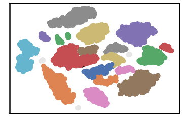

.. parsed-literal::

    k= 95 :Validity score is: 0.8826386507897434 but best score is 0.9064385563304047 at k= 60     
     ==================================================================================================== 
    
    using NGT, Proximity matrix has been calculated  in:  0.8056750297546387  seconds
    There are 4 outlier point(s) in black (noise of type-1) represent 0% of total points
    There are 74 weak point(s) in light grey (noise of type-2) represent 1% of total points
    DenMune detected 17 clusters 
    

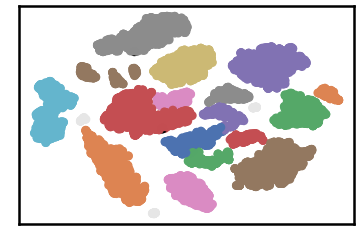

.. parsed-literal::

    k= 100 :Validity score is: 0.8825097982372475 but best score is 0.9064385563304047 at k= 60     
     ==================================================================================================== 
    

.. parsed-literal::

    <Figure size 432x288 with 0 Axes>

.. code:: ipython3

    # It is time to save the results
    results_path = 'results/'  # change it to whatever you output results to, set it to ''; so it will output to current folder
    para_file = 'denmune'+ '_para_'  + dataset + '.csv'
    df.sort_values(by=['F1', 'NMI', 'ARI'] , ascending=False, inplace=True)   
    df.to_csv(results_path + para_file, index=False, sep='\t', header=True)

.. code:: ipython3

    df # it is sorted now and saved

.. raw:: html

    

    
    <table border="1" class="dataframe">
      <thead>
        <tr style="text-align: right;">
          <th></th>
          <th>K</th>
          <th>ACC</th>
          <th>F1</th>
          <th>NMI</th>
          <th>AMI</th>
          <th>ARI</th>
          <th>Homogeneity</th>
          <th>Completeness</th>
          <th>Time</th>
        </tr>
      </thead>
      <tbody>
        <tr>
          <th>9</th>
          <td>60.0</td>
          <td>9383.0</td>
          <td>0.906439</td>
          <td>0.888266</td>
          <td>0.887909</td>
          <td>0.846696</td>
          <td>0.955570</td>
          <td>0.829820</td>
          <td>7.291832</td>
        </tr>
        <tr>
          <th>10</th>
          <td>65.0</td>
          <td>9387.0</td>
          <td>0.905491</td>
          <td>0.888360</td>
          <td>0.888023</td>
          <td>0.844829</td>
          <td>0.953267</td>
          <td>0.831729</td>
          <td>8.405005</td>
        </tr>
        <tr>
          <th>11</th>
          <td>70.0</td>
          <td>9386.0</td>
          <td>0.905333</td>
          <td>0.889868</td>
          <td>0.889535</td>
          <td>0.845368</td>
          <td>0.954716</td>
          <td>0.833269</td>
          <td>8.817534</td>
        </tr>
        <tr>
          <th>12</th>
          <td>75.0</td>
          <td>9379.0</td>
          <td>0.904425</td>
          <td>0.889676</td>
          <td>0.889342</td>
          <td>0.843945</td>
          <td>0.954252</td>
          <td>0.833286</td>
          <td>9.674934</td>
        </tr>
        <tr>
          <th>13</th>
          <td>80.0</td>
          <td>9376.0</td>
          <td>0.904217</td>
          <td>0.889414</td>
          <td>0.889079</td>
          <td>0.843555</td>
          <td>0.954021</td>
          <td>0.833002</td>
          <td>10.188589</td>
        </tr>
        <tr>
          <th>15</th>
          <td>90.0</td>
          <td>9077.0</td>
          <td>0.882938</td>
          <td>0.880385</td>
          <td>0.880008</td>
          <td>0.826733</td>
          <td>0.953427</td>
          <td>0.817738</td>
          <td>12.030128</td>
        </tr>
        <tr>
          <th>16</th>
          <td>95.0</td>
          <td>9073.0</td>
          <td>0.882639</td>
          <td>0.878107</td>
          <td>0.877723</td>
          <td>0.826188</td>
          <td>0.950868</td>
          <td>0.815690</td>
          <td>13.021503</td>
        </tr>
        <tr>
          <th>14</th>
          <td>85.0</td>
          <td>9073.0</td>
          <td>0.882567</td>
          <td>0.880605</td>
          <td>0.880228</td>
          <td>0.826550</td>
          <td>0.953721</td>
          <td>0.817902</td>
          <td>11.269780</td>
        </tr>
        <tr>
          <th>17</th>
          <td>100.0</td>
          <td>9071.0</td>
          <td>0.882510</td>
          <td>0.876823</td>
          <td>0.876454</td>
          <td>0.825125</td>
          <td>0.946214</td>
          <td>0.816914</td>
          <td>13.406094</td>
        </tr>
        <tr>
          <th>7</th>
          <td>50.0</td>
          <td>8704.0</td>
          <td>0.863736</td>
          <td>0.865857</td>
          <td>0.865351</td>
          <td>0.792994</td>
          <td>0.955992</td>
          <td>0.791255</td>
          <td>5.697755</td>
        </tr>
        <tr>
          <th>5</th>
          <td>40.0</td>
          <td>8580.0</td>
          <td>0.856004</td>
          <td>0.863872</td>
          <td>0.863338</td>
          <td>0.793687</td>
          <td>0.958925</td>
          <td>0.785963</td>
          <td>4.526678</td>
        </tr>
        <tr>
          <th>6</th>
          <td>45.0</td>
          <td>8603.0</td>
          <td>0.855629</td>
          <td>0.862724</td>
          <td>0.862208</td>
          <td>0.788863</td>
          <td>0.955543</td>
          <td>0.786341</td>
          <td>5.430274</td>
        </tr>
        <tr>
          <th>8</th>
          <td>55.0</td>
          <td>8363.0</td>
          <td>0.844266</td>
          <td>0.857640</td>
          <td>0.857156</td>
          <td>0.767917</td>
          <td>0.953389</td>
          <td>0.779368</td>
          <td>6.496609</td>
        </tr>
        <tr>
          <th>4</th>
          <td>35.0</td>
          <td>8199.0</td>
          <td>0.831515</td>
          <td>0.853573</td>
          <td>0.852936</td>
          <td>0.767816</td>
          <td>0.963580</td>
          <td>0.766110</td>
          <td>4.017795</td>
        </tr>
        <tr>
          <th>3</th>
          <td>30.0</td>
          <td>7803.0</td>
          <td>0.803298</td>
          <td>0.836016</td>
          <td>0.835156</td>
          <td>0.731291</td>
          <td>0.964708</td>
          <td>0.737617</td>
          <td>3.164729</td>
        </tr>
        <tr>
          <th>2</th>
          <td>25.0</td>
          <td>7324.0</td>
          <td>0.774152</td>
          <td>0.802851</td>
          <td>0.801489</td>
          <td>0.666186</td>
          <td>0.966610</td>
          <td>0.686541</td>
          <td>2.937663</td>
        </tr>
        <tr>
          <th>1</th>
          <td>20.0</td>
          <td>5398.0</td>
          <td>0.644148</td>
          <td>0.749690</td>
          <td>0.747330</td>
          <td>0.483874</td>
          <td>0.971174</td>
          <td>0.610469</td>
          <td>2.294626</td>
        </tr>
        <tr>
          <th>0</th>
          <td>15.0</td>
          <td>3655.0</td>
          <td>0.483118</td>
          <td>0.673110</td>
          <td>0.667784</td>
          <td>0.303165</td>
          <td>0.967827</td>
          <td>0.515986</td>
          <td>77.470820</td>
        </tr>
      </tbody>
    </table>
    

