DIM-32 Dataset
=================

.. code:: ipython3

    import time
    import os.path
    import requests
    import pandas as pd

.. code:: ipython3

    # install DenMune clustering algorithm using pip command from the offecial Python repository, PyPi
    # from https://pypi.org/project/denmune/
    !pip install denmune
    
    # now import it
    from denmune import DenMune

.. code:: ipython3

    dataset = 'dim032' # let us take DIM-32 dataset as an example
    
    url = "https://zerobytes.one/denmune_data/"
    file_ext = ".txt"
    ground_ext = "-gt"
    
    dataset_url = url + dataset + file_ext
    groundtruth_url = url + dataset + ground_ext  + file_ext
    
    data_path = 'data/' # change it to whatever you put your data, set it to ''; so it will retrive from current folder
    if  not os.path.isfile(data_path + dataset + file_ext):
        req = requests.get(dataset_url)
        with open(data_path + dataset + file_ext, 'wb') as f:
            f.write(req.content)
            
    if  not os.path.isfile(data_path + dataset + ground_ext + file_ext):
        req = requests.get(groundtruth_url)
        with open(data_path + dataset +  ground_ext + file_ext, 'wb') as f:
            f.write(req.content)       

.. code:: ipython3

    # Denmune's Paramaters
    # DenMune(dataset=dataset, k_nearest=n, data_path=data_path, verpose=verpose_mode, show_plot=show_plot, show_noise=show_noise)
    verpose_mode = True # view in-depth analysis of time complexity and outlier detection, num of clusters
    show_plot = True  # show plots on/off
    show_noise = True # show noise and outlier on/off
    
    # loop's parameters
    start = 2
    step = 2
    end=30
    
    # Validity indexes' parameters
    validity_val = -1
    best_k = 0
    best_val = -1
    
    validity_idx = 2 # Acc=1, F1-score=2,  NMI=3, AMI=4, ARI=5,  Homogeneity=6, and Completeness=7
    df = pd.DataFrame(columns =['K', 'ACC', 'F1', 'NMI', 'AMI', 'ARI','Homogeneity', 'Completeness', 'Time' ])
    
    
    for n in range(start, end+1, step):
        start_time = time.time()
        dm = DenMune(dataset=dataset, k_nearest=n, data_path=data_path, verpose=verpose_mode, show_noise=show_noise)
        labels_true, labels_pred = dm.datasets/dim032/output_3_Clusters()
        if show_plot == True and n==start:
            # Let us plot the groundtruth of this dataset which is reduced to 2-d using t-SNE
            print ("Dataset\'s Groundtruht")
            dm.plot_clusters(labels_true, ground=True)
            print('\n', "=====" * 20 , '\n')       
                   
        end_time = time.time()
        
        validity_indexes = dm.validate_Clusters(labels_true, labels_pred)
        validity_val = validity_indexes[validity_idx]
        validity_indexes[0] = n
        validity_indexes[8] = end_time - start_time
        
        df = df.append(pd.Series(validity_indexes, index=df.columns ), ignore_index=True)
        
        if (best_val < validity_val):
            best_val = validity_val
            best_k = n
            # Let us show results where only an improve in accuracy is detected
        if show_plot:
                dm.plot_clusters(labels_pred, show_noise=show_noise)
        print ('k=' , n, ':Validity score is:', validity_val , 'but best score is', best_val, 'at k=', best_k , end='     ')
                
        if not verpose_mode:
            print('\r', end='')
        else:
            print('\n', "=====" * 20 , '\n')

.. parsed-literal::

    using NGT, Proximity matrix has been calculated  in:  0.009486675262451172  seconds
    Dataset's Groundtruht

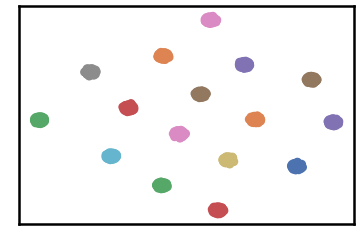

.. parsed-literal::

    
     ==================================================================================================== 
    
    There are 0 outlier point(s) in black (noise of type-1) represent 0% of total points
    There are 0 weak point(s) in light grey (noise of type-2) represent 0% of total points
    DenMune detected 232 clusters 
    

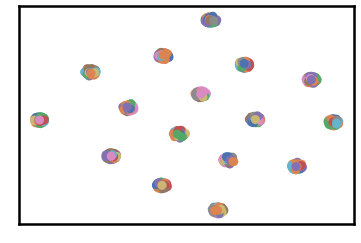

.. parsed-literal::

    k= 2 :Validity score is: 0.07224852066090989 but best score is 0.07224852066090989 at k= 2     
     ==================================================================================================== 
    
    using NGT, Proximity matrix has been calculated  in:  0.01723480224609375  seconds
    There are 37 outlier point(s) in black (noise of type-1) represent 4% of total points
    There are 40 weak point(s) in light grey (noise of type-2) represent 4% of total points
    DenMune detected 114 clusters 
    

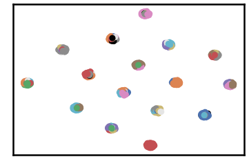

.. parsed-literal::

    k= 4 :Validity score is: 0.4851767900233957 but best score is 0.4851767900233957 at k= 4     
     ==================================================================================================== 
    
    using NGT, Proximity matrix has been calculated  in:  0.014195680618286133  seconds
    There are 15 outlier point(s) in black (noise of type-1) represent 1% of total points
    There are 55 weak point(s) in light grey (noise of type-2) represent 5% of total points
    DenMune detected 64 clusters 
    

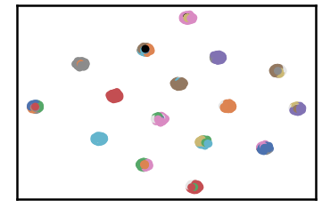

.. parsed-literal::

    k= 6 :Validity score is: 0.607281926890781 but best score is 0.607281926890781 at k= 6     
     ==================================================================================================== 
    
    using NGT, Proximity matrix has been calculated  in:  0.01800227165222168  seconds
    There are 10 outlier point(s) in black (noise of type-1) represent 1% of total points
    There are 43 weak point(s) in light grey (noise of type-2) represent 4% of total points
    DenMune detected 49 clusters 
    

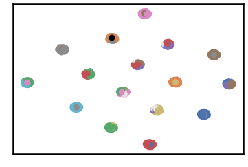

.. parsed-literal::

    k= 8 :Validity score is: 0.6996200298231641 but best score is 0.6996200298231641 at k= 8     
     ==================================================================================================== 
    
    using NGT, Proximity matrix has been calculated  in:  0.017964601516723633  seconds
    There are 6 outlier point(s) in black (noise of type-1) represent 1% of total points
    There are 123 weak point(s) in light grey (noise of type-2) represent 12% of total points
    DenMune detected 44 clusters 
    

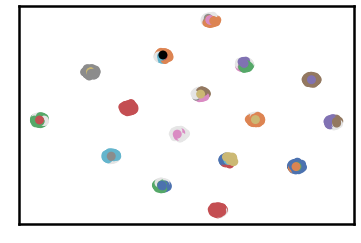

.. parsed-literal::

    k= 10 :Validity score is: 0.6756620164874914 but best score is 0.6996200298231641 at k= 8     
     ==================================================================================================== 
    
    using NGT, Proximity matrix has been calculated  in:  0.022975921630859375  seconds
    There are 3 outlier point(s) in black (noise of type-1) represent 0% of total points
    There are 191 weak point(s) in light grey (noise of type-2) represent 19% of total points
    DenMune detected 40 clusters 
    

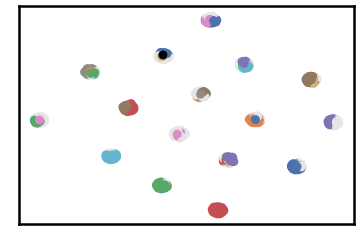

.. parsed-literal::

    k= 12 :Validity score is: 0.6716859744388628 but best score is 0.6996200298231641 at k= 8     
     ==================================================================================================== 
    
    using NGT, Proximity matrix has been calculated  in:  0.13350367546081543  seconds
    There are 1 outlier point(s) in black (noise of type-1) represent 0% of total points
    There are 0 weak point(s) in light grey (noise of type-2) represent 0% of total points
    DenMune detected 35 clusters 
    

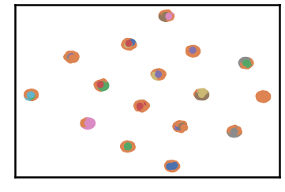

.. parsed-literal::

    k= 14 :Validity score is: 0.5427408951577599 but best score is 0.6996200298231641 at k= 8     
     ==================================================================================================== 
    
    using NGT, Proximity matrix has been calculated  in:  0.02523946762084961  seconds
    There are 1 outlier point(s) in black (noise of type-1) represent 0% of total points
    There are 0 weak point(s) in light grey (noise of type-2) represent 0% of total points
    DenMune detected 26 clusters 
    

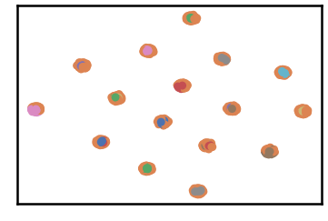

.. parsed-literal::

    k= 16 :Validity score is: 0.4272802582118586 but best score is 0.6996200298231641 at k= 8     
     ==================================================================================================== 
    
    using NGT, Proximity matrix has been calculated  in:  0.020970821380615234  seconds
    There are 1 outlier point(s) in black (noise of type-1) represent 0% of total points
    There are 0 weak point(s) in light grey (noise of type-2) represent 0% of total points
    DenMune detected 17 clusters 
    

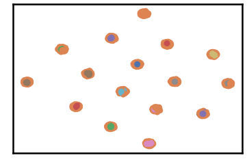

.. parsed-literal::

    k= 18 :Validity score is: 0.3553930835199245 but best score is 0.6996200298231641 at k= 8     
     ==================================================================================================== 
    
    using NGT, Proximity matrix has been calculated  in:  0.022987842559814453  seconds
    There are 1 outlier point(s) in black (noise of type-1) represent 0% of total points
    There are 0 weak point(s) in light grey (noise of type-2) represent 0% of total points
    DenMune detected 17 clusters 
    

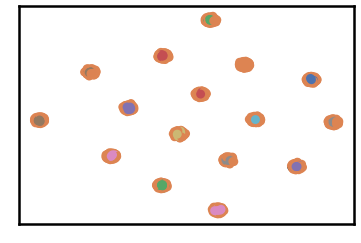

.. parsed-literal::

    k= 20 :Validity score is: 0.3173292877501589 but best score is 0.6996200298231641 at k= 8     
     ==================================================================================================== 
    
    using NGT, Proximity matrix has been calculated  in:  0.028342247009277344  seconds
    There are 1 outlier point(s) in black (noise of type-1) represent 0% of total points
    There are 0 weak point(s) in light grey (noise of type-2) represent 0% of total points
    DenMune detected 17 clusters 
    

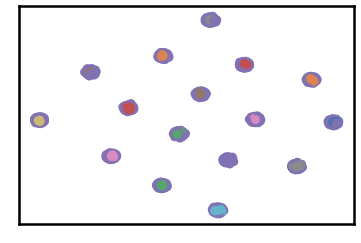

.. parsed-literal::

    k= 22 :Validity score is: 0.5019855600647085 but best score is 0.6996200298231641 at k= 8     
     ==================================================================================================== 
    
    using NGT, Proximity matrix has been calculated  in:  0.03183889389038086  seconds
    There are 1 outlier point(s) in black (noise of type-1) represent 0% of total points
    There are 337 weak point(s) in light grey (noise of type-2) represent 33% of total points
    DenMune detected 16 clusters 
    

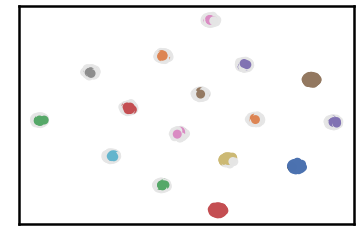

.. parsed-literal::

    k= 24 :Validity score is: 0.7915673888134647 but best score is 0.7915673888134647 at k= 24     
     ==================================================================================================== 
    
    using NGT, Proximity matrix has been calculated  in:  0.02433490753173828  seconds
    There are 1 outlier point(s) in black (noise of type-1) represent 0% of total points
    There are 182 weak point(s) in light grey (noise of type-2) represent 18% of total points
    DenMune detected 16 clusters 
    

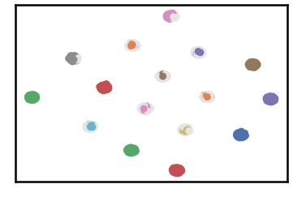

.. parsed-literal::

    k= 26 :Validity score is: 0.8917224582429304 but best score is 0.8917224582429304 at k= 26     
     ==================================================================================================== 
    
    using NGT, Proximity matrix has been calculated  in:  0.03260946273803711  seconds
    There are 1 outlier point(s) in black (noise of type-1) represent 0% of total points
    There are 32 weak point(s) in light grey (noise of type-2) represent 3% of total points
    DenMune detected 16 clusters 
    

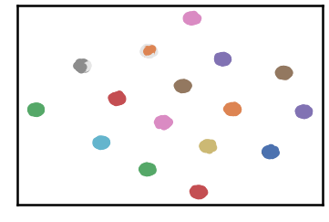

.. parsed-literal::

    k= 28 :Validity score is: 0.9810905070689693 but best score is 0.9810905070689693 at k= 28     
     ==================================================================================================== 
    
    using NGT, Proximity matrix has been calculated  in:  0.023916006088256836  seconds
    There are 1 outlier point(s) in black (noise of type-1) represent 0% of total points
    There are 0 weak point(s) in light grey (noise of type-2) represent 0% of total points
    DenMune detected 16 clusters 
    

.. parsed-literal::

    k= 30 :Validity score is: 0.999507874015748 but best score is 0.999507874015748 at k= 30     
     ==================================================================================================== 
    

.. parsed-literal::

    <Figure size 432x288 with 0 Axes>

.. code:: ipython3

    # It is time to save the results
    results_path = 'results/'  # change it to whatever you datasets/dim032/output_3 results to, set it to ''; so it will datasets/dim032/output_3 to current folder
    para_file = 'denmune'+ '_para_'  + dataset + '.csv'
    df.sort_values(by=['F1', 'NMI', 'ARI'] , ascending=False, inplace=True)   
    df.to_csv(results_path + para_file, index=False, sep='\t', header=True)

.. code:: ipython3

    df # it is sorted now and saved

.. raw:: html

    

    
    <table border="1" class="dataframe">
      <thead>
        <tr style="text-align: right;">
          <th></th>
          <th>K</th>
          <th>ACC</th>
          <th>F1</th>
          <th>NMI</th>
          <th>AMI</th>
          <th>ARI</th>
          <th>Homogeneity</th>
          <th>Completeness</th>
          <th>Time</th>
        </tr>
      </thead>
      <tbody>
        <tr>
          <th>14</th>
          <td>30.0</td>
          <td>1023.0</td>
          <td>0.999508</td>
          <td>0.999094</td>
          <td>0.999053</td>
          <td>0.998958</td>
          <td>1.000000</td>
          <td>0.998189</td>
          <td>0.400485</td>
        </tr>
        <tr>
          <th>13</th>
          <td>28.0</td>
          <td>991.0</td>
          <td>0.981091</td>
          <td>0.983959</td>
          <td>0.983183</td>
          <td>0.971248</td>
          <td>0.993304</td>
          <td>0.974789</td>
          <td>0.421917</td>
        </tr>
        <tr>
          <th>12</th>
          <td>26.0</td>
          <td>841.0</td>
          <td>0.891722</td>
          <td>0.869067</td>
          <td>0.862543</td>
          <td>0.666637</td>
          <td>0.863021</td>
          <td>0.875198</td>
          <td>0.452452</td>
        </tr>
        <tr>
          <th>11</th>
          <td>24.0</td>
          <td>686.0</td>
          <td>0.791567</td>
          <td>0.736431</td>
          <td>0.722302</td>
          <td>0.318344</td>
          <td>0.697463</td>
          <td>0.780012</td>
          <td>0.374854</td>
        </tr>
        <tr>
          <th>3</th>
          <td>8.0</td>
          <td>566.0</td>
          <td>0.699620</td>
          <td>0.822197</td>
          <td>0.797800</td>
          <td>0.564177</td>
          <td>0.959477</td>
          <td>0.719284</td>
          <td>0.205419</td>
        </tr>
        <tr>
          <th>4</th>
          <td>10.0</td>
          <td>550.0</td>
          <td>0.675662</td>
          <td>0.789617</td>
          <td>0.762370</td>
          <td>0.500322</td>
          <td>0.895590</td>
          <td>0.706070</td>
          <td>0.278080</td>
        </tr>
        <tr>
          <th>5</th>
          <td>12.0</td>
          <td>553.0</td>
          <td>0.671686</td>
          <td>0.758867</td>
          <td>0.730393</td>
          <td>0.424462</td>
          <td>0.827901</td>
          <td>0.700460</td>
          <td>0.246395</td>
        </tr>
        <tr>
          <th>2</th>
          <td>6.0</td>
          <td>464.0</td>
          <td>0.607282</td>
          <td>0.779452</td>
          <td>0.741180</td>
          <td>0.455380</td>
          <td>0.941716</td>
          <td>0.664887</td>
          <td>0.275665</td>
        </tr>
        <tr>
          <th>6</th>
          <td>14.0</td>
          <td>461.0</td>
          <td>0.542741</td>
          <td>0.666293</td>
          <td>0.631857</td>
          <td>0.204835</td>
          <td>0.668590</td>
          <td>0.664013</td>
          <td>0.446369</td>
        </tr>
        <tr>
          <th>10</th>
          <td>22.0</td>
          <td>430.0</td>
          <td>0.501986</td>
          <td>0.600695</td>
          <td>0.577357</td>
          <td>0.123105</td>
          <td>0.535729</td>
          <td>0.683591</td>
          <td>0.365468</td>
        </tr>
        <tr>
          <th>1</th>
          <td>4.0</td>
          <td>340.0</td>
          <td>0.485177</td>
          <td>0.717582</td>
          <td>0.639722</td>
          <td>0.299554</td>
          <td>0.932985</td>
          <td>0.582985</td>
          <td>0.146830</td>
        </tr>
        <tr>
          <th>7</th>
          <td>16.0</td>
          <td>376.0</td>
          <td>0.427280</td>
          <td>0.606407</td>
          <td>0.574527</td>
          <td>0.130082</td>
          <td>0.559035</td>
          <td>0.662552</td>
          <td>0.385975</td>
        </tr>
        <tr>
          <th>8</th>
          <td>18.0</td>
          <td>308.0</td>
          <td>0.355393</td>
          <td>0.560390</td>
          <td>0.533657</td>
          <td>0.088347</td>
          <td>0.485904</td>
          <td>0.661847</td>
          <td>0.333384</td>
        </tr>
        <tr>
          <th>9</th>
          <td>20.0</td>
          <td>279.0</td>
          <td>0.317329</td>
          <td>0.568640</td>
          <td>0.542615</td>
          <td>0.094749</td>
          <td>0.495856</td>
          <td>0.666466</td>
          <td>0.257869</td>
        </tr>
        <tr>
          <th>0</th>
          <td>2.0</td>
          <td>52.0</td>
          <td>0.072249</td>
          <td>0.593504</td>
          <td>0.395620</td>
          <td>0.064415</td>
          <td>0.828582</td>
          <td>0.462335</td>
          <td>0.349874</td>
        </tr>
      </tbody>
    </table>
    

