DIM-128 Dataset
=================

.. code:: ipython3

    import time
    import os.path
    import requests
    import pandas as pd

.. code:: ipython3

    # install DenMune clustering algorithm using pip command from the offecial Python repository, PyPi
    # from https://pypi.org/project/denmune/
    !pip install denmune
    
    # now import it
    from denmune import DenMune

.. code:: ipython3

    dataset = 'dim128' # let us take DIM-128 dataset as an example
    
    url = "https://zerobytes.one/denmune_data/"
    file_ext = ".txt"
    ground_ext = "-gt"
    
    dataset_url = url + dataset + file_ext
    groundtruth_url = url + dataset + ground_ext  + file_ext
    
    data_path = 'data/' # change it to whatever you put your data, set it to ''; so it will retrive from current folder
    if  not os.path.isfile(data_path + dataset + file_ext):
        req = requests.get(dataset_url)
        with open(data_path + dataset + file_ext, 'wb') as f:
            f.write(req.content)
            
    if  not os.path.isfile(data_path + dataset + ground_ext + file_ext):
        req = requests.get(groundtruth_url)
        with open(data_path + dataset +  ground_ext + file_ext, 'wb') as f:
            f.write(req.content)       

.. code:: ipython3

    # Denmune's Paramaters
    # DenMune(dataset=dataset, k_nearest=n, data_path=data_path, verpose=verpose_mode, show_plot=show_plot, show_noise=show_noise)
    verpose_mode = True # view in-depth analysis of time complexity and outlier detection, num of clusters
    show_plot = True  # show plots on/off
    show_noise = True # show noise and outlier on/off
    
    # loop's parameters
    start = 3
    step = 3
    end=35
    
    # Validity indexes' parameters
    validity_val = -1
    best_k = 0
    best_val = -1
    
    validity_idx = 2 # Acc=1, F1-score=2,  NMI=3, AMI=4, ARI=5,  Homogeneity=6, and Completeness=7
    df = pd.DataFrame(columns =['K', 'ACC', 'F1', 'NMI', 'AMI', 'ARI','Homogeneity', 'Completeness', 'Time' ])
    
    
    for n in range(start, end+1, step):
        start_time = time.time()
        dm = DenMune(dataset=dataset, k_nearest=n, data_path=data_path, verpose=verpose_mode, show_noise=show_noise)
        labels_true, labels_pred = dm.output_Clusters()
        if show_plot == True and n==start:
            # Let us plot the groundtruth of this dataset which is reduced to 2-d using t-SNE
            print ("Dataset\'s Groundtruht")
            dm.plot_clusters(labels_true, ground=True)
            print('\n', "=====" * 20 , '\n')       
                   
        end_time = time.time()
        
        validity_indexes = dm.validate_Clusters(labels_true, labels_pred)
        validity_val = validity_indexes[validity_idx]
        validity_indexes[0] = n
        validity_indexes[8] = end_time - start_time
        
        df = df.append(pd.Series(validity_indexes, index=df.columns ), ignore_index=True)
        
        if (best_val < validity_val):
            best_val = validity_val
            best_k = n
            # Let us show results where only an improve in accuracy is detected
        if show_plot:
                dm.plot_clusters(labels_pred, show_noise=show_noise)
        print ('k=' , n, ':Validity score is:', validity_val , 'but best score is', best_val, 'at k=', best_k , end='     ')
                
        if not verpose_mode:
            print('\r', end='')
        else:
            print('\n', "=====" * 20 , '\n')

.. parsed-literal::

    using NGT, Proximity matrix has been calculated  in:  0.01248478889465332  seconds
    Dataset's Groundtruht

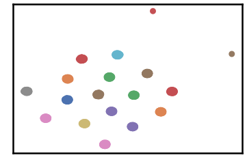

.. parsed-literal::

    
     ==================================================================================================== 
    
    There are 72 outlier point(s) in black (noise of type-1) represent 7% of total points
    There are 60 weak point(s) in light grey (noise of type-2) represent 6% of total points
    DenMune detected 143 clusters 
    

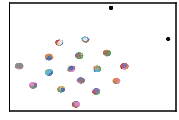

.. parsed-literal::

    k= 3 :Validity score is: 0.3416002422244925 but best score is 0.3416002422244925 at k= 3     
     ==================================================================================================== 
    
    using NGT, Proximity matrix has been calculated  in:  0.014574050903320312  seconds
    There are 30 outlier point(s) in black (noise of type-1) represent 3% of total points
    There are 75 weak point(s) in light grey (noise of type-2) represent 7% of total points
    DenMune detected 87 clusters 
    

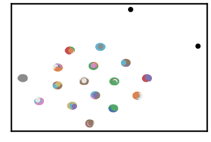

.. parsed-literal::

    k= 6 :Validity score is: 0.5496417030364036 but best score is 0.5496417030364036 at k= 6     
     ==================================================================================================== 
    
    using NGT, Proximity matrix has been calculated  in:  0.01980733871459961  seconds
    There are 20 outlier point(s) in black (noise of type-1) represent 2% of total points
    There are 0 weak point(s) in light grey (noise of type-2) represent 0% of total points
    DenMune detected 56 clusters 
    

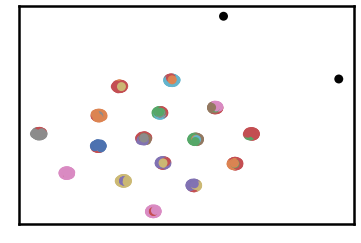

.. parsed-literal::

    k= 9 :Validity score is: 0.5991595546865423 but best score is 0.5991595546865423 at k= 9     
     ==================================================================================================== 
    
    using NGT, Proximity matrix has been calculated  in:  0.015910863876342773  seconds
    There are 11 outlier point(s) in black (noise of type-1) represent 1% of total points
    There are 0 weak point(s) in light grey (noise of type-2) represent 0% of total points
    DenMune detected 48 clusters 
    

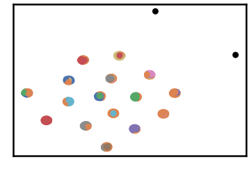

.. parsed-literal::

    k= 12 :Validity score is: 0.5087036519660283 but best score is 0.5991595546865423 at k= 9     
     ==================================================================================================== 
    
    using NGT, Proximity matrix has been calculated  in:  0.08576631546020508  seconds
    There are 4 outlier point(s) in black (noise of type-1) represent 0% of total points
    There are 0 weak point(s) in light grey (noise of type-2) represent 0% of total points
    DenMune detected 30 clusters 
    

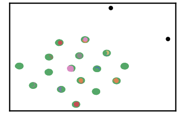

.. parsed-literal::

    k= 15 :Validity score is: 0.2840921100724487 but best score is 0.5991595546865423 at k= 9     
     ==================================================================================================== 
    
    using NGT, Proximity matrix has been calculated  in:  0.027782201766967773  seconds
    There are 2 outlier point(s) in black (noise of type-1) represent 0% of total points
    There are 0 weak point(s) in light grey (noise of type-2) represent 0% of total points
    DenMune detected 19 clusters 
    

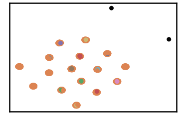

.. parsed-literal::

    k= 18 :Validity score is: 0.1780303854148954 but best score is 0.5991595546865423 at k= 9     
     ==================================================================================================== 
    
    using NGT, Proximity matrix has been calculated  in:  0.030691862106323242  seconds
    There are 2 outlier point(s) in black (noise of type-1) represent 0% of total points
    There are 0 weak point(s) in light grey (noise of type-2) represent 0% of total points
    DenMune detected 17 clusters 
    

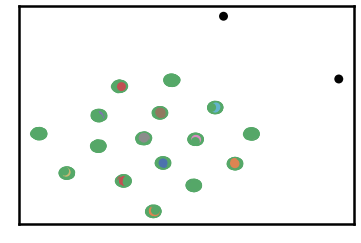

.. parsed-literal::

    k= 21 :Validity score is: 0.3089636423141578 but best score is 0.5991595546865423 at k= 9     
     ==================================================================================================== 
    
    using NGT, Proximity matrix has been calculated  in:  0.031907081604003906  seconds
    There are 2 outlier point(s) in black (noise of type-1) represent 0% of total points
    There are 0 weak point(s) in light grey (noise of type-2) represent 0% of total points
    DenMune detected 17 clusters 
    

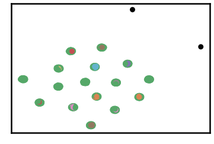

.. parsed-literal::

    k= 24 :Validity score is: 0.5497625919084339 but best score is 0.5991595546865423 at k= 9     
     ==================================================================================================== 
    
    using NGT, Proximity matrix has been calculated  in:  0.02799367904663086  seconds
    There are 2 outlier point(s) in black (noise of type-1) represent 0% of total points
    There are 271 weak point(s) in light grey (noise of type-2) represent 26% of total points
    DenMune detected 16 clusters 
    

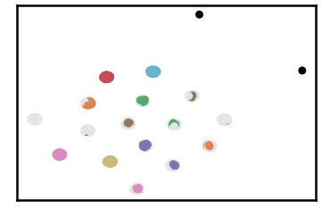

.. parsed-literal::

    k= 27 :Validity score is: 0.8365729472914749 but best score is 0.8365729472914749 at k= 27     
     ==================================================================================================== 
    
    using NGT, Proximity matrix has been calculated  in:  0.02694416046142578  seconds
    There are 2 outlier point(s) in black (noise of type-1) represent 0% of total points
    There are 18 weak point(s) in light grey (noise of type-2) represent 2% of total points
    DenMune detected 16 clusters 
    

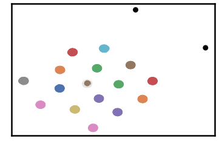

.. parsed-literal::

    k= 30 :Validity score is: 0.988613378602904 but best score is 0.988613378602904 at k= 30     
     ==================================================================================================== 
    
    using NGT, Proximity matrix has been calculated  in:  0.12585139274597168  seconds
    There are 2 outlier point(s) in black (noise of type-1) represent 0% of total points
    There are 0 weak point(s) in light grey (noise of type-2) represent 0% of total points
    DenMune detected 16 clusters 
    

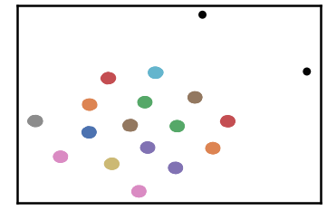

.. parsed-literal::

    k= 33 :Validity score is: 0.9990157480314961 but best score is 0.9990157480314961 at k= 33     
     ==================================================================================================== 
    

.. parsed-literal::

    <Figure size 432x288 with 0 Axes>

.. code:: ipython3

    # It is time to save the results
    results_path = 'results/'  # change it to whatever you output results to, set it to ''; so it will output to current folder
    para_file = 'denmune'+ '_para_'  + dataset + '.csv'
    df.sort_values(by=['F1', 'NMI', 'ARI'] , ascending=False, inplace=True)   
    df.to_csv(results_path + para_file, index=False, sep='\t', header=True)

.. code:: ipython3

    df # it is sorted now and saved

.. raw:: html

    

    
    <table border="1" class="dataframe">
      <thead>
        <tr style="text-align: right;">
          <th></th>
          <th>K</th>
          <th>ACC</th>
          <th>F1</th>
          <th>NMI</th>
          <th>AMI</th>
          <th>ARI</th>
          <th>Homogeneity</th>
          <th>Completeness</th>
          <th>Time</th>
        </tr>
      </thead>
      <tbody>
        <tr>
          <th>10</th>
          <td>33.0</td>
          <td>1022.0</td>
          <td>0.999016</td>
          <td>0.997945</td>
          <td>0.997851</td>
          <td>0.997898</td>
          <td>0.999512</td>
          <td>0.996383</td>
          <td>0.524048</td>
        </tr>
        <tr>
          <th>9</th>
          <td>30.0</td>
          <td>1004.0</td>
          <td>0.988613</td>
          <td>0.991375</td>
          <td>0.990952</td>
          <td>0.984310</td>
          <td>0.999512</td>
          <td>0.983369</td>
          <td>0.429776</td>
        </tr>
        <tr>
          <th>8</th>
          <td>27.0</td>
          <td>751.0</td>
          <td>0.836573</td>
          <td>0.788078</td>
          <td>0.776996</td>
          <td>0.443769</td>
          <td>0.764608</td>
          <td>0.813034</td>
          <td>0.417449</td>
        </tr>
        <tr>
          <th>2</th>
          <td>9.0</td>
          <td>469.0</td>
          <td>0.599160</td>
          <td>0.748930</td>
          <td>0.710866</td>
          <td>0.394564</td>
          <td>0.871402</td>
          <td>0.656642</td>
          <td>0.315118</td>
        </tr>
        <tr>
          <th>7</th>
          <td>24.0</td>
          <td>468.0</td>
          <td>0.549763</td>
          <td>0.606969</td>
          <td>0.583931</td>
          <td>0.129892</td>
          <td>0.544557</td>
          <td>0.685539</td>
          <td>0.453582</td>
        </tr>
        <tr>
          <th>1</th>
          <td>6.0</td>
          <td>401.0</td>
          <td>0.549642</td>
          <td>0.738485</td>
          <td>0.683384</td>
          <td>0.365239</td>
          <td>0.912852</td>
          <td>0.620048</td>
          <td>0.211246</td>
        </tr>
        <tr>
          <th>3</th>
          <td>12.0</td>
          <td>412.0</td>
          <td>0.508704</td>
          <td>0.711698</td>
          <td>0.673433</td>
          <td>0.291046</td>
          <td>0.786228</td>
          <td>0.650075</td>
          <td>0.251540</td>
        </tr>
        <tr>
          <th>0</th>
          <td>3.0</td>
          <td>212.0</td>
          <td>0.341600</td>
          <td>0.657272</td>
          <td>0.541691</td>
          <td>0.162713</td>
          <td>0.879186</td>
          <td>0.524806</td>
          <td>0.359053</td>
        </tr>
        <tr>
          <th>6</th>
          <td>21.0</td>
          <td>270.0</td>
          <td>0.308964</td>
          <td>0.556117</td>
          <td>0.528777</td>
          <td>0.084855</td>
          <td>0.481851</td>
          <td>0.657446</td>
          <td>0.407370</td>
        </tr>
        <tr>
          <th>4</th>
          <td>15.0</td>
          <td>262.0</td>
          <td>0.284092</td>
          <td>0.577878</td>
          <td>0.536775</td>
          <td>0.099919</td>
          <td>0.534745</td>
          <td>0.628580</td>
          <td>0.393446</td>
        </tr>
        <tr>
          <th>5</th>
          <td>18.0</td>
          <td>169.0</td>
          <td>0.178030</td>
          <td>0.524661</td>
          <td>0.492425</td>
          <td>0.065090</td>
          <td>0.445993</td>
          <td>0.637026</td>
          <td>0.473464</td>
        </tr>
      </tbody>
    </table>
    

