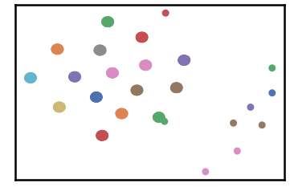
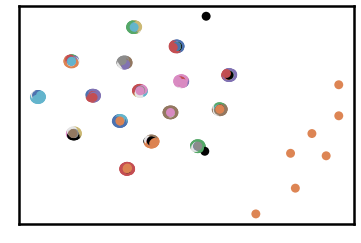
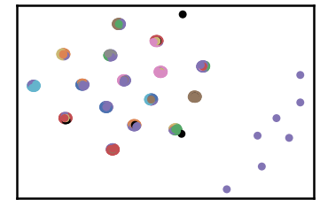
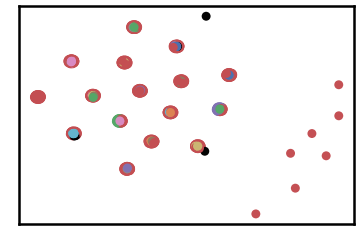
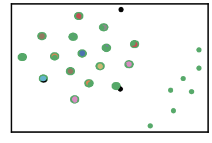
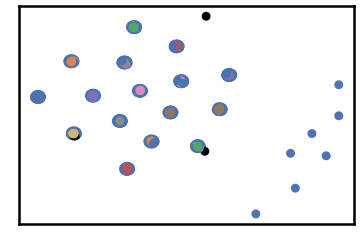
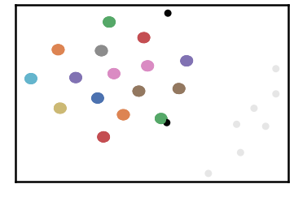

DIM-512 Dataset
=================

.. code:: ipython3

    import time
    import os.path
    import requests
    import pandas as pd

.. code:: ipython3

    # install DenMune clustering algorithm using pip command from the offecial Python repository, PyPi
    # from https://pypi.org/project/denmune/
    !pip install denmune
    
    # now import it
    from denmune import DenMune

.. code:: ipython3

    dataset = 'dim512' # let us take DIM-512 dataset as an example
    
    url = "https://zerobytes.one/denmune_data/"
    file_ext = ".txt"
    ground_ext = "-gt"
    
    dataset_url = url + dataset + file_ext
    groundtruth_url = url + dataset + ground_ext  + file_ext
    
    data_path = 'data/' # change it to whatever you put your data, set it to ''; so it will retrive from current folder
    if  not os.path.isfile(data_path + dataset + file_ext):
        req = requests.get(dataset_url)
        with open(data_path + dataset + file_ext, 'wb') as f:
            f.write(req.content)
            
    if  not os.path.isfile(data_path + dataset + ground_ext + file_ext):
        req = requests.get(groundtruth_url)
        with open(data_path + dataset +  ground_ext + file_ext, 'wb') as f:
            f.write(req.content)       

.. code:: ipython3

    # Denmune's Paramaters
    # DenMune(dataset=dataset, k_nearest=n, data_path=data_path, verpose=verpose_mode, show_plot=show_plot, show_noise=show_noise)
    verpose_mode = True # view in-depth analysis of time complexity and outlier detection, num of clusters
    show_plot = True  # show plots on/off
    show_noise = True # show noise and outlier on/off
    
    # loop's parameters
    start = 5
    step = 5
    end=60
    
    # Validity indexes' parameters
    validity_val = -1
    best_k = 0
    best_val = -1
    
    validity_idx = 2 # Acc=1, F1-score=2,  NMI=3, AMI=4, ARI=5,  Homogeneity=6, and Completeness=7
    df = pd.DataFrame(columns =['K', 'ACC', 'F1', 'NMI', 'AMI', 'ARI','Homogeneity', 'Completeness', 'Time' ])
    
    
    for n in range(start, end+1, step):
        start_time = time.time()
        dm = DenMune(dataset=dataset, k_nearest=n, data_path=data_path, verpose=verpose_mode, show_noise=show_noise)
        labels_true, labels_pred = dm.output_Clusters()
        if show_plot == True and n==start:
            # Let us plot the groundtruth of this dataset which is reduced to 2-d using t-SNE
            print ("Dataset\'s Groundtruht")
            dm.plot_clusters(labels_true, ground=True)
            print('\n', "=====" * 20 , '\n')       
                   
        end_time = time.time()
        
        validity_indexes = dm.validate_Clusters(labels_true, labels_pred)
        validity_val = validity_indexes[validity_idx]
        validity_indexes[0] = n
        validity_indexes[8] = end_time - start_time
        
        df = df.append(pd.Series(validity_indexes, index=df.columns ), ignore_index=True)
        
        if (best_val < validity_val):
            best_val = validity_val
            best_k = n
            # Let us show results where only an improve in accuracy is detected
        if show_plot:
                dm.plot_clusters(labels_pred, show_noise=show_noise)
        print ('k=' , n, ':Validity score is:', validity_val , 'but best score is', best_val, 'at k=', best_k , end='     ')
                
        if not verpose_mode:
            print('\r', end='')
        else:
            print('\n', "=====" * 20 , '\n')

.. parsed-literal::

    using NGT, Proximity matrix has been calculated  in:  0.012329816818237305  seconds
    Dataset's Groundtruht

.. parsed-literal::

    
     ==================================================================================================== 
    
    There are 45 outlier point(s) in black (noise of type-1) represent 4% of total points
    There are 74 weak point(s) in light grey (noise of type-2) represent 7% of total points
    DenMune detected 93 clusters 
    

.. parsed-literal::

    k= 5 :Validity score is: 0.5301748850415102 but best score is 0.5301748850415102 at k= 5     
     ==================================================================================================== 
    
    using NGT, Proximity matrix has been calculated  in:  0.014585256576538086  seconds
    There are 20 outlier point(s) in black (noise of type-1) represent 2% of total points
    There are 0 weak point(s) in light grey (noise of type-2) represent 0% of total points
    DenMune detected 57 clusters 
    

.. parsed-literal::

    k= 10 :Validity score is: 0.5326002202922284 but best score is 0.5326002202922284 at k= 10     
     ==================================================================================================== 
    
    using NGT, Proximity matrix has been calculated  in:  0.017347097396850586  seconds
    There are 12 outlier point(s) in black (noise of type-1) represent 1% of total points
    There are 0 weak point(s) in light grey (noise of type-2) represent 0% of total points
    DenMune detected 39 clusters 
    

.. parsed-literal::

    k= 15 :Validity score is: 0.19991740974952132 but best score is 0.5326002202922284 at k= 10     
     ==================================================================================================== 
    
    using NGT, Proximity matrix has been calculated  in:  0.025448322296142578  seconds
    There are 5 outlier point(s) in black (noise of type-1) represent 0% of total points
    There are 0 weak point(s) in light grey (noise of type-2) represent 0% of total points
    DenMune detected 17 clusters 
    

.. parsed-literal::

    k= 20 :Validity score is: 0.09216055113108908 but best score is 0.5326002202922284 at k= 10     
     ==================================================================================================== 
    
    using NGT, Proximity matrix has been calculated  in:  0.021915674209594727  seconds
    There are 5 outlier point(s) in black (noise of type-1) represent 0% of total points
    There are 0 weak point(s) in light grey (noise of type-2) represent 0% of total points
    DenMune detected 17 clusters 
    

.. parsed-literal::

    k= 25 :Validity score is: 0.6918593798598314 but best score is 0.6918593798598314 at k= 25     
     ==================================================================================================== 
    
    using NGT, Proximity matrix has been calculated  in:  0.023751020431518555  seconds
    There are 4 outlier point(s) in black (noise of type-1) represent 0% of total points
    There are 7 weak point(s) in light grey (noise of type-2) represent 1% of total points
    DenMune detected 16 clusters 
    

.. parsed-literal::

    k= 30 :Validity score is: 0.9945709911261092 but best score is 0.9945709911261092 at k= 30     
     ==================================================================================================== 
    
    using NGT, Proximity matrix has been calculated  in:  0.025185346603393555  seconds
    There are 4 outlier point(s) in black (noise of type-1) represent 0% of total points
    There are 7 weak point(s) in light grey (noise of type-2) represent 1% of total points
    DenMune detected 16 clusters 
    

.. image:: datasets/dim512/output_3_15.png

.. parsed-literal::

    k= 35 :Validity score is: 0.9945709911261092 but best score is 0.9945709911261092 at k= 30     
     ==================================================================================================== 
    
    using NGT, Proximity matrix has been calculated  in:  0.03941798210144043  seconds
    There are 4 outlier point(s) in black (noise of type-1) represent 0% of total points
    There are 7 weak point(s) in light grey (noise of type-2) represent 1% of total points
    DenMune detected 16 clusters 
    

.. parsed-literal::

    k= 40 :Validity score is: 0.9945709911261092 but best score is 0.9945709911261092 at k= 30     
     ==================================================================================================== 
    
    using NGT, Proximity matrix has been calculated  in:  0.03337287902832031  seconds
    There are 3 outlier point(s) in black (noise of type-1) represent 0% of total points
    There are 7 weak point(s) in light grey (noise of type-2) represent 1% of total points
    DenMune detected 16 clusters 
    

.. parsed-literal::

    k= 45 :Validity score is: 0.9950709286339208 but best score is 0.9950709286339208 at k= 45     
     ==================================================================================================== 
    
    using NGT, Proximity matrix has been calculated  in:  0.0346064567565918  seconds
    There are 2 outlier point(s) in black (noise of type-1) represent 0% of total points
    There are 7 weak point(s) in light grey (noise of type-2) represent 1% of total points
    DenMune detected 16 clusters 
    

.. parsed-literal::

    k= 50 :Validity score is: 0.9955630546181727 but best score is 0.9955630546181727 at k= 50     
     ==================================================================================================== 
    
    using NGT, Proximity matrix has been calculated  in:  0.03968024253845215  seconds
    There are 2 outlier point(s) in black (noise of type-1) represent 0% of total points
    There are 7 weak point(s) in light grey (noise of type-2) represent 1% of total points
    DenMune detected 16 clusters 
    

.. parsed-literal::

    k= 55 :Validity score is: 0.9955630546181727 but best score is 0.9955630546181727 at k= 50     
     ==================================================================================================== 
    
    using NGT, Proximity matrix has been calculated  in:  0.052216529846191406  seconds
    There are 1 outlier point(s) in black (noise of type-1) represent 0% of total points
    There are 7 weak point(s) in light grey (noise of type-2) represent 1% of total points
    DenMune detected 16 clusters 
    

.. parsed-literal::

    k= 60 :Validity score is: 0.9960629921259843 but best score is 0.9960629921259843 at k= 60     
     ==================================================================================================== 
    

.. parsed-literal::

    <Figure size 432x288 with 0 Axes>

.. code:: ipython3

    # It is time to save the results
    results_path = 'results/'  # change it to whatever you output results to, set it to ''; so it will output to current folder
    para_file = 'denmune'+ '_para_'  + dataset + '.csv'
    df.sort_values(by=['F1', 'NMI', 'ARI'] , ascending=False, inplace=True)   
    df.to_csv(results_path + para_file, index=False, sep='\t', header=True)

.. code:: ipython3

    df # it is sorted now and saved

.. raw:: html

    

    
    <table border="1" class="dataframe">
      <thead>
        <tr style="text-align: right;">
          <th></th>
          <th>K</th>
          <th>ACC</th>
          <th>F1</th>
          <th>NMI</th>
          <th>AMI</th>
          <th>ARI</th>
          <th>Homogeneity</th>
          <th>Completeness</th>
          <th>Time</th>
        </tr>
      </thead>
      <tbody>
        <tr>
          <th>11</th>
          <td>60.0</td>
          <td>1016.0</td>
          <td>0.996063</td>
          <td>0.990391</td>
          <td>0.989929</td>
          <td>0.991267</td>
          <td>0.995202</td>
          <td>0.985625</td>
          <td>1.134668</td>
        </tr>
        <tr>
          <th>9</th>
          <td>50.0</td>
          <td>1015.0</td>
          <td>0.995563</td>
          <td>0.989255</td>
          <td>0.988733</td>
          <td>0.990210</td>
          <td>0.994714</td>
          <td>0.983855</td>
          <td>1.008542</td>
        </tr>
        <tr>
          <th>10</th>
          <td>55.0</td>
          <td>1015.0</td>
          <td>0.995563</td>
          <td>0.989255</td>
          <td>0.988733</td>
          <td>0.990210</td>
          <td>0.994714</td>
          <td>0.983855</td>
          <td>0.992043</td>
        </tr>
        <tr>
          <th>8</th>
          <td>45.0</td>
          <td>1014.0</td>
          <td>0.995071</td>
          <td>0.988025</td>
          <td>0.987439</td>
          <td>0.989118</td>
          <td>0.994041</td>
          <td>0.982081</td>
          <td>1.023969</td>
        </tr>
        <tr>
          <th>5</th>
          <td>30.0</td>
          <td>1013.0</td>
          <td>0.994571</td>
          <td>0.987224</td>
          <td>0.986595</td>
          <td>0.988058</td>
          <td>0.993737</td>
          <td>0.980796</td>
          <td>0.750542</td>
        </tr>
        <tr>
          <th>6</th>
          <td>35.0</td>
          <td>1013.0</td>
          <td>0.994571</td>
          <td>0.987224</td>
          <td>0.986595</td>
          <td>0.988058</td>
          <td>0.993737</td>
          <td>0.980796</td>
          <td>0.796074</td>
        </tr>
        <tr>
          <th>7</th>
          <td>40.0</td>
          <td>1013.0</td>
          <td>0.994571</td>
          <td>0.987224</td>
          <td>0.986595</td>
          <td>0.988058</td>
          <td>0.993737</td>
          <td>0.980796</td>
          <td>1.078837</td>
        </tr>
        <tr>
          <th>4</th>
          <td>25.0</td>
          <td>585.0</td>
          <td>0.691859</td>
          <td>0.628703</td>
          <td>0.607052</td>
          <td>0.156269</td>
          <td>0.573621</td>
          <td>0.695486</td>
          <td>0.963598</td>
        </tr>
        <tr>
          <th>1</th>
          <td>10.0</td>
          <td>398.0</td>
          <td>0.532600</td>
          <td>0.727979</td>
          <td>0.684946</td>
          <td>0.325636</td>
          <td>0.851948</td>
          <td>0.635506</td>
          <td>0.567459</td>
        </tr>
        <tr>
          <th>0</th>
          <td>5.0</td>
          <td>378.0</td>
          <td>0.530175</td>
          <td>0.710690</td>
          <td>0.643606</td>
          <td>0.315203</td>
          <td>0.891350</td>
          <td>0.590921</td>
          <td>0.734795</td>
        </tr>
        <tr>
          <th>2</th>
          <td>15.0</td>
          <td>173.0</td>
          <td>0.199917</td>
          <td>0.572480</td>
          <td>0.521187</td>
          <td>0.087227</td>
          <td>0.546899</td>
          <td>0.600571</td>
          <td>0.724837</td>
        </tr>
        <tr>
          <th>3</th>
          <td>20.0</td>
          <td>102.0</td>
          <td>0.092161</td>
          <td>0.522732</td>
          <td>0.491880</td>
          <td>0.063919</td>
          <td>0.443324</td>
          <td>0.636796</td>
          <td>0.646258</td>
        </tr>
      </tbody>
    </table>
    

