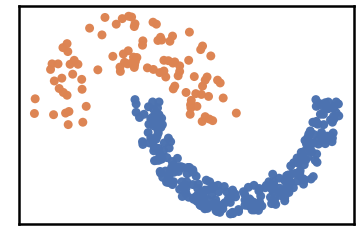
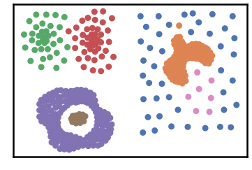
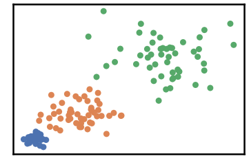
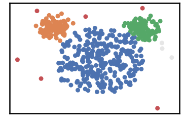

2D Shapes Datasets
---------------------

.. code:: python

    import pandas as pd
    import time
    import os.path
    
    import warnings
    warnings.filterwarnings('ignore')

.. code:: python

    # install DenMune clustering algorithm using pip command from the offecial Python repository, PyPi
    # from https://pypi.org/project/denmune/
    !pip install denmune
    
    # then import it
    from denmune import DenMune

.. code:: python

    # clone datasets from our repository datasets
    if not os.path.exists('datasets'):
      !git clone https://github.com/egy1st/datasets

.. parsed-literal::

    Cloning into 'datasets'...
    remote: Enumerating objects: 52, done.
    remote: Counting objects: 100% (52/52), done.
    remote: Compressing objects: 100% (43/43), done.
    remote: Total 52 (delta 8), reused 49 (delta 8), pack-reused 0
    Unpacking objects: 100% (52/52), done.
    Checking out files: 100% (20/20), done.

.. code:: python

    data_path = 'datasets/denmune/shapes/'  
    datasets = {"aggregation": 6, "jain": 15, "flame": 8, "compound": 13, "varydensity": 23,
                "unbalance": 8, "spiral": 6, "pathbased": 6, "mouse": 11}
    
    for dataset in datasets:
    
     
      data_file = data_path + dataset + '.csv'
      X_train = pd.read_csv(data_file, sep=',', header=None)
      y_train = X_train.iloc[:, -1]
      X_train = X_train.drop(X_train.columns[-1], axis=1)   
     
      print ("Dataset:", dataset)
      dm = DenMune(train_data=X_train,
                  train_truth=y_train,
                  k_nearest=datasets[dataset],
                  rgn_tsne=False)
    
      labels, validity = dm.fit_predict(show_noise=True, show_analyzer=True)

.. parsed-literal::

    Dataset: aggregation
    Plotting dataset Groundtruth

.. image:: images/2d_shapes/output_4_1.png

.. parsed-literal::

    Plotting train data

.. image:: images/2d_shapes/output_4_3.png

.. parsed-literal::

    Validating train data
    ├── exec_time
    │   ├── DenMune: 0.17
    │   ├── NGT: 0.016
    │   └── t_SNE: 0
    ├── n_clusters
    │   ├── actual: 7
    │   └── detected: 7
    ├── n_points
    │   ├── dim: 2
    │   ├── noise
    │   │   ├── type-1: 0
    │   │   └── type-2: 0
    │   ├── plot_size: 788
    │   ├── size: 788
    │   ├── strong: 492
    │   └── weak
    │       ├── all: 296
    │       ├── failed to merge: 0
    │       └── succeeded to merge: 296
    └── validity
        └── train
            ├── ACC: 785
            ├── AMI: 0.988
            ├── ARI: 0.993
            ├── F1: 0.996
            ├── NMI: 0.988
            ├── completeness: 0.987
            └── homogeneity: 0.989
    
    Dataset: jain
    Plotting dataset Groundtruth

.. parsed-literal::

    Plotting train data

.. image:: images/2d_shapes/output_4_7.png

.. parsed-literal::

    Validating train data
    ├── exec_time
    │   ├── DenMune: 0.097
    │   ├── NGT: 0.01
    │   └── t_SNE: 0
    ├── n_clusters
    │   ├── actual: 2
    │   └── detected: 2
    ├── n_points
    │   ├── dim: 2
    │   ├── noise
    │   │   ├── type-1: 0
    │   │   └── type-2: 0
    │   ├── plot_size: 373
    │   ├── size: 373
    │   ├── strong: 198
    │   └── weak
    │       ├── all: 175
    │       ├── failed to merge: 0
    │       └── succeeded to merge: 175
    └── validity
        └── train
            ├── ACC: 373
            ├── AMI: 1.0
            ├── ARI: 1.0
            ├── F1: 1.0
            ├── NMI: 1.0
            ├── completeness: 1.0
            └── homogeneity: 1.0
    
    Dataset: flame
    Plotting dataset Groundtruth

.. parsed-literal::

    Plotting train data

.. image:: images/2d_shapes/output_4_11.png

.. parsed-literal::

    Validating train data
    ├── exec_time
    │   ├── DenMune: 0.059
    │   ├── NGT: 0.01
    │   └── t_SNE: 0
    ├── n_clusters
    │   ├── actual: 2
    │   └── detected: 2
    ├── n_points
    │   ├── dim: 2
    │   ├── noise
    │   │   ├── type-1: 0
    │   │   └── type-2: 0
    │   ├── plot_size: 240
    │   ├── size: 240
    │   ├── strong: 150
    │   └── weak
    │       ├── all: 90
    │       ├── failed to merge: 0
    │       └── succeeded to merge: 90
    └── validity
        └── train
            ├── ACC: 240
            ├── AMI: 1.0
            ├── ARI: 1.0
            ├── F1: 1.0
            ├── NMI: 1.0
            ├── completeness: 1.0
            └── homogeneity: 1.0
    
    Dataset: compound
    Plotting dataset Groundtruth

.. image:: images/2d_shapes/output_4_13.png

.. parsed-literal::

    Plotting train data

.. parsed-literal::

    Validating train data
    ├── exec_time
    │   ├── DenMune: 0.077
    │   ├── NGT: 0.013
    │   └── t_SNE: 0
    ├── n_clusters
    │   ├── actual: 6
    │   └── detected: 7
    ├── n_points
    │   ├── dim: 2
    │   ├── noise
    │   │   ├── type-1: 0
    │   │   └── type-2: 0
    │   ├── plot_size: 399
    │   ├── size: 399
    │   ├── strong: 218
    │   └── weak
    │       ├── all: 181
    │       ├── failed to merge: 0
    │       └── succeeded to merge: 181
    └── validity
        └── train
            ├── ACC: 389
            ├── AMI: 0.96
            ├── ARI: 0.98
            ├── F1: 0.983
            ├── NMI: 0.961
            ├── completeness: 0.947
            └── homogeneity: 0.976
    
    Dataset: varydensity
    Plotting dataset Groundtruth

.. parsed-literal::

    Plotting train data

.. image:: images/2d_shapes/output_4_19.png

.. parsed-literal::

    Validating train data
    ├── exec_time
    │   ├── DenMune: 0.035
    │   ├── NGT: 0.004
    │   └── t_SNE: 0
    ├── n_clusters
    │   ├── actual: 3
    │   └── detected: 3
    ├── n_points
    │   ├── dim: 2
    │   ├── noise
    │   │   ├── type-1: 0
    │   │   └── type-2: 0
    │   ├── plot_size: 150
    │   ├── size: 150
    │   ├── strong: 76
    │   └── weak
    │       ├── all: 74
    │       ├── failed to merge: 0
    │       └── succeeded to merge: 74
    └── validity
        └── train
            ├── ACC: 150
            ├── AMI: 1.0
            ├── ARI: 1.0
            ├── F1: 1.0
            ├── NMI: 1.0
            ├── completeness: 1.0
            └── homogeneity: 1.0
    
    Dataset: unbalance
    Plotting dataset Groundtruth

.. parsed-literal::

    Plotting train data

.. parsed-literal::

    Validating train data
    ├── exec_time
    │   ├── DenMune: 1.028
    │   ├── NGT: 0.123
    │   └── t_SNE: 0
    ├── n_clusters
    │   ├── actual: 8
    │   └── detected: 91
    ├── n_points
    │   ├── dim: 2
    │   ├── noise
    │   │   ├── type-1: 21
    │   │   └── type-2: 127
    │   ├── plot_size: 6500
    │   ├── size: 6500
    │   ├── strong: 3910
    │   └── weak
    │       ├── all: 2590
    │       ├── failed to merge: 127
    │       └── succeeded to merge: 2463
    └── validity
        └── train
            ├── ACC: 2562
            ├── AMI: 0.534
            ├── ARI: 0.272
            ├── F1: 0.519
            ├── NMI: 0.542
            ├── completeness: 0.376
            └── homogeneity: 0.974
    
    Dataset: spiral
    Plotting dataset Groundtruth

.. parsed-literal::

    Plotting train data

.. parsed-literal::

    Validating train data
    ├── exec_time
    │   ├── DenMune: 0.036
    │   ├── NGT: 0.003
    │   └── t_SNE: 0
    ├── n_clusters
    │   ├── actual: 3
    │   └── detected: 4
    ├── n_points
    │   ├── dim: 2
    │   ├── noise
    │   │   ├── type-1: 0
    │   │   └── type-2: 0
    │   ├── plot_size: 312
    │   ├── size: 312
    │   ├── strong: 285
    │   └── weak
    │       ├── all: 27
    │       ├── failed to merge: 0
    │       └── succeeded to merge: 27
    └── validity
        └── train
            ├── ACC: 293
            ├── AMI: 0.932
            ├── ARI: 0.922
            ├── F1: 0.967
            ├── NMI: 0.932
            ├── completeness: 0.873
            └── homogeneity: 1.0
    
    Dataset: pathbased
    Plotting dataset Groundtruth

.. image:: images/2d_shapes/output_4_29.png

.. parsed-literal::

    Plotting train data

.. parsed-literal::

    Validating train data
    ├── exec_time
    │   ├── DenMune: 0.072
    │   ├── NGT: 0.007
    │   └── t_SNE: 0
    ├── n_clusters
    │   ├── actual: 3
    │   └── detected: 3
    ├── n_points
    │   ├── dim: 2
    │   ├── noise
    │   │   ├── type-1: 1
    │   │   └── type-2: 11
    │   ├── plot_size: 300
    │   ├── size: 300
    │   ├── strong: 198
    │   └── weak
    │       ├── all: 102
    │       ├── failed to merge: 11
    │       └── succeeded to merge: 91
    └── validity
        └── train
            ├── ACC: 286
            ├── AMI: 0.889
            ├── ARI: 0.924
            ├── F1: 0.972
            ├── NMI: 0.89
            ├── completeness: 0.842
            └── homogeneity: 0.943
    
    Dataset: mouse
    Plotting dataset Groundtruth

.. parsed-literal::

    Plotting train data

.. parsed-literal::

    Validating train data
    ├── exec_time
    │   ├── DenMune: 0.082
    │   ├── NGT: 0.015
    │   └── t_SNE: 0
    ├── n_clusters
    │   ├── actual: 4
    │   └── detected: 4
    ├── n_points
    │   ├── dim: 2
    │   ├── noise
    │   │   ├── type-1: 0
    │   │   └── type-2: 3
    │   ├── plot_size: 500
    │   ├── size: 500
    │   ├── strong: 302
    │   └── weak
    │       ├── all: 198
    │       ├── failed to merge: 3
    │       └── succeeded to merge: 195
    └── validity
        └── train
            ├── ACC: 492
            ├── AMI: 0.949
            ├── ARI: 0.972
            ├── F1: 0.986
            ├── NMI: 0.949
            ├── completeness: 0.95
            └── homogeneity: 0.948
    

