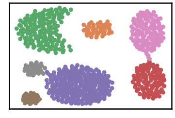
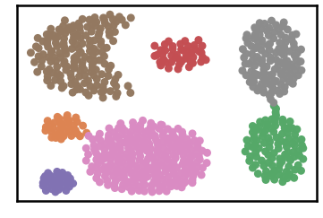

Aggregation Dataset
=====================

.. code:: ipython3

    import time
    import os.path
    import requests
    from numpy import genfromtxt
    !mkdir data #let us create data folder to hold our data

.. code:: ipython3

    # install DenMune clustering algorithm using pip command from the offecial Python repository, PyPi
    # from https://pypi.org/project/denmune/
    !pip install denmune
    
    # now import it
    from denmune import DenMune

.. code:: ipython3

    
    dataset = 'aggregation' # let us take Aggregation dataset as an example
    
    url = "https://zerobytes.one/denmune_data/"
    file_ext = ".txt"
    ground_ext = "-gt"
    
    dataset_url = url + dataset + file_ext
    groundtruth_url = url + dataset + ground_ext  + file_ext
    
    data_path = 'data/' # change it to whatever you put your data, set it to ''; so it will retrive from current folder
    data_file = data_path + dataset + file_ext #  i.e. 'iris' + '.txt' ==> iris.txt
    
    if  not os.path.isfile(data_path + dataset + file_ext):
        req = requests.get(dataset_url)
        with open(data_path + dataset + file_ext, 'wb') as f:
            f.write(req.content)
    data = genfromtxt(data_file , delimiter='\t') 
            
    if  not os.path.isfile(data_path + dataset + ground_ext + file_ext):
        req = requests.get(groundtruth_url)
        with open(data_path + dataset +  ground_ext + file_ext, 'wb') as f:
            f.write(req.content)    
    data_labels =  genfromtxt(groundtruth_url , delimiter='\t') #  i.e. 'iris' + + '-gt + '.txt' ==> iris-gt.txt          

.. code:: ipython3

    # Denmune's Paramaters
    verpose_mode = True # view in-depth analysis of time complexity and outlier detection, num of clusters
    show_groundtrugh = True  # show plots on/off
    show_noise = True # show noise and outlier on/off
    
    knn = 6
    dm = DenMune(data=data,  k_nearest=knn, verpose=verpose_mode, show_noise=show_noise, rgn_tsne=False, )
    labels_pred = dm.fit_predict()
    
    if show_groundtrugh:
        # Let us plot the groundtruth of this dataset
        print (dataset, "dataset: Groundtruht")
        dm.plot_clusters(labels=data_labels, ground=True)
        print('\n', "=====" * 20 , '\n')       
    
    # Let us plot the results produced using DenMune
    print (dataset, "dataset: DenMune Clustering")
    dm.plot_clusters(labels=labels_pred, show_noise=show_noise)
    
    validity = dm.validate_Clusters(labels_true=data_labels, labels_pred=labels_pred)
    validity_key = "F1" 
    # Acc=1, F1-score=2,  NMI=3, AMI=4, ARI=5,  Homogeneity=6, and Completeness=7       
    print ('k=' , knn, validity_key , 'score is:', round(validity[validity_key],3))

.. parsed-literal::

    aggregation dataset: Groundtruht

.. parsed-literal::

    
     ==================================================================================================== 
    
    aggregation dataset: DenMune Clustering

.. parsed-literal::

    DenMune Analyzer
    ├── exec_time
    │   ├── DenMune: 0.054
    │   └── NGT: 0.007
    ├── n_clusters
    │   ├── actual: 7
    │   └── detected: 7
    ├── n_points
    │   ├── dim: 2
    │   ├── noise
    │   │   ├── type-1: 0
    │   │   └── type-2: 0
    │   ├── size: 788
    │   ├── strong: 492
    │   └── weak
    │       ├── all: 296
    │       ├── failed to merge: 0
    │       └── succeeded to merge: 296
    └── validity
        ├── ACC: 785
        ├── AMI: 0.988
        ├── ARI: 0.993
        ├── F1: 0.996
        ├── NMI: 0.988
        ├── completeness: 0.987
        └── homogeneity: 0.989
    
    k= 6 F1 score is: 0.996

