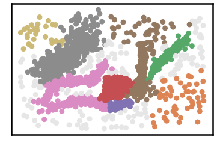

Clusterable Dataset
=========================

.. code:: ipython3

    import time
    import os.path
    import requests
    from numpy import genfromtxt
    !mkdir data #let us create data folder to hold our data

.. code:: ipython3

    # install DenMune clustering algorithm using pip command from the offecial Python repository, PyPi
    # from https://pypi.org/project/denmune/
    !pip install denmune
    
    # now import it
    from denmune import DenMune

.. code:: ipython3

    dataset = 'clusterable' # let us take Aggregation dataset as an example
    
    url = "https://zerobytes.one/denmune_data/"
    file_ext = ".txt"
    
    dataset_url = url + dataset + file_ext
    
    data_path = 'data/' # change it to whatever you put your data, set it to ''; so it will retrive from current folder
    data_file = data_path + dataset + file_ext #  i.e. 'iris' + '.txt' ==> iris.txt
    
    if  not os.path.isfile(data_path + dataset + file_ext):
        req = requests.get(dataset_url)
        with open(data_path + dataset + file_ext, 'wb') as f:
            f.write(req.content)
    data = genfromtxt(data_file , delimiter='\t')    

.. code:: ipython3

    # Denmune's Paramaters
    verpose_mode = True # view in-depth analysis of time complexity and outlier detection, num of clusters
    show_noise = True # show noise and outlier on/off
    
    knn = 24
    dm = DenMune(data=data,  k_nearest=knn, verpose=verpose_mode, show_noise=show_noise, rgn_tsne=False, )
    labels_pred = dm.fit_predict()
    
    # Let us plot the results produced using DenMune
    print (dataset, "dataset: DenMune Clustering")
    dm.plot_clusters(labels=labels_pred, show_noise=show_noise)

.. parsed-literal::

    clusterable dataset: DenMune Clustering

.. parsed-literal::

    0

