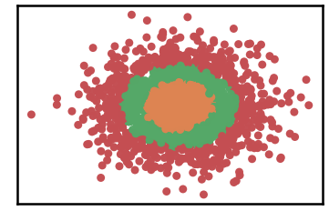
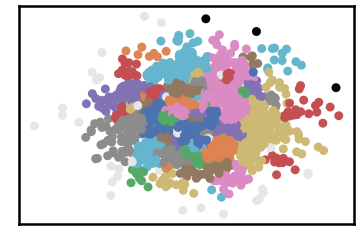

Make Gaussian Quantiles Dataset
===================================

.. code:: ipython3

    import time
    import os.path
    import requests
    from numpy import genfromtxt
    from sklearn.datasets import make_moons, make_circles, make_classification, make_gaussian_quantiles
    import pandas as pd
    !mkdir data #let us create data folder to hold our data

.. code:: ipython3

    # install DenMune clustering algorithm using pip command from the offecial Python repository, PyPi
    # from https://pypi.org/project/denmune/
    !pip install denmune
    
    # now import it
    from denmune import DenMune

.. code:: ipython3

    X, y =make_gaussian_quantiles(n_samples=2000, n_features=2, n_classes=3)
    pd.DataFrame(X).head()

.. raw:: html

    
      

        

          

    
    <table border="1" class="dataframe">
      <thead>
        <tr style="text-align: right;">
          <th></th>
          <th>0</th>
          <th>1</th>
        </tr>
      </thead>
      <tbody>
        <tr>
          <th>0</th>
          <td>0.447079</td>
          <td>2.547967</td>
        </tr>
        <tr>
          <th>1</th>
          <td>-1.125597</td>
          <td>1.488687</td>
        </tr>
        <tr>
          <th>2</th>
          <td>-0.470447</td>
          <td>1.740964</td>
        </tr>
        <tr>
          <th>3</th>
          <td>1.098492</td>
          <td>2.004093</td>
        </tr>
        <tr>
          <th>4</th>
          <td>0.463150</td>
          <td>0.056207</td>
        </tr>
      </tbody>
    </table>
    

          <button class="colab-df-convert" onclick="convertToInteractive('df-2c7f0da1-4bab-424b-988e-d8c939a8a288')"
                  title="Convert this dataframe to an interactive table."
                  style="display:none;">
    
      <svg xmlns="http://www.w3.org/2000/svg" height="24px"viewBox="0 0 24 24"
           width="24px">
        <path d="M0 0h24v24H0V0z" fill="none"/>
        <path d="M18.56 5.44l.94 2.06.94-2.06 2.06-.94-2.06-.94-.94-2.06-.94 2.06-2.06.94zm-11 1L8.5 8.5l.94-2.06 2.06-.94-2.06-.94L8.5 2.5l-.94 2.06-2.06.94zm10 10l.94 2.06.94-2.06 2.06-.94-2.06-.94-.94-2.06-.94 2.06-2.06.94z"/><path d="M17.41 7.96l-1.37-1.37c-.4-.4-.92-.59-1.43-.59-.52 0-1.04.2-1.43.59L10.3 9.45l-7.72 7.72c-.78.78-.78 2.05 0 2.83L4 21.41c.39.39.9.59 1.41.59.51 0 1.02-.2 1.41-.59l7.78-7.78 2.81-2.81c.8-.78.8-2.07 0-2.86zM5.41 20L4 18.59l7.72-7.72 1.47 1.35L5.41 20z"/>
      </svg>
          </button>
    
      
    
          
        

      

.. code:: ipython3

    data = X
    data_labels = y
    #file_2d = 'data/classification-2d.txt'

.. code:: ipython3

    # Denmune's Paramaters
    verpose_mode = True # view in-depth analysis of time complexity and outlier detection, num of clusters
    show_groundtrugh = True  # show plots on/off
    show_noise = True # show noise and outlier on/off
    
    knn = 6
    dm = DenMune(data=data,  file_2d=file_2d, k_nearest=knn, verpose=verpose_mode, show_noise=show_noise, rgn_tsne=True )
    labels_pred = dm.fit_predict()
    
    if show_groundtrugh:
        # Let us plot the groundtruth of this dataset
        print ("classification dataset", ": Groundtruht")
        dm.plot_clusters(labels=data_labels, ground=True)
        print('\n', "=====" * 20 , '\n')       
    
    # Let us plot the results produced using DenMune
    print ("classification dataset", ": DenMune Clustering")
    dm.plot_clusters(labels=labels_pred, show_noise=show_noise)
    
    validity = dm.validate_Clusters(labels_true=data_labels, labels_pred=labels_pred)
    validity_key = "F1" 
    # Acc=1, F1-score=2,  NMI=3, AMI=4, ARI=5,  Homogeneity=6, and Completeness=7       
    print ('k=' , knn, validity_key , 'score is:', round(validity[validity_key],3))

.. parsed-literal::

    classification dataset : Groundtruht

.. parsed-literal::

    
     ==================================================================================================== 
    
    classification dataset : DenMune Clustering

.. parsed-literal::

    DenMune Analyzer
    ├── exec_time
    │   ├── DenMune: 0.261
    │   └── NGT: 0.027
    ├── n_clusters
    │   ├── actual: 3
    │   └── detected: 60
    ├── n_points
    │   ├── dim: 2
    │   ├── noise
    │   │   ├── type-1: 3
    │   │   └── type-2: 58
    │   ├── size: 2000
    │   ├── strong: 1194
    │   └── weak
    │       ├── all: 806
    │       ├── failed to merge: 58
    │       └── succeeded to merge: 748
    └── validity
        ├── ACC: 1511
        ├── AMI: 0.475
        ├── ARI: 0.463
        ├── F1: 0.764
        ├── NMI: 0.477
        ├── completeness: 0.454
        └── homogeneity: 0.503
    
    k= 6 F1 score is: 0.764

