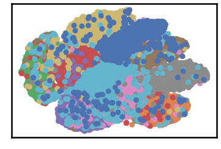
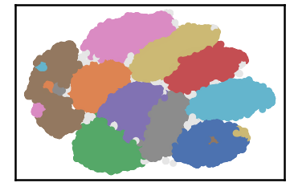

MNIST Dataset
================

.. code:: ipython3

    import time
    import os.path
    import requests
    from numpy import genfromtxt
    !mkdir data #let us create data folder to hold our data

.. code:: ipython3

    # install datasets/mnist/datasets/mnist/output_3_3 clustering algorithm using pip command from the offecial Python repository, PyPi
    # from https://pypi.org/project/datasets/mnist/datasets/mnist/output_3_3/
    !pip install datasets/mnist/datasets/mnist/output_3_3
    
    # now import it
    from datasets/mnist/datasets/mnist/output_3_3 import datasets/mnist/datasets/mnist/output_3_3

.. code:: ipython3

    dataset = 'mnist' # let us take iris dataset as an example
    
    url = "https://zerobytes.one/datasets/mnist/datasets/mnist/output_3_3_data/"
    file_ext = ".txt"
    ground_ext = "-gt"
    
    
    dataset_url = url + dataset + file_ext
    groundtruth_url = url + dataset + ground_ext  + file_ext
    
    data_path = 'data/' # change it to whatever you put your data, set it to ''; so it will retrive from current folder
    data_file = data_path + dataset + file_ext #  i.e. 'iris' + '.txt' ==> iris.txt
    
    data_path = 'data/' # change it to whatever you put your data, set it to ''; so it will retrive from current folder
    if  not os.path.isfile(data_path + dataset + file_ext):
        req = requests.get(dataset_url)
        with open(data_path + dataset + file_ext, 'wb') as f:
            f.write(req.content)
    data = genfromtxt(data_file , delimiter='\t') 
    
    if  not os.path.isfile(data_path + dataset + ground_ext + file_ext):
        req = requests.get(groundtruth_url)
        with open(data_path + dataset +  ground_ext + file_ext, 'wb') as f:
            f.write(req.content)    
    data_labels =  genfromtxt(groundtruth_url , delimiter='\t') #  i.e. 'iris' + + '-gt + '.txt' ==> iris-gt.txt 
    
    data2d_ext = '-2d'
    file_2d =  data_path + dataset + data2d_ext + file_ext # 'iris' + '-2d' + '.txt' ==> iris-2d.txt

.. code:: ipython3

    # datasets/mnist/datasets/mnist/output_3_3's Paramaters
    verpose_mode = True # view in-depth analysis of time complexity and outlier detection, num of clusters
    show_groundtrugh = True  # show plots on/off
    show_noise = True # show noise and outlier on/off
    
    knn = 60
    dm = datasets/mnist/datasets/mnist/output_3_3(data=data, file_2d=file_2d,  k_nearest=knn, verpose=verpose_mode, show_noise=show_noise, rgn_tsne=False)
    
    if show_groundtrugh:
        # Let us plot the groundtruth of this dataset which is reduced to 2-d using t-SNE
        print ("Dataset\'s Groundtruth")
        dm.plot_clusters(labels=data_labels, ground=True)
        print('\n', "=====" * 20 , '\n')       
    
    labels_pred = dm.fit_predict()
    validity = dm.validate_Clusters(labels_true=data_labels, labels_pred=labels_pred)
    
    dm.plot_clusters(labels=labels_pred, show_noise=show_noise)
            
    validity_key = "F1"
    # Acc=1, F1-score=2,  NMI=3, AMI=4, ARI=5,  Homogeneity=6, and Completeness=7       
    print ('k=' , knn, validity_key , 'score is:', round(validity[validity_key],3))

.. parsed-literal::

    /usr/local/lib/python3.7/dist-packages/sklearn/manifold/_t_sne.py:793: FutureWarning: The default learning rate in TSNE will change from 200.0 to 'auto' in 1.2.
      FutureWarning,

.. parsed-literal::

    Dataset's Groundtruth

.. parsed-literal::

    
     ==================================================================================================== 
    
    datasets/mnist/datasets/mnist/output_3_3 Analyzer
    ├── exec_time
    │   ├── datasets/mnist/datasets/mnist/output_3_3: 124.51
    │   ├── NGT: 6.843
    │   └── t_SNE: 1158.965
    ├── n_clusters
    │   ├── actual: 10
    │   └── detected: 9
    ├── n_points
    │   ├── dim: 784
    │   ├── noise
    │   │   ├── type-1: 0
    │   │   └── type-2: 6903
    │   ├── size: 70000
    │   ├── strong: 37527
    │   └── weak
    │       ├── all: 32473
    │       ├── failed to merge: 6903
    │       └── succeeded to merge: 25570
    └── validity
        ├── ACC: 66249
        ├── AMI: 0.895
        ├── ARI: 0.909
        ├── F1: 0.958
        ├── NMI: 0.895
        ├── completeness: 0.874
        └── homogeneity: 0.917
    

.. parsed-literal::

    k= 60 F1 score is: 0.958

