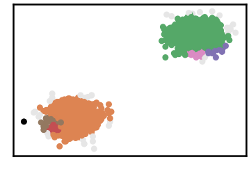
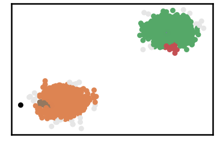
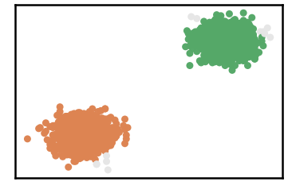
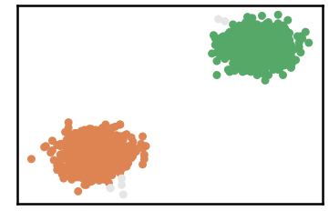
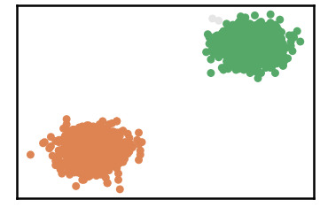
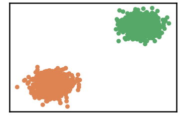

G2-2-10 Dataset
=================

.. code:: ipython3

    import time
    import os.path
    import requests
    import pandas as pd

.. code:: ipython3

    # install DenMune clustering algorithm using pip command from the offecial Python repository, PyPi
    # from https://pypi.org/project/denmune/
    !pip install denmune
    
    # now import it
    from denmune import DenMune

.. code:: ipython3

    dataset = 'g2-2-10' # let us take G2-2-10 dataset as an example
    
    url = "https://zerobytes.one/denmune_data/"
    file_ext = ".txt"
    ground_ext = "-gt"
    
    dataset_url = url + dataset + file_ext
    groundtruth_url = url + dataset + ground_ext  + file_ext
    
    data_path = 'data/' # change it to whatever you put your data, set it to ''; so it will retrive from current folder
    if  not os.path.isfile(data_path + dataset + file_ext):
        req = requests.get(dataset_url)
        with open(data_path + dataset + file_ext, 'wb') as f:
            f.write(req.content)
            
    if  not os.path.isfile(data_path + dataset + ground_ext + file_ext):
        req = requests.get(groundtruth_url)
        with open(data_path + dataset +  ground_ext + file_ext, 'wb') as f:
            f.write(req.content)       

.. code:: ipython3

    # Denmune's Paramaters
    # DenMune(dataset=dataset, k_nearest=n, data_path=data_path, verpose=verpose_mode, show_plot=show_plot, show_noise=show_noise)
    verpose_mode = True # view in-depth analysis of time complexity and outlier detection, num of clusters
    show_plot = True  # show plots on/off
    show_noise = True # show noise and outlier on/off
    
    # loop's parameters
    start = 5
    step = 5
    end=55
    
    # Validity indexes' parameters
    validity_val = -1
    best_k = 0
    best_val = -1
    
    validity_idx = 2 # Acc=1, F1-score=2,  NMI=3, AMI=4, ARI=5,  Homogeneity=6, and Completeness=7
    df = pd.DataFrame(columns =['K', 'ACC', 'F1', 'NMI', 'AMI', 'ARI','Homogeneity', 'Completeness', 'Time' ])
    
    
    for n in range(start, end+1, step):
        start_time = time.time()
        dm = DenMune(dataset=dataset, k_nearest=n, data_path=data_path, verpose=verpose_mode, show_noise=show_noise)
        labels_true, labels_pred = dm.output_Clusters()
        if show_plot == True and n==start:
            # Let us plot the groundtruth of this dataset which is reduced to 2-d using t-SNE
            print ("Dataset\'s Groundtruht")
            dm.plot_clusters(labels_true, ground=True)
            print('\n', "=====" * 20 , '\n')       
                   
        end_time = time.time()
        
        validity_indexes = dm.validate_Clusters(labels_true, labels_pred)
        validity_val = validity_indexes[validity_idx]
        validity_indexes[0] = n
        validity_indexes[8] = end_time - start_time
        
        df = df.append(pd.Series(validity_indexes, index=df.columns ), ignore_index=True)
        
        if (best_val < validity_val):
            best_val = validity_val
            best_k = n
            # Let us show results where only an improve in accuracy is detected
        if show_plot:
                dm.plot_clusters(labels_pred, show_noise=show_noise)
        print ('k=' , n, ':Validity score is:', validity_val , 'but best score is', best_val, 'at k=', best_k , end='     ')
                
        if not verpose_mode:
            print('\r', end='')
        else:
            print('\n', "=====" * 20 , '\n')

.. parsed-literal::

    using NGT, Proximity matrix has been calculated  in:  0.02620697021484375  seconds
    Dataset's Groundtruht

.. image:: datasets/g2-2-10/output_3_1.png

.. parsed-literal::

    
     ==================================================================================================== 
    
    There are 26 outlier point(s) in black (noise of type-1) represent 1% of total points
    There are 123 weak point(s) in light grey (noise of type-2) represent 6% of total points
    DenMune detected 99 clusters 
    

.. image:: datasets/g2-2-10/output_3_3.png

.. parsed-literal::

    k= 5 :Validity score is: 0.27163026014425873 but best score is 0.27163026014425873 at k= 5     
     ==================================================================================================== 
    
    using NGT, Proximity matrix has been calculated  in:  0.05127263069152832  seconds
    There are 1 outlier point(s) in black (noise of type-1) represent 0% of total points
    There are 38 weak point(s) in light grey (noise of type-2) represent 2% of total points
    DenMune detected 6 clusters 
    

.. parsed-literal::

    k= 10 :Validity score is: 0.9629207237402133 but best score is 0.9629207237402133 at k= 10     
     ==================================================================================================== 
    
    using NGT, Proximity matrix has been calculated  in:  0.057437896728515625  seconds
    There are 1 outlier point(s) in black (noise of type-1) represent 0% of total points
    There are 37 weak point(s) in light grey (noise of type-2) represent 2% of total points
    DenMune detected 5 clusters 
    

.. parsed-literal::

    k= 15 :Validity score is: 0.9767137185355605 but best score is 0.9767137185355605 at k= 15     
     ==================================================================================================== 
    
    using NGT, Proximity matrix has been calculated  in:  0.05525326728820801  seconds
    There are 0 outlier point(s) in black (noise of type-1) represent 0% of total points
    There are 19 weak point(s) in light grey (noise of type-2) represent 1% of total points
    DenMune detected 2 clusters 
    

.. parsed-literal::

    k= 20 :Validity score is: 0.9953381995227502 but best score is 0.9953381995227502 at k= 20     
     ==================================================================================================== 
    
    using NGT, Proximity matrix has been calculated  in:  0.15114259719848633  seconds
    There are 0 outlier point(s) in black (noise of type-1) represent 0% of total points
    There are 12 weak point(s) in light grey (noise of type-2) represent 1% of total points
    DenMune detected 2 clusters 
    

.. parsed-literal::

    k= 25 :Validity score is: 0.9970614636851063 but best score is 0.9970614636851063 at k= 25     
     ==================================================================================================== 
    
    using NGT, Proximity matrix has been calculated  in:  0.09525060653686523  seconds
    There are 0 outlier point(s) in black (noise of type-1) represent 0% of total points
    There are 7 weak point(s) in light grey (noise of type-2) represent 0% of total points
    DenMune detected 2 clusters 
    

.. image:: datasets/g2-2-10/output_3_13.png

.. parsed-literal::

    k= 30 :Validity score is: 0.9982875507957218 but best score is 0.9982875507957218 at k= 30     
     ==================================================================================================== 
    
    using NGT, Proximity matrix has been calculated  in:  0.07119083404541016  seconds
    There are 0 outlier point(s) in black (noise of type-1) represent 0% of total points
    There are 7 weak point(s) in light grey (noise of type-2) represent 0% of total points
    DenMune detected 2 clusters 
    

.. parsed-literal::

    k= 35 :Validity score is: 0.9982875507957218 but best score is 0.9982875507957218 at k= 30     
     ==================================================================================================== 
    
    using NGT, Proximity matrix has been calculated  in:  0.10254549980163574  seconds
    There are 0 outlier point(s) in black (noise of type-1) represent 0% of total points
    There are 7 weak point(s) in light grey (noise of type-2) represent 0% of total points
    DenMune detected 2 clusters 
    

.. parsed-literal::

    k= 40 :Validity score is: 0.9982875507957218 but best score is 0.9982875507957218 at k= 30     
     ==================================================================================================== 
    
    using NGT, Proximity matrix has been calculated  in:  0.11093783378601074  seconds
    There are 0 outlier point(s) in black (noise of type-1) represent 0% of total points
    There are 2 weak point(s) in light grey (noise of type-2) represent 0% of total points
    DenMune detected 2 clusters 
    

.. parsed-literal::

    k= 45 :Validity score is: 0.9995112414467253 but best score is 0.9995112414467253 at k= 45     
     ==================================================================================================== 
    
    using NGT, Proximity matrix has been calculated  in:  0.10842418670654297  seconds
    There are 0 outlier point(s) in black (noise of type-1) represent 0% of total points
    There are 2 weak point(s) in light grey (noise of type-2) represent 0% of total points
    DenMune detected 2 clusters 
    

.. parsed-literal::

    k= 50 :Validity score is: 0.9995112414467253 but best score is 0.9995112414467253 at k= 45     
     ==================================================================================================== 
    
    using NGT, Proximity matrix has been calculated  in:  0.09409642219543457  seconds
    There are 0 outlier point(s) in black (noise of type-1) represent 0% of total points
    There are 0 weak point(s) in light grey (noise of type-2) represent 0% of total points
    DenMune detected 2 clusters 
    

.. parsed-literal::

    k= 55 :Validity score is: 1.0 but best score is 1.0 at k= 55     
     ==================================================================================================== 
    

.. parsed-literal::

    <Figure size 432x288 with 0 Axes>

.. code:: ipython3

    # It is time to save the results
    results_path = 'results/'  # change it to whatever you output results to, set it to ''; so it will output to current folder
    para_file = 'denmune'+ '_para_'  + dataset + '.csv'
    df.sort_values(by=['F1', 'NMI', 'ARI'] , ascending=False, inplace=True)   
    df.to_csv(results_path + para_file, index=False, sep='\t', header=True)

.. code:: ipython3

    df # it is sorted now and saved

.. raw:: html

    

    
    <table border="1" class="dataframe">
      <thead>
        <tr style="text-align: right;">
          <th></th>
          <th>K</th>
          <th>ACC</th>
          <th>F1</th>
          <th>NMI</th>
          <th>AMI</th>
          <th>ARI</th>
          <th>Homogeneity</th>
          <th>Completeness</th>
          <th>Time</th>
        </tr>
      </thead>
      <tbody>
        <tr>
          <th>10</th>
          <td>55.0</td>
          <td>2048.0</td>
          <td>1.000000</td>
          <td>1.000000</td>
          <td>1.000000</td>
          <td>1.000000</td>
          <td>1.000000</td>
          <td>1.000000</td>
          <td>2.793306</td>
        </tr>
        <tr>
          <th>8</th>
          <td>45.0</td>
          <td>2046.0</td>
          <td>0.999511</td>
          <td>0.994928</td>
          <td>0.994923</td>
          <td>0.998050</td>
          <td>1.000000</td>
          <td>0.989906</td>
          <td>2.074476</td>
        </tr>
        <tr>
          <th>9</th>
          <td>50.0</td>
          <td>2046.0</td>
          <td>0.999511</td>
          <td>0.994928</td>
          <td>0.994923</td>
          <td>0.998050</td>
          <td>1.000000</td>
          <td>0.989906</td>
          <td>2.247880</td>
        </tr>
        <tr>
          <th>5</th>
          <td>30.0</td>
          <td>2041.0</td>
          <td>0.998288</td>
          <td>0.982555</td>
          <td>0.982542</td>
          <td>0.993179</td>
          <td>0.997050</td>
          <td>0.968475</td>
          <td>1.202561</td>
        </tr>
        <tr>
          <th>6</th>
          <td>35.0</td>
          <td>2041.0</td>
          <td>0.998288</td>
          <td>0.982555</td>
          <td>0.982542</td>
          <td>0.993179</td>
          <td>0.997050</td>
          <td>0.968475</td>
          <td>1.512105</td>
        </tr>
        <tr>
          <th>7</th>
          <td>40.0</td>
          <td>2041.0</td>
          <td>0.998288</td>
          <td>0.982555</td>
          <td>0.982542</td>
          <td>0.993179</td>
          <td>0.997050</td>
          <td>0.968475</td>
          <td>1.669844</td>
        </tr>
        <tr>
          <th>4</th>
          <td>25.0</td>
          <td>2036.0</td>
          <td>0.997061</td>
          <td>0.971897</td>
          <td>0.971877</td>
          <td>0.988313</td>
          <td>0.994259</td>
          <td>0.950520</td>
          <td>1.072540</td>
        </tr>
        <tr>
          <th>3</th>
          <td>20.0</td>
          <td>2029.0</td>
          <td>0.995338</td>
          <td>0.959211</td>
          <td>0.959182</td>
          <td>0.981540</td>
          <td>0.991192</td>
          <td>0.929229</td>
          <td>0.716110</td>
        </tr>
        <tr>
          <th>2</th>
          <td>15.0</td>
          <td>1955.0</td>
          <td>0.976714</td>
          <td>0.854581</td>
          <td>0.854286</td>
          <td>0.912180</td>
          <td>0.983577</td>
          <td>0.755497</td>
          <td>0.592301</td>
        </tr>
        <tr>
          <th>1</th>
          <td>10.0</td>
          <td>1902.0</td>
          <td>0.962921</td>
          <td>0.797888</td>
          <td>0.797454</td>
          <td>0.864436</td>
          <td>0.982043</td>
          <td>0.671893</td>
          <td>0.319634</td>
        </tr>
        <tr>
          <th>0</th>
          <td>5.0</td>
          <td>322.0</td>
          <td>0.271630</td>
          <td>0.271117</td>
          <td>0.262846</td>
          <td>0.048493</td>
          <td>0.928776</td>
          <td>0.158725</td>
          <td>0.445858</td>
        </tr>
      </tbody>
    </table>
    

