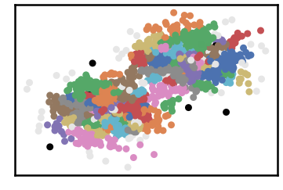
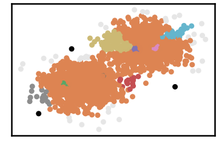
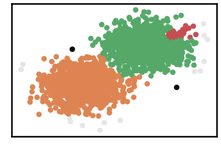
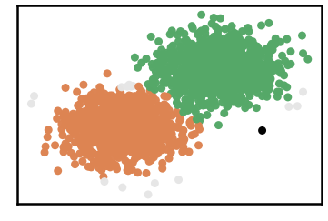
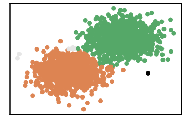
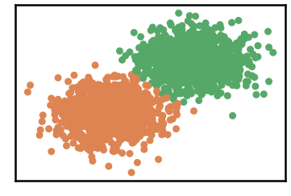

G2-2-10 Dataset
=================

.. code:: ipython3

    import time
    import os.path
    import requests
    import pandas as pd

.. code:: ipython3

    # install DenMune clustering algorithm using pip command from the offecial Python repository, PyPi
    # from https://pypi.org/project/denmune/
    !pip install denmune
    
    # now import it
    from denmune import DenMune

.. code:: ipython3

    dataset = 'g2-2-30' # let us take G2-2-30 dataset as an example
    
    url = "https://zerobytes.one/denmune_data/"
    file_ext = ".txt"
    ground_ext = "-gt"
    
    dataset_url = url + dataset + file_ext
    groundtruth_url = url + dataset + ground_ext  + file_ext
    
    data_path = 'data/' # change it to whatever you put your data, set it to ''; so it will retrive from current folder
    if  not os.path.isfile(data_path + dataset + file_ext):
        req = requests.get(dataset_url)
        with open(data_path + dataset + file_ext, 'wb') as f:
            f.write(req.content)
            
    if  not os.path.isfile(data_path + dataset + ground_ext + file_ext):
        req = requests.get(groundtruth_url)
        with open(data_path + dataset +  ground_ext + file_ext, 'wb') as f:
            f.write(req.content)       

.. code:: ipython3

    # Denmune's Paramaters
    # DenMune(dataset=dataset, k_nearest=n, data_path=data_path, verpose=verpose_mode, show_plot=show_plot, show_noise=show_noise)
    verpose_mode = True # view in-depth analysis of time complexity and outlier detection, num of clusters
    show_plot = True  # show plots on/off
    show_noise = True # show noise and outlier on/off
    
    # loop's parameters
    start = 5
    step = 5
    end=50
    
    # Validity indexes' parameters
    validity_val = -1
    best_k = 0
    best_val = -1
    
    validity_idx = 2 # Acc=1, F1-score=2,  NMI=3, AMI=4, ARI=5,  Homogeneity=6, and Completeness=7
    df = pd.DataFrame(columns =['K', 'ACC', 'F1', 'NMI', 'AMI', 'ARI','Homogeneity', 'Completeness', 'Time' ])
    
    
    for n in range(start, end+1, step):
        start_time = time.time()
        dm = DenMune(dataset=dataset, k_nearest=n, data_path=data_path, verpose=verpose_mode, show_noise=show_noise)
        labels_true, labels_pred = dm.output_Clusters()
        if show_plot == True and n==start:
            # Let us plot the groundtruth of this dataset which is reduced to 2-d using t-SNE
            print ("Dataset\'s Groundtruht")
            dm.plot_clusters(labels_true, ground=True)
            print('\n', "=====" * 20 , '\n')       
                   
        end_time = time.time()
        
        validity_indexes = dm.validate_Clusters(labels_true, labels_pred)
        validity_val = validity_indexes[validity_idx]
        validity_indexes[0] = n
        validity_indexes[8] = end_time - start_time
        
        df = df.append(pd.Series(validity_indexes, index=df.columns ), ignore_index=True)
        
        if (best_val < validity_val):
            best_val = validity_val
            best_k = n
            # Let us show results where only an improve in accuracy is detected
        if show_plot:
                dm.plot_clusters(labels_pred, show_noise=show_noise)
        print ('k=' , n, ':Validity score is:', validity_val , 'but best score is', best_val, 'at k=', best_k , end='     ')
                
        if not verpose_mode:
            print('\r', end='')
        else:
            print('\n', "=====" * 20 , '\n')

.. parsed-literal::

    using NGT, Proximity matrix has been calculated  in:  0.030940771102905273  seconds
    Dataset's Groundtruht

.. parsed-literal::

    
     ==================================================================================================== 
    
    There are 7 outlier point(s) in black (noise of type-1) represent 0% of total points
    There are 90 weak point(s) in light grey (noise of type-2) represent 4% of total points
    DenMune detected 91 clusters 
    

.. parsed-literal::

    k= 5 :Validity score is: 0.19606719072103052 but best score is 0.19606719072103052 at k= 5     
     ==================================================================================================== 
    
    using NGT, Proximity matrix has been calculated  in:  0.05861067771911621  seconds
    There are 3 outlier point(s) in black (noise of type-1) represent 0% of total points
    There are 39 weak point(s) in light grey (noise of type-2) represent 2% of total points
    DenMune detected 9 clusters 
    

.. parsed-literal::

    k= 10 :Validity score is: 0.34334763948497854 but best score is 0.34334763948497854 at k= 10     
     ==================================================================================================== 
    
    using NGT, Proximity matrix has been calculated  in:  0.042825937271118164  seconds
    There are 2 outlier point(s) in black (noise of type-1) represent 0% of total points
    There are 14 weak point(s) in light grey (noise of type-2) represent 1% of total points
    DenMune detected 3 clusters 
    

.. parsed-literal::

    k= 15 :Validity score is: 0.9786273589021381 but best score is 0.9786273589021381 at k= 15     
     ==================================================================================================== 
    
    using NGT, Proximity matrix has been calculated  in:  0.04987621307373047  seconds
    There are 1 outlier point(s) in black (noise of type-1) represent 0% of total points
    There are 15 weak point(s) in light grey (noise of type-2) represent 1% of total points
    DenMune detected 2 clusters 
    

.. parsed-literal::

    k= 20 :Validity score is: 0.9872429265141816 but best score is 0.9872429265141816 at k= 20     
     ==================================================================================================== 
    
    using NGT, Proximity matrix has been calculated  in:  0.08478283882141113  seconds
    There are 1 outlier point(s) in black (noise of type-1) represent 0% of total points
    There are 2 weak point(s) in light grey (noise of type-2) represent 0% of total points
    DenMune detected 2 clusters 
    

.. parsed-literal::

    k= 25 :Validity score is: 0.9894944319223716 but best score is 0.9894944319223716 at k= 25     
     ==================================================================================================== 
    
    using NGT, Proximity matrix has been calculated  in:  0.1543445587158203  seconds
    There are 1 outlier point(s) in black (noise of type-1) represent 0% of total points
    There are 7 weak point(s) in light grey (noise of type-2) represent 0% of total points
    DenMune detected 2 clusters 
    

.. parsed-literal::

    k= 30 :Validity score is: 0.9892270200803444 but best score is 0.9894944319223716 at k= 25     
     ==================================================================================================== 
    
    using NGT, Proximity matrix has been calculated  in:  0.11440443992614746  seconds
    There are 0 outlier point(s) in black (noise of type-1) represent 0% of total points
    There are 3 weak point(s) in light grey (noise of type-2) represent 0% of total points
    DenMune detected 2 clusters 
    

.. parsed-literal::

    k= 35 :Validity score is: 0.9919334812461735 but best score is 0.9919334812461735 at k= 35     
     ==================================================================================================== 
    
    using NGT, Proximity matrix has been calculated  in:  0.0887601375579834  seconds
    There are 0 outlier point(s) in black (noise of type-1) represent 0% of total points
    There are 0 weak point(s) in light grey (noise of type-2) represent 0% of total points
    DenMune detected 2 clusters 
    

.. parsed-literal::

    k= 40 :Validity score is: 0.9902342911802489 but best score is 0.9919334812461735 at k= 35     
     ==================================================================================================== 
    
    using NGT, Proximity matrix has been calculated  in:  0.1427769660949707  seconds
    There are 0 outlier point(s) in black (noise of type-1) represent 0% of total points
    There are 0 weak point(s) in light grey (noise of type-2) represent 0% of total points
    DenMune detected 2 clusters 
    

.. parsed-literal::

    k= 45 :Validity score is: 0.9912109291180888 but best score is 0.9919334812461735 at k= 35     
     ==================================================================================================== 
    
    using NGT, Proximity matrix has been calculated  in:  0.1163492202758789  seconds
    There are 0 outlier point(s) in black (noise of type-1) represent 0% of total points
    There are 0 weak point(s) in light grey (noise of type-2) represent 0% of total points
    DenMune detected 2 clusters 
    

.. parsed-literal::

    k= 50 :Validity score is: 0.9916992009384175 but best score is 0.9919334812461735 at k= 35     
     ==================================================================================================== 
    

.. parsed-literal::

    <Figure size 432x288 with 0 Axes>

.. code:: ipython3

    # It is time to save the results
    results_path = 'results/'  # change it to whatever you output results to, set it to ''; so it will output to current folder
    para_file = 'denmune'+ '_para_'  + dataset + '.csv'
    df.sort_values(by=['F1', 'NMI', 'ARI'] , ascending=False, inplace=True)   
    df.to_csv(results_path + para_file, index=False, sep='\t', header=True)

.. code:: ipython3

    df # it is sorted now and saved

.. raw:: html

    

    
    <table border="1" class="dataframe">
      <thead>
        <tr style="text-align: right;">
          <th></th>
          <th>K</th>
          <th>ACC</th>
          <th>F1</th>
          <th>NMI</th>
          <th>AMI</th>
          <th>ARI</th>
          <th>Homogeneity</th>
          <th>Completeness</th>
          <th>Time</th>
        </tr>
      </thead>
      <tbody>
        <tr>
          <th>6</th>
          <td>35.0</td>
          <td>2030.0</td>
          <td>0.991933</td>
          <td>0.932823</td>
          <td>0.932769</td>
          <td>0.968024</td>
          <td>0.939522</td>
          <td>0.926219</td>
          <td>1.545215</td>
        </tr>
        <tr>
          <th>9</th>
          <td>50.0</td>
          <td>2031.0</td>
          <td>0.991699</td>
          <td>0.930881</td>
          <td>0.930856</td>
          <td>0.967056</td>
          <td>0.930878</td>
          <td>0.930883</td>
          <td>2.362582</td>
        </tr>
        <tr>
          <th>8</th>
          <td>45.0</td>
          <td>2030.0</td>
          <td>0.991211</td>
          <td>0.927424</td>
          <td>0.927398</td>
          <td>0.965136</td>
          <td>0.927422</td>
          <td>0.927425</td>
          <td>2.303775</td>
        </tr>
        <tr>
          <th>7</th>
          <td>40.0</td>
          <td>2028.0</td>
          <td>0.990234</td>
          <td>0.921401</td>
          <td>0.921374</td>
          <td>0.961300</td>
          <td>0.921390</td>
          <td>0.921413</td>
          <td>1.632434</td>
        </tr>
        <tr>
          <th>4</th>
          <td>25.0</td>
          <td>2025.0</td>
          <td>0.989494</td>
          <td>0.913645</td>
          <td>0.913531</td>
          <td>0.958431</td>
          <td>0.920855</td>
          <td>0.906547</td>
          <td>1.266382</td>
        </tr>
        <tr>
          <th>5</th>
          <td>30.0</td>
          <td>2022.0</td>
          <td>0.989227</td>
          <td>0.913423</td>
          <td>0.913318</td>
          <td>0.957504</td>
          <td>0.929396</td>
          <td>0.897989</td>
          <td>1.130844</td>
        </tr>
        <tr>
          <th>3</th>
          <td>20.0</td>
          <td>2014.0</td>
          <td>0.987243</td>
          <td>0.896228</td>
          <td>0.896106</td>
          <td>0.949893</td>
          <td>0.923400</td>
          <td>0.870609</td>
          <td>0.632339</td>
        </tr>
        <tr>
          <th>2</th>
          <td>15.0</td>
          <td>1977.0</td>
          <td>0.978627</td>
          <td>0.852885</td>
          <td>0.852674</td>
          <td>0.918846</td>
          <td>0.930141</td>
          <td>0.787478</td>
          <td>0.446712</td>
        </tr>
        <tr>
          <th>1</th>
          <td>10.0</td>
          <td>960.0</td>
          <td>0.343348</td>
          <td>0.118750</td>
          <td>0.115231</td>
          <td>0.017390</td>
          <td>0.114499</td>
          <td>0.123328</td>
          <td>0.468389</td>
        </tr>
        <tr>
          <th>0</th>
          <td>5.0</td>
          <td>226.0</td>
          <td>0.196067</td>
          <td>0.260937</td>
          <td>0.253540</td>
          <td>0.039422</td>
          <td>0.909386</td>
          <td>0.152322</td>
          <td>0.329488</td>
        </tr>
      </tbody>
    </table>
    

