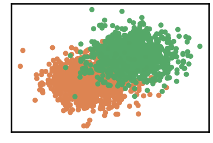
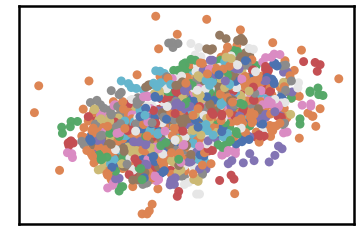
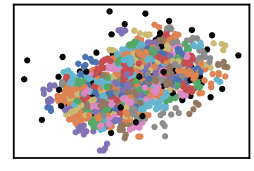
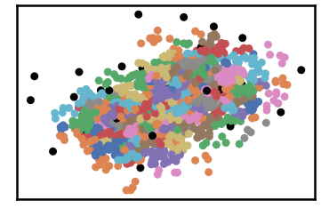
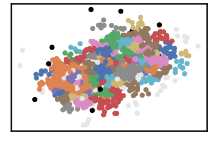
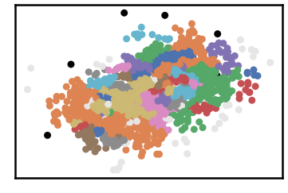
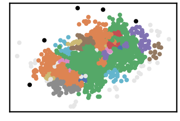
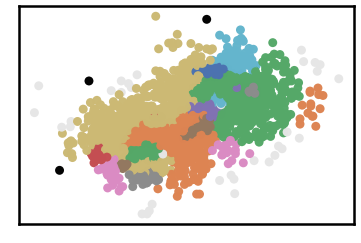
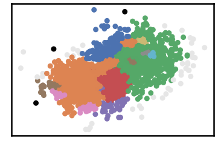
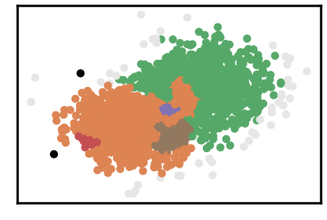

G2-2-50 Dataset
=================

.. code:: ipython3

    import time
    import os.path
    import requests
    import pandas as pd

.. code:: ipython3

    # install DenMune clustering algorithm using pip command from the offecial Python repository, PyPi
    # from https://pypi.org/project/denmune/
    !pip install denmune
    
    # now import it
    from denmune import DenMune

.. code:: ipython3

    dataset = 'g2-2-50' # let us take G2-2-50 dataset as an example
    
    url = "https://zerobytes.one/denmune_data/"
    file_ext = ".txt"
    ground_ext = "-gt"
    
    dataset_url = url + dataset + file_ext
    groundtruth_url = url + dataset + ground_ext  + file_ext
    
    data_path = 'data/' # change it to whatever you put your data, set it to ''; so it will retrive from current folder
    if  not os.path.isfile(data_path + dataset + file_ext):
        req = requests.get(dataset_url)
        with open(data_path + dataset + file_ext, 'wb') as f:
            f.write(req.content)
            
    if  not os.path.isfile(data_path + dataset + ground_ext + file_ext):
        req = requests.get(groundtruth_url)
        with open(data_path + dataset +  ground_ext + file_ext, 'wb') as f:
            f.write(req.content)       

.. code:: ipython3

    # Denmune's Paramaters
    # DenMune(dataset=dataset, k_nearest=n, data_path=data_path, verpose=verpose_mode, show_plot=show_plot, show_noise=show_noise)
    verpose_mode = True # view in-depth analysis of time complexity and outlier detection, num of clusters
    show_plot = True  # show plots on/off
    show_noise = True # show noise and outlier on/off
    
    # loop's parameters
    start = 2
    step = 1
    end=11
    
    # Validity indexes' parameters
    validity_val = -1
    best_k = 0
    best_val = -1
    
    validity_idx = 2 # Acc=1, F1-score=2,  NMI=3, AMI=4, ARI=5,  Homogeneity=6, and Completeness=7
    df = pd.DataFrame(columns =['K', 'ACC', 'F1', 'NMI', 'AMI', 'ARI','Homogeneity', 'Completeness', 'Time' ])
    
    
    for n in range(start, end+1, step):
        start_time = time.time()
        dm = DenMune(dataset=dataset, k_nearest=n, data_path=data_path, verpose=verpose_mode, show_noise=show_noise)
        labels_true, labels_pred = dm.output_Clusters()
        if show_plot == True and n==start:
            # Let us plot the groundtruth of this dataset which is reduced to 2-d using t-SNE
            print ("Dataset\'s Groundtruht")
            dm.plot_clusters(labels_true, ground=True)
            print('\n', "=====" * 20 , '\n')       
                   
        end_time = time.time()
        
        validity_indexes = dm.validate_Clusters(labels_true, labels_pred)
        validity_val = validity_indexes[validity_idx]
        validity_indexes[0] = n
        validity_indexes[8] = end_time - start_time
        
        df = df.append(pd.Series(validity_indexes, index=df.columns ), ignore_index=True)
        
        if (best_val < validity_val):
            best_val = validity_val
            best_k = n
            # Let us show results where only an improve in accuracy is detected
        if show_plot:
                dm.plot_clusters(labels_pred, show_noise=show_noise)
        print ('k=' , n, ':Validity score is:', validity_val , 'but best score is', best_val, 'at k=', best_k , end='     ')
                
        if not verpose_mode:
            print('\r', end='')
        else:
            print('\n', "=====" * 20 , '\n')

.. parsed-literal::

    using NGT, Proximity matrix has been calculated  in:  0.024016380310058594  seconds
    Dataset's Groundtruht

.. parsed-literal::

    
     ==================================================================================================== 
    
    There are 0 outlier point(s) in black (noise of type-1) represent 0% of total points
    There are 120 weak point(s) in light grey (noise of type-2) represent 6% of total points
    DenMune detected 469 clusters 
    

.. parsed-literal::

    k= 2 :Validity score is: 0.09112519809825673 but best score is 0.09112519809825673 at k= 2     
     ==================================================================================================== 
    
    using NGT, Proximity matrix has been calculated  in:  0.05162763595581055  seconds
    There are 74 outlier point(s) in black (noise of type-1) represent 4% of total points
    There are 0 weak point(s) in light grey (noise of type-2) represent 0% of total points
    DenMune detected 263 clusters 
    

.. parsed-literal::

    k= 3 :Validity score is: 0.04513888888888889 but best score is 0.09112519809825673 at k= 2     
     ==================================================================================================== 
    
    using NGT, Proximity matrix has been calculated  in:  0.11351346969604492  seconds
    There are 28 outlier point(s) in black (noise of type-1) represent 1% of total points
    There are 0 weak point(s) in light grey (noise of type-2) represent 0% of total points
    DenMune detected 160 clusters 
    

.. parsed-literal::

    k= 4 :Validity score is: 0.10440657526663832 but best score is 0.10440657526663832 at k= 4     
     ==================================================================================================== 
    
    using NGT, Proximity matrix has been calculated  in:  0.05091142654418945  seconds
    There are 11 outlier point(s) in black (noise of type-1) represent 1% of total points
    There are 84 weak point(s) in light grey (noise of type-2) represent 4% of total points
    DenMune detected 88 clusters 
    

.. parsed-literal::

    k= 5 :Validity score is: 0.24204474565151812 but best score is 0.24204474565151812 at k= 5     
     ==================================================================================================== 
    
    using NGT, Proximity matrix has been calculated  in:  0.05118846893310547  seconds
    There are 6 outlier point(s) in black (noise of type-1) represent 0% of total points
    There are 68 weak point(s) in light grey (noise of type-2) represent 3% of total points
    DenMune detected 53 clusters 
    

.. parsed-literal::

    k= 6 :Validity score is: 0.36504086448385165 but best score is 0.36504086448385165 at k= 6     
     ==================================================================================================== 
    
    using NGT, Proximity matrix has been calculated  in:  0.03051137924194336  seconds
    There are 5 outlier point(s) in black (noise of type-1) represent 0% of total points
    There are 48 weak point(s) in light grey (noise of type-2) represent 2% of total points
    DenMune detected 32 clusters 
    

.. parsed-literal::

    k= 7 :Validity score is: 0.49213947596506435 but best score is 0.49213947596506435 at k= 7     
     ==================================================================================================== 
    
    using NGT, Proximity matrix has been calculated  in:  0.034645795822143555  seconds
    There are 3 outlier point(s) in black (noise of type-1) represent 0% of total points
    There are 38 weak point(s) in light grey (noise of type-2) represent 2% of total points
    DenMune detected 19 clusters 
    

.. parsed-literal::

    k= 8 :Validity score is: 0.597250105773594 but best score is 0.597250105773594 at k= 8     
     ==================================================================================================== 
    
    using NGT, Proximity matrix has been calculated  in:  0.03628134727478027  seconds
    There are 3 outlier point(s) in black (noise of type-1) represent 0% of total points
    There are 45 weak point(s) in light grey (noise of type-2) represent 2% of total points
    DenMune detected 16 clusters 
    

.. parsed-literal::

    k= 9 :Validity score is: 0.7300796317033719 but best score is 0.7300796317033719 at k= 9     
     ==================================================================================================== 
    
    using NGT, Proximity matrix has been calculated  in:  0.04142951965332031  seconds
    There are 3 outlier point(s) in black (noise of type-1) represent 0% of total points
    There are 52 weak point(s) in light grey (noise of type-2) represent 3% of total points
    DenMune detected 7 clusters 
    

.. image:: datasets/g2-2-50/output_3_19.png

.. parsed-literal::

    k= 10 :Validity score is: 0.32424677187948353 but best score is 0.7300796317033719 at k= 9     
     ==================================================================================================== 
    
    using NGT, Proximity matrix has been calculated  in:  0.03584122657775879  seconds
    There are 2 outlier point(s) in black (noise of type-1) represent 0% of total points
    There are 48 weak point(s) in light grey (noise of type-2) represent 2% of total points
    DenMune detected 5 clusters 
    

.. parsed-literal::

    k= 11 :Validity score is: 0.8171015485779693 but best score is 0.8171015485779693 at k= 11     
     ==================================================================================================== 
    

.. parsed-literal::

    <Figure size 432x288 with 0 Axes>

.. code:: ipython3

    # It is time to save the results
    results_path = 'results/'  # change it to whatever you output results to, set it to ''; so it will output to current folder
    para_file = 'denmune'+ '_para_'  + dataset + '.csv'
    df.sort_values(by=['F1', 'NMI', 'ARI'] , ascending=False, inplace=True)   
    df.to_csv(results_path + para_file, index=False, sep='\t', header=True)

.. code:: ipython3

    df # it is sorted now and saved

.. raw:: html

    

    
    <table border="1" class="dataframe">
      <thead>
        <tr style="text-align: right;">
          <th></th>
          <th>K</th>
          <th>ACC</th>
          <th>F1</th>
          <th>NMI</th>
          <th>AMI</th>
          <th>ARI</th>
          <th>Homogeneity</th>
          <th>Completeness</th>
          <th>Time</th>
        </tr>
      </thead>
      <tbody>
        <tr>
          <th>9</th>
          <td>11.0</td>
          <td>1585.0</td>
          <td>0.817102</td>
          <td>0.348754</td>
          <td>0.347585</td>
          <td>0.432670</td>
          <td>0.442971</td>
          <td>0.287586</td>
          <td>0.368702</td>
        </tr>
        <tr>
          <th>7</th>
          <td>9.0</td>
          <td>1242.0</td>
          <td>0.730080</td>
          <td>0.309722</td>
          <td>0.307331</td>
          <td>0.322136</td>
          <td>0.561941</td>
          <td>0.213773</td>
          <td>0.369037</td>
        </tr>
        <tr>
          <th>6</th>
          <td>8.0</td>
          <td>909.0</td>
          <td>0.597250</td>
          <td>0.257167</td>
          <td>0.254433</td>
          <td>0.199215</td>
          <td>0.518648</td>
          <td>0.170971</td>
          <td>0.320226</td>
        </tr>
        <tr>
          <th>5</th>
          <td>7.0</td>
          <td>676.0</td>
          <td>0.492139</td>
          <td>0.262053</td>
          <td>0.258307</td>
          <td>0.154762</td>
          <td>0.630184</td>
          <td>0.165420</td>
          <td>0.213850</td>
        </tr>
        <tr>
          <th>4</th>
          <td>6.0</td>
          <td>470.0</td>
          <td>0.365041</td>
          <td>0.228462</td>
          <td>0.223118</td>
          <td>0.099825</td>
          <td>0.660435</td>
          <td>0.138121</td>
          <td>0.362521</td>
        </tr>
        <tr>
          <th>8</th>
          <td>10.0</td>
          <td>904.0</td>
          <td>0.324247</td>
          <td>0.082489</td>
          <td>0.079677</td>
          <td>0.005519</td>
          <td>0.080253</td>
          <td>0.084852</td>
          <td>0.440638</td>
        </tr>
        <tr>
          <th>3</th>
          <td>5.0</td>
          <td>288.0</td>
          <td>0.242045</td>
          <td>0.203342</td>
          <td>0.195497</td>
          <td>0.040879</td>
          <td>0.697846</td>
          <td>0.119010</td>
          <td>0.385725</td>
        </tr>
        <tr>
          <th>2</th>
          <td>4.0</td>
          <td>115.0</td>
          <td>0.104407</td>
          <td>0.175942</td>
          <td>0.162685</td>
          <td>0.013777</td>
          <td>0.689785</td>
          <td>0.100830</td>
          <td>0.344748</td>
        </tr>
        <tr>
          <th>0</th>
          <td>2.0</td>
          <td>115.0</td>
          <td>0.091125</td>
          <td>0.145918</td>
          <td>0.104673</td>
          <td>0.001884</td>
          <td>0.660063</td>
          <td>0.082026</td>
          <td>0.489367</td>
        </tr>
        <tr>
          <th>1</th>
          <td>3.0</td>
          <td>52.0</td>
          <td>0.045139</td>
          <td>0.158350</td>
          <td>0.137005</td>
          <td>0.005894</td>
          <td>0.679514</td>
          <td>0.089617</td>
          <td>0.246058</td>
        </tr>
      </tbody>
    </table>
    

