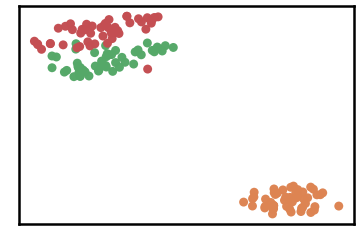
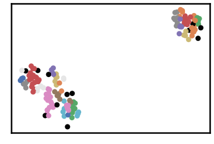
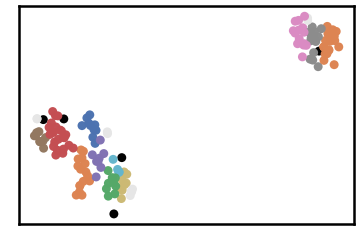
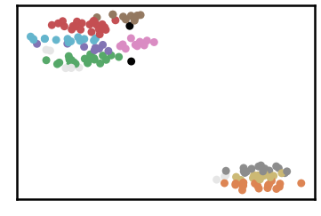
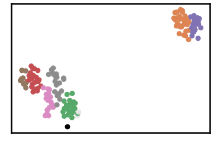
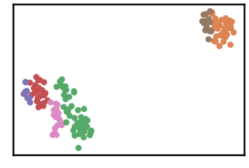
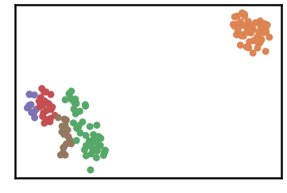
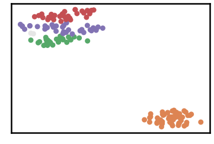
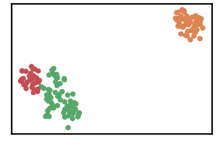

Iris Dataset
=============

:Description: This is perhaps the best known database to be found in the pattern recognition literature. The data set contains 3 classes of 50 instances each, where each class refers to a type of iris plant.
:Challenge:  One class is linearly separable from the other 2; the latter are NOT linearly separable from each other.

About it
------------------
:Name: iris dataset
:Dataset URL: https://archive.ics.uci.edu/ml/datasets/iris
:Number of Instances: 150
:Predicted attribute: class of iris plant.
:Classes [3]: 
	- Iris Setosa
	- Iris Versicolour
	- Iris Virginica
:Attributes [4]:
	- sepal length in cm
	- sepal width in cm
	- petal length in cm
	- petal width in cm	

.. image:: images/iris/iris01. * 
.. image:: images/iris/iris02. * 

Code it
------------------
.. code:: ipython3

    import time
    import os.path
    import requests
    import pandas as pd

.. code:: ipython3

    # install DenMune clustering algorithm using pip command from the offecial Python repository, PyPi
    # from https://pypi.org/project/denmune/
    !pip install denmune
    
    # now import it
    from denmune import DenMune

.. code:: ipython3

    dataset = 'iris' # let us take iris dataset as an example
    
    url = "https://zerobytes.one/denmune_data/"
    file_ext = ".txt"
    ground_ext = "-gt"
    
    dataset_url = url + dataset + file_ext
    groundtruth_url = url + dataset + ground_ext  + file_ext
    
    data_path = 'data/' # change it to whatever you put your data, set it to ''; so it will retrive from current folder
    if  not os.path.isfile(data_path + dataset + file_ext):
        req = requests.get(dataset_url)
        with open(data_path + dataset + file_ext, 'wb') as f:
            f.write(req.content)
            
    if  not os.path.isfile(data_path + dataset + ground_ext + file_ext):
        req = requests.get(groundtruth_url)
        with open(data_path + dataset +  ground_ext + file_ext, 'wb') as f:
            f.write(req.content)       

.. code:: ipython3

    # Denmune's Paramaters
    # DenMune(dataset=dataset, k_nearest=n, data_path=data_path, verpose=verpose_mode, show_plot=show_plot, show_noise=show_noise)
    verpose_mode = True # view in-depth analysis of time complexity and outlier detection, num of clusters
    show_plot = True  # show plots on/off
    show_noise = True # show noise and outlier on/off
    
    # loop's parameters
    start = 3
    step = 1
    end=15
    
    # Validity indexes' parameters
    validity_val = -1
    best_k = 0
    best_val = -1
    
    validity_idx = 2 # Acc=1, F1-score=2,  NMI=3, AMI=4, ARI=5,  Homogeneity=6, and Completeness=7
    df = pd.DataFrame(columns =['K', 'ACC', 'F1', 'NMI', 'AMI', 'ARI','Homogeneity', 'Completeness', 'Time' ])
    
    
    for n in range(start, end+1, step):
        start_time = time.time()
        dm = DenMune(dataset=dataset, k_nearest=n, data_path=data_path, verpose=verpose_mode, show_noise=show_noise)
        labels_true, labels_pred = dm.output_Clusters()
        if show_plot == True and n==start:
            # Let us plot the groundtruth of this dataset which is reduced to 2-d using t-SNE
            print ("Dataset\'s Groundtruht")
            dm.plot_clusters(labels_true, ground=True)
            print('\n', "=====" * 20 , '\n')       
                   
        end_time = time.time()
        
        validity_indexes = dm.validate_Clusters(labels_true, labels_pred)
        validity_val = validity_indexes[validity_idx]
        validity_indexes[0] = n
        validity_indexes[8] = end_time - start_time
        
        df = df.append(pd.Series(validity_indexes, index=df.columns ), ignore_index=True)
        
        if (best_val < validity_val):
            best_val = validity_val
            best_k = n
            # Let us show results where only an improve in accuracy is detected
        if show_plot:
                dm.plot_clusters(labels_pred, show_noise=show_noise)
        print ('k=' , n, ':Validity score is:', validity_val , 'but best score is', best_val, 'at k=', best_k , end='     ')
                
        if not verpose_mode:
            print('\r', end='')
        else:
            print('\n', "=====" * 20 , '\n')

Visualize it
------------------
.. parsed-literal::

    using t-SNE iris  dataset has been reduced to 2-d in  0.9025790691375732  seconds
    using NGT, Proximity matrix has been calculated  in:  0.0011229515075683594  seconds
    Dataset's Groundtruht

.. parsed-literal::

    
     ==================================================================================================== 
    
    There are 12 outlier point(s) in black (noise of type-1) represent 8% of total points
    There are 8 weak point(s) in light grey (noise of type-2) represent 5% of total points
    DenMune detected 21 clusters 
    

.. parsed-literal::

    k= 3 :Validity score is: 0.404561160280075 but best score is 0.404561160280075 at k= 3     
     ==================================================================================================== 
    
    using NGT, Proximity matrix has been calculated  in:  0.002125263214111328  seconds
    There are 5 outlier point(s) in black (noise of type-1) represent 3% of total points
    There are 10 weak point(s) in light grey (noise of type-2) represent 7% of total points
    DenMune detected 11 clusters 
    

.. parsed-literal::

    k= 4 :Validity score is: 0.5047316524386208 but best score is 0.5047316524386208 at k= 4     
     ==================================================================================================== 
    
    using NGT, Proximity matrix has been calculated  in:  0.002331256866455078  seconds
    There are 2 outlier point(s) in black (noise of type-1) represent 1% of total points
    There are 9 weak point(s) in light grey (noise of type-2) represent 6% of total points
    DenMune detected 8 clusters 
    

.. parsed-literal::

    k= 5 :Validity score is: 0.6715841236389182 but best score is 0.6715841236389182 at k= 5     
     ==================================================================================================== 
    
    using NGT, Proximity matrix has been calculated  in:  0.0019311904907226562  seconds
    There are 1 outlier point(s) in black (noise of type-1) represent 1% of total points
    There are 3 weak point(s) in light grey (noise of type-2) represent 2% of total points
    DenMune detected 7 clusters 
    

.. parsed-literal::

    k= 6 :Validity score is: 0.6824324324324323 but best score is 0.6824324324324323 at k= 6     
     ==================================================================================================== 
    
    using NGT, Proximity matrix has been calculated  in:  0.001992940902709961  seconds
    There are 0 outlier point(s) in black (noise of type-1) represent 0% of total points
    There are 0 weak point(s) in light grey (noise of type-2) represent 0% of total points
    DenMune detected 6 clusters 
    

.. parsed-literal::

    k= 7 :Validity score is: 0.8210198808205451 but best score is 0.8210198808205451 at k= 7     
     ==================================================================================================== 
    
    using NGT, Proximity matrix has been calculated  in:  0.002408742904663086  seconds
    There are 0 outlier point(s) in black (noise of type-1) represent 0% of total points
    There are 0 weak point(s) in light grey (noise of type-2) represent 0% of total points
    DenMune detected 5 clusters 
    

.. parsed-literal::

    k= 8 :Validity score is: 0.8631068865902525 but best score is 0.8631068865902525 at k= 8     
     ==================================================================================================== 
    
    using NGT, Proximity matrix has been calculated  in:  0.0026082992553710938  seconds
    There are 0 outlier point(s) in black (noise of type-1) represent 0% of total points
    There are 0 weak point(s) in light grey (noise of type-2) represent 0% of total points
    DenMune detected 3 clusters 
    

.. image:: datasets/iris/output_3_15.png

.. parsed-literal::

    k= 9 :Validity score is: 0.89769820971867 but best score is 0.89769820971867 at k= 9     
     ==================================================================================================== 
    
    using NGT, Proximity matrix has been calculated  in:  0.002123594284057617  seconds
    There are 0 outlier point(s) in black (noise of type-1) represent 0% of total points
    There are 0 weak point(s) in light grey (noise of type-2) represent 0% of total points
    DenMune detected 4 clusters 
    

.. parsed-literal::

    k= 10 :Validity score is: 0.8441300570861255 but best score is 0.89769820971867 at k= 9     
     ==================================================================================================== 
    
    using NGT, Proximity matrix has been calculated  in:  0.0022115707397460938  seconds
    There are 0 outlier point(s) in black (noise of type-1) represent 0% of total points
    There are 0 weak point(s) in light grey (noise of type-2) represent 0% of total points
    DenMune detected 3 clusters 
    

.. image:: datasets/iris/output_3_19.png

.. parsed-literal::

    k= 11 :Validity score is: 0.89769820971867 but best score is 0.89769820971867 at k= 9     
     ==================================================================================================== 
    
    using NGT, Proximity matrix has been calculated  in:  0.002968311309814453  seconds
    There are 0 outlier point(s) in black (noise of type-1) represent 0% of total points
    There are 0 weak point(s) in light grey (noise of type-2) represent 0% of total points
    DenMune detected 3 clusters 
    

.. parsed-literal::

    k= 12 :Validity score is: 0.89769820971867 but best score is 0.89769820971867 at k= 9     
     ==================================================================================================== 
    
    using NGT, Proximity matrix has been calculated  in:  0.0023262500762939453  seconds
    There are 0 outlier point(s) in black (noise of type-1) represent 0% of total points
    There are 0 weak point(s) in light grey (noise of type-2) represent 0% of total points
    DenMune detected 3 clusters 
    

.. image:: datasets/iris/output_3_23.png

.. parsed-literal::

    k= 13 :Validity score is: 0.89769820971867 but best score is 0.89769820971867 at k= 9     
     ==================================================================================================== 
    
    using NGT, Proximity matrix has been calculated  in:  0.0025136470794677734  seconds
    There are 0 outlier point(s) in black (noise of type-1) represent 0% of total points
    There are 0 weak point(s) in light grey (noise of type-2) represent 0% of total points
    DenMune detected 3 clusters 
    

.. parsed-literal::

    k= 14 :Validity score is: 0.8905309250136836 but best score is 0.89769820971867 at k= 9     
     ==================================================================================================== 
    
    using NGT, Proximity matrix has been calculated  in:  0.002603292465209961  seconds
    There are 0 outlier point(s) in black (noise of type-1) represent 0% of total points
    There are 0 weak point(s) in light grey (noise of type-2) represent 0% of total points
    DenMune detected 3 clusters 
    

.. parsed-literal::

    k= 15 :Validity score is: 0.89769820971867 but best score is 0.89769820971867 at k= 9     
     ==================================================================================================== 
    

Assess it
------------------

.. code:: ipython3

    # It is time to save the results
    results_path = 'results/'  # change it to whatever you output results to, set it to ''; so it will output to current folder
    para_file = 'denmune'+ '_para_'  + dataset + '.csv'
    df.sort_values(by=['F1', 'NMI', 'ARI'] , ascending=False, inplace=True)   
    df.to_csv(results_path + para_file, index=False, sep='\t', header=True)

.. code:: ipython3

    df # it is sorted now and saved

.. raw:: html

    

    
    <table border="1" class="dataframe">
      <thead>
        <tr style="text-align: right;">
          <th></th>
          <th>K</th>
          <th>ACC</th>
          <th>F1</th>
          <th>NMI</th>
          <th>AMI</th>
          <th>ARI</th>
          <th>Homogeneity</th>
          <th>Completeness</th>
          <th>Time</th>
        </tr>
      </thead>
      <tbody>
        <tr>
          <th>6</th>
          <td>9.0</td>
          <td>135.0</td>
          <td>0.897698</td>
          <td>0.797989</td>
          <td>0.795421</td>
          <td>0.745504</td>
          <td>0.786923</td>
          <td>0.809369</td>
          <td>0.023523</td>
        </tr>
        <tr>
          <th>8</th>
          <td>11.0</td>
          <td>135.0</td>
          <td>0.897698</td>
          <td>0.797989</td>
          <td>0.795421</td>
          <td>0.745504</td>
          <td>0.786923</td>
          <td>0.809369</td>
          <td>0.024874</td>
        </tr>
        <tr>
          <th>9</th>
          <td>12.0</td>
          <td>135.0</td>
          <td>0.897698</td>
          <td>0.797989</td>
          <td>0.795421</td>
          <td>0.745504</td>
          <td>0.786923</td>
          <td>0.809369</td>
          <td>0.023519</td>
        </tr>
        <tr>
          <th>10</th>
          <td>13.0</td>
          <td>135.0</td>
          <td>0.897698</td>
          <td>0.797989</td>
          <td>0.795421</td>
          <td>0.745504</td>
          <td>0.786923</td>
          <td>0.809369</td>
          <td>0.026462</td>
        </tr>
        <tr>
          <th>12</th>
          <td>15.0</td>
          <td>135.0</td>
          <td>0.897698</td>
          <td>0.797989</td>
          <td>0.795421</td>
          <td>0.745504</td>
          <td>0.786923</td>
          <td>0.809369</td>
          <td>0.028596</td>
        </tr>
        <tr>
          <th>11</th>
          <td>14.0</td>
          <td>134.0</td>
          <td>0.890531</td>
          <td>0.790679</td>
          <td>0.788012</td>
          <td>0.732298</td>
          <td>0.778177</td>
          <td>0.803589</td>
          <td>0.027658</td>
        </tr>
        <tr>
          <th>5</th>
          <td>8.0</td>
          <td>120.0</td>
          <td>0.863107</td>
          <td>0.789928</td>
          <td>0.785268</td>
          <td>0.774596</td>
          <td>0.922431</td>
          <td>0.690710</td>
          <td>0.020778</td>
        </tr>
        <tr>
          <th>7</th>
          <td>10.0</td>
          <td>113.0</td>
          <td>0.844130</td>
          <td>0.737834</td>
          <td>0.733401</td>
          <td>0.679531</td>
          <td>0.827620</td>
          <td>0.665622</td>
          <td>0.023621</td>
        </tr>
        <tr>
          <th>4</th>
          <td>7.0</td>
          <td>108.0</td>
          <td>0.821020</td>
          <td>0.736204</td>
          <td>0.729306</td>
          <td>0.659476</td>
          <td>0.922431</td>
          <td>0.612540</td>
          <td>0.021180</td>
        </tr>
        <tr>
          <th>3</th>
          <td>6.0</td>
          <td>78.0</td>
          <td>0.682432</td>
          <td>0.675962</td>
          <td>0.663360</td>
          <td>0.477823</td>
          <td>0.951927</td>
          <td>0.524042</td>
          <td>0.020106</td>
        </tr>
        <tr>
          <th>2</th>
          <td>5.0</td>
          <td>76.0</td>
          <td>0.671584</td>
          <td>0.625789</td>
          <td>0.609812</td>
          <td>0.433304</td>
          <td>0.920773</td>
          <td>0.473951</td>
          <td>0.075269</td>
        </tr>
        <tr>
          <th>1</th>
          <td>4.0</td>
          <td>52.0</td>
          <td>0.504732</td>
          <td>0.534538</td>
          <td>0.509955</td>
          <td>0.287688</td>
          <td>0.866648</td>
          <td>0.386447</td>
          <td>0.018903</td>
        </tr>
        <tr>
          <th>0</th>
          <td>3.0</td>
          <td>39.0</td>
          <td>0.404561</td>
          <td>0.460335</td>
          <td>0.408779</td>
          <td>0.166681</td>
          <td>0.847152</td>
          <td>0.316032</td>
          <td>0.970442</td>
        </tr>
      </tbody>
    </table>
    

