Jain Dataset
============

.. code:: ipython3

    import time
    import os.path
    import requests
    import pandas as pd

.. code:: ipython3

    # install DenMune clustering algorithm using pip command from the offecial Python repository, PyPi
    # from https://pypi.org/project/denmune/
    !pip install denmune
    
    # now import it
    from denmune import DenMune

.. code:: ipython3

    dataset = 'jain' # let us take Jain dataset as an example
    
    url = "https://zerobytes.one/denmune_data/"
    file_ext = ".txt"
    ground_ext = "-gt"
    
    dataset_url = url + dataset + file_ext
    groundtruth_url = url + dataset + ground_ext  + file_ext
    
    data_path = 'data/' # change it to whatever you put your data, set it to ''; so it will retrive from current folder
    if  not os.path.isfile(data_path + dataset + file_ext):
        req = requests.get(dataset_url)
        with open(data_path + dataset + file_ext, 'wb') as f:
            f.write(req.content)
            
    if  not os.path.isfile(data_path + dataset + ground_ext + file_ext):
        req = requests.get(groundtruth_url)
        with open(data_path + dataset +  ground_ext + file_ext, 'wb') as f:
            f.write(req.content)       

.. code:: ipython3

    # Denmune's Paramaters
    # DenMune(dataset=dataset, k_nearest=n, data_path=data_path, verpose=verpose_mode, show_plot=show_plot, show_noise=show_noise)
    verpose_mode = True # view in-depth analysis of time complexity and outlier detection, num of clusters
    show_plot = True  # show plots on/off
    show_noise = True # show noise and outlier on/off
    
    # loop's parameters
    start = 3
    step = 1
    end=15
    
    # Validity indexes' parameters
    validity_val = -1
    best_k = 0
    best_val = -1
    
    validity_idx = 2 # Acc=1, F1-score=2,  NMI=3, AMI=4, ARI=5,  Homogeneity=6, and Completeness=7
    df = pd.DataFrame(columns =['K', 'ACC', 'F1', 'NMI', 'AMI', 'ARI','Homogeneity', 'Completeness', 'Time' ])
    
    
    for n in range(start, end+1, step):
        start_time = time.time()
        dm = DenMune(dataset=dataset, k_nearest=n, data_path=data_path, verpose=verpose_mode, show_noise=show_noise)
        labels_true, labels_pred = dm.output_Clusters()
        if show_plot == True and n==start:
            # Let us plot the groundtruth of this dataset which is reduced to 2-d using t-SNE
            print ("Dataset\'s Groundtruht")
            dm.plot_clusters(labels_true, ground=True)
            print('\n', "=====" * 20 , '\n')       
                   
        end_time = time.time()
        
        validity_indexes = dm.validate_Clusters(labels_true, labels_pred)
        validity_val = validity_indexes[validity_idx]
        validity_indexes[0] = n
        validity_indexes[8] = end_time - start_time
        
        df = df.append(pd.Series(validity_indexes, index=df.columns ), ignore_index=True)
        
        if (best_val < validity_val):
            best_val = validity_val
            best_k = n
            # Let us show results where only an improve in accuracy is detected
        if show_plot:
                dm.plot_clusters(labels_pred, show_noise=show_noise)
        print ('k=' , n, ':Validity score is:', validity_val , 'but best score is', best_val, 'at k=', best_k , end='     ')
                
        if not verpose_mode:
            print('\r', end='')
        else:
            print('\n', "=====" * 20 , '\n')

.. parsed-literal::

    using NGT, Proximity matrix has been calculated  in:  0.003320932388305664  seconds
    Dataset's Groundtruht

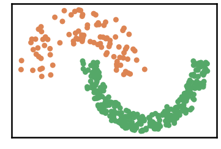

.. parsed-literal::

    
     ==================================================================================================== 
    
    There are 11 outlier point(s) in black (noise of type-1) represent 3% of total points
    There are 25 weak point(s) in light grey (noise of type-2) represent 7% of total points
    DenMune detected 44 clusters 
    

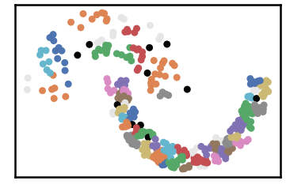

.. parsed-literal::

    k= 3 :Validity score is: 0.15552130458822808 but best score is 0.15552130458822808 at k= 3     
     ==================================================================================================== 
    
    using NGT, Proximity matrix has been calculated  in:  0.005502939224243164  seconds
    There are 3 outlier point(s) in black (noise of type-1) represent 1% of total points
    There are 24 weak point(s) in light grey (noise of type-2) represent 6% of total points
    DenMune detected 28 clusters 
    

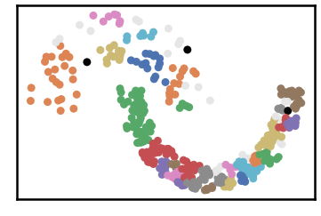

.. parsed-literal::

    k= 4 :Validity score is: 0.33430436583186207 but best score is 0.33430436583186207 at k= 4     
     ==================================================================================================== 
    
    using NGT, Proximity matrix has been calculated  in:  0.004088163375854492  seconds
    There are 1 outlier point(s) in black (noise of type-1) represent 0% of total points
    There are 18 weak point(s) in light grey (noise of type-2) represent 5% of total points
    DenMune detected 16 clusters 
    

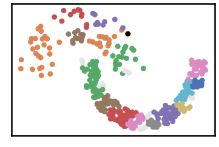

.. parsed-literal::

    k= 5 :Validity score is: 0.3252818002827062 but best score is 0.33430436583186207 at k= 4     
     ==================================================================================================== 
    
    using NGT, Proximity matrix has been calculated  in:  0.0036873817443847656  seconds
    There are 1 outlier point(s) in black (noise of type-1) represent 0% of total points
    There are 11 weak point(s) in light grey (noise of type-2) represent 3% of total points
    DenMune detected 12 clusters 
    

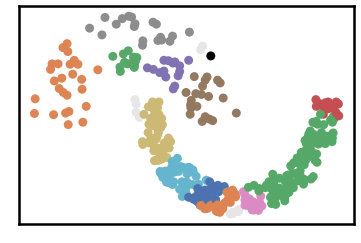

.. parsed-literal::

    k= 6 :Validity score is: 0.49479283629096166 but best score is 0.49479283629096166 at k= 6     
     ==================================================================================================== 
    
    using NGT, Proximity matrix has been calculated  in:  0.003950595855712891  seconds
    There are 1 outlier point(s) in black (noise of type-1) represent 0% of total points
    There are 14 weak point(s) in light grey (noise of type-2) represent 4% of total points
    DenMune detected 10 clusters 
    

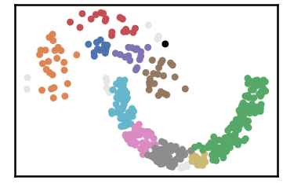

.. parsed-literal::

    k= 7 :Validity score is: 0.5303473057065475 but best score is 0.5303473057065475 at k= 7     
     ==================================================================================================== 
    
    using NGT, Proximity matrix has been calculated  in:  0.004128217697143555  seconds
    There are 1 outlier point(s) in black (noise of type-1) represent 0% of total points
    There are 13 weak point(s) in light grey (noise of type-2) represent 3% of total points
    DenMune detected 10 clusters 
    

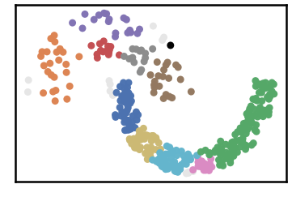

.. parsed-literal::

    k= 8 :Validity score is: 0.5303473057065475 but best score is 0.5303473057065475 at k= 7     
     ==================================================================================================== 
    
    using NGT, Proximity matrix has been calculated  in:  0.004098415374755859  seconds
    There are 1 outlier point(s) in black (noise of type-1) represent 0% of total points
    There are 7 weak point(s) in light grey (noise of type-2) represent 2% of total points
    DenMune detected 8 clusters 
    

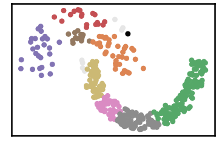

.. parsed-literal::

    k= 9 :Validity score is: 0.5650927617291178 but best score is 0.5650927617291178 at k= 9     
     ==================================================================================================== 
    
    using NGT, Proximity matrix has been calculated  in:  0.004141092300415039  seconds
    There are 1 outlier point(s) in black (noise of type-1) represent 0% of total points
    There are 7 weak point(s) in light grey (noise of type-2) represent 2% of total points
    DenMune detected 7 clusters 
    

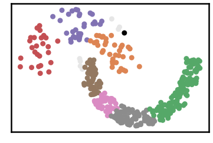

.. parsed-literal::

    k= 10 :Validity score is: 0.5650927617291178 but best score is 0.5650927617291178 at k= 9     
     ==================================================================================================== 
    
    using NGT, Proximity matrix has been calculated  in:  0.0047490596771240234  seconds
    There are 1 outlier point(s) in black (noise of type-1) represent 0% of total points
    There are 4 weak point(s) in light grey (noise of type-2) represent 1% of total points
    DenMune detected 3 clusters 
    

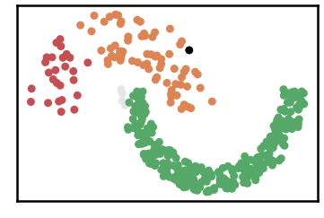

.. parsed-literal::

    k= 11 :Validity score is: 0.9525543343949469 but best score is 0.9525543343949469 at k= 11     
     ==================================================================================================== 
    
    using NGT, Proximity matrix has been calculated  in:  0.0047647953033447266  seconds
    There are 1 outlier point(s) in black (noise of type-1) represent 0% of total points
    There are 4 weak point(s) in light grey (noise of type-2) represent 1% of total points
    DenMune detected 3 clusters 
    

.. parsed-literal::

    k= 12 :Validity score is: 0.9525543343949469 but best score is 0.9525543343949469 at k= 11     
     ==================================================================================================== 
    
    using NGT, Proximity matrix has been calculated  in:  0.005233287811279297  seconds
    There are 1 outlier point(s) in black (noise of type-1) represent 0% of total points
    There are 11 weak point(s) in light grey (noise of type-2) represent 3% of total points
    DenMune detected 3 clusters 
    

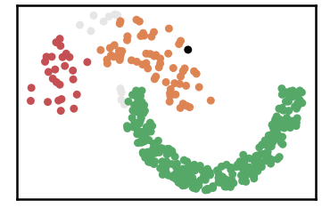

.. parsed-literal::

    k= 13 :Validity score is: 0.9393375374258822 but best score is 0.9525543343949469 at k= 11     
     ==================================================================================================== 
    
    using NGT, Proximity matrix has been calculated  in:  0.005416393280029297  seconds
    There are 0 outlier point(s) in black (noise of type-1) represent 0% of total points
    There are 7 weak point(s) in light grey (noise of type-2) represent 2% of total points
    DenMune detected 3 clusters 
    

.. parsed-literal::

    k= 14 :Validity score is: 0.9466970842422527 but best score is 0.9525543343949469 at k= 11     
     ==================================================================================================== 
    
    using NGT, Proximity matrix has been calculated  in:  0.0051822662353515625  seconds
    There are 0 outlier point(s) in black (noise of type-1) represent 0% of total points
    There are 0 weak point(s) in light grey (noise of type-2) represent 0% of total points
    DenMune detected 2 clusters 
    

.. parsed-literal::

    k= 15 :Validity score is: 1.0 but best score is 1.0 at k= 15     
     ==================================================================================================== 
    

.. parsed-literal::

    <Figure size 432x288 with 0 Axes>

.. code:: ipython3

    # It is time to save the results
    results_path = 'results/'  # change it to whatever you output results to, set it to ''; so it will output to current folder
    para_file = 'denmune'+ '_para_'  + dataset + '.csv'
    df.sort_values(by=['F1', 'NMI', 'ARI'] , ascending=False, inplace=True)   
    df.to_csv(results_path + para_file, index=False, sep='\t', header=True)

.. code:: ipython3

    df # it is sorted now and saved

.. raw:: html

    

    
    <table border="1" class="dataframe">
      <thead>
        <tr style="text-align: right;">
          <th></th>
          <th>K</th>
          <th>ACC</th>
          <th>F1</th>
          <th>NMI</th>
          <th>AMI</th>
          <th>ARI</th>
          <th>Homogeneity</th>
          <th>Completeness</th>
          <th>Time</th>
        </tr>
      </thead>
      <tbody>
        <tr>
          <th>12</th>
          <td>15.0</td>
          <td>373.0</td>
          <td>1.000000</td>
          <td>1.000000</td>
          <td>1.000000</td>
          <td>1.000000</td>
          <td>1.000000</td>
          <td>1.000000</td>
          <td>0.115833</td>
        </tr>
        <tr>
          <th>8</th>
          <td>11.0</td>
          <td>342.0</td>
          <td>0.952554</td>
          <td>0.838168</td>
          <td>0.836755</td>
          <td>0.910509</td>
          <td>1.000000</td>
          <td>0.721419</td>
          <td>0.036988</td>
        </tr>
        <tr>
          <th>9</th>
          <td>12.0</td>
          <td>342.0</td>
          <td>0.952554</td>
          <td>0.838168</td>
          <td>0.836755</td>
          <td>0.910509</td>
          <td>1.000000</td>
          <td>0.721419</td>
          <td>0.109738</td>
        </tr>
        <tr>
          <th>11</th>
          <td>14.0</td>
          <td>340.0</td>
          <td>0.946697</td>
          <td>0.843630</td>
          <td>0.842635</td>
          <td>0.931329</td>
          <td>1.000000</td>
          <td>0.729550</td>
          <td>0.046440</td>
        </tr>
        <tr>
          <th>10</th>
          <td>13.0</td>
          <td>335.0</td>
          <td>0.939338</td>
          <td>0.785945</td>
          <td>0.784184</td>
          <td>0.896827</td>
          <td>0.966271</td>
          <td>0.662339</td>
          <td>0.043675</td>
        </tr>
        <tr>
          <th>7</th>
          <td>10.0</td>
          <td>147.0</td>
          <td>0.565093</td>
          <td>0.455403</td>
          <td>0.450350</td>
          <td>0.235531</td>
          <td>0.977638</td>
          <td>0.296838</td>
          <td>0.035487</td>
        </tr>
        <tr>
          <th>6</th>
          <td>9.0</td>
          <td>147.0</td>
          <td>0.565093</td>
          <td>0.444470</td>
          <td>0.438782</td>
          <td>0.229592</td>
          <td>0.977638</td>
          <td>0.287615</td>
          <td>0.032778</td>
        </tr>
        <tr>
          <th>5</th>
          <td>8.0</td>
          <td>136.0</td>
          <td>0.530347</td>
          <td>0.404531</td>
          <td>0.397647</td>
          <td>0.197351</td>
          <td>0.959482</td>
          <td>0.256294</td>
          <td>0.031678</td>
        </tr>
        <tr>
          <th>4</th>
          <td>7.0</td>
          <td>136.0</td>
          <td>0.530347</td>
          <td>0.403521</td>
          <td>0.396629</td>
          <td>0.197021</td>
          <td>0.957316</td>
          <td>0.255637</td>
          <td>0.038883</td>
        </tr>
        <tr>
          <th>3</th>
          <td>6.0</td>
          <td>123.0</td>
          <td>0.494793</td>
          <td>0.382028</td>
          <td>0.374165</td>
          <td>0.156875</td>
          <td>0.975602</td>
          <td>0.237518</td>
          <td>0.096983</td>
        </tr>
        <tr>
          <th>1</th>
          <td>4.0</td>
          <td>75.0</td>
          <td>0.334304</td>
          <td>0.281686</td>
          <td>0.264311</td>
          <td>0.060173</td>
          <td>0.913638</td>
          <td>0.166512</td>
          <td>0.036888</td>
        </tr>
        <tr>
          <th>2</th>
          <td>5.0</td>
          <td>73.0</td>
          <td>0.325282</td>
          <td>0.333324</td>
          <td>0.323422</td>
          <td>0.087609</td>
          <td>0.962062</td>
          <td>0.201583</td>
          <td>0.027567</td>
        </tr>
        <tr>
          <th>0</th>
          <td>3.0</td>
          <td>32.0</td>
          <td>0.155521</td>
          <td>0.236647</td>
          <td>0.210897</td>
          <td>0.023152</td>
          <td>0.884328</td>
          <td>0.136601</td>
          <td>0.084130</td>
        </tr>
      </tbody>
    </table>
    

