MNIST Dataset
==================

.. code:: ipython3

    import time
    import os.path
    import requests
    import pandas as pd

.. code:: ipython3

    # install DenMune clustering algorithm using pip command from the offecial Python repository, PyPi
    # from https://pypi.org/project/denmune/
    !pip install denmune
    
    # now import it
    from denmune import DenMune

.. code:: ipython3

    dataset = 'mnist' # let us take iris dataset as an example
    
    url = "https://zerobytes.one/denmune_data/"
    file_ext = ".txt"
    ground_ext = "-gt"
    
    dataset_url = url + dataset + file_ext
    groundtruth_url = url + dataset + ground_ext  + file_ext
    
    data_path = 'data/' # change it to whatever you put your data, set it to ''; so it will retrive from current folder
    if  not os.path.isfile(data_path + dataset + file_ext):
        req = requests.get(dataset_url)
        with open(data_path + dataset + file_ext, 'wb') as f:
            f.write(req.content)
        
    if  not os.path.isfile(data_path + dataset + ground_ext + file_ext):
        req = requests.get(groundtruth_url)
        with open(data_path + dataset +  ground_ext + file_ext, 'wb') as f:
            f.write(req.content)       

.. code:: ipython3

    # Denmune's Paramaters
    # DenMune(dataset=dataset, k_nearest=n, data_path=data_path, verpose=verpose_mode, show_plot=show_plot, show_noise=show_noise)
    verpose_mode = True # view in-depth analysis of time complexity and outlier detection, num of clusters
    show_plot = True  # show plots on/off
    show_noise = True # show noise and outlier on/off
    
    # loop's parameters
    start = 15
    step = 5
    end=100
    
    # Validity indexes' parameters
    validity_val = -1
    best_k = 0
    best_val = -1
    
    validity_idx = 2 # Acc=1, F1-score=2,  NMI=3, AMI=4, ARI=5,  Homogeneity=6, and Completeness=7
    df = pd.DataFrame(columns =['K', 'ACC', 'F1', 'NMI', 'AMI', 'ARI','Homogeneity', 'Completeness', 'Time' ])
    
    
    for n in range(start, end+1, step):
        start_time = time.time()
        dm = DenMune(dataset=dataset, k_nearest=n, data_path=data_path, verpose=verpose_mode, show_noise=show_noise)
        labels_true, labels_pred = dm.output_Clusters()
        if show_plot == True and n==start:
            # Let us plot the groundtruth of this dataset which is reduced to 2-d using t-SNE
            print ("Dataset\'s Groundtruht")
            dm.plot_clusters(labels_true, ground=True)
            print('\n', "=====" * 20 , '\n')       
                   
        end_time = time.time()
        
        validity_indexes = dm.validate_Clusters(labels_true, labels_pred)
        validity_val = validity_indexes[validity_idx]
        validity_indexes[0] = n
        validity_indexes[8] = end_time - start_time
        
        df = df.append(pd.Series(validity_indexes, index=df.columns ), ignore_index=True)
        
        if (best_val < validity_val):
            best_val = validity_val
            best_k = n
        # Let us show results where only an improve in accuracy is detected
        if show_plot:
                dm.plot_clusters(labels_pred, show_noise=show_noise)
        print ('k=' , n, ':Validity score is:', validity_val , 'but best score is', best_val, 'at k=', best_k , end='     ')
                
        if not verpose_mode:
            print('\r', end='')
        else:
            print('\n', "=====" * 20 , '\n')

.. parsed-literal::

    using NGT, Proximity matrix has been calculated  in:  1.4676945209503174  seconds
    Dataset's Groundtruht

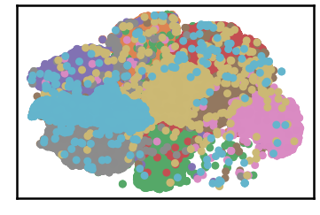

.. parsed-literal::

    
     ==================================================================================================== 
    
    There are 12 outlier point(s) in black (noise of type-1) represent 0% of total points
    There are 2379 weak point(s) in light grey (noise of type-2) represent 3% of total points
    DenMune detected 640 clusters 
    

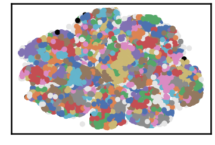

.. parsed-literal::

    k= 15 :Validity score is: 0.24136699730831654 but best score is 0.24136699730831654 at k= 15     
     ==================================================================================================== 
    
    using NGT, Proximity matrix has been calculated  in:  2.1348283290863037  seconds
    There are 4 outlier point(s) in black (noise of type-1) represent 0% of total points
    There are 2809 weak point(s) in light grey (noise of type-2) represent 4% of total points
    DenMune detected 320 clusters 
    

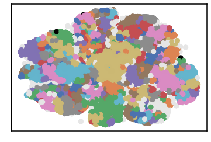

.. parsed-literal::

    k= 20 :Validity score is: 0.4232059826324992 but best score is 0.4232059826324992 at k= 20     
     ==================================================================================================== 
    
    using NGT, Proximity matrix has been calculated  in:  1.7253365516662598  seconds
    There are 1 outlier point(s) in black (noise of type-1) represent 0% of total points
    There are 2984 weak point(s) in light grey (noise of type-2) represent 4% of total points
    DenMune detected 180 clusters 
    

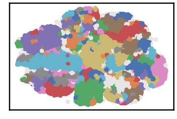

.. parsed-literal::

    k= 25 :Validity score is: 0.5812863092415327 but best score is 0.5812863092415327 at k= 25     
     ==================================================================================================== 
    
    using NGT, Proximity matrix has been calculated  in:  2.007952928543091  seconds
    There are 1 outlier point(s) in black (noise of type-1) represent 0% of total points
    There are 3171 weak point(s) in light grey (noise of type-2) represent 5% of total points
    DenMune detected 118 clusters 
    

.. image:: datasets/mnist/output_3_9.png

.. parsed-literal::

    k= 30 :Validity score is: 0.6841808027373228 but best score is 0.6841808027373228 at k= 30     
     ==================================================================================================== 
    
    using NGT, Proximity matrix has been calculated  in:  2.51125431060791  seconds
    There are 0 outlier point(s) in black (noise of type-1) represent 0% of total points
    There are 5643 weak point(s) in light grey (noise of type-2) represent 8% of total points
    DenMune detected 65 clusters 
    

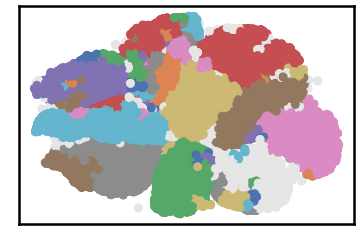

.. parsed-literal::

    k= 35 :Validity score is: 0.8183195120352139 but best score is 0.8183195120352139 at k= 35     
     ==================================================================================================== 
    
    using NGT, Proximity matrix has been calculated  in:  2.4731810092926025  seconds
    There are 0 outlier point(s) in black (noise of type-1) represent 0% of total points
    There are 6593 weak point(s) in light grey (noise of type-2) represent 9% of total points
    DenMune detected 45 clusters 
    

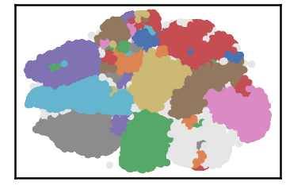

.. parsed-literal::

    k= 40 :Validity score is: 0.869388661912839 but best score is 0.869388661912839 at k= 40     
     ==================================================================================================== 
    
    using NGT, Proximity matrix has been calculated  in:  2.640702486038208  seconds
    There are 0 outlier point(s) in black (noise of type-1) represent 0% of total points
    There are 7047 weak point(s) in light grey (noise of type-2) represent 10% of total points
    DenMune detected 27 clusters 
    

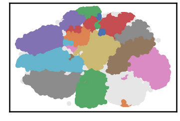

.. parsed-literal::

    k= 45 :Validity score is: 0.8604487496449033 but best score is 0.869388661912839 at k= 40     
     ==================================================================================================== 
    
    using NGT, Proximity matrix has been calculated  in:  3.0415401458740234  seconds
    There are 0 outlier point(s) in black (noise of type-1) represent 0% of total points
    There are 7281 weak point(s) in light grey (noise of type-2) represent 10% of total points
    DenMune detected 20 clusters 
    

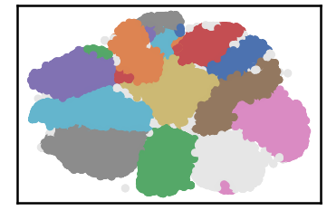

.. parsed-literal::

    k= 50 :Validity score is: 0.8923761291810635 but best score is 0.8923761291810635 at k= 50     
     ==================================================================================================== 
    
    using NGT, Proximity matrix has been calculated  in:  4.494442939758301  seconds
    There are 0 outlier point(s) in black (noise of type-1) represent 0% of total points
    There are 7225 weak point(s) in light grey (noise of type-2) represent 10% of total points
    DenMune detected 18 clusters 
    

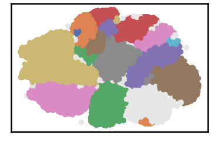

.. parsed-literal::

    k= 55 :Validity score is: 0.7455414449173456 but best score is 0.8923761291810635 at k= 50     
     ==================================================================================================== 
    
    using NGT, Proximity matrix has been calculated  in:  3.7537379264831543  seconds
    There are 0 outlier point(s) in black (noise of type-1) represent 0% of total points
    There are 7255 weak point(s) in light grey (noise of type-2) represent 10% of total points
    DenMune detected 17 clusters 
    

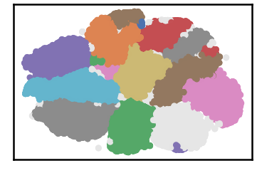

.. parsed-literal::

    k= 60 :Validity score is: 0.9025482341213613 but best score is 0.9025482341213613 at k= 60     
     ==================================================================================================== 
    
    using NGT, Proximity matrix has been calculated  in:  4.078341484069824  seconds
    There are 0 outlier point(s) in black (noise of type-1) represent 0% of total points
    There are 7292 weak point(s) in light grey (noise of type-2) represent 10% of total points
    DenMune detected 10 clusters 
    

.. image:: datasets/mnist/output_3_23.png

.. parsed-literal::

    k= 65 :Validity score is: 0.7212138669974589 but best score is 0.9025482341213613 at k= 60     
     ==================================================================================================== 
    
    using NGT, Proximity matrix has been calculated  in:  4.695742607116699  seconds
    There are 0 outlier point(s) in black (noise of type-1) represent 0% of total points
    There are 7346 weak point(s) in light grey (noise of type-2) represent 10% of total points
    DenMune detected 10 clusters 
    

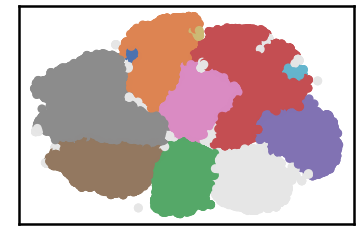

.. parsed-literal::

    k= 70 :Validity score is: 0.720668799668165 but best score is 0.9025482341213613 at k= 60     
     ==================================================================================================== 
    
    using NGT, Proximity matrix has been calculated  in:  4.56486177444458  seconds
    There are 0 outlier point(s) in black (noise of type-1) represent 0% of total points
    There are 7253 weak point(s) in light grey (noise of type-2) represent 10% of total points
    DenMune detected 10 clusters 
    

.. parsed-literal::

    k= 75 :Validity score is: 0.7228516373918583 but best score is 0.9025482341213613 at k= 60     
     ==================================================================================================== 
    
    using NGT, Proximity matrix has been calculated  in:  6.139951229095459  seconds
    There are 0 outlier point(s) in black (noise of type-1) represent 0% of total points
    There are 7270 weak point(s) in light grey (noise of type-2) represent 10% of total points
    DenMune detected 10 clusters 
    

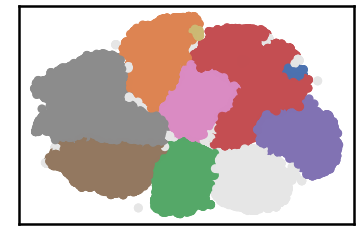

.. parsed-literal::

    k= 80 :Validity score is: 0.7222919851997249 but best score is 0.9025482341213613 at k= 60     
     ==================================================================================================== 
    
    using NGT, Proximity matrix has been calculated  in:  4.792306661605835  seconds
    There are 0 outlier point(s) in black (noise of type-1) represent 0% of total points
    There are 7178 weak point(s) in light grey (noise of type-2) represent 10% of total points
    DenMune detected 10 clusters 
    

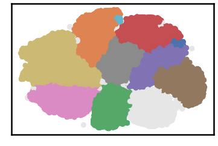

.. parsed-literal::

    k= 85 :Validity score is: 0.838662677989539 but best score is 0.9025482341213613 at k= 60     
     ==================================================================================================== 
    
    using NGT, Proximity matrix has been calculated  in:  7.076320648193359  seconds
    There are 0 outlier point(s) in black (noise of type-1) represent 0% of total points
    There are 7215 weak point(s) in light grey (noise of type-2) represent 10% of total points
    DenMune detected 9 clusters 
    

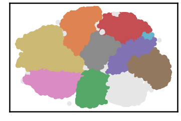

.. parsed-literal::

    k= 90 :Validity score is: 0.8394626132856486 but best score is 0.9025482341213613 at k= 60     
     ==================================================================================================== 
    
    using NGT, Proximity matrix has been calculated  in:  6.858129262924194  seconds
    There are 0 outlier point(s) in black (noise of type-1) represent 0% of total points
    There are 7184 weak point(s) in light grey (noise of type-2) represent 10% of total points
    DenMune detected 8 clusters 
    

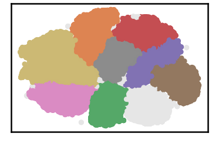

.. parsed-literal::

    k= 95 :Validity score is: 0.8382407163414239 but best score is 0.9025482341213613 at k= 60     
     ==================================================================================================== 
    
    using NGT, Proximity matrix has been calculated  in:  7.545353889465332  seconds
    There are 0 outlier point(s) in black (noise of type-1) represent 0% of total points
    There are 7163 weak point(s) in light grey (noise of type-2) represent 10% of total points
    DenMune detected 9 clusters 
    

.. image:: datasets/mnist/output_3_37.png

.. parsed-literal::

    k= 100 :Validity score is: 0.8393295701599626 but best score is 0.9025482341213613 at k= 60     
     ==================================================================================================== 
    

.. parsed-literal::

    <Figure size 432x288 with 0 Axes>

.. code:: ipython3

    # It is time to save the results
    results_path = 'results/'  # change it to whatever you output results to, set it to ''; so it will output to current folder
    para_file = 'denmune'+ '_para_'  + dataset + '.csv'
    df.sort_values(by=['F1', 'NMI', 'ARI'] , ascending=False, inplace=True)   
    df.to_csv(results_path + para_file, index=False, sep='\t', header=True)

.. code:: ipython3

    df # it is sorted now and saved

.. raw:: html

    

    
    <table border="1" class="dataframe">
      <thead>
        <tr style="text-align: right;">
          <th></th>
          <th>K</th>
          <th>ACC</th>
          <th>F1</th>
          <th>NMI</th>
          <th>AMI</th>
          <th>ARI</th>
          <th>Homogeneity</th>
          <th>Completeness</th>
          <th>Time</th>
        </tr>
      </thead>
      <tbody>
        <tr>
          <th>9</th>
          <td>60.0</td>
          <td>60859.0</td>
          <td>0.902548</td>
          <td>0.860205</td>
          <td>0.860141</td>
          <td>0.837358</td>
          <td>0.899993</td>
          <td>0.823785</td>
          <td>135.141402</td>
        </tr>
        <tr>
          <th>7</th>
          <td>50.0</td>
          <td>59837.0</td>
          <td>0.892376</td>
          <td>0.851150</td>
          <td>0.851071</td>
          <td>0.824614</td>
          <td>0.900579</td>
          <td>0.806864</td>
          <td>107.823716</td>
        </tr>
        <tr>
          <th>5</th>
          <td>40.0</td>
          <td>58371.0</td>
          <td>0.869389</td>
          <td>0.820432</td>
          <td>0.820224</td>
          <td>0.805600</td>
          <td>0.904599</td>
          <td>0.750594</td>
          <td>91.704587</td>
        </tr>
        <tr>
          <th>6</th>
          <td>45.0</td>
          <td>57358.0</td>
          <td>0.860449</td>
          <td>0.836144</td>
          <td>0.836028</td>
          <td>0.805056</td>
          <td>0.903286</td>
          <td>0.778293</td>
          <td>101.851056</td>
        </tr>
        <tr>
          <th>15</th>
          <td>90.0</td>
          <td>60900.0</td>
          <td>0.839463</td>
          <td>0.883543</td>
          <td>0.883513</td>
          <td>0.836640</td>
          <td>0.859595</td>
          <td>0.908864</td>
          <td>221.506331</td>
        </tr>
        <tr>
          <th>17</th>
          <td>100.0</td>
          <td>60891.0</td>
          <td>0.839330</td>
          <td>0.883435</td>
          <td>0.883405</td>
          <td>0.836464</td>
          <td>0.859507</td>
          <td>0.908735</td>
          <td>247.071939</td>
        </tr>
        <tr>
          <th>14</th>
          <td>85.0</td>
          <td>60790.0</td>
          <td>0.838663</td>
          <td>0.882004</td>
          <td>0.881970</td>
          <td>0.834862</td>
          <td>0.859724</td>
          <td>0.905468</td>
          <td>199.185077</td>
        </tr>
        <tr>
          <th>16</th>
          <td>95.0</td>
          <td>60897.0</td>
          <td>0.838241</td>
          <td>0.882144</td>
          <td>0.882117</td>
          <td>0.834635</td>
          <td>0.856037</td>
          <td>0.909894</td>
          <td>235.960343</td>
        </tr>
        <tr>
          <th>4</th>
          <td>35.0</td>
          <td>52921.0</td>
          <td>0.818320</td>
          <td>0.784965</td>
          <td>0.784621</td>
          <td>0.735112</td>
          <td>0.910864</td>
          <td>0.689643</td>
          <td>84.104193</td>
        </tr>
        <tr>
          <th>8</th>
          <td>55.0</td>
          <td>51746.0</td>
          <td>0.745541</td>
          <td>0.828736</td>
          <td>0.828653</td>
          <td>0.744152</td>
          <td>0.858238</td>
          <td>0.801195</td>
          <td>126.094919</td>
        </tr>
        <tr>
          <th>12</th>
          <td>75.0</td>
          <td>54832.0</td>
          <td>0.722852</td>
          <td>0.854626</td>
          <td>0.854582</td>
          <td>0.764475</td>
          <td>0.808873</td>
          <td>0.905865</td>
          <td>181.084767</td>
        </tr>
        <tr>
          <th>13</th>
          <td>80.0</td>
          <td>54794.0</td>
          <td>0.722292</td>
          <td>0.853045</td>
          <td>0.853000</td>
          <td>0.763207</td>
          <td>0.807298</td>
          <td>0.904288</td>
          <td>190.846570</td>
        </tr>
        <tr>
          <th>10</th>
          <td>65.0</td>
          <td>54649.0</td>
          <td>0.721214</td>
          <td>0.851616</td>
          <td>0.851572</td>
          <td>0.761558</td>
          <td>0.808050</td>
          <td>0.900146</td>
          <td>154.162615</td>
        </tr>
        <tr>
          <th>11</th>
          <td>70.0</td>
          <td>54602.0</td>
          <td>0.720669</td>
          <td>0.850541</td>
          <td>0.850497</td>
          <td>0.760620</td>
          <td>0.807119</td>
          <td>0.898901</td>
          <td>173.150218</td>
        </tr>
        <tr>
          <th>3</th>
          <td>30.0</td>
          <td>40757.0</td>
          <td>0.684181</td>
          <td>0.713625</td>
          <td>0.712852</td>
          <td>0.574192</td>
          <td>0.905748</td>
          <td>0.588743</td>
          <td>76.377032</td>
        </tr>
        <tr>
          <th>2</th>
          <td>25.0</td>
          <td>32002.0</td>
          <td>0.581286</td>
          <td>0.664135</td>
          <td>0.662854</td>
          <td>0.445127</td>
          <td>0.914485</td>
          <td>0.521397</td>
          <td>69.463069</td>
        </tr>
        <tr>
          <th>1</th>
          <td>20.0</td>
          <td>20224.0</td>
          <td>0.423206</td>
          <td>0.593064</td>
          <td>0.590573</td>
          <td>0.235793</td>
          <td>0.915303</td>
          <td>0.438639</td>
          <td>65.355177</td>
        </tr>
        <tr>
          <th>0</th>
          <td>15.0</td>
          <td>10064.0</td>
          <td>0.241367</td>
          <td>0.526828</td>
          <td>0.521591</td>
          <td>0.090769</td>
          <td>0.919459</td>
          <td>0.369180</td>
          <td>64.834815</td>
        </tr>
      </tbody>
    </table>
    

