R15 Dataset
=============

.. code:: ipython3

    import time
    import os.path
    import requests
    import pandas as pd

.. code:: ipython3

    # install DenMune clustering algorithm using pip command from the offecial Python repository, PyPi
    # from https://pypi.org/project/denmune/
    !pip install denmune
    
    # now import it
    from denmune import DenMune

.. code:: ipython3

    dataset = 'r15' # let us take Spiral dataset as an example
    
    url = "https://zerobytes.one/denmune_data/"
    file_ext = ".txt"
    ground_ext = "-gt"
    
    dataset_url = url + dataset + file_ext
    groundtruth_url = url + dataset + ground_ext  + file_ext
    
    data_path = 'data/' # change it to whatever you put your data, set it to ''; so it will retrive from current folder
    if  not os.path.isfile(data_path + dataset + file_ext):
        req = requests.get(dataset_url)
        with open(data_path + dataset + file_ext, 'wb') as f:
            f.write(req.content)
            
    if  not os.path.isfile(data_path + dataset + ground_ext + file_ext):
        req = requests.get(groundtruth_url)
        with open(data_path + dataset +  ground_ext + file_ext, 'wb') as f:
            f.write(req.content)       

.. code:: ipython3

    # Denmune's Paramaters
    # DenMune(dataset=dataset, k_nearest=n, data_path=data_path, verpose=verpose_mode, show_plot=show_plot, show_noise=show_noise)
    verpose_mode = True # view in-depth analysis of time complexity and outlier detection, num of clusters
    show_plot = True  # show plots on/off
    show_noise = True # show noise and outlier on/off
    
    # loop's parameters
    start = 3
    step = 2
    end=25
    
    # Validity indexes' parameters
    validity_val = -1
    best_k = 0
    best_val = -1
    
    validity_idx = 2 # Acc=1, F1-score=2,  NMI=3, AMI=4, ARI=5,  Homogeneity=6, and Completeness=7
    df = pd.DataFrame(columns =['K', 'ACC', 'F1', 'NMI', 'AMI', 'ARI','Homogeneity', 'Completeness', 'Time' ])
    
    
    for n in range(start, end+1, step):
        start_time = time.time()
        dm = DenMune(dataset=dataset, k_nearest=n, data_path=data_path, verpose=verpose_mode, show_noise=show_noise)
        labels_true, labels_pred = dm.output_Clusters()
        if show_plot == True and n==start:
            # Let us plot the groundtruth of this dataset which is reduced to 2-d using t-SNE
            print ("Dataset\'s Groundtruht")
            dm.plot_clusters(labels_true, ground=True)
            print('\n', "=====" * 20 , '\n')       
                   
        end_time = time.time()
        
        validity_indexes = dm.validate_Clusters(labels_true, labels_pred)
        validity_val = validity_indexes[validity_idx]
        validity_indexes[0] = n
        validity_indexes[8] = end_time - start_time
        
        df = df.append(pd.Series(validity_indexes, index=df.columns ), ignore_index=True)
        
        if (best_val < validity_val):
            best_val = validity_val
            best_k = n
            # Let us show results where only an improve in accuracy is detected
        if show_plot:
                dm.plot_clusters(labels_pred, show_noise=show_noise)
        print ('k=' , n, ':Validity score is:', validity_val , 'but best score is', best_val, 'at k=', best_k , end='     ')
                
        if not verpose_mode:
            print('\r', end='')
        else:
            print('\n', "=====" * 20 , '\n')

.. parsed-literal::

    using NGT, Proximity matrix has been calculated  in:  0.01089334487915039  seconds
    Dataset's Groundtruht

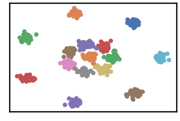

.. parsed-literal::

    
     ==================================================================================================== 
    
    There are 38 outlier point(s) in black (noise of type-1) represent 6% of total points
    There are 0 weak point(s) in light grey (noise of type-2) represent 0% of total points
    DenMune detected 84 clusters 
    

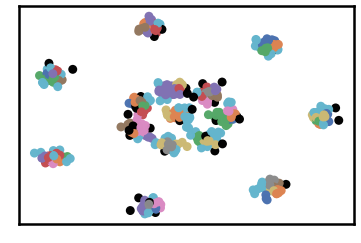

.. parsed-literal::

    k= 3 :Validity score is: 0.42682556375431024 but best score is 0.42682556375431024 at k= 3     
     ==================================================================================================== 
    
    using NGT, Proximity matrix has been calculated  in:  0.011243104934692383  seconds
    There are 9 outlier point(s) in black (noise of type-1) represent 2% of total points
    There are 83 weak point(s) in light grey (noise of type-2) represent 14% of total points
    DenMune detected 27 clusters 
    

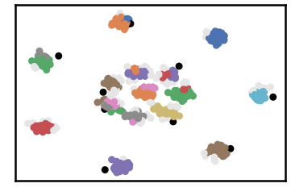

.. parsed-literal::

    k= 5 :Validity score is: 0.8082310558294394 but best score is 0.8082310558294394 at k= 5     
     ==================================================================================================== 
    
    using NGT, Proximity matrix has been calculated  in:  0.01985454559326172  seconds
    There are 6 outlier point(s) in black (noise of type-1) represent 1% of total points
    There are 76 weak point(s) in light grey (noise of type-2) represent 13% of total points
    DenMune detected 16 clusters 
    

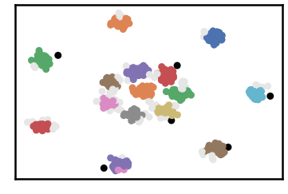

.. parsed-literal::

    k= 7 :Validity score is: 0.9193949292146482 but best score is 0.9193949292146482 at k= 7     
     ==================================================================================================== 
    
    using NGT, Proximity matrix has been calculated  in:  0.016056537628173828  seconds
    There are 4 outlier point(s) in black (noise of type-1) represent 1% of total points
    There are 56 weak point(s) in light grey (noise of type-2) represent 9% of total points
    DenMune detected 15 clusters 
    

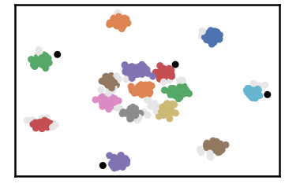

.. parsed-literal::

    k= 9 :Validity score is: 0.9467105925007049 but best score is 0.9467105925007049 at k= 9     
     ==================================================================================================== 
    
    using NGT, Proximity matrix has been calculated  in:  0.016366004943847656  seconds
    There are 4 outlier point(s) in black (noise of type-1) represent 1% of total points
    There are 31 weak point(s) in light grey (noise of type-2) represent 5% of total points
    DenMune detected 15 clusters 
    

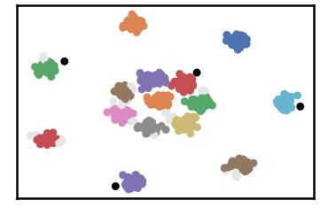

.. parsed-literal::

    k= 11 :Validity score is: 0.967723282843203 but best score is 0.967723282843203 at k= 11     
     ==================================================================================================== 
    
    using NGT, Proximity matrix has been calculated  in:  0.014049768447875977  seconds
    There are 4 outlier point(s) in black (noise of type-1) represent 1% of total points
    There are 24 weak point(s) in light grey (noise of type-2) represent 4% of total points
    DenMune detected 15 clusters 
    

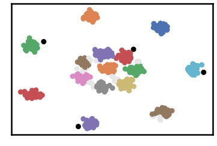

.. parsed-literal::

    k= 13 :Validity score is: 0.9739670975080702 but best score is 0.9739670975080702 at k= 13     
     ==================================================================================================== 
    
    using NGT, Proximity matrix has been calculated  in:  0.014261007308959961  seconds
    There are 3 outlier point(s) in black (noise of type-1) represent 0% of total points
    There are 11 weak point(s) in light grey (noise of type-2) represent 2% of total points
    DenMune detected 15 clusters 
    

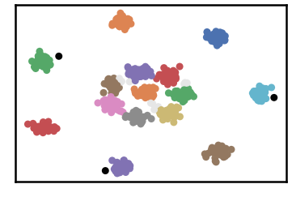

.. parsed-literal::

    k= 15 :Validity score is: 0.9846553717158499 but best score is 0.9846553717158499 at k= 15     
     ==================================================================================================== 
    
    using NGT, Proximity matrix has been calculated  in:  0.017575502395629883  seconds
    There are 2 outlier point(s) in black (noise of type-1) represent 0% of total points
    There are 10 weak point(s) in light grey (noise of type-2) represent 2% of total points
    DenMune detected 15 clusters 
    

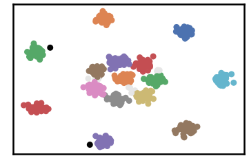

.. parsed-literal::

    k= 17 :Validity score is: 0.9846983672159481 but best score is 0.9846983672159481 at k= 17     
     ==================================================================================================== 
    
    using NGT, Proximity matrix has been calculated  in:  0.018901586532592773  seconds
    There are 1 outlier point(s) in black (noise of type-1) represent 0% of total points
    There are 10 weak point(s) in light grey (noise of type-2) represent 2% of total points
    DenMune detected 15 clusters 
    

.. parsed-literal::

    k= 19 :Validity score is: 0.9872086552817916 but best score is 0.9872086552817916 at k= 19     
     ==================================================================================================== 
    
    using NGT, Proximity matrix has been calculated  in:  0.012954473495483398  seconds
    There are 1 outlier point(s) in black (noise of type-1) represent 0% of total points
    There are 0 weak point(s) in light grey (noise of type-2) represent 0% of total points
    DenMune detected 15 clusters 
    

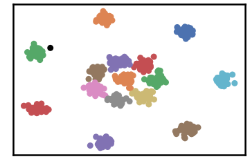

.. parsed-literal::

    k= 21 :Validity score is: 0.9958222638954002 but best score is 0.9958222638954002 at k= 21     
     ==================================================================================================== 
    
    using NGT, Proximity matrix has been calculated  in:  0.017482757568359375  seconds
    There are 1 outlier point(s) in black (noise of type-1) represent 0% of total points
    There are 0 weak point(s) in light grey (noise of type-2) represent 0% of total points
    DenMune detected 15 clusters 
    

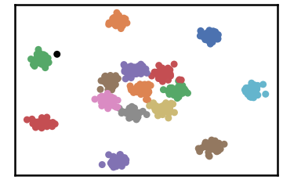

.. parsed-literal::

    k= 23 :Validity score is: 0.9908598626899678 but best score is 0.9958222638954002 at k= 21     
     ==================================================================================================== 
    
    using NGT, Proximity matrix has been calculated  in:  0.016937971115112305  seconds
    There are 0 outlier point(s) in black (noise of type-1) represent 0% of total points
    There are 0 weak point(s) in light grey (noise of type-2) represent 0% of total points
    DenMune detected 15 clusters 
    

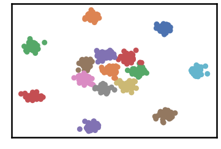

.. parsed-literal::

    k= 25 :Validity score is: 0.9933701507558116 but best score is 0.9958222638954002 at k= 21     
     ==================================================================================================== 
    

.. parsed-literal::

    <Figure size 432x288 with 0 Axes>

.. code:: ipython3

    # It is time to save the results
    results_path = 'results/'  # change it to whatever you output results to, set it to ''; so it will output to current folder
    para_file = 'denmune'+ '_para_'  + dataset + '.csv'
    df.sort_values(by=['F1', 'NMI', 'ARI'] , ascending=False, inplace=True)   
    df.to_csv(results_path + para_file, index=False, sep='\t', header=True)

.. code:: ipython3

    df # it is sorted now and saved

.. raw:: html

    

    
    <table border="1" class="dataframe">
      <thead>
        <tr style="text-align: right;">
          <th></th>
          <th>K</th>
          <th>ACC</th>
          <th>F1</th>
          <th>NMI</th>
          <th>AMI</th>
          <th>ARI</th>
          <th>Homogeneity</th>
          <th>Completeness</th>
          <th>Time</th>
        </tr>
      </thead>
      <tbody>
        <tr>
          <th>9</th>
          <td>21.0</td>
          <td>597.0</td>
          <td>0.995822</td>
          <td>0.992800</td>
          <td>0.992265</td>
          <td>0.990982</td>
          <td>0.994213</td>
          <td>0.991390</td>
          <td>0.223072</td>
        </tr>
        <tr>
          <th>11</th>
          <td>25.0</td>
          <td>596.0</td>
          <td>0.993370</td>
          <td>0.989295</td>
          <td>0.988520</td>
          <td>0.985560</td>
          <td>0.989235</td>
          <td>0.989356</td>
          <td>0.227191</td>
        </tr>
        <tr>
          <th>10</th>
          <td>23.0</td>
          <td>594.0</td>
          <td>0.990860</td>
          <td>0.985007</td>
          <td>0.983894</td>
          <td>0.980228</td>
          <td>0.986372</td>
          <td>0.983646</td>
          <td>0.141636</td>
        </tr>
        <tr>
          <th>8</th>
          <td>19.0</td>
          <td>587.0</td>
          <td>0.987209</td>
          <td>0.977337</td>
          <td>0.975537</td>
          <td>0.971788</td>
          <td>0.985805</td>
          <td>0.969013</td>
          <td>0.260031</td>
        </tr>
        <tr>
          <th>7</th>
          <td>17.0</td>
          <td>585.0</td>
          <td>0.984698</td>
          <td>0.972669</td>
          <td>0.970473</td>
          <td>0.966306</td>
          <td>0.982089</td>
          <td>0.963429</td>
          <td>0.133579</td>
        </tr>
        <tr>
          <th>6</th>
          <td>15.0</td>
          <td>584.0</td>
          <td>0.984655</td>
          <td>0.971102</td>
          <td>0.968759</td>
          <td>0.965660</td>
          <td>0.981714</td>
          <td>0.960717</td>
          <td>0.121075</td>
        </tr>
        <tr>
          <th>5</th>
          <td>13.0</td>
          <td>571.0</td>
          <td>0.973967</td>
          <td>0.950475</td>
          <td>0.946429</td>
          <td>0.936087</td>
          <td>0.964588</td>
          <td>0.936769</td>
          <td>0.247600</td>
        </tr>
        <tr>
          <th>4</th>
          <td>11.0</td>
          <td>564.0</td>
          <td>0.967723</td>
          <td>0.938437</td>
          <td>0.933412</td>
          <td>0.915991</td>
          <td>0.952994</td>
          <td>0.924317</td>
          <td>0.129396</td>
        </tr>
        <tr>
          <th>3</th>
          <td>9.0</td>
          <td>540.0</td>
          <td>0.946711</td>
          <td>0.896411</td>
          <td>0.887938</td>
          <td>0.833002</td>
          <td>0.909241</td>
          <td>0.883938</td>
          <td>0.130982</td>
        </tr>
        <tr>
          <th>2</th>
          <td>7.0</td>
          <td>512.0</td>
          <td>0.919395</td>
          <td>0.859752</td>
          <td>0.847465</td>
          <td>0.741890</td>
          <td>0.873921</td>
          <td>0.846035</td>
          <td>0.267066</td>
        </tr>
        <tr>
          <th>1</th>
          <td>5.0</td>
          <td>417.0</td>
          <td>0.808231</td>
          <td>0.793537</td>
          <td>0.764630</td>
          <td>0.580774</td>
          <td>0.851311</td>
          <td>0.743106</td>
          <td>0.091022</td>
        </tr>
        <tr>
          <th>0</th>
          <td>3.0</td>
          <td>172.0</td>
          <td>0.426826</td>
          <td>0.667179</td>
          <td>0.549026</td>
          <td>0.213600</td>
          <td>0.838155</td>
          <td>0.554140</td>
          <td>0.164184</td>
        </tr>
      </tbody>
    </table>
    

