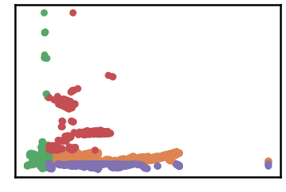
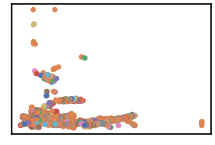
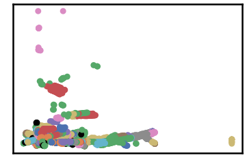
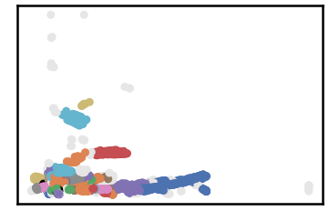
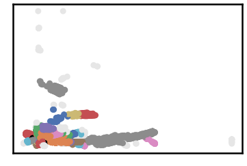
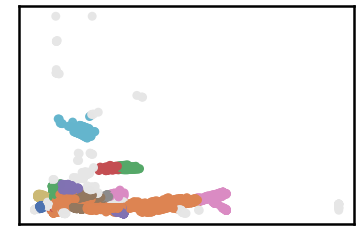
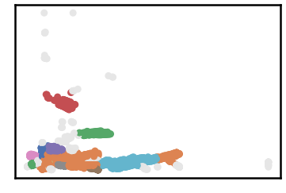
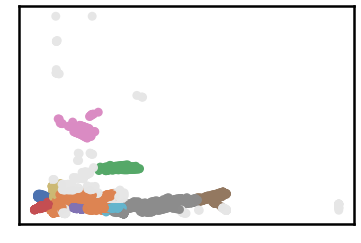
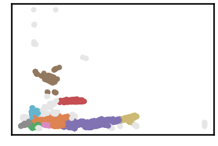

Robot navigation Dataset
===========================

.. code:: ipython3

    import time
    import os.path
    import requests
    import pandas as pd

.. code:: ipython3

    # install DenMune clustering algorithm using pip command from the offecial Python repository, PyPi
    # from https://pypi.org/project/denmune/
    !pip install denmune
    
    # now import it
    from denmune import DenMune

.. code:: ipython3

    dataset = 'robot2d' # let us take Robot navigation (d=2) dataset as an example
    
    url = "https://zerobytes.one/denmune_data/"
    file_ext = ".txt"
    ground_ext = "-gt"
    
    dataset_url = url + dataset + file_ext
    groundtruth_url = url + dataset + ground_ext  + file_ext
    
    data_path = 'data/' # change it to whatever you put your data, set it to ''; so it will retrive from current folder
    if  not os.path.isfile(data_path + dataset + file_ext):
        req = requests.get(dataset_url)
        with open(data_path + dataset + file_ext, 'wb') as f:
            f.write(req.content)
            
    if  not os.path.isfile(data_path + dataset + ground_ext + file_ext):
        req = requests.get(groundtruth_url)
        with open(data_path + dataset +  ground_ext + file_ext, 'wb') as f:
            f.write(req.content)       

.. code:: ipython3

    # Denmune's Paramaters
    # DenMune(dataset=dataset, k_nearest=n, data_path=data_path, verpose=verpose_mode, show_plot=show_plot, show_noise=show_noise)
    verpose_mode = True # view in-depth analysis of time complexity and outlier detection, num of clusters
    show_plot = True  # show plots on/off
    show_noise = True # show noise and outlier on/off
    
    # loop's parameters
    start = 1
    step = 10
    end=80
    
    # Validity indexes' parameters
    validity_val = -1
    best_k = 0
    best_val = -1
    
    validity_idx = 2 # Acc=1, F1-score=2,  NMI=3, AMI=4, ARI=5,  Homogeneity=6, and Completeness=7
    df = pd.DataFrame(columns =['K', 'ACC', 'F1', 'NMI', 'AMI', 'ARI','Homogeneity', 'Completeness', 'Time' ])
    
    
    for n in range(start, end+1, step):
        start_time = time.time()
        dm = DenMune(dataset=dataset, k_nearest=n, data_path=data_path, verpose=verpose_mode, show_noise=show_noise)
        labels_true, labels_pred = dm.output_Clusters()
        if show_plot == True and n==start:
            # Let us plot the groundtruth of this dataset which is reduced to 2-d using t-SNE
            print ("Dataset\'s Groundtruht")
            dm.plot_clusters(labels_true, ground=True)
            print('\n', "=====" * 20 , '\n')       
                   
        end_time = time.time()
        
        validity_indexes = dm.validate_Clusters(labels_true, labels_pred)
        validity_val = validity_indexes[validity_idx]
        validity_indexes[0] = n
        validity_indexes[8] = end_time - start_time
        
        df = df.append(pd.Series(validity_indexes, index=df.columns ), ignore_index=True)
        
        if (best_val < validity_val):
            best_val = validity_val
            best_k = n
            # Let us show results where only an improve in accuracy is detected
        if show_plot:
                dm.plot_clusters(labels_pred, show_noise=show_noise)
        print ('k=' , n, ':Validity score is:', validity_val , 'but best score is', best_val, 'at k=', best_k , end='     ')
                
        if not verpose_mode:
            print('\r', end='')
        else:
            print('\n', "=====" * 20 , '\n')

.. parsed-literal::

    using NGT, Proximity matrix has been calculated  in:  0.08831095695495605  seconds
    Dataset's Groundtruht

.. parsed-literal::

    
     ==================================================================================================== 
    
    There are 0 outlier point(s) in black (noise of type-1) represent 0% of total points
    There are 0 weak point(s) in light grey (noise of type-2) represent 0% of total points
    DenMune detected 1610 clusters 
    

.. parsed-literal::

    k= 1 :Validity score is: 0.15634167319326175 but best score is 0.15634167319326175 at k= 1     
     ==================================================================================================== 
    
    using NGT, Proximity matrix has been calculated  in:  0.13827085494995117  seconds
    There are 19 outlier point(s) in black (noise of type-1) represent 0% of total points
    There are 0 weak point(s) in light grey (noise of type-2) represent 0% of total points
    DenMune detected 120 clusters 
    

.. parsed-literal::

    k= 11 :Validity score is: 0.3018970189562082 but best score is 0.3018970189562082 at k= 11     
     ==================================================================================================== 
    
    using NGT, Proximity matrix has been calculated  in:  0.17598605155944824  seconds
    There are 5 outlier point(s) in black (noise of type-1) represent 0% of total points
    There are 321 weak point(s) in light grey (noise of type-2) represent 6% of total points
    DenMune detected 50 clusters 
    

.. parsed-literal::

    k= 21 :Validity score is: 0.35973819494712317 but best score is 0.35973819494712317 at k= 21     
     ==================================================================================================== 
    
    using NGT, Proximity matrix has been calculated  in:  0.210860013961792  seconds
    There are 3 outlier point(s) in black (noise of type-1) represent 0% of total points
    There are 236 weak point(s) in light grey (noise of type-2) represent 4% of total points
    DenMune detected 29 clusters 
    

.. parsed-literal::

    k= 31 :Validity score is: 0.41775278376109487 but best score is 0.41775278376109487 at k= 31     
     ==================================================================================================== 
    
    using NGT, Proximity matrix has been calculated  in:  0.2326219081878662  seconds
    There are 0 outlier point(s) in black (noise of type-1) represent 0% of total points
    There are 257 weak point(s) in light grey (noise of type-2) represent 5% of total points
    DenMune detected 16 clusters 
    

.. parsed-literal::

    k= 41 :Validity score is: 0.2006537890708819 but best score is 0.41775278376109487 at k= 31     
     ==================================================================================================== 
    
    using NGT, Proximity matrix has been calculated  in:  0.3068885803222656  seconds
    There are 0 outlier point(s) in black (noise of type-1) represent 0% of total points
    There are 245 weak point(s) in light grey (noise of type-2) represent 4% of total points
    DenMune detected 12 clusters 
    

.. parsed-literal::

    k= 51 :Validity score is: 0.2725040947941867 but best score is 0.41775278376109487 at k= 31     
     ==================================================================================================== 
    
    using NGT, Proximity matrix has been calculated  in:  0.3280761241912842  seconds
    There are 0 outlier point(s) in black (noise of type-1) represent 0% of total points
    There are 305 weak point(s) in light grey (noise of type-2) represent 6% of total points
    DenMune detected 10 clusters 
    

.. parsed-literal::

    k= 61 :Validity score is: 0.2738203932396119 but best score is 0.41775278376109487 at k= 31     
     ==================================================================================================== 
    
    using NGT, Proximity matrix has been calculated  in:  0.3262913227081299  seconds
    There are 0 outlier point(s) in black (noise of type-1) represent 0% of total points
    There are 285 weak point(s) in light grey (noise of type-2) represent 5% of total points
    DenMune detected 9 clusters 
    

.. parsed-literal::

    k= 71 :Validity score is: 0.6231549525796931 but best score is 0.6231549525796931 at k= 71     
     ==================================================================================================== 
    

.. parsed-literal::

    <Figure size 432x288 with 0 Axes>

.. code:: ipython3

    # It is time to save the results
    results_path = 'results/'  # change it to whatever you output results to, set it to ''; so it will output to current folder
    para_file = 'denmune'+ '_para_'  + dataset + '.csv'
    df.sort_values(by=['F1', 'NMI', 'ARI'] , ascending=False, inplace=True)   
    df.to_csv(results_path + para_file, index=False, sep='\t', header=True)

.. code:: ipython3

    df # it is sorted now and saved

.. raw:: html

    

    
    <table border="1" class="dataframe">
      <thead>
        <tr style="text-align: right;">
          <th></th>
          <th>K</th>
          <th>ACC</th>
          <th>F1</th>
          <th>NMI</th>
          <th>AMI</th>
          <th>ARI</th>
          <th>Homogeneity</th>
          <th>Completeness</th>
          <th>Time</th>
        </tr>
      </thead>
      <tbody>
        <tr>
          <th>7</th>
          <td>71.0</td>
          <td>2986.0</td>
          <td>0.623155</td>
          <td>0.441913</td>
          <td>0.440965</td>
          <td>0.321620</td>
          <td>0.548669</td>
          <td>0.369934</td>
          <td>7.477833</td>
        </tr>
        <tr>
          <th>3</th>
          <td>31.0</td>
          <td>1695.0</td>
          <td>0.417753</td>
          <td>0.412534</td>
          <td>0.409943</td>
          <td>0.195453</td>
          <td>0.672602</td>
          <td>0.297502</td>
          <td>2.810973</td>
        </tr>
        <tr>
          <th>2</th>
          <td>21.0</td>
          <td>1410.0</td>
          <td>0.359738</td>
          <td>0.377976</td>
          <td>0.373810</td>
          <td>0.124867</td>
          <td>0.699577</td>
          <td>0.258939</td>
          <td>2.096652</td>
        </tr>
        <tr>
          <th>1</th>
          <td>11.0</td>
          <td>1086.0</td>
          <td>0.301897</td>
          <td>0.341978</td>
          <td>0.333054</td>
          <td>0.066286</td>
          <td>0.766279</td>
          <td>0.220104</td>
          <td>1.099149</td>
        </tr>
        <tr>
          <th>6</th>
          <td>61.0</td>
          <td>1702.0</td>
          <td>0.273820</td>
          <td>0.367632</td>
          <td>0.366329</td>
          <td>0.174453</td>
          <td>0.419665</td>
          <td>0.327078</td>
          <td>7.101079</td>
        </tr>
        <tr>
          <th>5</th>
          <td>51.0</td>
          <td>1733.0</td>
          <td>0.272504</td>
          <td>0.338348</td>
          <td>0.336691</td>
          <td>0.143783</td>
          <td>0.383681</td>
          <td>0.302596</td>
          <td>5.916969</td>
        </tr>
        <tr>
          <th>4</th>
          <td>41.0</td>
          <td>1157.0</td>
          <td>0.200654</td>
          <td>0.343456</td>
          <td>0.341524</td>
          <td>0.115152</td>
          <td>0.442555</td>
          <td>0.280619</td>
          <td>3.945728</td>
        </tr>
        <tr>
          <th>0</th>
          <td>1.0</td>
          <td>896.0</td>
          <td>0.156342</td>
          <td>0.219702</td>
          <td>0.091382</td>
          <td>-0.002140</td>
          <td>0.550581</td>
          <td>0.137231</td>
          <td>6.783397</td>
        </tr>
      </tbody>
    </table>
    

