S1 Dataset
=============

.. code:: ipython3

    import time
    import os.path
    import requests
    import pandas as pd

.. code:: ipython3

    # install DenMune clustering algorithm using pip command from the offecial Python repository, PyPi
    # from https://pypi.org/project/denmune/
    !pip install denmune
    
    # now import it
    from denmune import DenMune

.. code:: ipython3

    dataset = 's1' # let us take Jain dataset as an example
    
    url = "https://zerobytes.one/denmune_data/"
    file_ext = ".txt"
    ground_ext = "-gt"
    
    dataset_url = url + dataset + file_ext
    groundtruth_url = url + dataset + ground_ext  + file_ext
    
    data_path = 'data/' # change it to whatever you put your data, set it to ''; so it will retrive from current folder
    if  not os.path.isfile(data_path + dataset + file_ext):
        req = requests.get(dataset_url)
        with open(data_path + dataset + file_ext, 'wb') as f:
            f.write(req.content)
            
    if  not os.path.isfile(data_path + dataset + ground_ext + file_ext):
        req = requests.get(groundtruth_url)
        with open(data_path + dataset +  ground_ext + file_ext, 'wb') as f:
            f.write(req.content)       

.. code:: ipython3

    # Denmune's Paramaters
    # DenMune(dataset=dataset, k_nearest=n, data_path=data_path, verpose=verpose_mode, show_plot=show_plot, show_noise=show_noise)
    verpose_mode = True # view in-depth analysis of time complexity and outlier detection, num of clusters
    show_plot = True  # show plots on/off
    show_noise = True # show noise and outlier on/off
    
    # loop's parameters
    start = 5
    step = 10
    end=50
    
    # Validity indexes' parameters
    validity_val = -1
    best_k = 0
    best_val = -1
    
    validity_idx = 2 # Acc=1, F1-score=2,  NMI=3, AMI=4, ARI=5,  Homogeneity=6, and Completeness=7
    df = pd.DataFrame(columns =['K', 'ACC', 'F1', 'NMI', 'AMI', 'ARI','Homogeneity', 'Completeness', 'Time' ])
    
    
    for n in range(start, end+1, step):
        start_time = time.time()
        dm = DenMune(dataset=dataset, k_nearest=n, data_path=data_path, verpose=verpose_mode, show_noise=show_noise)
        labels_true, labels_pred = dm.output_Clusters()
        if show_plot == True and n==start:
            # Let us plot the groundtruth of this dataset which is reduced to 2-d using t-SNE
            print ("Dataset\'s Groundtruht")
            dm.plot_clusters(labels_true, ground=True)
            print('\n', "=====" * 20 , '\n')       
                   
        end_time = time.time()
        
        validity_indexes = dm.validate_Clusters(labels_true, labels_pred)
        validity_val = validity_indexes[validity_idx]
        validity_indexes[0] = n
        validity_indexes[8] = end_time - start_time
        
        df = df.append(pd.Series(validity_indexes, index=df.columns ), ignore_index=True)
        
        if (best_val < validity_val):
            best_val = validity_val
            best_k = n
            # Let us show results where only an improve in accuracy is detected
        if show_plot:
                dm.plot_clusters(labels_pred, show_noise=show_noise)
        print ('k=' , n, ':Validity score is:', validity_val , 'but best score is', best_val, 'at k=', best_k , end='     ')
                
        if not verpose_mode:
            print('\r', end='')
        else:
            print('\n', "=====" * 20 , '\n')

.. parsed-literal::

    using NGT, Proximity matrix has been calculated  in:  0.09301638603210449  seconds
    Dataset's Groundtruht

.. parsed-literal::

    
     ==================================================================================================== 
    
    There are 3 outlier point(s) in black (noise of type-1) represent 0% of total points
    There are 196 weak point(s) in light grey (noise of type-2) represent 4% of total points
    DenMune detected 60 clusters 
    

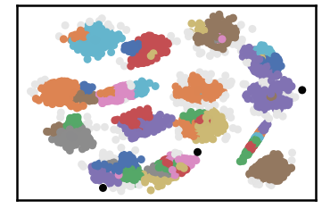

.. parsed-literal::

    k= 10 :Validity score is: 0.7971064638501856 but best score is 0.7971064638501856 at k= 10     
     ==================================================================================================== 
    
    using NGT, Proximity matrix has been calculated  in:  0.1327528953552246  seconds
    There are 0 outlier point(s) in black (noise of type-1) represent 0% of total points
    There are 151 weak point(s) in light grey (noise of type-2) represent 3% of total points
    DenMune detected 20 clusters 
    

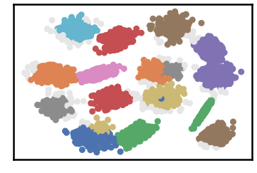

.. parsed-literal::

    k= 20 :Validity score is: 0.9525137881965842 but best score is 0.9525137881965842 at k= 20     
     ==================================================================================================== 
    
    using NGT, Proximity matrix has been calculated  in:  0.18410086631774902  seconds
    There are 0 outlier point(s) in black (noise of type-1) represent 0% of total points
    There are 88 weak point(s) in light grey (noise of type-2) represent 2% of total points
    DenMune detected 18 clusters 
    

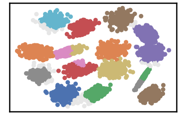

.. parsed-literal::

    k= 30 :Validity score is: 0.9645834351044292 but best score is 0.9645834351044292 at k= 30     
     ==================================================================================================== 
    
    using NGT, Proximity matrix has been calculated  in:  0.28183555603027344  seconds
    There are 0 outlier point(s) in black (noise of type-1) represent 0% of total points
    There are 69 weak point(s) in light grey (noise of type-2) represent 1% of total points
    DenMune detected 15 clusters 
    

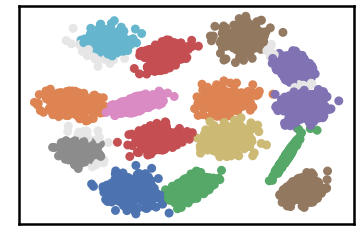

.. parsed-literal::

    k= 40 :Validity score is: 0.9878776164887859 but best score is 0.9878776164887859 at k= 40     
     ==================================================================================================== 
    
    using NGT, Proximity matrix has been calculated  in:  0.2985081672668457  seconds
    There are 0 outlier point(s) in black (noise of type-1) represent 0% of total points
    There are 99 weak point(s) in light grey (noise of type-2) represent 2% of total points
    DenMune detected 15 clusters 
    

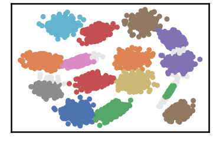

.. parsed-literal::

    k= 50 :Validity score is: 0.9852445683391011 but best score is 0.9878776164887859 at k= 40     
     ==================================================================================================== 
    
    using NGT, Proximity matrix has been calculated  in:  0.36101841926574707  seconds
    There are 0 outlier point(s) in black (noise of type-1) represent 0% of total points
    There are 144 weak point(s) in light grey (noise of type-2) represent 3% of total points
    DenMune detected 15 clusters 
    

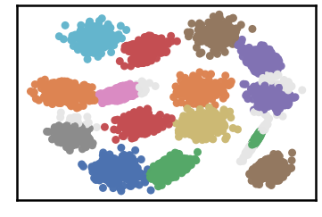

.. parsed-literal::

    k= 60 :Validity score is: 0.9803742114822198 but best score is 0.9878776164887859 at k= 40     
     ==================================================================================================== 
    
    using NGT, Proximity matrix has been calculated  in:  0.31430530548095703  seconds
    There are 0 outlier point(s) in black (noise of type-1) represent 0% of total points
    There are 116 weak point(s) in light grey (noise of type-2) represent 2% of total points
    DenMune detected 15 clusters 
    

.. parsed-literal::

    k= 70 :Validity score is: 0.9825596227324892 but best score is 0.9878776164887859 at k= 40     
     ==================================================================================================== 
    
    using NGT, Proximity matrix has been calculated  in:  0.3495619297027588  seconds
    There are 0 outlier point(s) in black (noise of type-1) represent 0% of total points
    There are 127 weak point(s) in light grey (noise of type-2) represent 3% of total points
    DenMune detected 15 clusters 
    

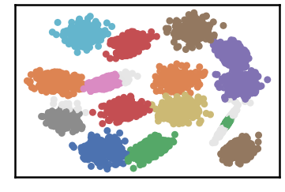

.. parsed-literal::

    k= 80 :Validity score is: 0.980304098210825 but best score is 0.9878776164887859 at k= 40     
     ==================================================================================================== 
    
    using NGT, Proximity matrix has been calculated  in:  0.437852144241333  seconds
    There are 0 outlier point(s) in black (noise of type-1) represent 0% of total points
    There are 130 weak point(s) in light grey (noise of type-2) represent 3% of total points
    DenMune detected 15 clusters 
    

.. parsed-literal::

    k= 90 :Validity score is: 0.9803395842334225 but best score is 0.9878776164887859 at k= 40     
     ==================================================================================================== 
    
    using NGT, Proximity matrix has been calculated  in:  0.3907203674316406  seconds
    There are 0 outlier point(s) in black (noise of type-1) represent 0% of total points
    There are 172 weak point(s) in light grey (noise of type-2) represent 3% of total points
    DenMune detected 15 clusters 
    

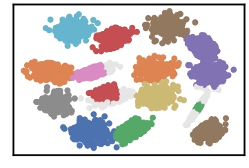

.. parsed-literal::

    k= 100 :Validity score is: 0.9764581274992125 but best score is 0.9878776164887859 at k= 40     
     ==================================================================================================== 
    
    using NGT, Proximity matrix has been calculated  in:  0.4727597236633301  seconds
    There are 0 outlier point(s) in black (noise of type-1) represent 0% of total points
    There are 116 weak point(s) in light grey (noise of type-2) represent 2% of total points
    DenMune detected 15 clusters 
    

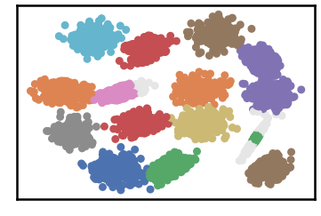

.. parsed-literal::

    k= 110 :Validity score is: 0.9820566635961139 but best score is 0.9878776164887859 at k= 40     
     ==================================================================================================== 
    
    using NGT, Proximity matrix has been calculated  in:  0.6502780914306641  seconds
    There are 0 outlier point(s) in black (noise of type-1) represent 0% of total points
    There are 117 weak point(s) in light grey (noise of type-2) represent 2% of total points
    DenMune detected 15 clusters 
    

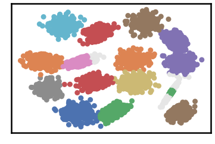

.. parsed-literal::

    k= 120 :Validity score is: 0.9815209332107646 but best score is 0.9878776164887859 at k= 40     
     ==================================================================================================== 
    
    using NGT, Proximity matrix has been calculated  in:  0.485370397567749  seconds
    There are 0 outlier point(s) in black (noise of type-1) represent 0% of total points
    There are 110 weak point(s) in light grey (noise of type-2) represent 2% of total points
    DenMune detected 15 clusters 
    

.. parsed-literal::

    k= 130 :Validity score is: 0.9826361948681608 but best score is 0.9878776164887859 at k= 40     
     ==================================================================================================== 
    
    using NGT, Proximity matrix has been calculated  in:  0.5848991870880127  seconds
    There are 0 outlier point(s) in black (noise of type-1) represent 0% of total points
    There are 110 weak point(s) in light grey (noise of type-2) represent 2% of total points
    DenMune detected 15 clusters 
    

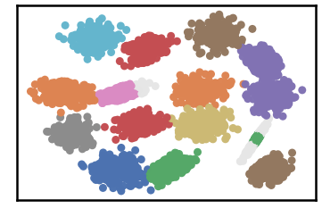

.. parsed-literal::

    k= 140 :Validity score is: 0.9822368360833641 but best score is 0.9878776164887859 at k= 40     
     ==================================================================================================== 
    
    using NGT, Proximity matrix has been calculated  in:  0.5335092544555664  seconds
    There are 0 outlier point(s) in black (noise of type-1) represent 0% of total points
    There are 96 weak point(s) in light grey (noise of type-2) represent 2% of total points
    DenMune detected 15 clusters 
    

.. parsed-literal::

    k= 150 :Validity score is: 0.983864966537716 but best score is 0.9878776164887859 at k= 40     
     ==================================================================================================== 
    
    using NGT, Proximity matrix has been calculated  in:  0.6767749786376953  seconds
    There are 0 outlier point(s) in black (noise of type-1) represent 0% of total points
    There are 66 weak point(s) in light grey (noise of type-2) represent 1% of total points
    DenMune detected 15 clusters 
    

.. image:: datasets/s1/output_3_33.png

.. parsed-literal::

    k= 160 :Validity score is: 0.9881814193720143 but best score is 0.9881814193720143 at k= 160     
     ==================================================================================================== 
    
    using NGT, Proximity matrix has been calculated  in:  0.5669295787811279  seconds
    There are 0 outlier point(s) in black (noise of type-1) represent 0% of total points
    There are 53 weak point(s) in light grey (noise of type-2) represent 1% of total points
    DenMune detected 15 clusters 
    

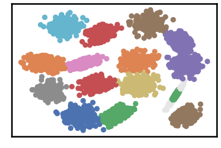

.. parsed-literal::

    k= 170 :Validity score is: 0.9891771114423227 but best score is 0.9891771114423227 at k= 170     
     ==================================================================================================== 
    
    using NGT, Proximity matrix has been calculated  in:  0.6176459789276123  seconds
    There are 0 outlier point(s) in black (noise of type-1) represent 0% of total points
    There are 26 weak point(s) in light grey (noise of type-2) represent 1% of total points
    DenMune detected 15 clusters 
    

.. image:: datasets/s1/output_3_37.png

.. parsed-literal::

    k= 180 :Validity score is: 0.9922724504821739 but best score is 0.9922724504821739 at k= 180     
     ==================================================================================================== 
    
    using NGT, Proximity matrix has been calculated  in:  0.771998405456543  seconds
    There are 0 outlier point(s) in black (noise of type-1) represent 0% of total points
    There are 0 weak point(s) in light grey (noise of type-2) represent 0% of total points
    DenMune detected 15 clusters 
    

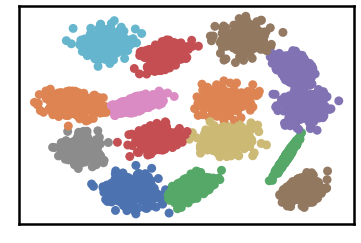

.. parsed-literal::

    k= 190 :Validity score is: 0.9952011642698819 but best score is 0.9952011642698819 at k= 190     
     ==================================================================================================== 
    
    using NGT, Proximity matrix has been calculated  in:  0.8689122200012207  seconds
    There are 0 outlier point(s) in black (noise of type-1) represent 0% of total points
    There are 0 weak point(s) in light grey (noise of type-2) represent 0% of total points
    DenMune detected 15 clusters 
    

.. parsed-literal::

    k= 200 :Validity score is: 0.9952002842400277 but best score is 0.9952011642698819 at k= 190     
     ==================================================================================================== 
    

.. parsed-literal::

    <Figure size 432x288 with 0 Axes>

.. code:: ipython3

    # It is time to save the results
    results_path = 'results/'  # change it to whatever you output results to, set it to ''; so it will output to current folder
    para_file = 'denmune'+ '_para_'  + dataset + '.csv'
    df.sort_values(by=['F1', 'NMI', 'ARI'] , ascending=False, inplace=True)   
    df.to_csv(results_path + para_file, index=False, sep='\t', header=True)

.. code:: ipython3

    df # it is sorted now and saved

.. raw:: html

    

    
    <table border="1" class="dataframe">
      <thead>
        <tr style="text-align: right;">
          <th></th>
          <th>K</th>
          <th>ACC</th>
          <th>F1</th>
          <th>NMI</th>
          <th>AMI</th>
          <th>ARI</th>
          <th>Homogeneity</th>
          <th>Completeness</th>
          <th>Time</th>
        </tr>
      </thead>
      <tbody>
        <tr>
          <th>18</th>
          <td>190.0</td>
          <td>4976.0</td>
          <td>0.995201</td>
          <td>0.989329</td>
          <td>0.989251</td>
          <td>0.989702</td>
          <td>0.989321</td>
          <td>0.989338</td>
          <td>17.449380</td>
        </tr>
        <tr>
          <th>19</th>
          <td>200.0</td>
          <td>4976.0</td>
          <td>0.995200</td>
          <td>0.989226</td>
          <td>0.989147</td>
          <td>0.989698</td>
          <td>0.989221</td>
          <td>0.989232</td>
          <td>19.568756</td>
        </tr>
        <tr>
          <th>17</th>
          <td>180.0</td>
          <td>4949.0</td>
          <td>0.992272</td>
          <td>0.985802</td>
          <td>0.985689</td>
          <td>0.984381</td>
          <td>0.989048</td>
          <td>0.982577</td>
          <td>15.363023</td>
        </tr>
        <tr>
          <th>16</th>
          <td>170.0</td>
          <td>4922.0</td>
          <td>0.989177</td>
          <td>0.984026</td>
          <td>0.983900</td>
          <td>0.980210</td>
          <td>0.989189</td>
          <td>0.978916</td>
          <td>14.794135</td>
        </tr>
        <tr>
          <th>15</th>
          <td>160.0</td>
          <td>4912.0</td>
          <td>0.988181</td>
          <td>0.984462</td>
          <td>0.984339</td>
          <td>0.979836</td>
          <td>0.990309</td>
          <td>0.978683</td>
          <td>14.028737</td>
        </tr>
        <tr>
          <th>3</th>
          <td>40.0</td>
          <td>4906.0</td>
          <td>0.987878</td>
          <td>0.976230</td>
          <td>0.976043</td>
          <td>0.974035</td>
          <td>0.982555</td>
          <td>0.969985</td>
          <td>3.524230</td>
        </tr>
        <tr>
          <th>4</th>
          <td>50.0</td>
          <td>4879.0</td>
          <td>0.985245</td>
          <td>0.972556</td>
          <td>0.972341</td>
          <td>0.968785</td>
          <td>0.980177</td>
          <td>0.965053</td>
          <td>3.521255</td>
        </tr>
        <tr>
          <th>14</th>
          <td>150.0</td>
          <td>4877.0</td>
          <td>0.983865</td>
          <td>0.977172</td>
          <td>0.976992</td>
          <td>0.971371</td>
          <td>0.984392</td>
          <td>0.970056</td>
          <td>11.851536</td>
        </tr>
        <tr>
          <th>12</th>
          <td>130.0</td>
          <td>4866.0</td>
          <td>0.982636</td>
          <td>0.977626</td>
          <td>0.977451</td>
          <td>0.970938</td>
          <td>0.985273</td>
          <td>0.970098</td>
          <td>10.815090</td>
        </tr>
        <tr>
          <th>6</th>
          <td>70.0</td>
          <td>4860.0</td>
          <td>0.982560</td>
          <td>0.972279</td>
          <td>0.972062</td>
          <td>0.966347</td>
          <td>0.980340</td>
          <td>0.964350</td>
          <td>4.684623</td>
        </tr>
        <tr>
          <th>13</th>
          <td>140.0</td>
          <td>4864.0</td>
          <td>0.982237</td>
          <td>0.976767</td>
          <td>0.976585</td>
          <td>0.970066</td>
          <td>0.984409</td>
          <td>0.969243</td>
          <td>13.108546</td>
        </tr>
        <tr>
          <th>10</th>
          <td>110.0</td>
          <td>4860.0</td>
          <td>0.982057</td>
          <td>0.975634</td>
          <td>0.975443</td>
          <td>0.969028</td>
          <td>0.983510</td>
          <td>0.967882</td>
          <td>7.892831</td>
        </tr>
        <tr>
          <th>11</th>
          <td>120.0</td>
          <td>4857.0</td>
          <td>0.981521</td>
          <td>0.974688</td>
          <td>0.974490</td>
          <td>0.968028</td>
          <td>0.982584</td>
          <td>0.966918</td>
          <td>10.305852</td>
        </tr>
        <tr>
          <th>5</th>
          <td>60.0</td>
          <td>4835.0</td>
          <td>0.980374</td>
          <td>0.966785</td>
          <td>0.966525</td>
          <td>0.958946</td>
          <td>0.975805</td>
          <td>0.957930</td>
          <td>4.249030</td>
        </tr>
        <tr>
          <th>8</th>
          <td>90.0</td>
          <td>4844.0</td>
          <td>0.980340</td>
          <td>0.970771</td>
          <td>0.970542</td>
          <td>0.963556</td>
          <td>0.979150</td>
          <td>0.962535</td>
          <td>6.643332</td>
        </tr>
        <tr>
          <th>7</th>
          <td>80.0</td>
          <td>4845.0</td>
          <td>0.980304</td>
          <td>0.970714</td>
          <td>0.970484</td>
          <td>0.963239</td>
          <td>0.979018</td>
          <td>0.962549</td>
          <td>5.774545</td>
        </tr>
        <tr>
          <th>9</th>
          <td>100.0</td>
          <td>4806.0</td>
          <td>0.976458</td>
          <td>0.966517</td>
          <td>0.966255</td>
          <td>0.954243</td>
          <td>0.975972</td>
          <td>0.957243</td>
          <td>6.672032</td>
        </tr>
        <tr>
          <th>2</th>
          <td>30.0</td>
          <td>4694.0</td>
          <td>0.964583</td>
          <td>0.954687</td>
          <td>0.954264</td>
          <td>0.934984</td>
          <td>0.979181</td>
          <td>0.931388</td>
          <td>2.204248</td>
        </tr>
        <tr>
          <th>1</th>
          <td>20.0</td>
          <td>4593.0</td>
          <td>0.952514</td>
          <td>0.934240</td>
          <td>0.933565</td>
          <td>0.910009</td>
          <td>0.964523</td>
          <td>0.905800</td>
          <td>1.466922</td>
        </tr>
        <tr>
          <th>0</th>
          <td>10.0</td>
          <td>3411.0</td>
          <td>0.797106</td>
          <td>0.829484</td>
          <td>0.824367</td>
          <td>0.676664</td>
          <td>0.957105</td>
          <td>0.731893</td>
          <td>1.092771</td>
        </tr>
      </tbody>
    </table>
    

