S2 Dataset
============

.. code:: ipython3

    import time
    import os.path
    import requests
    import pandas as pd

.. code:: ipython3

    # install DenMune clustering algorithm using pip command from the offecial Python repository, PyPi
    # from https://pypi.org/project/denmune/
    !pip install denmune
    
    # now import it
    from denmune import DenMune

.. parsed-literal::

    Defaulting to user installation because normal site-packages is not writeable
    Requirement already satisfied: denmune in /home/jupyter-admin/.local/lib/python3.7/site-packages (0.0.3.8)
    Requirement already satisfied: ngt>=1.11.6 in /opt/tljh/user/lib/python3.7/site-packages (from denmune) (1.11.6)
    Requirement already satisfied: numpy>=1.18.5 in /opt/tljh/user/lib/python3.7/site-packages (from denmune) (1.18.5)
    Requirement already satisfied: pandas>=1.0.3 in /opt/tljh/user/lib/python3.7/site-packages (from denmune) (1.0.3)
    Requirement already satisfied: matplotlib>=3.2.1 in /opt/tljh/user/lib/python3.7/site-packages (from denmune) (3.2.1)
    Requirement already satisfied: anytree>=2.8.0 in /home/jupyter-admin/.local/lib/python3.7/site-packages (from denmune) (2.8.0)
    Requirement already satisfied: scikit-learn>=0.22.1 in /opt/tljh/user/lib/python3.7/site-packages (from denmune) (0.22.1)
    Requirement already satisfied: seaborn>=0.10.1 in /opt/tljh/user/lib/python3.7/site-packages (from denmune) (0.10.1)
    Requirement already satisfied: six>=1.9.0 in /opt/tljh/user/lib/python3.7/site-packages (from anytree>=2.8.0->denmune) (1.12.0)
    Requirement already satisfied: pyparsing!=2.0.4,!=2.1.2,!=2.1.6,>=2.0.1 in /opt/tljh/user/lib/python3.7/site-packages (from matplotlib>=3.2.1->denmune) (2.4.7)
    Requirement already satisfied: python-dateutil>=2.1 in /opt/tljh/user/lib/python3.7/site-packages (from matplotlib>=3.2.1->denmune) (2.8.1)
    Requirement already satisfied: kiwisolver>=1.0.1 in /opt/tljh/user/lib/python3.7/site-packages (from matplotlib>=3.2.1->denmune) (1.2.0)
    Requirement already satisfied: cycler>=0.10 in /opt/tljh/user/lib/python3.7/site-packages (from matplotlib>=3.2.1->denmune) (0.10.0)
    Requirement already satisfied: pybind11 in /opt/tljh/user/lib/python3.7/site-packages (from ngt>=1.11.6->denmune) (2.5.0)
    Requirement already satisfied: pytz>=2017.2 in /opt/tljh/user/lib/python3.7/site-packages (from pandas>=1.0.3->denmune) (2020.1)
    Requirement already satisfied: joblib>=0.11 in /opt/tljh/user/lib/python3.7/site-packages (from scikit-learn>=0.22.1->denmune) (0.15.1)
    Requirement already satisfied: scipy>=0.17.0 in /opt/tljh/user/lib/python3.7/site-packages (from scikit-learn>=0.22.1->denmune) (1.4.1)

.. code:: ipython3

    dataset = 's2' # let us take Jain dataset as an example
    
    url = "https://zerobytes.one/denmune_data/"
    file_ext = ".txt"
    ground_ext = "-gt"
    
    dataset_url = url + dataset + file_ext
    groundtruth_url = url + dataset + ground_ext  + file_ext
    
    data_path = 'data/' # change it to whatever you put your data, set it to ''; so it will retrive from current folder
    if  not os.path.isfile(data_path + dataset + file_ext):
        req = requests.get(dataset_url)
        with open(data_path + dataset + file_ext, 'wb') as f:
            f.write(req.content)
            
    if  not os.path.isfile(data_path + dataset + ground_ext + file_ext):
        req = requests.get(groundtruth_url)
        with open(data_path + dataset +  ground_ext + file_ext, 'wb') as f:
            f.write(req.content)       

.. code:: ipython3

    # Denmune's Paramaters
    # DenMune(dataset=dataset, k_nearest=n, data_path=data_path, verpose=verpose_mode, show_plot=show_plot, show_noise=show_noise)
    verpose_mode = True # view in-depth analysis of time complexity and outlier detection, num of clusters
    show_plot = True  # show plots on/off
    show_noise = True # show noise and outlier on/off
    
    # loop's parameters
    start = 10
    step = 10
    end=200
    
    # Validity indexes' parameters
    validity_val = -1
    best_k = 0
    best_val = -1
    
    validity_idx = 2 # Acc=1, F1-score=2,  NMI=3, AMI=4, ARI=5,  Homogeneity=6, and Completeness=7
    df = pd.DataFrame(columns =['K', 'ACC', 'F1', 'NMI', 'AMI', 'ARI','Homogeneity', 'Completeness', 'Time' ])
    
    
    for n in range(start, end+1, step):
        start_time = time.time()
        dm = DenMune(dataset=dataset, k_nearest=n, data_path=data_path, verpose=verpose_mode, show_noise=show_noise)
        labels_true, labels_pred = dm.output_Clusters()
        if show_plot == True and n==start:
            # Let us plot the groundtruth of this dataset which is reduced to 2-d using t-SNE
            print ("Dataset\'s Groundtruht")
            dm.plot_clusters(labels_true, ground=True)
            print('\n', "=====" * 20 , '\n')       
                   
        end_time = time.time()
        
        validity_indexes = dm.validate_Clusters(labels_true, labels_pred)
        validity_val = validity_indexes[validity_idx]
        validity_indexes[0] = n
        validity_indexes[8] = end_time - start_time
        
        df = df.append(pd.Series(validity_indexes, index=df.columns ), ignore_index=True)
        
        if (best_val < validity_val):
            best_val = validity_val
            best_k = n
            # Let us show results where only an improve in accuracy is detected
        if show_plot:
                dm.plot_clusters(labels_pred, show_noise=show_noise)
        print ('k=' , n, ':Validity score is:', validity_val , 'but best score is', best_val, 'at k=', best_k , end='     ')
                
        if not verpose_mode:
            print('\r', end='')
        else:
            print('\n', "=====" * 20 , '\n')

.. parsed-literal::

    using NGT, Proximity matrix has been calculated  in:  0.08344745635986328  seconds
    Dataset's Groundtruht

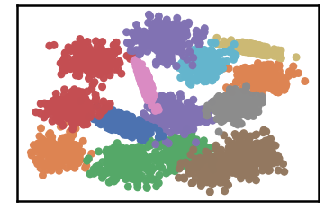

.. parsed-literal::

    
     ==================================================================================================== 
    
    There are 1 outlier point(s) in black (noise of type-1) represent 0% of total points
    There are 153 weak point(s) in light grey (noise of type-2) represent 3% of total points
    DenMune detected 51 clusters 
    

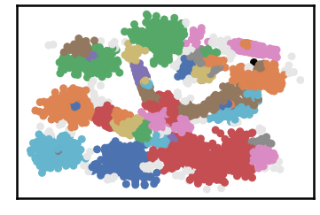

.. parsed-literal::

    k= 10 :Validity score is: 0.6476470524824873 but best score is 0.6476470524824873 at k= 10     
     ==================================================================================================== 
    
    using NGT, Proximity matrix has been calculated  in:  0.14246678352355957  seconds
    There are 1 outlier point(s) in black (noise of type-1) represent 0% of total points
    There are 143 weak point(s) in light grey (noise of type-2) represent 3% of total points
    DenMune detected 21 clusters 
    

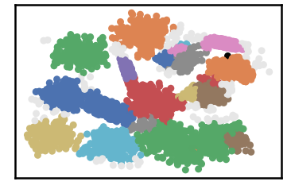

.. parsed-literal::

    k= 20 :Validity score is: 0.6995081745217219 but best score is 0.6995081745217219 at k= 20     
     ==================================================================================================== 
    
    using NGT, Proximity matrix has been calculated  in:  0.13210821151733398  seconds
    There are 0 outlier point(s) in black (noise of type-1) represent 0% of total points
    There are 76 weak point(s) in light grey (noise of type-2) represent 2% of total points
    DenMune detected 16 clusters 
    

.. image:: datasets/s2/output_3_7.png

.. parsed-literal::

    k= 30 :Validity score is: 0.8019679653395814 but best score is 0.8019679653395814 at k= 30     
     ==================================================================================================== 
    
    using NGT, Proximity matrix has been calculated  in:  0.17234373092651367  seconds
    There are 0 outlier point(s) in black (noise of type-1) represent 0% of total points
    There are 151 weak point(s) in light grey (noise of type-2) represent 3% of total points
    DenMune detected 13 clusters 
    

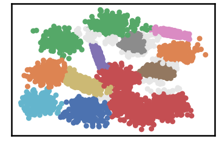

.. parsed-literal::

    k= 40 :Validity score is: 0.8134475174972531 but best score is 0.8134475174972531 at k= 40     
     ==================================================================================================== 
    
    using NGT, Proximity matrix has been calculated  in:  0.254746675491333  seconds
    There are 0 outlier point(s) in black (noise of type-1) represent 0% of total points
    There are 136 weak point(s) in light grey (noise of type-2) represent 3% of total points
    DenMune detected 13 clusters 
    

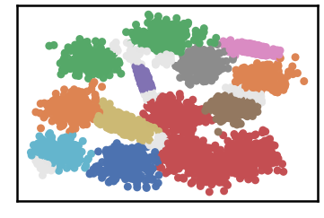

.. parsed-literal::

    k= 50 :Validity score is: 0.8135516563265903 but best score is 0.8135516563265903 at k= 50     
     ==================================================================================================== 
    
    using NGT, Proximity matrix has been calculated  in:  0.34607386589050293  seconds
    There are 0 outlier point(s) in black (noise of type-1) represent 0% of total points
    There are 324 weak point(s) in light grey (noise of type-2) represent 6% of total points
    DenMune detected 14 clusters 
    

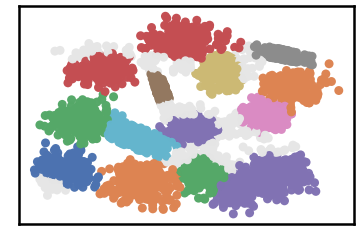

.. parsed-literal::

    k= 60 :Validity score is: 0.8620419017710871 but best score is 0.8620419017710871 at k= 60     
     ==================================================================================================== 
    
    using NGT, Proximity matrix has been calculated  in:  0.39754533767700195  seconds
    There are 0 outlier point(s) in black (noise of type-1) represent 0% of total points
    There are 364 weak point(s) in light grey (noise of type-2) represent 7% of total points
    DenMune detected 15 clusters 
    

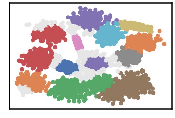

.. parsed-literal::

    k= 70 :Validity score is: 0.9321111887940006 but best score is 0.9321111887940006 at k= 70     
     ==================================================================================================== 
    
    using NGT, Proximity matrix has been calculated  in:  0.3415517807006836  seconds
    There are 0 outlier point(s) in black (noise of type-1) represent 0% of total points
    There are 358 weak point(s) in light grey (noise of type-2) represent 7% of total points
    DenMune detected 15 clusters 
    

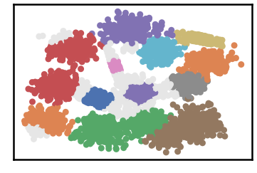

.. parsed-literal::

    k= 80 :Validity score is: 0.9302998301821841 but best score is 0.9321111887940006 at k= 70     
     ==================================================================================================== 
    
    using NGT, Proximity matrix has been calculated  in:  0.33071303367614746  seconds
    There are 0 outlier point(s) in black (noise of type-1) represent 0% of total points
    There are 394 weak point(s) in light grey (noise of type-2) represent 8% of total points
    DenMune detected 16 clusters 
    

.. image:: datasets/s2/output_3_19.png

.. parsed-literal::

    k= 90 :Validity score is: 0.9276235816320223 but best score is 0.9321111887940006 at k= 70     
     ==================================================================================================== 
    
    using NGT, Proximity matrix has been calculated  in:  0.4978787899017334  seconds
    There are 0 outlier point(s) in black (noise of type-1) represent 0% of total points
    There are 471 weak point(s) in light grey (noise of type-2) represent 9% of total points
    DenMune detected 15 clusters 
    

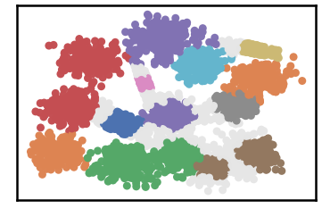

.. parsed-literal::

    k= 100 :Validity score is: 0.9248615551252839 but best score is 0.9321111887940006 at k= 70     
     ==================================================================================================== 
    
    using NGT, Proximity matrix has been calculated  in:  0.44110798835754395  seconds
    There are 0 outlier point(s) in black (noise of type-1) represent 0% of total points
    There are 335 weak point(s) in light grey (noise of type-2) represent 7% of total points
    DenMune detected 15 clusters 
    

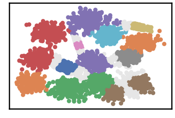

.. parsed-literal::

    k= 110 :Validity score is: 0.9396448216417084 but best score is 0.9396448216417084 at k= 110     
     ==================================================================================================== 
    
    using NGT, Proximity matrix has been calculated  in:  0.4978938102722168  seconds
    There are 0 outlier point(s) in black (noise of type-1) represent 0% of total points
    There are 291 weak point(s) in light grey (noise of type-2) represent 6% of total points
    DenMune detected 15 clusters 
    

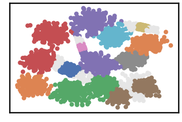

.. parsed-literal::

    k= 120 :Validity score is: 0.9372990266577004 but best score is 0.9396448216417084 at k= 110     
     ==================================================================================================== 
    
    using NGT, Proximity matrix has been calculated  in:  0.5990688800811768  seconds
    There are 0 outlier point(s) in black (noise of type-1) represent 0% of total points
    There are 170 weak point(s) in light grey (noise of type-2) represent 3% of total points
    DenMune detected 15 clusters 
    

.. parsed-literal::

    k= 130 :Validity score is: 0.9470976930330729 but best score is 0.9470976930330729 at k= 130     
     ==================================================================================================== 
    
    using NGT, Proximity matrix has been calculated  in:  0.6244940757751465  seconds
    There are 0 outlier point(s) in black (noise of type-1) represent 0% of total points
    There are 109 weak point(s) in light grey (noise of type-2) represent 2% of total points
    DenMune detected 15 clusters 
    

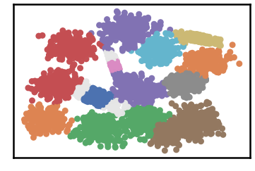

.. parsed-literal::

    k= 140 :Validity score is: 0.952431572317505 but best score is 0.952431572317505 at k= 140     
     ==================================================================================================== 
    
    using NGT, Proximity matrix has been calculated  in:  0.6929934024810791  seconds
    There are 0 outlier point(s) in black (noise of type-1) represent 0% of total points
    There are 71 weak point(s) in light grey (noise of type-2) represent 1% of total points
    DenMune detected 15 clusters 
    

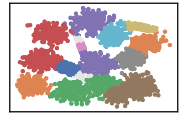

.. parsed-literal::

    k= 150 :Validity score is: 0.9577379949357644 but best score is 0.9577379949357644 at k= 150     
     ==================================================================================================== 
    
    using NGT, Proximity matrix has been calculated  in:  0.5759756565093994  seconds
    There are 0 outlier point(s) in black (noise of type-1) represent 0% of total points
    There are 0 weak point(s) in light grey (noise of type-2) represent 0% of total points
    DenMune detected 15 clusters 
    

.. parsed-literal::

    k= 160 :Validity score is: 0.9616886384072888 but best score is 0.9616886384072888 at k= 160     
     ==================================================================================================== 
    
    using NGT, Proximity matrix has been calculated  in:  0.6682028770446777  seconds
    There are 0 outlier point(s) in black (noise of type-1) represent 0% of total points
    There are 0 weak point(s) in light grey (noise of type-2) represent 0% of total points
    DenMune detected 15 clusters 
    

.. image:: datasets/s2/output_3_35.png

.. parsed-literal::

    k= 170 :Validity score is: 0.9632867527581535 but best score is 0.9632867527581535 at k= 170     
     ==================================================================================================== 
    
    using NGT, Proximity matrix has been calculated  in:  0.7933950424194336  seconds
    There are 0 outlier point(s) in black (noise of type-1) represent 0% of total points
    There are 0 weak point(s) in light grey (noise of type-2) represent 0% of total points
    DenMune detected 15 clusters 
    

.. parsed-literal::

    k= 180 :Validity score is: 0.9658655308385496 but best score is 0.9658655308385496 at k= 180     
     ==================================================================================================== 
    
    using NGT, Proximity matrix has been calculated  in:  0.7028090953826904  seconds
    There are 0 outlier point(s) in black (noise of type-1) represent 0% of total points
    There are 0 weak point(s) in light grey (noise of type-2) represent 0% of total points
    DenMune detected 15 clusters 
    

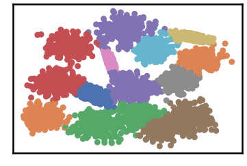

.. parsed-literal::

    k= 190 :Validity score is: 0.9672424984489025 but best score is 0.9672424984489025 at k= 190     
     ==================================================================================================== 
    
    using NGT, Proximity matrix has been calculated  in:  0.9236400127410889  seconds
    There are 0 outlier point(s) in black (noise of type-1) represent 0% of total points
    There are 0 weak point(s) in light grey (noise of type-2) represent 0% of total points
    DenMune detected 15 clusters 
    

.. parsed-literal::

    k= 200 :Validity score is: 0.9677954331699078 but best score is 0.9677954331699078 at k= 200     
     ==================================================================================================== 
    

.. parsed-literal::

    <Figure size 432x288 with 0 Axes>

.. code:: ipython3

    # It is time to save the results
    results_path = 'results/'  # change it to whatever you output results to, set it to ''; so it will output to current folder
    para_file = 'denmune'+ '_para_'  + dataset + '.csv'
    df.sort_values(by=['F1', 'NMI', 'ARI'] , ascending=False, inplace=True)   
    df.to_csv(results_path + para_file, index=False, sep='\t', header=True)

.. code:: ipython3

    df # it is sorted now and saved

.. raw:: html

    

    
    <table border="1" class="dataframe">
      <thead>
        <tr style="text-align: right;">
          <th></th>
          <th>K</th>
          <th>ACC</th>
          <th>F1</th>
          <th>NMI</th>
          <th>AMI</th>
          <th>ARI</th>
          <th>Homogeneity</th>
          <th>Completeness</th>
          <th>Time</th>
        </tr>
      </thead>
      <tbody>
        <tr>
          <th>19</th>
          <td>200.0</td>
          <td>4839.0</td>
          <td>0.967795</td>
          <td>0.943464</td>
          <td>0.943048</td>
          <td>0.933339</td>
          <td>0.943417</td>
          <td>0.943512</td>
          <td>20.449993</td>
        </tr>
        <tr>
          <th>18</th>
          <td>190.0</td>
          <td>4836.0</td>
          <td>0.967242</td>
          <td>0.943428</td>
          <td>0.943011</td>
          <td>0.932059</td>
          <td>0.943368</td>
          <td>0.943488</td>
          <td>18.535582</td>
        </tr>
        <tr>
          <th>17</th>
          <td>180.0</td>
          <td>4829.0</td>
          <td>0.965866</td>
          <td>0.941956</td>
          <td>0.941529</td>
          <td>0.929275</td>
          <td>0.941888</td>
          <td>0.942023</td>
          <td>16.147110</td>
        </tr>
        <tr>
          <th>16</th>
          <td>170.0</td>
          <td>4816.0</td>
          <td>0.963287</td>
          <td>0.939392</td>
          <td>0.938946</td>
          <td>0.924060</td>
          <td>0.939242</td>
          <td>0.939542</td>
          <td>15.055896</td>
        </tr>
        <tr>
          <th>15</th>
          <td>160.0</td>
          <td>4808.0</td>
          <td>0.961689</td>
          <td>0.936752</td>
          <td>0.936286</td>
          <td>0.920623</td>
          <td>0.936569</td>
          <td>0.936934</td>
          <td>14.511147</td>
        </tr>
        <tr>
          <th>14</th>
          <td>150.0</td>
          <td>4758.0</td>
          <td>0.957738</td>
          <td>0.931889</td>
          <td>0.931353</td>
          <td>0.915015</td>
          <td>0.937703</td>
          <td>0.926146</td>
          <td>12.715962</td>
        </tr>
        <tr>
          <th>13</th>
          <td>140.0</td>
          <td>4715.0</td>
          <td>0.952432</td>
          <td>0.926425</td>
          <td>0.925848</td>
          <td>0.905023</td>
          <td>0.933809</td>
          <td>0.919157</td>
          <td>11.220277</td>
        </tr>
        <tr>
          <th>12</th>
          <td>130.0</td>
          <td>4661.0</td>
          <td>0.947098</td>
          <td>0.918884</td>
          <td>0.918250</td>
          <td>0.892058</td>
          <td>0.927850</td>
          <td>0.910091</td>
          <td>10.278394</td>
        </tr>
        <tr>
          <th>10</th>
          <td>110.0</td>
          <td>4550.0</td>
          <td>0.939645</td>
          <td>0.900007</td>
          <td>0.899226</td>
          <td>0.859254</td>
          <td>0.910007</td>
          <td>0.890224</td>
          <td>7.563737</td>
        </tr>
        <tr>
          <th>11</th>
          <td>120.0</td>
          <td>4560.0</td>
          <td>0.937299</td>
          <td>0.902295</td>
          <td>0.901532</td>
          <td>0.863614</td>
          <td>0.912119</td>
          <td>0.892680</td>
          <td>10.034118</td>
        </tr>
        <tr>
          <th>6</th>
          <td>70.0</td>
          <td>4500.0</td>
          <td>0.932111</td>
          <td>0.894624</td>
          <td>0.893801</td>
          <td>0.842390</td>
          <td>0.904189</td>
          <td>0.885260</td>
          <td>5.012626</td>
        </tr>
        <tr>
          <th>7</th>
          <td>80.0</td>
          <td>4495.0</td>
          <td>0.930300</td>
          <td>0.894388</td>
          <td>0.893563</td>
          <td>0.841773</td>
          <td>0.903862</td>
          <td>0.885110</td>
          <td>5.017143</td>
        </tr>
        <tr>
          <th>8</th>
          <td>90.0</td>
          <td>4436.0</td>
          <td>0.927624</td>
          <td>0.882437</td>
          <td>0.881460</td>
          <td>0.828048</td>
          <td>0.897407</td>
          <td>0.867959</td>
          <td>6.594405</td>
        </tr>
        <tr>
          <th>9</th>
          <td>100.0</td>
          <td>4422.0</td>
          <td>0.924862</td>
          <td>0.881572</td>
          <td>0.880645</td>
          <td>0.813366</td>
          <td>0.889836</td>
          <td>0.873460</td>
          <td>8.789676</td>
        </tr>
        <tr>
          <th>5</th>
          <td>60.0</td>
          <td>4270.0</td>
          <td>0.862042</td>
          <td>0.885341</td>
          <td>0.884492</td>
          <td>0.813228</td>
          <td>0.881088</td>
          <td>0.889634</td>
          <td>5.407281</td>
        </tr>
        <tr>
          <th>4</th>
          <td>50.0</td>
          <td>4175.0</td>
          <td>0.813552</td>
          <td>0.898971</td>
          <td>0.898258</td>
          <td>0.770663</td>
          <td>0.871892</td>
          <td>0.927785</td>
          <td>3.458734</td>
        </tr>
        <tr>
          <th>3</th>
          <td>40.0</td>
          <td>4173.0</td>
          <td>0.813448</td>
          <td>0.896830</td>
          <td>0.896104</td>
          <td>0.771253</td>
          <td>0.870773</td>
          <td>0.924494</td>
          <td>2.532613</td>
        </tr>
        <tr>
          <th>2</th>
          <td>30.0</td>
          <td>4067.0</td>
          <td>0.801968</td>
          <td>0.895353</td>
          <td>0.894444</td>
          <td>0.753883</td>
          <td>0.881110</td>
          <td>0.910063</td>
          <td>1.767720</td>
        </tr>
        <tr>
          <th>1</th>
          <td>20.0</td>
          <td>3623.0</td>
          <td>0.699508</td>
          <td>0.851647</td>
          <td>0.849947</td>
          <td>0.692691</td>
          <td>0.841299</td>
          <td>0.862252</td>
          <td>1.329110</td>
        </tr>
        <tr>
          <th>0</th>
          <td>10.0</td>
          <td>2913.0</td>
          <td>0.647647</td>
          <td>0.788285</td>
          <td>0.782820</td>
          <td>0.581016</td>
          <td>0.880598</td>
          <td>0.713490</td>
          <td>1.157112</td>
        </tr>
      </tbody>
    </table>
    

