Seeds datasets
=================

.. code:: ipython3

    import time
    import os.path
    import requests
    import pandas as pd

.. code:: ipython3

    # install DenMune clustering algorithm using pip command from the offecial Python repository, PyPi
    # from https://pypi.org/project/denmune/
    !pip install denmune
    
    # now import it
    from denmune import DenMune

.. code:: ipython3

    dataset = 'seeds' # let us take Seeds dataset as an example
    
    url = "https://zerobytes.one/denmune_data/"
    file_ext = ".txt"
    ground_ext = "-gt"
    
    dataset_url = url + dataset + file_ext
    groundtruth_url = url + dataset + ground_ext  + file_ext
    
    data_path = 'data/' # change it to whatever you put your data, set it to ''; so it will retrive from current folder
    if  not os.path.isfile(data_path + dataset + file_ext):
        req = requests.get(dataset_url)
        with open(data_path + dataset + file_ext, 'wb') as f:
            f.write(req.content)
            
    if  not os.path.isfile(data_path + dataset + ground_ext + file_ext):
        req = requests.get(groundtruth_url)
        with open(data_path + dataset +  ground_ext + file_ext, 'wb') as f:
            f.write(req.content)       

.. code:: ipython3

    # Denmune's Paramaters
    # DenMune(dataset=dataset, k_nearest=n, data_path=data_path, verpose=verpose_mode, show_plot=show_plot, show_noise=show_noise)
    verpose_mode = True # view in-depth analysis of time complexity and outlier detection, num of clusters
    show_plot = True  # show plots on/off
    show_noise = True # show noise and outlier on/off
    
    # loop's parameters
    start = 2
    step = 1
    end=40
    
    # Validity indexes' parameters
    validity_val = -1
    best_k = 0
    best_val = -1
    
    validity_idx = 2 # Acc=1, F1-score=2,  NMI=3, AMI=4, ARI=5,  Homogeneity=6, and Completeness=7
    df = pd.DataFrame(columns =['K', 'ACC', 'F1', 'NMI', 'AMI', 'ARI','Homogeneity', 'Completeness', 'Time' ])
    
    
    for n in range(start, end+1, step):
        start_time = time.time()
        dm = DenMune(dataset=dataset, k_nearest=n, data_path=data_path, verpose=verpose_mode, show_noise=show_noise)
        labels_true, labels_pred = dm.output_Clusters()
        if show_plot == True and n==start:
            # Let us plot the groundtruth of this dataset which is reduced to 2-d using t-SNE
            print ("Dataset\'s Groundtruht")
            dm.plot_clusters(labels_true, ground=True)
            print('\n', "=====" * 20 , '\n')       
                   
        end_time = time.time()
        
        validity_indexes = dm.validate_Clusters(labels_true, labels_pred)
        validity_val = validity_indexes[validity_idx]
        validity_indexes[0] = n
        validity_indexes[8] = end_time - start_time
        
        df = df.append(pd.Series(validity_indexes, index=df.columns ), ignore_index=True)
        
        if (best_val < validity_val):
            best_val = validity_val
            best_k = n
            # Let us show results where only an improve in accuracy is detected
        if show_plot:
                dm.plot_clusters(labels_pred, show_noise=show_noise)
        print ('k=' , n, ':Validity score is:', validity_val , 'but best score is', best_val, 'at k=', best_k , end='     ')
                
        if not verpose_mode:
            print('\r', end='')
        else:
            print('\n', "=====" * 20 , '\n')

.. parsed-literal::

    using NGT, Proximity matrix has been calculated  in:  0.003916263580322266  seconds
    Dataset's Groundtruht

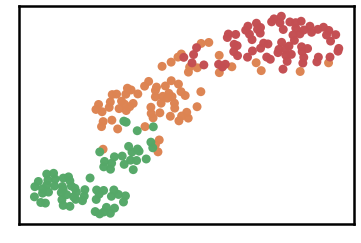

.. parsed-literal::

    
     ==================================================================================================== 
    
    There are 0 outlier point(s) in black (noise of type-1) represent 0% of total points
    There are 14 weak point(s) in light grey (noise of type-2) represent 7% of total points
    DenMune detected 41 clusters 
    

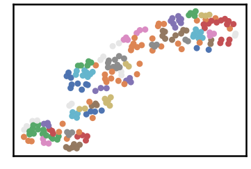

.. parsed-literal::

    k= 2 :Validity score is: 0.27897907419150286 but best score is 0.27897907419150286 at k= 2     
     ==================================================================================================== 
    
    using NGT, Proximity matrix has been calculated  in:  0.002784252166748047  seconds
    There are 6 outlier point(s) in black (noise of type-1) represent 3% of total points
    There are 2 weak point(s) in light grey (noise of type-2) represent 1% of total points
    DenMune detected 26 clusters 
    

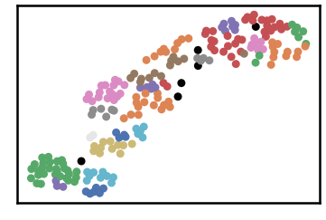

.. parsed-literal::

    k= 3 :Validity score is: 0.41489403842345024 but best score is 0.41489403842345024 at k= 3     
     ==================================================================================================== 
    
    using NGT, Proximity matrix has been calculated  in:  0.004817962646484375  seconds
    There are 1 outlier point(s) in black (noise of type-1) represent 0% of total points
    There are 6 weak point(s) in light grey (noise of type-2) represent 3% of total points
    DenMune detected 12 clusters 
    

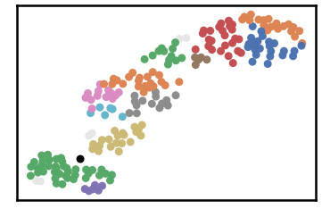

.. parsed-literal::

    k= 4 :Validity score is: 0.5467642288501776 but best score is 0.5467642288501776 at k= 4     
     ==================================================================================================== 
    
    using NGT, Proximity matrix has been calculated  in:  0.00525665283203125  seconds
    There are 1 outlier point(s) in black (noise of type-1) represent 0% of total points
    There are 0 weak point(s) in light grey (noise of type-2) represent 0% of total points
    DenMune detected 7 clusters 
    

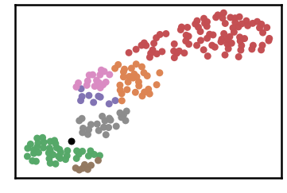

.. parsed-literal::

    k= 5 :Validity score is: 0.7301217301217302 but best score is 0.7301217301217302 at k= 5     
     ==================================================================================================== 
    
    using NGT, Proximity matrix has been calculated  in:  0.0033538341522216797  seconds
    There are 1 outlier point(s) in black (noise of type-1) represent 0% of total points
    There are 0 weak point(s) in light grey (noise of type-2) represent 0% of total points
    DenMune detected 4 clusters 
    

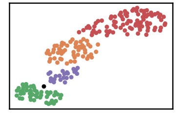

.. parsed-literal::

    k= 6 :Validity score is: 0.8357687712526423 but best score is 0.8357687712526423 at k= 6     
     ==================================================================================================== 
    
    using NGT, Proximity matrix has been calculated  in:  0.0037734508514404297  seconds
    There are 0 outlier point(s) in black (noise of type-1) represent 0% of total points
    There are 0 weak point(s) in light grey (noise of type-2) represent 0% of total points
    DenMune detected 7 clusters 
    

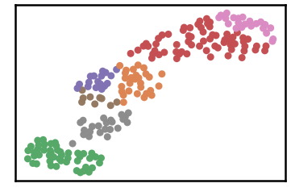

.. parsed-literal::

    k= 7 :Validity score is: 0.6902857073432767 but best score is 0.8357687712526423 at k= 6     
     ==================================================================================================== 
    
    using NGT, Proximity matrix has been calculated  in:  0.003976345062255859  seconds
    There are 0 outlier point(s) in black (noise of type-1) represent 0% of total points
    There are 0 weak point(s) in light grey (noise of type-2) represent 0% of total points
    DenMune detected 5 clusters 
    

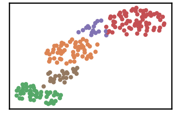

.. parsed-literal::

    k= 8 :Validity score is: 0.8413853768692479 but best score is 0.8413853768692479 at k= 8     
     ==================================================================================================== 
    
    using NGT, Proximity matrix has been calculated  in:  0.004312276840209961  seconds
    There are 0 outlier point(s) in black (noise of type-1) represent 0% of total points
    There are 0 weak point(s) in light grey (noise of type-2) represent 0% of total points
    DenMune detected 5 clusters 
    

.. parsed-literal::

    k= 9 :Validity score is: 0.8421891507050664 but best score is 0.8421891507050664 at k= 9     
     ==================================================================================================== 
    
    using NGT, Proximity matrix has been calculated  in:  0.004160404205322266  seconds
    There are 0 outlier point(s) in black (noise of type-1) represent 0% of total points
    There are 0 weak point(s) in light grey (noise of type-2) represent 0% of total points
    DenMune detected 4 clusters 
    

.. parsed-literal::

    k= 10 :Validity score is: 0.8423317398232653 but best score is 0.8423317398232653 at k= 10     
     ==================================================================================================== 
    
    using NGT, Proximity matrix has been calculated  in:  0.0040132999420166016  seconds
    There are 0 outlier point(s) in black (noise of type-1) represent 0% of total points
    There are 0 weak point(s) in light grey (noise of type-2) represent 0% of total points
    DenMune detected 4 clusters 
    

.. parsed-literal::

    k= 11 :Validity score is: 0.8413344498503655 but best score is 0.8423317398232653 at k= 10     
     ==================================================================================================== 
    
    using NGT, Proximity matrix has been calculated  in:  0.0045163631439208984  seconds
    There are 0 outlier point(s) in black (noise of type-1) represent 0% of total points
    There are 0 weak point(s) in light grey (noise of type-2) represent 0% of total points
    DenMune detected 3 clusters 
    

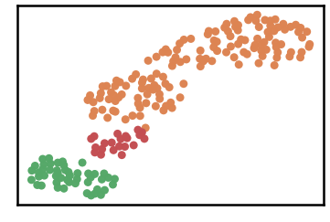

.. parsed-literal::

    k= 12 :Validity score is: 0.48287680402709726 but best score is 0.8423317398232653 at k= 10     
     ==================================================================================================== 
    
    using NGT, Proximity matrix has been calculated  in:  0.00416111946105957  seconds
    There are 0 outlier point(s) in black (noise of type-1) represent 0% of total points
    There are 0 weak point(s) in light grey (noise of type-2) represent 0% of total points
    DenMune detected 3 clusters 
    

.. parsed-literal::

    k= 13 :Validity score is: 0.48287680402709726 but best score is 0.8423317398232653 at k= 10     
     ==================================================================================================== 
    
    using NGT, Proximity matrix has been calculated  in:  0.0034024715423583984  seconds
    There are 0 outlier point(s) in black (noise of type-1) represent 0% of total points
    There are 0 weak point(s) in light grey (noise of type-2) represent 0% of total points
    DenMune detected 3 clusters 
    

.. parsed-literal::

    k= 14 :Validity score is: 0.4807102502017757 but best score is 0.8423317398232653 at k= 10     
     ==================================================================================================== 
    
    using NGT, Proximity matrix has been calculated  in:  0.003764629364013672  seconds
    There are 0 outlier point(s) in black (noise of type-1) represent 0% of total points
    There are 0 weak point(s) in light grey (noise of type-2) represent 0% of total points
    DenMune detected 2 clusters 
    

.. image:: datasets/seeds/output_3_29.png

.. parsed-literal::

    k= 15 :Validity score is: 0.47233586596532245 but best score is 0.8423317398232653 at k= 10     
     ==================================================================================================== 
    
    using NGT, Proximity matrix has been calculated  in:  0.0037212371826171875  seconds
    There are 0 outlier point(s) in black (noise of type-1) represent 0% of total points
    There are 0 weak point(s) in light grey (noise of type-2) represent 0% of total points
    DenMune detected 2 clusters 
    

.. image:: datasets/seeds/output_3_31.png

.. parsed-literal::

    k= 16 :Validity score is: 0.47233586596532245 but best score is 0.8423317398232653 at k= 10     
     ==================================================================================================== 
    
    using NGT, Proximity matrix has been calculated  in:  0.004815578460693359  seconds
    There are 0 outlier point(s) in black (noise of type-1) represent 0% of total points
    There are 0 weak point(s) in light grey (noise of type-2) represent 0% of total points
    DenMune detected 2 clusters 
    

.. image:: datasets/seeds/output_3_33.png

.. parsed-literal::

    k= 17 :Validity score is: 0.47233586596532245 but best score is 0.8423317398232653 at k= 10     
     ==================================================================================================== 
    
    using NGT, Proximity matrix has been calculated  in:  0.0054399967193603516  seconds
    There are 0 outlier point(s) in black (noise of type-1) represent 0% of total points
    There are 0 weak point(s) in light grey (noise of type-2) represent 0% of total points
    DenMune detected 2 clusters 
    

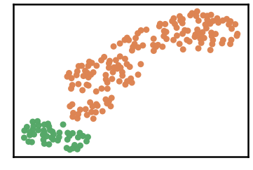

.. parsed-literal::

    k= 18 :Validity score is: 0.47233586596532245 but best score is 0.8423317398232653 at k= 10     
     ==================================================================================================== 
    
    using NGT, Proximity matrix has been calculated  in:  0.005685091018676758  seconds
    There are 0 outlier point(s) in black (noise of type-1) represent 0% of total points
    There are 0 weak point(s) in light grey (noise of type-2) represent 0% of total points
    DenMune detected 2 clusters 
    

.. parsed-literal::

    k= 19 :Validity score is: 0.47233586596532245 but best score is 0.8423317398232653 at k= 10     
     ==================================================================================================== 
    
    using NGT, Proximity matrix has been calculated  in:  0.003610849380493164  seconds
    There are 0 outlier point(s) in black (noise of type-1) represent 0% of total points
    There are 0 weak point(s) in light grey (noise of type-2) represent 0% of total points
    DenMune detected 2 clusters 
    

.. image:: datasets/seeds/output_3_39.png

.. parsed-literal::

    k= 20 :Validity score is: 0.47233586596532245 but best score is 0.8423317398232653 at k= 10     
     ==================================================================================================== 
    
    using NGT, Proximity matrix has been calculated  in:  0.006106853485107422  seconds
    There are 0 outlier point(s) in black (noise of type-1) represent 0% of total points
    There are 0 weak point(s) in light grey (noise of type-2) represent 0% of total points
    DenMune detected 2 clusters 
    

.. image:: datasets/seeds/output_3_41.png

.. parsed-literal::

    k= 21 :Validity score is: 0.47233586596532245 but best score is 0.8423317398232653 at k= 10     
     ==================================================================================================== 
    
    using NGT, Proximity matrix has been calculated  in:  0.005724191665649414  seconds
    There are 0 outlier point(s) in black (noise of type-1) represent 0% of total points
    There are 0 weak point(s) in light grey (noise of type-2) represent 0% of total points
    DenMune detected 2 clusters 
    

.. parsed-literal::

    k= 22 :Validity score is: 0.4765300059417706 but best score is 0.8423317398232653 at k= 10     
     ==================================================================================================== 
    
    using NGT, Proximity matrix has been calculated  in:  0.004357099533081055  seconds
    There are 0 outlier point(s) in black (noise of type-1) represent 0% of total points
    There are 0 weak point(s) in light grey (noise of type-2) represent 0% of total points
    DenMune detected 2 clusters 
    

.. image:: datasets/seeds/output_3_45.png

.. parsed-literal::

    k= 23 :Validity score is: 0.4806763285024155 but best score is 0.8423317398232653 at k= 10     
     ==================================================================================================== 
    
    using NGT, Proximity matrix has been calculated  in:  0.005303621292114258  seconds
    There are 0 outlier point(s) in black (noise of type-1) represent 0% of total points
    There are 0 weak point(s) in light grey (noise of type-2) represent 0% of total points
    DenMune detected 2 clusters 
    

.. parsed-literal::

    k= 24 :Validity score is: 0.4806763285024155 but best score is 0.8423317398232653 at k= 10     
     ==================================================================================================== 
    
    using NGT, Proximity matrix has been calculated  in:  0.0048694610595703125  seconds
    There are 0 outlier point(s) in black (noise of type-1) represent 0% of total points
    There are 0 weak point(s) in light grey (noise of type-2) represent 0% of total points
    DenMune detected 3 clusters 
    

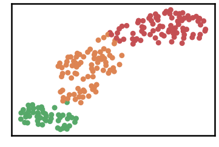

.. parsed-literal::

    k= 25 :Validity score is: 0.8457827987707225 but best score is 0.8457827987707225 at k= 25     
     ==================================================================================================== 
    
    using NGT, Proximity matrix has been calculated  in:  0.0070154666900634766  seconds
    There are 0 outlier point(s) in black (noise of type-1) represent 0% of total points
    There are 0 weak point(s) in light grey (noise of type-2) represent 0% of total points
    DenMune detected 3 clusters 
    

.. parsed-literal::

    k= 26 :Validity score is: 0.8410351777588464 but best score is 0.8457827987707225 at k= 25     
     ==================================================================================================== 
    
    using NGT, Proximity matrix has been calculated  in:  0.008509159088134766  seconds
    There are 0 outlier point(s) in black (noise of type-1) represent 0% of total points
    There are 0 weak point(s) in light grey (noise of type-2) represent 0% of total points
    DenMune detected 2 clusters 
    

.. parsed-literal::

    k= 27 :Validity score is: 0.4806763285024155 but best score is 0.8457827987707225 at k= 25     
     ==================================================================================================== 
    
    using NGT, Proximity matrix has been calculated  in:  0.0060770511627197266  seconds
    There are 0 outlier point(s) in black (noise of type-1) represent 0% of total points
    There are 0 weak point(s) in light grey (noise of type-2) represent 0% of total points
    DenMune detected 2 clusters 
    

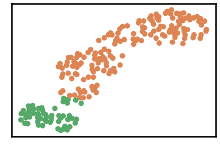

.. parsed-literal::

    k= 28 :Validity score is: 0.4968122561613855 but best score is 0.8457827987707225 at k= 25     
     ==================================================================================================== 
    
    using NGT, Proximity matrix has been calculated  in:  0.0073621273040771484  seconds
    There are 0 outlier point(s) in black (noise of type-1) represent 0% of total points
    There are 0 weak point(s) in light grey (noise of type-2) represent 0% of total points
    DenMune detected 3 clusters 
    

.. parsed-literal::

    k= 29 :Validity score is: 0.8555555555555554 but best score is 0.8555555555555554 at k= 29     
     ==================================================================================================== 
    
    using NGT, Proximity matrix has been calculated  in:  0.007261753082275391  seconds
    There are 0 outlier point(s) in black (noise of type-1) represent 0% of total points
    There are 0 weak point(s) in light grey (noise of type-2) represent 0% of total points
    DenMune detected 3 clusters 
    

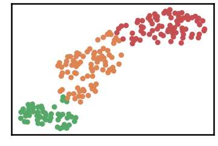

.. parsed-literal::

    k= 30 :Validity score is: 0.8569256178620499 but best score is 0.8569256178620499 at k= 30     
     ==================================================================================================== 
    
    using NGT, Proximity matrix has been calculated  in:  0.007007598876953125  seconds
    There are 0 outlier point(s) in black (noise of type-1) represent 0% of total points
    There are 0 weak point(s) in light grey (noise of type-2) represent 0% of total points
    DenMune detected 3 clusters 
    

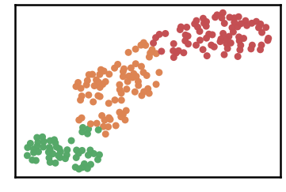

.. parsed-literal::

    k= 31 :Validity score is: 0.8667640064155743 but best score is 0.8667640064155743 at k= 31     
     ==================================================================================================== 
    
    using NGT, Proximity matrix has been calculated  in:  0.006173849105834961  seconds
    There are 0 outlier point(s) in black (noise of type-1) represent 0% of total points
    There are 0 weak point(s) in light grey (noise of type-2) represent 0% of total points
    DenMune detected 3 clusters 
    

.. image:: datasets/seeds/output_3_63.png

.. parsed-literal::

    k= 32 :Validity score is: 0.8667640064155743 but best score is 0.8667640064155743 at k= 31     
     ==================================================================================================== 
    
    using NGT, Proximity matrix has been calculated  in:  0.008446931838989258  seconds
    There are 0 outlier point(s) in black (noise of type-1) represent 0% of total points
    There are 0 weak point(s) in light grey (noise of type-2) represent 0% of total points
    DenMune detected 3 clusters 
    

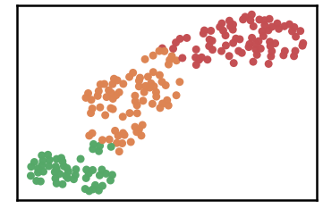

.. parsed-literal::

    k= 33 :Validity score is: 0.8620255547739588 but best score is 0.8667640064155743 at k= 31     
     ==================================================================================================== 
    
    using NGT, Proximity matrix has been calculated  in:  0.007668733596801758  seconds
    There are 0 outlier point(s) in black (noise of type-1) represent 0% of total points
    There are 0 weak point(s) in light grey (noise of type-2) represent 0% of total points
    DenMune detected 3 clusters 
    

.. parsed-literal::

    k= 34 :Validity score is: 0.8667640064155743 but best score is 0.8667640064155743 at k= 31     
     ==================================================================================================== 
    
    using NGT, Proximity matrix has been calculated  in:  0.008543729782104492  seconds
    There are 0 outlier point(s) in black (noise of type-1) represent 0% of total points
    There are 0 weak point(s) in light grey (noise of type-2) represent 0% of total points
    DenMune detected 3 clusters 
    

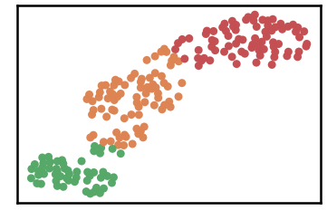

.. parsed-literal::

    k= 35 :Validity score is: 0.8716432520904732 but best score is 0.8716432520904732 at k= 35     
     ==================================================================================================== 
    
    using NGT, Proximity matrix has been calculated  in:  0.009981393814086914  seconds
    There are 0 outlier point(s) in black (noise of type-1) represent 0% of total points
    There are 0 weak point(s) in light grey (noise of type-2) represent 0% of total points
    DenMune detected 3 clusters 
    

.. parsed-literal::

    k= 36 :Validity score is: 0.8716432520904732 but best score is 0.8716432520904732 at k= 35     
     ==================================================================================================== 
    
    using NGT, Proximity matrix has been calculated  in:  0.007881879806518555  seconds
    There are 0 outlier point(s) in black (noise of type-1) represent 0% of total points
    There are 0 weak point(s) in light grey (noise of type-2) represent 0% of total points
    DenMune detected 3 clusters 
    

.. image:: datasets/seeds/output_3_73.png

.. parsed-literal::

    k= 37 :Validity score is: 0.8716432520904732 but best score is 0.8716432520904732 at k= 35     
     ==================================================================================================== 
    
    using NGT, Proximity matrix has been calculated  in:  0.008330583572387695  seconds
    There are 0 outlier point(s) in black (noise of type-1) represent 0% of total points
    There are 0 weak point(s) in light grey (noise of type-2) represent 0% of total points
    DenMune detected 3 clusters 
    

.. parsed-literal::

    k= 38 :Validity score is: 0.9004646147503289 but best score is 0.9004646147503289 at k= 38     
     ==================================================================================================== 
    
    using NGT, Proximity matrix has been calculated  in:  0.010681867599487305  seconds
    There are 0 outlier point(s) in black (noise of type-1) represent 0% of total points
    There are 0 weak point(s) in light grey (noise of type-2) represent 0% of total points
    DenMune detected 3 clusters 
    

.. parsed-literal::

    k= 39 :Validity score is: 0.9004646147503289 but best score is 0.9004646147503289 at k= 38     
     ==================================================================================================== 
    
    using NGT, Proximity matrix has been calculated  in:  0.010917186737060547  seconds
    There are 0 outlier point(s) in black (noise of type-1) represent 0% of total points
    There are 0 weak point(s) in light grey (noise of type-2) represent 0% of total points
    DenMune detected 3 clusters 
    

.. parsed-literal::

    k= 40 :Validity score is: 0.8957069908066585 but best score is 0.9004646147503289 at k= 38     
     ==================================================================================================== 
    

.. parsed-literal::

    <Figure size 432x288 with 0 Axes>

.. code:: ipython3

    # It is time to save the results
    results_path = 'results/'  # change it to whatever you output results to, set it to ''; so it will output to current folder
    para_file = 'denmune'+ '_para_'  + dataset + '.csv'
    df.sort_values(by=['F1', 'NMI', 'ARI'] , ascending=False, inplace=True)   
    df.to_csv(results_path + para_file, index=False, sep='\t', header=True)

.. code:: ipython3

    df # it is sorted now and saved

.. raw:: html

    

    
    <table border="1" class="dataframe">
      <thead>
        <tr style="text-align: right;">
          <th></th>
          <th>K</th>
          <th>ACC</th>
          <th>F1</th>
          <th>NMI</th>
          <th>AMI</th>
          <th>ARI</th>
          <th>Homogeneity</th>
          <th>Completeness</th>
          <th>Time</th>
        </tr>
      </thead>
      <tbody>
        <tr>
          <th>36</th>
          <td>38.0</td>
          <td>189.0</td>
          <td>0.900465</td>
          <td>0.716585</td>
          <td>0.714067</td>
          <td>0.727835</td>
          <td>0.714794</td>
          <td>0.718385</td>
          <td>0.098336</td>
        </tr>
        <tr>
          <th>37</th>
          <td>39.0</td>
          <td>189.0</td>
          <td>0.900465</td>
          <td>0.716585</td>
          <td>0.714067</td>
          <td>0.727835</td>
          <td>0.714794</td>
          <td>0.718385</td>
          <td>0.096565</td>
        </tr>
        <tr>
          <th>38</th>
          <td>40.0</td>
          <td>188.0</td>
          <td>0.895707</td>
          <td>0.708453</td>
          <td>0.705861</td>
          <td>0.716466</td>
          <td>0.706358</td>
          <td>0.710560</td>
          <td>0.192422</td>
        </tr>
        <tr>
          <th>33</th>
          <td>35.0</td>
          <td>183.0</td>
          <td>0.871643</td>
          <td>0.672844</td>
          <td>0.669925</td>
          <td>0.663214</td>
          <td>0.668643</td>
          <td>0.677097</td>
          <td>0.183936</td>
        </tr>
        <tr>
          <th>34</th>
          <td>36.0</td>
          <td>183.0</td>
          <td>0.871643</td>
          <td>0.672844</td>
          <td>0.669925</td>
          <td>0.663214</td>
          <td>0.668643</td>
          <td>0.677097</td>
          <td>0.095151</td>
        </tr>
        <tr>
          <th>35</th>
          <td>37.0</td>
          <td>183.0</td>
          <td>0.871643</td>
          <td>0.672844</td>
          <td>0.669925</td>
          <td>0.663214</td>
          <td>0.668643</td>
          <td>0.677097</td>
          <td>0.088227</td>
        </tr>
        <tr>
          <th>29</th>
          <td>31.0</td>
          <td>182.0</td>
          <td>0.866764</td>
          <td>0.666561</td>
          <td>0.663583</td>
          <td>0.653294</td>
          <td>0.661827</td>
          <td>0.671362</td>
          <td>0.151942</td>
        </tr>
        <tr>
          <th>30</th>
          <td>32.0</td>
          <td>182.0</td>
          <td>0.866764</td>
          <td>0.666561</td>
          <td>0.663583</td>
          <td>0.653294</td>
          <td>0.661827</td>
          <td>0.671362</td>
          <td>0.070147</td>
        </tr>
        <tr>
          <th>32</th>
          <td>34.0</td>
          <td>182.0</td>
          <td>0.866764</td>
          <td>0.666561</td>
          <td>0.663583</td>
          <td>0.653294</td>
          <td>0.661827</td>
          <td>0.671362</td>
          <td>0.075542</td>
        </tr>
        <tr>
          <th>31</th>
          <td>33.0</td>
          <td>181.0</td>
          <td>0.862026</td>
          <td>0.658551</td>
          <td>0.655503</td>
          <td>0.643045</td>
          <td>0.653911</td>
          <td>0.663258</td>
          <td>0.088146</td>
        </tr>
        <tr>
          <th>28</th>
          <td>30.0</td>
          <td>180.0</td>
          <td>0.856926</td>
          <td>0.654691</td>
          <td>0.651601</td>
          <td>0.634196</td>
          <td>0.648784</td>
          <td>0.660707</td>
          <td>0.070528</td>
        </tr>
        <tr>
          <th>27</th>
          <td>29.0</td>
          <td>180.0</td>
          <td>0.855556</td>
          <td>0.681061</td>
          <td>0.678205</td>
          <td>0.643153</td>
          <td>0.674358</td>
          <td>0.687899</td>
          <td>0.069376</td>
        </tr>
        <tr>
          <th>23</th>
          <td>25.0</td>
          <td>178.0</td>
          <td>0.845783</td>
          <td>0.668189</td>
          <td>0.665214</td>
          <td>0.624491</td>
          <td>0.660909</td>
          <td>0.675632</td>
          <td>0.055123</td>
        </tr>
        <tr>
          <th>8</th>
          <td>10.0</td>
          <td>169.0</td>
          <td>0.842332</td>
          <td>0.665279</td>
          <td>0.661124</td>
          <td>0.627024</td>
          <td>0.721444</td>
          <td>0.617228</td>
          <td>0.032485</td>
        </tr>
        <tr>
          <th>7</th>
          <td>9.0</td>
          <td>161.0</td>
          <td>0.842189</td>
          <td>0.643375</td>
          <td>0.637889</td>
          <td>0.622821</td>
          <td>0.757806</td>
          <td>0.558968</td>
          <td>0.034528</td>
        </tr>
        <tr>
          <th>6</th>
          <td>8.0</td>
          <td>161.0</td>
          <td>0.841385</td>
          <td>0.643257</td>
          <td>0.637769</td>
          <td>0.625780</td>
          <td>0.757502</td>
          <td>0.558957</td>
          <td>0.115563</td>
        </tr>
        <tr>
          <th>9</th>
          <td>11.0</td>
          <td>168.0</td>
          <td>0.841334</td>
          <td>0.666054</td>
          <td>0.661928</td>
          <td>0.626164</td>
          <td>0.724878</td>
          <td>0.616061</td>
          <td>0.038269</td>
        </tr>
        <tr>
          <th>24</th>
          <td>26.0</td>
          <td>177.0</td>
          <td>0.841035</td>
          <td>0.660987</td>
          <td>0.657947</td>
          <td>0.614740</td>
          <td>0.653749</td>
          <td>0.668386</td>
          <td>0.063526</td>
        </tr>
        <tr>
          <th>4</th>
          <td>6.0</td>
          <td>167.0</td>
          <td>0.835769</td>
          <td>0.650783</td>
          <td>0.644933</td>
          <td>0.614481</td>
          <td>0.713892</td>
          <td>0.597926</td>
          <td>0.029990</td>
        </tr>
        <tr>
          <th>3</th>
          <td>5.0</td>
          <td>138.0</td>
          <td>0.730122</td>
          <td>0.582791</td>
          <td>0.571694</td>
          <td>0.504661</td>
          <td>0.732011</td>
          <td>0.484107</td>
          <td>0.034003</td>
        </tr>
        <tr>
          <th>5</th>
          <td>7.0</td>
          <td>122.0</td>
          <td>0.690286</td>
          <td>0.575261</td>
          <td>0.566266</td>
          <td>0.434343</td>
          <td>0.754413</td>
          <td>0.464868</td>
          <td>0.029441</td>
        </tr>
        <tr>
          <th>2</th>
          <td>4.0</td>
          <td>82.0</td>
          <td>0.546764</td>
          <td>0.495576</td>
          <td>0.475244</td>
          <td>0.304006</td>
          <td>0.792561</td>
          <td>0.360494</td>
          <td>0.029062</td>
        </tr>
        <tr>
          <th>26</th>
          <td>28.0</td>
          <td>124.0</td>
          <td>0.496812</td>
          <td>0.468479</td>
          <td>0.465385</td>
          <td>0.323887</td>
          <td>0.355781</td>
          <td>0.685673</td>
          <td>0.068783</td>
        </tr>
        <tr>
          <th>10</th>
          <td>12.0</td>
          <td>115.0</td>
          <td>0.482877</td>
          <td>0.536727</td>
          <td>0.531997</td>
          <td>0.400950</td>
          <td>0.472350</td>
          <td>0.621420</td>
          <td>0.037904</td>
        </tr>
        <tr>
          <th>11</th>
          <td>13.0</td>
          <td>115.0</td>
          <td>0.482877</td>
          <td>0.536727</td>
          <td>0.531997</td>
          <td>0.400950</td>
          <td>0.472350</td>
          <td>0.621420</td>
          <td>0.041916</td>
        </tr>
        <tr>
          <th>12</th>
          <td>14.0</td>
          <td>114.0</td>
          <td>0.480710</td>
          <td>0.529008</td>
          <td>0.524227</td>
          <td>0.398115</td>
          <td>0.467710</td>
          <td>0.608798</td>
          <td>0.037166</td>
        </tr>
        <tr>
          <th>21</th>
          <td>23.0</td>
          <td>120.0</td>
          <td>0.480676</td>
          <td>0.424223</td>
          <td>0.420826</td>
          <td>0.273929</td>
          <td>0.318084</td>
          <td>0.636669</td>
          <td>0.051765</td>
        </tr>
        <tr>
          <th>22</th>
          <td>24.0</td>
          <td>120.0</td>
          <td>0.480676</td>
          <td>0.424223</td>
          <td>0.420826</td>
          <td>0.273929</td>
          <td>0.318084</td>
          <td>0.636669</td>
          <td>0.138868</td>
        </tr>
        <tr>
          <th>25</th>
          <td>27.0</td>
          <td>120.0</td>
          <td>0.480676</td>
          <td>0.424223</td>
          <td>0.420826</td>
          <td>0.273929</td>
          <td>0.318084</td>
          <td>0.636669</td>
          <td>0.168939</td>
        </tr>
        <tr>
          <th>20</th>
          <td>22.0</td>
          <td>119.0</td>
          <td>0.476530</td>
          <td>0.413733</td>
          <td>0.410261</td>
          <td>0.262147</td>
          <td>0.309164</td>
          <td>0.625195</td>
          <td>0.048238</td>
        </tr>
        <tr>
          <th>13</th>
          <td>15.0</td>
          <td>118.0</td>
          <td>0.472336</td>
          <td>0.403444</td>
          <td>0.399897</td>
          <td>0.250646</td>
          <td>0.300423</td>
          <td>0.613993</td>
          <td>0.034628</td>
        </tr>
        <tr>
          <th>14</th>
          <td>16.0</td>
          <td>118.0</td>
          <td>0.472336</td>
          <td>0.403444</td>
          <td>0.399897</td>
          <td>0.250646</td>
          <td>0.300423</td>
          <td>0.613993</td>
          <td>0.035560</td>
        </tr>
        <tr>
          <th>15</th>
          <td>17.0</td>
          <td>118.0</td>
          <td>0.472336</td>
          <td>0.403444</td>
          <td>0.399897</td>
          <td>0.250646</td>
          <td>0.300423</td>
          <td>0.613993</td>
          <td>0.046811</td>
        </tr>
        <tr>
          <th>16</th>
          <td>18.0</td>
          <td>118.0</td>
          <td>0.472336</td>
          <td>0.403444</td>
          <td>0.399897</td>
          <td>0.250646</td>
          <td>0.300423</td>
          <td>0.613993</td>
          <td>0.051038</td>
        </tr>
        <tr>
          <th>17</th>
          <td>19.0</td>
          <td>118.0</td>
          <td>0.472336</td>
          <td>0.403444</td>
          <td>0.399897</td>
          <td>0.250646</td>
          <td>0.300423</td>
          <td>0.613993</td>
          <td>0.132252</td>
        </tr>
        <tr>
          <th>18</th>
          <td>20.0</td>
          <td>118.0</td>
          <td>0.472336</td>
          <td>0.403444</td>
          <td>0.399897</td>
          <td>0.250646</td>
          <td>0.300423</td>
          <td>0.613993</td>
          <td>0.040339</td>
        </tr>
        <tr>
          <th>19</th>
          <td>21.0</td>
          <td>118.0</td>
          <td>0.472336</td>
          <td>0.403444</td>
          <td>0.399897</td>
          <td>0.250646</td>
          <td>0.300423</td>
          <td>0.613993</td>
          <td>0.048479</td>
        </tr>
        <tr>
          <th>1</th>
          <td>3.0</td>
          <td>57.0</td>
          <td>0.414894</td>
          <td>0.427366</td>
          <td>0.382748</td>
          <td>0.166026</td>
          <td>0.816856</td>
          <td>0.289383</td>
          <td>0.022669</td>
        </tr>
        <tr>
          <th>0</th>
          <td>2.0</td>
          <td>36.0</td>
          <td>0.278979</td>
          <td>0.357057</td>
          <td>0.280810</td>
          <td>0.068350</td>
          <td>0.744962</td>
          <td>0.234797</td>
          <td>0.115756</td>
        </tr>
      </tbody>
    </table>
    

