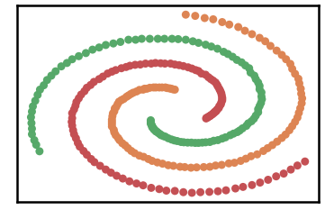
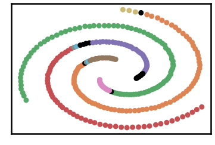
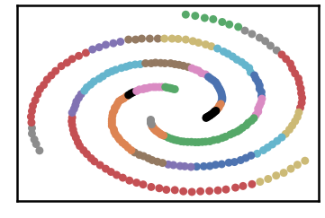
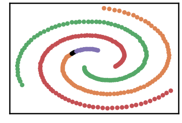
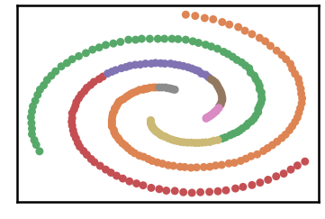
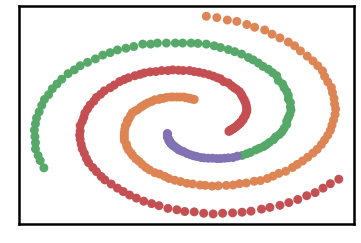
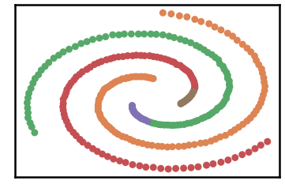
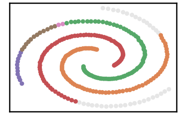
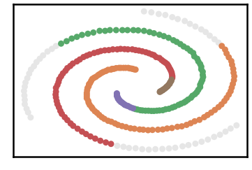

Spiral Dataset
===============

.. code:: ipython3

    import time
    import os.path
    import requests
    import pandas as pd

.. code:: ipython3

    # install DenMune clustering algorithm using pip command from the offecial Python repository, PyPi
    # from https://pypi.org/project/denmune/
    !pip install denmune
    
    # now import it
    from denmune import DenMune

.. code:: ipython3

    dataset = 'spiral' # let us take Spiral dataset as an example
    
    url = "https://zerobytes.one/denmune_data/"
    file_ext = ".txt"
    ground_ext = "-gt"
    
    dataset_url = url + dataset + file_ext
    groundtruth_url = url + dataset + ground_ext  + file_ext
    
    data_path = 'data/' # change it to whatever you put your data, set it to ''; so it will retrive from current folder
    if  not os.path.isfile(data_path + dataset + file_ext):
        req = requests.get(dataset_url)
        with open(data_path + dataset + file_ext, 'wb') as f:
            f.write(req.content)
            
    if  not os.path.isfile(data_path + dataset + ground_ext + file_ext):
        req = requests.get(groundtruth_url)
        with open(data_path + dataset +  ground_ext + file_ext, 'wb') as f:
            f.write(req.content)       

.. code:: ipython3

    # Denmune's Paramaters
    # DenMune(dataset=dataset, k_nearest=n, data_path=data_path, verpose=verpose_mode, show_plot=show_plot, show_noise=show_noise)
    verpose_mode = True # view in-depth analysis of time complexity and outlier detection, num of clusters
    show_plot = True  # show plots on/off
    show_noise = True # show noise and outlier on/off
    
    # loop's parameters
    start = 2
    step = 1
    end=10
    
    # Validity indexes' parameters
    validity_val = -1
    best_k = 0
    best_val = -1
    
    validity_idx = 2 # Acc=1, F1-score=2,  NMI=3, AMI=4, ARI=5,  Homogeneity=6, and Completeness=7
    df = pd.DataFrame(columns =['K', 'ACC', 'F1', 'NMI', 'AMI', 'ARI','Homogeneity', 'Completeness', 'Time' ])
    
    
    for n in range(start, end+1, step):
        start_time = time.time()
        dm = DenMune(dataset=dataset, k_nearest=n, data_path=data_path, verpose=verpose_mode, show_noise=show_noise)
        labels_true, labels_pred = dm.output_Clusters()
        if show_plot == True and n==start:
            # Let us plot the groundtruth of this dataset which is reduced to 2-d using t-SNE
            print ("Dataset\'s Groundtruht")
            dm.plot_clusters(labels_true, ground=True)
            print('\n', "=====" * 20 , '\n')       
                   
        end_time = time.time()
        
        validity_indexes = dm.validate_Clusters(labels_true, labels_pred)
        validity_val = validity_indexes[validity_idx]
        validity_indexes[0] = n
        validity_indexes[8] = end_time - start_time
        
        df = df.append(pd.Series(validity_indexes, index=df.columns ), ignore_index=True)
        
        if (best_val < validity_val):
            best_val = validity_val
            best_k = n
            # Let us show results where only an improve in accuracy is detected
        if show_plot:
                dm.plot_clusters(labels_pred, show_noise=show_noise)
        print ('k=' , n, ':Validity score is:', validity_val , 'but best score is', best_val, 'at k=', best_k , end='     ')
                
        if not verpose_mode:
            print('\r', end='')
        else:
            print('\n', "=====" * 20 , '\n')

.. parsed-literal::

    using NGT, Proximity matrix has been calculated  in:  0.0030486583709716797  seconds
    Dataset's Groundtruht

.. parsed-literal::

    
     ==================================================================================================== 
    
    There are 19 outlier point(s) in black (noise of type-1) represent 6% of total points
    There are 0 weak point(s) in light grey (noise of type-2) represent 0% of total points
    DenMune detected 9 clusters 
    

.. parsed-literal::

    k= 2 :Validity score is: 0.8116794450556772 but best score is 0.8116794450556772 at k= 2     
     ==================================================================================================== 
    
    using NGT, Proximity matrix has been calculated  in:  0.0028192996978759766  seconds
    There are 15 outlier point(s) in black (noise of type-1) represent 5% of total points
    There are 0 weak point(s) in light grey (noise of type-2) represent 0% of total points
    DenMune detected 31 clusters 
    

.. parsed-literal::

    k= 3 :Validity score is: 0.3778102085069554 but best score is 0.8116794450556772 at k= 2     
     ==================================================================================================== 
    
    using NGT, Proximity matrix has been calculated  in:  0.002615690231323242  seconds
    There are 3 outlier point(s) in black (noise of type-1) represent 1% of total points
    There are 0 weak point(s) in light grey (noise of type-2) represent 0% of total points
    DenMune detected 4 clusters 
    

.. parsed-literal::

    k= 4 :Validity score is: 0.9663899397505955 but best score is 0.9663899397505955 at k= 4     
     ==================================================================================================== 
    
    using NGT, Proximity matrix has been calculated  in:  0.0030701160430908203  seconds
    There are 0 outlier point(s) in black (noise of type-1) represent 0% of total points
    There are 0 weak point(s) in light grey (noise of type-2) represent 0% of total points
    DenMune detected 8 clusters 
    

.. parsed-literal::

    k= 5 :Validity score is: 0.8077914495470682 but best score is 0.9663899397505955 at k= 4     
     ==================================================================================================== 
    
    using NGT, Proximity matrix has been calculated  in:  0.0030591487884521484  seconds
    There are 0 outlier point(s) in black (noise of type-1) represent 0% of total points
    There are 0 weak point(s) in light grey (noise of type-2) represent 0% of total points
    DenMune detected 4 clusters 
    

.. parsed-literal::

    k= 6 :Validity score is: 0.9665223519935561 but best score is 0.9665223519935561 at k= 6     
     ==================================================================================================== 
    
    using NGT, Proximity matrix has been calculated  in:  0.003557920455932617  seconds
    There are 0 outlier point(s) in black (noise of type-1) represent 0% of total points
    There are 0 weak point(s) in light grey (noise of type-2) represent 0% of total points
    DenMune detected 4 clusters 
    

.. parsed-literal::

    k= 7 :Validity score is: 0.9394987035436474 but best score is 0.9665223519935561 at k= 6     
     ==================================================================================================== 
    
    using NGT, Proximity matrix has been calculated  in:  0.0041658878326416016  seconds
    There are 0 outlier point(s) in black (noise of type-1) represent 0% of total points
    There are 0 weak point(s) in light grey (noise of type-2) represent 0% of total points
    DenMune detected 5 clusters 
    

.. parsed-literal::

    k= 8 :Validity score is: 0.9369036800671918 but best score is 0.9665223519935561 at k= 6     
     ==================================================================================================== 
    
    using NGT, Proximity matrix has been calculated  in:  0.005620718002319336  seconds
    There are 0 outlier point(s) in black (noise of type-1) represent 0% of total points
    There are 36 weak point(s) in light grey (noise of type-2) represent 12% of total points
    DenMune detected 6 clusters 
    

.. parsed-literal::

    k= 9 :Validity score is: 0.8912011418940893 but best score is 0.9665223519935561 at k= 6     
     ==================================================================================================== 
    
    using NGT, Proximity matrix has been calculated  in:  0.003793954849243164  seconds
    There are 0 outlier point(s) in black (noise of type-1) represent 0% of total points
    There are 53 weak point(s) in light grey (noise of type-2) represent 17% of total points
    DenMune detected 5 clusters 
    

.. parsed-literal::

    k= 10 :Validity score is: 0.8249420823584819 but best score is 0.9665223519935561 at k= 6     
     ==================================================================================================== 
    

.. parsed-literal::

    <Figure size 432x288 with 0 Axes>

.. code:: ipython3

    # It is time to save the results
    results_path = 'results/'  # change it to whatever you output results to, set it to ''; so it will output to current folder
    para_file = 'denmune'+ '_para_'  + dataset + '.csv'
    df.sort_values(by=['F1', 'NMI', 'ARI'] , ascending=False, inplace=True)   
    df.to_csv(results_path + para_file, index=False, sep='\t', header=True)

.. code:: ipython3

    df # it is sorted now and saved

.. raw:: html

    

    
    <table border="1" class="dataframe">
      <thead>
        <tr style="text-align: right;">
          <th></th>
          <th>K</th>
          <th>ACC</th>
          <th>F1</th>
          <th>NMI</th>
          <th>AMI</th>
          <th>ARI</th>
          <th>Homogeneity</th>
          <th>Completeness</th>
          <th>Time</th>
        </tr>
      </thead>
      <tbody>
        <tr>
          <th>4</th>
          <td>6.0</td>
          <td>293.0</td>
          <td>0.966522</td>
          <td>0.932456</td>
          <td>0.931889</td>
          <td>0.921991</td>
          <td>1.000000</td>
          <td>0.873460</td>
          <td>0.029804</td>
        </tr>
        <tr>
          <th>2</th>
          <td>4.0</td>
          <td>293.0</td>
          <td>0.966390</td>
          <td>0.923074</td>
          <td>0.922159</td>
          <td>0.923363</td>
          <td>1.000000</td>
          <td>0.857138</td>
          <td>0.025905</td>
        </tr>
        <tr>
          <th>5</th>
          <td>7.0</td>
          <td>280.0</td>
          <td>0.939499</td>
          <td>0.913917</td>
          <td>0.913213</td>
          <td>0.887202</td>
          <td>1.000000</td>
          <td>0.841480</td>
          <td>0.029997</td>
        </tr>
        <tr>
          <th>6</th>
          <td>8.0</td>
          <td>276.0</td>
          <td>0.936904</td>
          <td>0.876786</td>
          <td>0.875477</td>
          <td>0.846007</td>
          <td>1.000000</td>
          <td>0.780604</td>
          <td>0.032652</td>
        </tr>
        <tr>
          <th>7</th>
          <td>9.0</td>
          <td>251.0</td>
          <td>0.891201</td>
          <td>0.760754</td>
          <td>0.756989</td>
          <td>0.719240</td>
          <td>0.928652</td>
          <td>0.644271</td>
          <td>0.034173</td>
        </tr>
        <tr>
          <th>8</th>
          <td>10.0</td>
          <td>221.0</td>
          <td>0.824942</td>
          <td>0.662844</td>
          <td>0.658781</td>
          <td>0.585667</td>
          <td>0.831865</td>
          <td>0.550908</td>
          <td>0.037669</td>
        </tr>
        <tr>
          <th>0</th>
          <td>2.0</td>
          <td>217.0</td>
          <td>0.811679</td>
          <td>0.718088</td>
          <td>0.711794</td>
          <td>0.629062</td>
          <td>0.962156</td>
          <td>0.572790</td>
          <td>0.157566</td>
        </tr>
        <tr>
          <th>3</th>
          <td>5.0</td>
          <td>217.0</td>
          <td>0.807791</td>
          <td>0.753132</td>
          <td>0.749092</td>
          <td>0.641642</td>
          <td>1.000000</td>
          <td>0.604019</td>
          <td>0.025443</td>
        </tr>
        <tr>
          <th>1</th>
          <td>3.0</td>
          <td>74.0</td>
          <td>0.377810</td>
          <td>0.487873</td>
          <td>0.459952</td>
          <td>0.154465</td>
          <td>0.978097</td>
          <td>0.324988</td>
          <td>0.021516</td>
        </tr>
      </tbody>
    </table>
    

