Unbalance Dataset
==================

.. code:: ipython3

    import time
    import os.path
    import requests
    import pandas as pd

.. code:: ipython3

    # install DenMune clustering algorithm using pip command from the offecial Python repository, PyPi
    # from https://pypi.org/project/denmune/
    !pip install denmune
    
    # now import it
    from denmune import DenMune

.. code:: ipython3

    dataset = 'unbalance' # let us take Jain dataset as an example
    
    url = "https://zerobytes.one/denmune_data/"
    file_ext = ".txt"
    ground_ext = "-gt"
    
    dataset_url = url + dataset + file_ext
    groundtruth_url = url + dataset + ground_ext  + file_ext
    
    data_path = 'data/' # change it to whatever you put your data, set it to ''; so it will retrive from current folder
    if  not os.path.isfile(data_path + dataset + file_ext):
        req = requests.get(dataset_url)
        with open(data_path + dataset + file_ext, 'wb') as f:
            f.write(req.content)
            
    if  not os.path.isfile(data_path + dataset + ground_ext + file_ext):
        req = requests.get(groundtruth_url)
        with open(data_path + dataset +  ground_ext + file_ext, 'wb') as f:
            f.write(req.content)       

.. code:: ipython3

    # Denmune's Paramaters
    # DenMune(dataset=dataset, k_nearest=n, data_path=data_path, verpose=verpose_mode, show_plot=show_plot, show_noise=show_noise)
    verpose_mode = True # view in-depth analysis of time complexity and outlier detection, num of clusters
    show_plot = True  # show plots on/off
    show_noise = True # show noise and outlier on/off
    
    # loop's parameters
    start = 2
    step = 2
    end=30
    
    # Validity indexes' parameters
    validity_val = -1
    best_k = 0
    best_val = -1
    
    validity_idx = 2 # Acc=1, F1-score=2,  NMI=3, AMI=4, ARI=5,  Homogeneity=6, and Completeness=7
    df = pd.DataFrame(columns =['K', 'ACC', 'F1', 'NMI', 'AMI', 'ARI','Homogeneity', 'Completeness', 'Time' ])
    
    
    for n in range(start, end+1, step):
        start_time = time.time()
        dm = DenMune(dataset=dataset, k_nearest=n, data_path=data_path, verpose=verpose_mode, show_noise=show_noise)
        labels_true, labels_pred = dm.output_Clusters()
        if show_plot == True and n==start:
            # Let us plot the groundtruth of this dataset which is reduced to 2-d using t-SNE
            print ("Dataset\'s Groundtruht")
            dm.plot_clusters(labels_true, ground=True)
            print('\n', "=====" * 20 , '\n')       
                   
        end_time = time.time()
        
        validity_indexes = dm.validate_Clusters(labels_true, labels_pred)
        validity_val = validity_indexes[validity_idx]
        validity_indexes[0] = n
        validity_indexes[8] = end_time - start_time
        
        df = df.append(pd.Series(validity_indexes, index=df.columns ), ignore_index=True)
        
        if (best_val < validity_val):
            best_val = validity_val
            best_k = n
            # Let us show results where only an improve in accuracy is detected
        if show_plot:
                dm.plot_clusters(labels_pred, show_noise=show_noise)
        print ('k=' , n, ':Validity score is:', validity_val , 'but best score is', best_val, 'at k=', best_k , end='     ')
                
        if not verpose_mode:
            print('\r', end='')
        else:
            print('\n', "=====" * 20 , '\n')

.. parsed-literal::

    using NGT, Proximity matrix has been calculated  in:  0.08098793029785156  seconds
    Dataset's Groundtruht

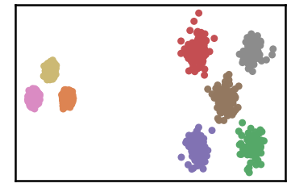

.. parsed-literal::

    
     ==================================================================================================== 
    
    There are 0 outlier point(s) in black (noise of type-1) represent 0% of total points
    There are 0 weak point(s) in light grey (noise of type-2) represent 0% of total points
    DenMune detected 1418 clusters 
    

.. image:: datasets/unbalance/output_3_3.png

.. parsed-literal::

    k= 2 :Validity score is: 0.057445948562544764 but best score is 0.057445948562544764 at k= 2     
     ==================================================================================================== 
    
    using NGT, Proximity matrix has been calculated  in:  0.138671875  seconds
    There are 95 outlier point(s) in black (noise of type-1) represent 1% of total points
    There are 0 weak point(s) in light grey (noise of type-2) represent 0% of total points
    DenMune detected 532 clusters 
    

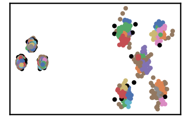

.. parsed-literal::

    k= 4 :Validity score is: 0.05769657068988571 but best score is 0.05769657068988571 at k= 4     
     ==================================================================================================== 
    
    using NGT, Proximity matrix has been calculated  in:  0.0945889949798584  seconds
    There are 34 outlier point(s) in black (noise of type-1) represent 1% of total points
    There are 184 weak point(s) in light grey (noise of type-2) represent 3% of total points
    DenMune detected 208 clusters 
    

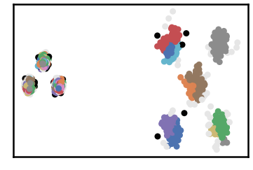

.. parsed-literal::

    k= 6 :Validity score is: 0.21174149057193573 but best score is 0.21174149057193573 at k= 6     
     ==================================================================================================== 
    
    using NGT, Proximity matrix has been calculated  in:  0.16339588165283203  seconds
    There are 21 outlier point(s) in black (noise of type-1) represent 0% of total points
    There are 127 weak point(s) in light grey (noise of type-2) represent 2% of total points
    DenMune detected 91 clusters 
    

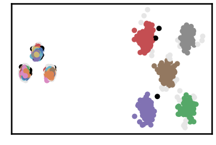

.. parsed-literal::

    k= 8 :Validity score is: 0.5191619178694389 but best score is 0.5191619178694389 at k= 8     
     ==================================================================================================== 
    
    using NGT, Proximity matrix has been calculated  in:  0.1719498634338379  seconds
    There are 15 outlier point(s) in black (noise of type-1) represent 0% of total points
    There are 104 weak point(s) in light grey (noise of type-2) represent 2% of total points
    DenMune detected 46 clusters 
    

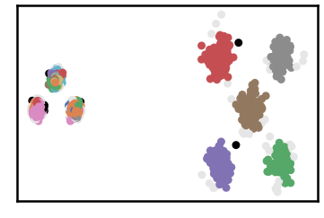

.. parsed-literal::

    k= 10 :Validity score is: 0.756892526128086 but best score is 0.756892526128086 at k= 10     
     ==================================================================================================== 
    
    using NGT, Proximity matrix has been calculated  in:  0.13025116920471191  seconds
    There are 14 outlier point(s) in black (noise of type-1) represent 0% of total points
    There are 100 weak point(s) in light grey (noise of type-2) represent 2% of total points
    DenMune detected 21 clusters 
    

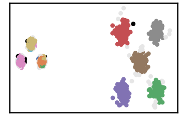

.. parsed-literal::

    k= 12 :Validity score is: 0.9629820504960892 but best score is 0.9629820504960892 at k= 12     
     ==================================================================================================== 
    
    using NGT, Proximity matrix has been calculated  in:  0.1421957015991211  seconds
    There are 13 outlier point(s) in black (noise of type-1) represent 0% of total points
    There are 83 weak point(s) in light grey (noise of type-2) represent 1% of total points
    DenMune detected 13 clusters 
    

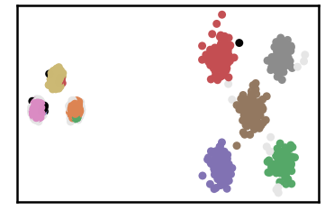

.. parsed-literal::

    k= 14 :Validity score is: 0.9780260292285193 but best score is 0.9780260292285193 at k= 14     
     ==================================================================================================== 
    
    using NGT, Proximity matrix has been calculated  in:  0.2127687931060791  seconds
    There are 13 outlier point(s) in black (noise of type-1) represent 0% of total points
    There are 84 weak point(s) in light grey (noise of type-2) represent 1% of total points
    DenMune detected 11 clusters 
    

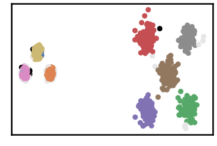

.. parsed-literal::

    k= 16 :Validity score is: 0.9840496185819786 but best score is 0.9840496185819786 at k= 16     
     ==================================================================================================== 
    
    using NGT, Proximity matrix has been calculated  in:  0.1758129596710205  seconds
    There are 12 outlier point(s) in black (noise of type-1) represent 0% of total points
    There are 94 weak point(s) in light grey (noise of type-2) represent 1% of total points
    DenMune detected 9 clusters 
    

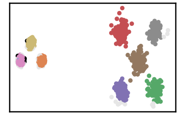

.. parsed-literal::

    k= 18 :Validity score is: 0.9854908347492868 but best score is 0.9854908347492868 at k= 18     
     ==================================================================================================== 
    
    using NGT, Proximity matrix has been calculated  in:  0.20323610305786133  seconds
    There are 12 outlier point(s) in black (noise of type-1) represent 0% of total points
    There are 68 weak point(s) in light grey (noise of type-2) represent 1% of total points
    DenMune detected 8 clusters 
    

.. parsed-literal::

    k= 20 :Validity score is: 0.9934808826633339 but best score is 0.9934808826633339 at k= 20     
     ==================================================================================================== 
    
    using NGT, Proximity matrix has been calculated  in:  0.1607046127319336  seconds
    There are 12 outlier point(s) in black (noise of type-1) represent 0% of total points
    There are 74 weak point(s) in light grey (noise of type-2) represent 1% of total points
    DenMune detected 8 clusters 
    

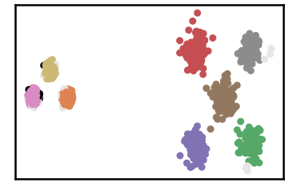

.. parsed-literal::

    k= 22 :Validity score is: 0.9931810097799574 but best score is 0.9934808826633339 at k= 20     
     ==================================================================================================== 
    
    using NGT, Proximity matrix has been calculated  in:  0.26929330825805664  seconds
    There are 11 outlier point(s) in black (noise of type-1) represent 0% of total points
    There are 49 weak point(s) in light grey (noise of type-2) represent 1% of total points
    DenMune detected 8 clusters 
    

.. parsed-literal::

    k= 24 :Validity score is: 0.9952018771246369 but best score is 0.9952018771246369 at k= 24     
     ==================================================================================================== 
    
    using NGT, Proximity matrix has been calculated  in:  0.21662688255310059  seconds
    There are 11 outlier point(s) in black (noise of type-1) represent 0% of total points
    There are 20 weak point(s) in light grey (noise of type-2) represent 0% of total points
    DenMune detected 8 clusters 
    

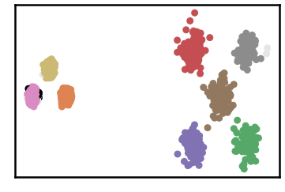

.. parsed-literal::

    k= 26 :Validity score is: 0.9974457891485078 but best score is 0.9974457891485078 at k= 26     
     ==================================================================================================== 
    
    using NGT, Proximity matrix has been calculated  in:  0.2522895336151123  seconds
    There are 11 outlier point(s) in black (noise of type-1) represent 0% of total points
    There are 7 weak point(s) in light grey (noise of type-2) represent 0% of total points
    DenMune detected 8 clusters 
    

.. parsed-literal::

    k= 28 :Validity score is: 0.9984561211827646 but best score is 0.9984561211827646 at k= 28     
     ==================================================================================================== 
    
    using NGT, Proximity matrix has been calculated  in:  0.21538400650024414  seconds
    There are 11 outlier point(s) in black (noise of type-1) represent 0% of total points
    There are 14 weak point(s) in light grey (noise of type-2) represent 0% of total points
    DenMune detected 8 clusters 
    

.. parsed-literal::

    k= 30 :Validity score is: 0.9979171808772892 but best score is 0.9984561211827646 at k= 28     
     ==================================================================================================== 
    

.. parsed-literal::

    <Figure size 432x288 with 0 Axes>

.. code:: ipython3

    # It is time to save the results
    results_path = 'results/'  # change it to whatever you output results to, set it to ''; so it will output to current folder
    para_file = 'denmune'+ '_para_'  + dataset + '.csv'
    df.sort_values(by=['F1', 'NMI', 'ARI'] , ascending=False, inplace=True)   
    df.to_csv(results_path + para_file, index=False, sep='\t', header=True)

.. code:: ipython3

    df # it is sorted now and saved

.. raw:: html

    

    
    <table border="1" class="dataframe">
      <thead>
        <tr style="text-align: right;">
          <th></th>
          <th>K</th>
          <th>ACC</th>
          <th>F1</th>
          <th>NMI</th>
          <th>AMI</th>
          <th>ARI</th>
          <th>Homogeneity</th>
          <th>Completeness</th>
          <th>Time</th>
        </tr>
      </thead>
      <tbody>
        <tr>
          <th>13</th>
          <td>28.0</td>
          <td>6481.0</td>
          <td>0.998456</td>
          <td>0.992670</td>
          <td>0.992644</td>
          <td>0.996249</td>
          <td>0.998563</td>
          <td>0.986846</td>
          <td>4.798441</td>
        </tr>
        <tr>
          <th>14</th>
          <td>30.0</td>
          <td>6474.0</td>
          <td>0.997917</td>
          <td>0.990298</td>
          <td>0.990264</td>
          <td>0.994620</td>
          <td>0.998170</td>
          <td>0.982549</td>
          <td>4.131251</td>
        </tr>
        <tr>
          <th>12</th>
          <td>26.0</td>
          <td>6468.0</td>
          <td>0.997446</td>
          <td>0.988595</td>
          <td>0.988554</td>
          <td>0.993255</td>
          <td>0.997992</td>
          <td>0.979373</td>
          <td>4.558174</td>
        </tr>
        <tr>
          <th>11</th>
          <td>24.0</td>
          <td>6439.0</td>
          <td>0.995202</td>
          <td>0.976895</td>
          <td>0.976812</td>
          <td>0.987306</td>
          <td>0.991860</td>
          <td>0.962375</td>
          <td>3.346760</td>
        </tr>
        <tr>
          <th>9</th>
          <td>20.0</td>
          <td>6418.0</td>
          <td>0.993481</td>
          <td>0.971539</td>
          <td>0.971437</td>
          <td>0.982674</td>
          <td>0.990238</td>
          <td>0.953533</td>
          <td>2.713985</td>
        </tr>
        <tr>
          <th>10</th>
          <td>22.0</td>
          <td>6413.0</td>
          <td>0.993181</td>
          <td>0.968443</td>
          <td>0.968330</td>
          <td>0.981176</td>
          <td>0.988148</td>
          <td>0.949508</td>
          <td>3.205814</td>
        </tr>
        <tr>
          <th>8</th>
          <td>18.0</td>
          <td>6317.0</td>
          <td>0.985491</td>
          <td>0.946018</td>
          <td>0.945806</td>
          <td>0.961199</td>
          <td>0.983863</td>
          <td>0.910976</td>
          <td>2.565627</td>
        </tr>
        <tr>
          <th>7</th>
          <td>16.0</td>
          <td>6298.0</td>
          <td>0.984050</td>
          <td>0.941916</td>
          <td>0.941653</td>
          <td>0.955640</td>
          <td>0.988049</td>
          <td>0.899900</td>
          <td>2.258097</td>
        </tr>
        <tr>
          <th>6</th>
          <td>14.0</td>
          <td>6225.0</td>
          <td>0.978026</td>
          <td>0.925159</td>
          <td>0.924770</td>
          <td>0.939949</td>
          <td>0.988315</td>
          <td>0.869590</td>
          <td>2.101282</td>
        </tr>
        <tr>
          <th>5</th>
          <td>12.0</td>
          <td>6039.0</td>
          <td>0.962982</td>
          <td>0.877287</td>
          <td>0.876381</td>
          <td>0.899442</td>
          <td>0.980366</td>
          <td>0.793822</td>
          <td>1.672905</td>
        </tr>
        <tr>
          <th>4</th>
          <td>10.0</td>
          <td>4307.0</td>
          <td>0.756893</td>
          <td>0.696616</td>
          <td>0.692940</td>
          <td>0.611059</td>
          <td>0.977707</td>
          <td>0.541061</td>
          <td>1.421368</td>
        </tr>
        <tr>
          <th>3</th>
          <td>8.0</td>
          <td>2562.0</td>
          <td>0.519162</td>
          <td>0.542398</td>
          <td>0.533704</td>
          <td>0.272083</td>
          <td>0.973646</td>
          <td>0.375903</td>
          <td>1.365459</td>
        </tr>
        <tr>
          <th>2</th>
          <td>6.0</td>
          <td>848.0</td>
          <td>0.211741</td>
          <td>0.431312</td>
          <td>0.412700</td>
          <td>0.051055</td>
          <td>0.958805</td>
          <td>0.278238</td>
          <td>1.114396</td>
        </tr>
        <tr>
          <th>1</th>
          <td>4.0</td>
          <td>237.0</td>
          <td>0.057697</td>
          <td>0.357717</td>
          <td>0.317203</td>
          <td>0.012688</td>
          <td>0.927975</td>
          <td>0.221562</td>
          <td>1.121255</td>
        </tr>
        <tr>
          <th>0</th>
          <td>2.0</td>
          <td>271.0</td>
          <td>0.057446</td>
          <td>0.286898</td>
          <td>0.191522</td>
          <td>0.000085</td>
          <td>0.792509</td>
          <td>0.175153</td>
          <td>2.577729</td>
        </tr>
      </tbody>
    </table>
    

