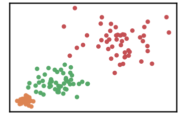
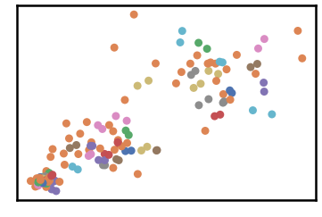
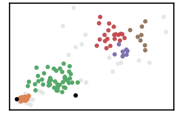
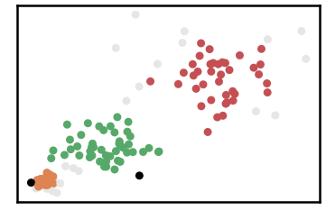
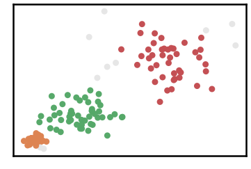

Vary Density Dataset
========================

.. code:: ipython3

    import time
    import os.path
    import requests
    import pandas as pd

.. code:: ipython3

    # install DenMune clustering algorithm using pip command from the offecial Python repository, PyPi
    # from https://pypi.org/project/denmune/
    !pip install denmune
    
    # now import it
    from denmune import DenMune

.. code:: ipython3

    dataset = 'varydensity' # let us take Vary Density dataset as an example
    
    url = "https://zerobytes.one/denmune_data/"
    file_ext = ".txt"
    ground_ext = "-gt"
    
    dataset_url = url + dataset + file_ext
    groundtruth_url = url + dataset + ground_ext  + file_ext
    
    data_path = 'data/' # change it to whatever you put your data, set it to ''; so it will retrive from current folder
    if  not os.path.isfile(data_path + dataset + file_ext):
        req = requests.get(dataset_url)
        with open(data_path + dataset + file_ext, 'wb') as f:
            f.write(req.content)
            
    if  not os.path.isfile(data_path + dataset + ground_ext + file_ext):
        req = requests.get(groundtruth_url)
        with open(data_path + dataset +  ground_ext + file_ext, 'wb') as f:
            f.write(req.content)       

.. code:: ipython3

    # Denmune's Paramaters
    # DenMune(dataset=dataset, k_nearest=n, data_path=data_path, verpose=verpose_mode, show_plot=show_plot, show_noise=show_noise)
    verpose_mode = True # view in-depth analysis of time complexity and outlier detection, num of clusters
    show_plot = True  # show plots on/off
    show_noise = True # show noise and outlier on/off
    
    # loop's parameters
    start = 1
    step = 2
    end=25
    
    # Validity indexes' parameters
    validity_val = -1
    best_k = 0
    best_val = -1
    
    validity_idx = 2 # Acc=1, F1-score=2,  NMI=3, AMI=4, ARI=5,  Homogeneity=6, and Completeness=7
    df = pd.DataFrame(columns =['K', 'ACC', 'F1', 'NMI', 'AMI', 'ARI','Homogeneity', 'Completeness', 'Time' ])
    
    
    for n in range(start, end+1, step):
        start_time = time.time()
        dm = DenMune(dataset=dataset, k_nearest=n, data_path=data_path, verpose=verpose_mode, show_noise=show_noise)
        labels_true, labels_pred = dm.output_Clusters()
        if show_plot == True and n==start:
            # Let us plot the groundtruth of this dataset which is reduced to 2-d using t-SNE
            print ("Dataset\'s Groundtruht")
            dm.plot_clusters(labels_true, ground=True)
            print('\n', "=====" * 20 , '\n')       
                   
        end_time = time.time()
        
        validity_indexes = dm.validate_Clusters(labels_true, labels_pred)
        validity_val = validity_indexes[validity_idx]
        validity_indexes[0] = n
        validity_indexes[8] = end_time - start_time
        
        df = df.append(pd.Series(validity_indexes, index=df.columns ), ignore_index=True)
        
        if (best_val < validity_val):
            best_val = validity_val
            best_k = n
            # Let us show results where only an improve in accuracy is detected
        if show_plot:
                dm.plot_clusters(labels_pred, show_noise=show_noise)
        print ('k=' , n, ':Validity score is:', validity_val , 'but best score is', best_val, 'at k=', best_k , end='     ')
                
        if not verpose_mode:
            print('\r', end='')
        else:
            print('\n', "=====" * 20 , '\n')

.. parsed-literal::

    using NGT, Proximity matrix has been calculated  in:  0.0026073455810546875  seconds
    Dataset's Groundtruht

.. parsed-literal::

    
     ==================================================================================================== 
    
    There are 0 outlier point(s) in black (noise of type-1) represent 0% of total points
    There are 0 weak point(s) in light grey (noise of type-2) represent 0% of total points
    DenMune detected 49 clusters 
    

.. parsed-literal::

    k= 1 :Validity score is: 0.11538461538461538 but best score is 0.11538461538461538 at k= 1     
     ==================================================================================================== 
    
    using NGT, Proximity matrix has been calculated  in:  0.0021309852600097656  seconds
    There are 6 outlier point(s) in black (noise of type-1) represent 4% of total points
    There are 10 weak point(s) in light grey (noise of type-2) represent 7% of total points
    DenMune detected 20 clusters 
    

.. image:: datasets/varydensity/output_3_5.png

.. parsed-literal::

    k= 3 :Validity score is: 0.5259373394966615 but best score is 0.5259373394966615 at k= 3     
     ==================================================================================================== 
    
    using NGT, Proximity matrix has been calculated  in:  0.0016169548034667969  seconds
    There are 2 outlier point(s) in black (noise of type-1) represent 1% of total points
    There are 30 weak point(s) in light grey (noise of type-2) represent 20% of total points
    DenMune detected 5 clusters 
    

.. parsed-literal::

    k= 5 :Validity score is: 0.7904117159436309 but best score is 0.7904117159436309 at k= 5     
     ==================================================================================================== 
    
    using NGT, Proximity matrix has been calculated  in:  0.0018258094787597656  seconds
    There are 2 outlier point(s) in black (noise of type-1) represent 1% of total points
    There are 22 weak point(s) in light grey (noise of type-2) represent 15% of total points
    DenMune detected 3 clusters 
    

.. parsed-literal::

    k= 7 :Validity score is: 0.9116710584101889 but best score is 0.9116710584101889 at k= 7     
     ==================================================================================================== 
    
    using NGT, Proximity matrix has been calculated  in:  0.0019626617431640625  seconds
    There are 0 outlier point(s) in black (noise of type-1) represent 0% of total points
    There are 10 weak point(s) in light grey (noise of type-2) represent 7% of total points
    DenMune detected 3 clusters 
    

.. parsed-literal::

    k= 9 :Validity score is: 0.964211771665188 but best score is 0.964211771665188 at k= 9     
     ==================================================================================================== 
    
    using NGT, Proximity matrix has been calculated  in:  0.0020427703857421875  seconds
    There are 0 outlier point(s) in black (noise of type-1) represent 0% of total points
    There are 10 weak point(s) in light grey (noise of type-2) represent 7% of total points
    DenMune detected 3 clusters 
    

.. parsed-literal::

    k= 11 :Validity score is: 0.964211771665188 but best score is 0.964211771665188 at k= 9     
     ==================================================================================================== 
    
    using NGT, Proximity matrix has been calculated  in:  0.002412557601928711  seconds
    There are 0 outlier point(s) in black (noise of type-1) represent 0% of total points
    There are 2 weak point(s) in light grey (noise of type-2) represent 1% of total points
    DenMune detected 3 clusters 
    

.. parsed-literal::

    k= 13 :Validity score is: 0.9865299455115579 but best score is 0.9865299455115579 at k= 13     
     ==================================================================================================== 
    
    using NGT, Proximity matrix has been calculated  in:  0.0037796497344970703  seconds
    There are 0 outlier point(s) in black (noise of type-1) represent 0% of total points
    There are 2 weak point(s) in light grey (noise of type-2) represent 1% of total points
    DenMune detected 3 clusters 
    

.. image:: datasets/varydensity/output_3_17.png

.. parsed-literal::

    k= 15 :Validity score is: 0.9865299455115579 but best score is 0.9865299455115579 at k= 13     
     ==================================================================================================== 
    
    using NGT, Proximity matrix has been calculated  in:  0.0023272037506103516  seconds
    There are 0 outlier point(s) in black (noise of type-1) represent 0% of total points
    There are 2 weak point(s) in light grey (noise of type-2) represent 1% of total points
    DenMune detected 3 clusters 
    

.. image:: datasets/varydensity/output_3_19.png

.. parsed-literal::

    k= 17 :Validity score is: 0.9865299455115579 but best score is 0.9865299455115579 at k= 13     
     ==================================================================================================== 
    
    using NGT, Proximity matrix has been calculated  in:  0.0023775100708007812  seconds
    There are 0 outlier point(s) in black (noise of type-1) represent 0% of total points
    There are 2 weak point(s) in light grey (noise of type-2) represent 1% of total points
    DenMune detected 3 clusters 
    

.. image:: datasets/varydensity/output_3_21.png

.. parsed-literal::

    k= 19 :Validity score is: 0.9865299455115579 but best score is 0.9865299455115579 at k= 13     
     ==================================================================================================== 
    
    using NGT, Proximity matrix has been calculated  in:  0.003352642059326172  seconds
    There are 0 outlier point(s) in black (noise of type-1) represent 0% of total points
    There are 2 weak point(s) in light grey (noise of type-2) represent 1% of total points
    DenMune detected 3 clusters 
    

.. parsed-literal::

    k= 21 :Validity score is: 0.9865299455115579 but best score is 0.9865299455115579 at k= 13     
     ==================================================================================================== 
    
    using NGT, Proximity matrix has been calculated  in:  0.002562999725341797  seconds
    There are 0 outlier point(s) in black (noise of type-1) represent 0% of total points
    There are 0 weak point(s) in light grey (noise of type-2) represent 0% of total points
    DenMune detected 3 clusters 
    

.. parsed-literal::

    k= 23 :Validity score is: 1.0 but best score is 1.0 at k= 23     
     ==================================================================================================== 
    
    using NGT, Proximity matrix has been calculated  in:  0.002787351608276367  seconds
    There are 0 outlier point(s) in black (noise of type-1) represent 0% of total points
    There are 0 weak point(s) in light grey (noise of type-2) represent 0% of total points
    DenMune detected 3 clusters 
    

.. parsed-literal::

    k= 25 :Validity score is: 0.9933326665999933 but best score is 1.0 at k= 23     
     ==================================================================================================== 
    

.. parsed-literal::

    <Figure size 432x288 with 0 Axes>

.. code:: ipython3

    # It is time to save the results
    results_path = 'results/'  # change it to whatever you output results to, set it to ''; so it will output to current folder
    para_file = 'denmune'+ '_para_'  + dataset + '.csv'
    df.sort_values(by=['F1', 'NMI', 'ARI'] , ascending=False, inplace=True)   
    df.to_csv(results_path + para_file, index=False, sep='\t', header=True)

.. code:: ipython3

    df # it is sorted now and saved

.. raw:: html

    

    
    <table border="1" class="dataframe">
      <thead>
        <tr style="text-align: right;">
          <th></th>
          <th>K</th>
          <th>ACC</th>
          <th>F1</th>
          <th>NMI</th>
          <th>AMI</th>
          <th>ARI</th>
          <th>Homogeneity</th>
          <th>Completeness</th>
          <th>Time</th>
        </tr>
      </thead>
      <tbody>
        <tr>
          <th>11</th>
          <td>23.0</td>
          <td>150.0</td>
          <td>1.000000</td>
          <td>1.000000</td>
          <td>1.000000</td>
          <td>1.000000</td>
          <td>1.000000</td>
          <td>1.000000</td>
          <td>0.028737</td>
        </tr>
        <tr>
          <th>12</th>
          <td>25.0</td>
          <td>149.0</td>
          <td>0.993333</td>
          <td>0.970191</td>
          <td>0.969818</td>
          <td>0.979932</td>
          <td>0.970132</td>
          <td>0.970250</td>
          <td>0.106456</td>
        </tr>
        <tr>
          <th>6</th>
          <td>13.0</td>
          <td>147.0</td>
          <td>0.986530</td>
          <td>0.946085</td>
          <td>0.945005</td>
          <td>0.960207</td>
          <td>0.970132</td>
          <td>0.923201</td>
          <td>0.023794</td>
        </tr>
        <tr>
          <th>7</th>
          <td>15.0</td>
          <td>147.0</td>
          <td>0.986530</td>
          <td>0.946085</td>
          <td>0.945005</td>
          <td>0.960207</td>
          <td>0.970132</td>
          <td>0.923201</td>
          <td>0.103414</td>
        </tr>
        <tr>
          <th>8</th>
          <td>17.0</td>
          <td>147.0</td>
          <td>0.986530</td>
          <td>0.946085</td>
          <td>0.945005</td>
          <td>0.960207</td>
          <td>0.970132</td>
          <td>0.923201</td>
          <td>0.021201</td>
        </tr>
        <tr>
          <th>9</th>
          <td>19.0</td>
          <td>147.0</td>
          <td>0.986530</td>
          <td>0.946085</td>
          <td>0.945005</td>
          <td>0.960207</td>
          <td>0.970132</td>
          <td>0.923201</td>
          <td>0.022777</td>
        </tr>
        <tr>
          <th>10</th>
          <td>21.0</td>
          <td>147.0</td>
          <td>0.986530</td>
          <td>0.946085</td>
          <td>0.945005</td>
          <td>0.960207</td>
          <td>0.970132</td>
          <td>0.923201</td>
          <td>0.031632</td>
        </tr>
        <tr>
          <th>4</th>
          <td>9.0</td>
          <td>140.0</td>
          <td>0.964212</td>
          <td>0.900314</td>
          <td>0.898520</td>
          <td>0.906482</td>
          <td>0.969634</td>
          <td>0.840243</td>
          <td>0.016980</td>
        </tr>
        <tr>
          <th>5</th>
          <td>11.0</td>
          <td>140.0</td>
          <td>0.964212</td>
          <td>0.900314</td>
          <td>0.898520</td>
          <td>0.906482</td>
          <td>0.969634</td>
          <td>0.840243</td>
          <td>0.018820</td>
        </tr>
        <tr>
          <th>3</th>
          <td>7.0</td>
          <td>126.0</td>
          <td>0.911671</td>
          <td>0.756721</td>
          <td>0.750941</td>
          <td>0.757106</td>
          <td>0.862535</td>
          <td>0.674032</td>
          <td>0.016409</td>
        </tr>
        <tr>
          <th>2</th>
          <td>5.0</td>
          <td>102.0</td>
          <td>0.790412</td>
          <td>0.639641</td>
          <td>0.627733</td>
          <td>0.574321</td>
          <td>0.805504</td>
          <td>0.530421</td>
          <td>0.014432</td>
        </tr>
        <tr>
          <th>1</th>
          <td>3.0</td>
          <td>56.0</td>
          <td>0.525937</td>
          <td>0.516089</td>
          <td>0.470664</td>
          <td>0.254844</td>
          <td>0.922335</td>
          <td>0.358282</td>
          <td>0.016242</td>
        </tr>
        <tr>
          <th>0</th>
          <td>1.0</td>
          <td>18.0</td>
          <td>0.115385</td>
          <td>0.332472</td>
          <td>0.172067</td>
          <td>0.009862</td>
          <td>0.640000</td>
          <td>0.224566</td>
          <td>0.098456</td>
        </tr>
      </tbody>
    </table>
    

