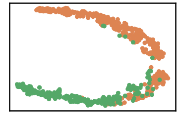
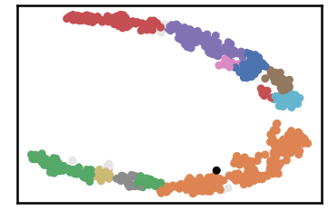
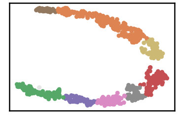
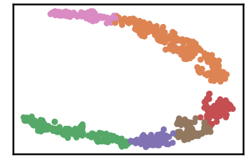
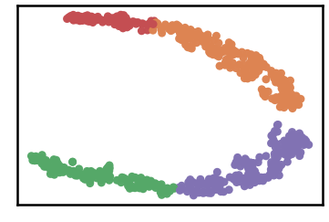
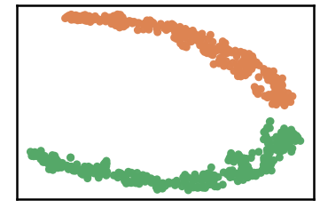
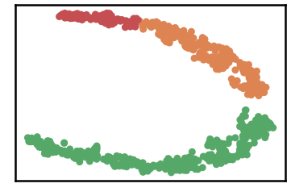
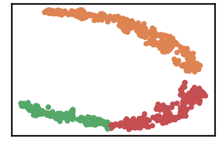
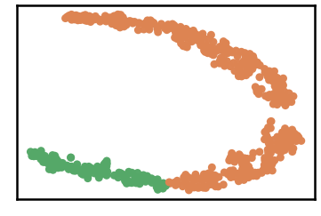

WDBC Dataset
===============

.. code:: ipython3

    import time
    import os.path
    import requests
    import pandas as pd

.. code:: ipython3

    # install DenMune clustering algorithm using pip command from the offecial Python repository, PyPi
    # from https://pypi.org/project/denmune/
    !pip install denmune
    
    # now import it
    from denmune import DenMune

.. code:: ipython3

    dataset = 'wdbc' # let us take WDBC dataset as an example
    
    url = "https://zerobytes.one/denmune_data/"
    file_ext = ".txt"
    ground_ext = "-gt"
    
    dataset_url = url + dataset + file_ext
    groundtruth_url = url + dataset + ground_ext  + file_ext
    
    data_path = 'data/' # change it to whatever you put your data, set it to ''; so it will retrive from current folder
    if  not os.path.isfile(data_path + dataset + file_ext):
        req = requests.get(dataset_url)
        with open(data_path + dataset + file_ext, 'wb') as f:
            f.write(req.content)
            
    if  not os.path.isfile(data_path + dataset + ground_ext + file_ext):
        req = requests.get(groundtruth_url)
        with open(data_path + dataset +  ground_ext + file_ext, 'wb') as f:
            f.write(req.content)       

.. code:: ipython3

    # Denmune's Paramaters
    # DenMune(dataset=dataset, k_nearest=n, data_path=data_path, verpose=verpose_mode, show_plot=show_plot, show_noise=show_noise)
    verpose_mode = True # view in-depth analysis of time complexity and outlier detection, num of clusters
    show_plot = True  # show plots on/off
    show_noise = True # show noise and outlier on/off
    
    # loop's parameters
    start = 6
    step = 10
    end=100
    
    # Validity indexes' parameters
    validity_val = -1
    best_k = 0
    best_val = -1
    
    validity_idx = 2 # Acc=1, F1-score=2,  NMI=3, AMI=4, ARI=5,  Homogeneity=6, and Completeness=7
    df = pd.DataFrame(columns =['K', 'ACC', 'F1', 'NMI', 'AMI', 'ARI','Homogeneity', 'Completeness', 'Time' ])
    
    
    for n in range(start, end+1, step):
        start_time = time.time()
        dm = DenMune(dataset=dataset, k_nearest=n, data_path=data_path, verpose=verpose_mode, show_noise=show_noise)
        labels_true, labels_pred = dm.output_Clusters()
        if show_plot == True and n==start:
            # Let us plot the groundtruth of this dataset which is reduced to 2-d using t-SNE
            print ("Dataset\'s Groundtruht")
            dm.plot_clusters(labels_true, ground=True)
            print('\n', "=====" * 20 , '\n')       
                   
        end_time = time.time()
        
        validity_indexes = dm.validate_Clusters(labels_true, labels_pred)
        validity_val = validity_indexes[validity_idx]
        validity_indexes[0] = n
        validity_indexes[8] = end_time - start_time
        
        df = df.append(pd.Series(validity_indexes, index=df.columns ), ignore_index=True)
        
        if (best_val < validity_val):
            best_val = validity_val
            best_k = n
            # Let us show results where only an improve in accuracy is detected
        if show_plot:
                dm.plot_clusters(labels_pred, show_noise=show_noise)
        print ('k=' , n, ':Validity score is:', validity_val , 'but best score is', best_val, 'at k=', best_k , end='     ')
                
        if not verpose_mode:
            print('\r', end='')
        else:
            print('\n', "=====" * 20 , '\n')

.. parsed-literal::

    using NGT, Proximity matrix has been calculated  in:  0.011875152587890625  seconds
    Dataset's Groundtruht

.. parsed-literal::

    
     ==================================================================================================== 
    
    There are 1 outlier point(s) in black (noise of type-1) represent 0% of total points
    There are 11 weak point(s) in light grey (noise of type-2) represent 2% of total points
    DenMune detected 14 clusters 
    

.. parsed-literal::

    k= 6 :Validity score is: 0.3918135531892898 but best score is 0.3918135531892898 at k= 6     
     ==================================================================================================== 
    
    using NGT, Proximity matrix has been calculated  in:  0.013498306274414062  seconds
    There are 0 outlier point(s) in black (noise of type-1) represent 0% of total points
    There are 2 weak point(s) in light grey (noise of type-2) represent 0% of total points
    DenMune detected 8 clusters 
    

.. parsed-literal::

    k= 16 :Validity score is: 0.6106376274008425 but best score is 0.6106376274008425 at k= 16     
     ==================================================================================================== 
    
    using NGT, Proximity matrix has been calculated  in:  0.01679396629333496  seconds
    There are 0 outlier point(s) in black (noise of type-1) represent 0% of total points
    There are 0 weak point(s) in light grey (noise of type-2) represent 0% of total points
    DenMune detected 6 clusters 
    

.. parsed-literal::

    k= 26 :Validity score is: 0.7075594864658572 but best score is 0.7075594864658572 at k= 26     
     ==================================================================================================== 
    
    using NGT, Proximity matrix has been calculated  in:  0.024177074432373047  seconds
    There are 0 outlier point(s) in black (noise of type-1) represent 0% of total points
    There are 0 weak point(s) in light grey (noise of type-2) represent 0% of total points
    DenMune detected 4 clusters 
    

.. parsed-literal::

    k= 36 :Validity score is: 0.7102420497377575 but best score is 0.7102420497377575 at k= 36     
     ==================================================================================================== 
    
    using NGT, Proximity matrix has been calculated  in:  0.026588916778564453  seconds
    There are 0 outlier point(s) in black (noise of type-1) represent 0% of total points
    There are 0 weak point(s) in light grey (noise of type-2) represent 0% of total points
    DenMune detected 2 clusters 
    

.. parsed-literal::

    k= 46 :Validity score is: 0.821753124938291 but best score is 0.821753124938291 at k= 46     
     ==================================================================================================== 
    
    using NGT, Proximity matrix has been calculated  in:  0.03217768669128418  seconds
    There are 0 outlier point(s) in black (noise of type-1) represent 0% of total points
    There are 0 weak point(s) in light grey (noise of type-2) represent 0% of total points
    DenMune detected 3 clusters 
    

.. parsed-literal::

    k= 56 :Validity score is: 0.718642692983642 but best score is 0.821753124938291 at k= 46     
     ==================================================================================================== 
    
    using NGT, Proximity matrix has been calculated  in:  0.032402753829956055  seconds
    There are 0 outlier point(s) in black (noise of type-1) represent 0% of total points
    There are 0 weak point(s) in light grey (noise of type-2) represent 0% of total points
    DenMune detected 2 clusters 
    

.. parsed-literal::

    k= 66 :Validity score is: 0.8182453221723962 but best score is 0.821753124938291 at k= 46     
     ==================================================================================================== 
    
    using NGT, Proximity matrix has been calculated  in:  0.035175323486328125  seconds
    There are 0 outlier point(s) in black (noise of type-1) represent 0% of total points
    There are 0 weak point(s) in light grey (noise of type-2) represent 0% of total points
    DenMune detected 3 clusters 
    

.. parsed-literal::

    k= 76 :Validity score is: 0.7978724033850427 but best score is 0.821753124938291 at k= 46     
     ==================================================================================================== 
    
    using NGT, Proximity matrix has been calculated  in:  0.049748897552490234  seconds
    There are 0 outlier point(s) in black (noise of type-1) represent 0% of total points
    There are 0 weak point(s) in light grey (noise of type-2) represent 0% of total points
    DenMune detected 2 clusters 
    

.. parsed-literal::

    k= 86 :Validity score is: 0.821753124938291 but best score is 0.821753124938291 at k= 46     
     ==================================================================================================== 
    
    using NGT, Proximity matrix has been calculated  in:  0.056775569915771484  seconds
    There are 0 outlier point(s) in black (noise of type-1) represent 0% of total points
    There are 0 weak point(s) in light grey (noise of type-2) represent 0% of total points
    DenMune detected 2 clusters 
    

.. parsed-literal::

    k= 96 :Validity score is: 0.8443374522699525 but best score is 0.8443374522699525 at k= 96     
     ==================================================================================================== 
    

.. parsed-literal::

    <Figure size 432x288 with 0 Axes>

.. code:: ipython3

    # It is time to save the results
    results_path = 'results/'  # change it to whatever you output results to, set it to ''; so it will output to current folder
    para_file = 'denmune'+ '_para_'  + dataset + '.csv'
    df.sort_values(by=['F1', 'NMI', 'ARI'] , ascending=False, inplace=True)   
    df.to_csv(results_path + para_file, index=False, sep='\t', header=True)

.. code:: ipython3

    df # it is sorted now and saved

.. raw:: html

    

    
    <table border="1" class="dataframe">
      <thead>
        <tr style="text-align: right;">
          <th></th>
          <th>K</th>
          <th>ACC</th>
          <th>F1</th>
          <th>NMI</th>
          <th>AMI</th>
          <th>ARI</th>
          <th>Homogeneity</th>
          <th>Completeness</th>
          <th>Time</th>
        </tr>
      </thead>
      <tbody>
        <tr>
          <th>9</th>
          <td>96.0</td>
          <td>486.0</td>
          <td>0.844337</td>
          <td>0.464793</td>
          <td>0.464005</td>
          <td>0.491425</td>
          <td>0.422291</td>
          <td>0.516809</td>
          <td>0.932110</td>
        </tr>
        <tr>
          <th>4</th>
          <td>46.0</td>
          <td>466.0</td>
          <td>0.821753</td>
          <td>0.408539</td>
          <td>0.407766</td>
          <td>0.405858</td>
          <td>0.418041</td>
          <td>0.399459</td>
          <td>0.357147</td>
        </tr>
        <tr>
          <th>8</th>
          <td>86.0</td>
          <td>466.0</td>
          <td>0.821753</td>
          <td>0.408539</td>
          <td>0.407766</td>
          <td>0.405858</td>
          <td>0.418041</td>
          <td>0.399459</td>
          <td>0.732811</td>
        </tr>
        <tr>
          <th>6</th>
          <td>66.0</td>
          <td>464.0</td>
          <td>0.818245</td>
          <td>0.402913</td>
          <td>0.402133</td>
          <td>0.396883</td>
          <td>0.412136</td>
          <td>0.394093</td>
          <td>0.521260</td>
        </tr>
        <tr>
          <th>7</th>
          <td>76.0</td>
          <td>384.0</td>
          <td>0.797872</td>
          <td>0.448298</td>
          <td>0.447159</td>
          <td>0.436988</td>
          <td>0.581242</td>
          <td>0.364849</td>
          <td>0.587190</td>
        </tr>
        <tr>
          <th>5</th>
          <td>56.0</td>
          <td>389.0</td>
          <td>0.718643</td>
          <td>0.342629</td>
          <td>0.341202</td>
          <td>0.245751</td>
          <td>0.423573</td>
          <td>0.287658</td>
          <td>0.531083</td>
        </tr>
        <tr>
          <th>3</th>
          <td>36.0</td>
          <td>318.0</td>
          <td>0.710242</td>
          <td>0.399889</td>
          <td>0.398288</td>
          <td>0.296932</td>
          <td>0.603445</td>
          <td>0.299022</td>
          <td>0.250036</td>
        </tr>
        <tr>
          <th>2</th>
          <td>26.0</td>
          <td>316.0</td>
          <td>0.707559</td>
          <td>0.378641</td>
          <td>0.376261</td>
          <td>0.312643</td>
          <td>0.665965</td>
          <td>0.264518</td>
          <td>0.242784</td>
        </tr>
        <tr>
          <th>1</th>
          <td>16.0</td>
          <td>253.0</td>
          <td>0.610638</td>
          <td>0.334924</td>
          <td>0.331130</td>
          <td>0.233777</td>
          <td>0.662211</td>
          <td>0.224144</td>
          <td>0.114861</td>
        </tr>
        <tr>
          <th>0</th>
          <td>6.0</td>
          <td>147.0</td>
          <td>0.391814</td>
          <td>0.281913</td>
          <td>0.275325</td>
          <td>0.112146</td>
          <td>0.653379</td>
          <td>0.179731</td>
          <td>0.166746</td>
        </tr>
      </tbody>
    </table>
    

