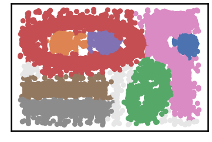
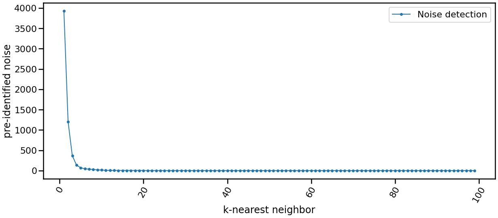
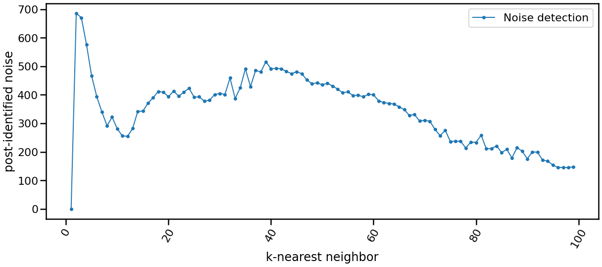
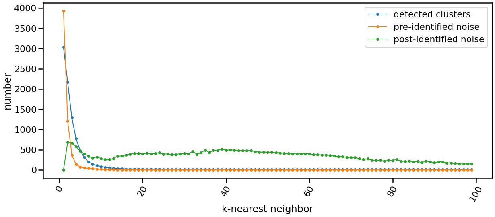

K-nearest Neighbor Evolution
-------------------------------

.. code:: python

    import pandas as pd
    import matplotlib.pyplot as plt
    import time
    import os.path
    
    import warnings
    warnings.filterwarnings('ignore')

.. code:: python

    # install DenMune clustering algorithm using pip command from the offecial Python repository, PyPi
    # from https://pypi.org/project/denmune/
    !pip install denmune
    
    # then import it
    from denmune import DenMune

.. code:: python

    # clone datasets from our repository datasets
    if not os.path.exists('datasets'):
      !git clone https://github.com/egy1st/datasets

.. parsed-literal::

    Cloning into 'datasets'...
    remote: Enumerating objects: 63, done.
    remote: Counting objects: 100% (63/63), done.
    remote: Compressing objects: 100% (52/52), done.
    remote: Total 63 (delta 10), reused 59 (delta 9), pack-reused 0
    Unpacking objects: 100% (63/63), done.

.. code:: python

    data_path = 'datasets/denmune/chameleon/'  
    chameleon_dataset = "t7.10k" #["t4.8k", "t5.8k", "t7.10k", "t8.8k"]
    
    # train file
    detected_clusers = []
    noise_type1 = []
    noise_type2 = []
    
    data_file = data_path + chameleon_dataset + '.csv'
    X_train = pd.read_csv(data_file, sep=',', header=None)
    
    from IPython.display import clear_output
    for knn in range (1, 100, 1):
        print ("knn", knn )
        clear_output(wait=True)
        dm = DenMune(train_data=X_train, k_nearest=knn, rgn_tsne=False )
        labels, validity = dm.fit_predict(show_analyzer=False)
        n_clusters = dm.analyzer['n_clusters']['detected']
        pre_noise = dm.analyzer['n_points']['noise']['type-1']
        post_noise = dm.analyzer['n_points']['noise']['type-2']
        detected_clusers.append([knn, n_clusters ])
        noise_type1.append([knn, pre_noise ])
        noise_type2.append([knn, post_noise ])
        
        print('knn:',knn ,  ' :: we detected', n_clusters, 'clusters:' , ' :: pre-noise:', pre_noise, 'post_noise', post_noise)
        time.sleep(0.2)
        

.. parsed-literal::

    knn: 99  :: we detected 8 clusters:  :: pre-noise: 0 post_noise 148

.. code:: python

    x, y = zip(*detected_clusers)
    f1 = plt.figure(1)
    # Creating figure and axis objects using subplots()
    fig, ax = plt.subplots(figsize=[20, 8])
    ax.plot(x, y, marker='.', linewidth=2, label='evolution of detected clusters')
    plt.xticks(rotation=60)
    ax.set_xlabel('k-nearest neighbor')
    ax.set_ylabel('number of detected clusters')
    plt.legend()
    plt.show()

.. parsed-literal::

    <Figure size 432x288 with 0 Axes>

.. image:: images/knn_evolution/output_5_1.png

.. code:: python

    x, y = zip(*noise_type1)
    
    # Creating figure and axis objects using subplots()
    fig, ax = plt.subplots(figsize=[20, 8])
    ax.plot(x, y, marker='.', linewidth=2, label='Noise detection')
    plt.xticks(rotation=60)
    ax.set_xlabel('k-nearest neighbor')
    ax.set_ylabel('pre-identified noise')
    plt.legend()
    plt.show()

.. code:: python

    x, y = zip(*noise_type2)
    
    # Creating figure and axis objects using subplots()
    fig, ax = plt.subplots(figsize=[20, 8])
    ax.plot(x, y, marker='.', linewidth=2, label='Noise detection')
    plt.xticks(rotation=60)
    ax.set_xlabel('k-nearest neighbor')
    ax.set_ylabel('post-identified noise')
    plt.legend()
    plt.show()

.. code:: python

    # Creating figure and axis objects using subplots()
    fig, ax = plt.subplots(figsize=[20, 8])
    
    x, y = zip(*detected_clusers)
    ax.plot(x, y, marker='.', linewidth=2, label='detected clusters')
    
    x, y = zip(*noise_type1)
    ax.plot(x, y, marker='.', linewidth=2, label='pre-identified noise')
    
    x, y = zip(*noise_type2)
    ax.plot(x, y, marker='.', linewidth=2, label='post-identified noise')
    
    
    plt.xticks(rotation=60)
    ax.set_xlabel('k-nearest neighbor')
    ax.set_ylabel('number')
    plt.legend()
    plt.show()

